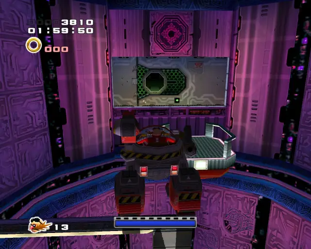
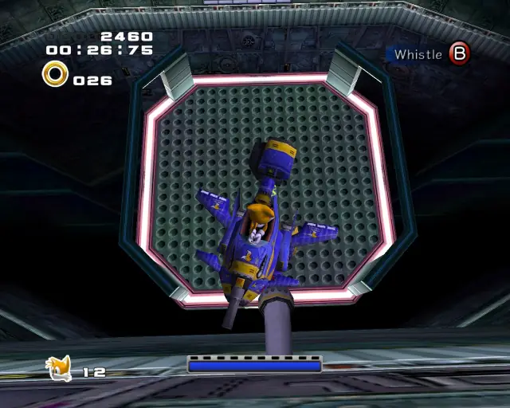
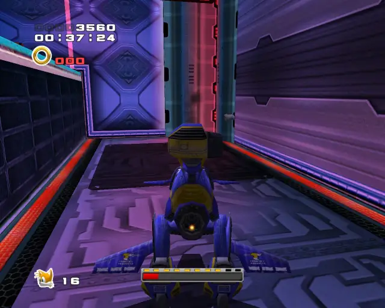
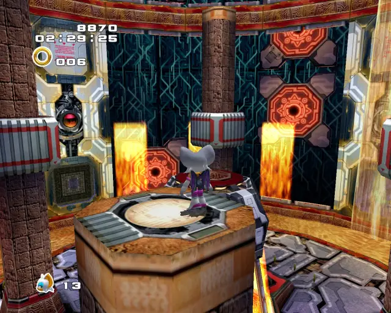
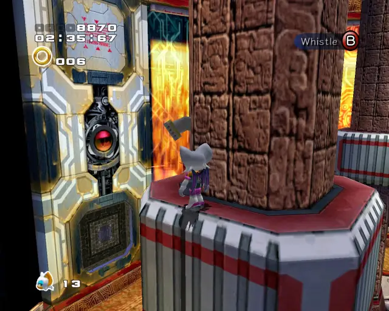
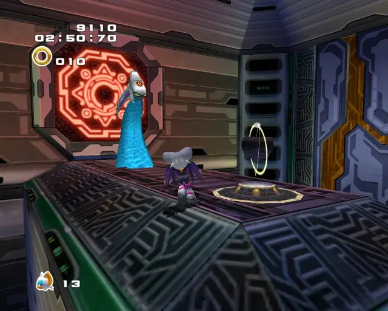
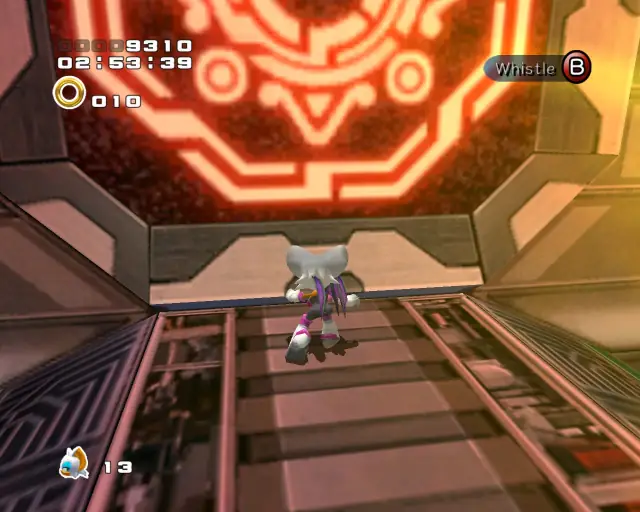

# Cannon's Core 

## Cannon's Core Gold Beetle

[Back to Top](#)

## Cannon's Core Chao Box 1

  

[Back to Top](#)

## Cannon's Core Chao Box 2
  

[Back to Top](#)

## Cannon's Core Chao Box 3
  

[Back to Top](#)

## Cannon's Core Pipe 1

[Back to Top](#)

## Cannon's Core Pipe 2

[Back to Top](#)

## Cannon's Core Pipe 3

[Back to Top](#)

## Cannon's Core Pipe 4

[Back to Top](#)

## Cannon's Core Pipe 5

[Back to Top](#)

## Cannon's Core Hidden 1

[Back to Top](#)
