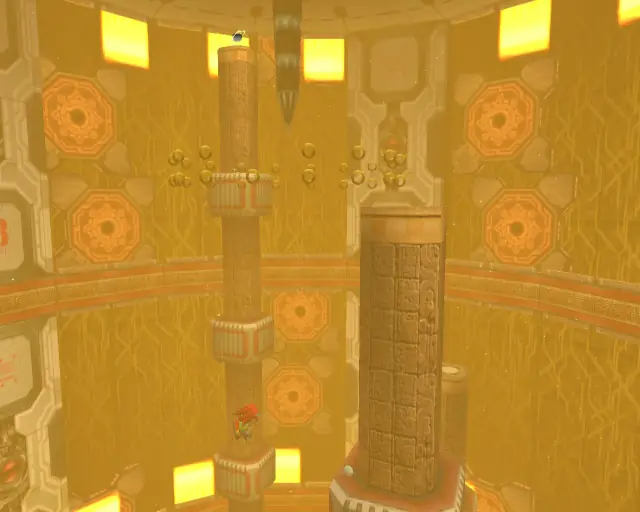
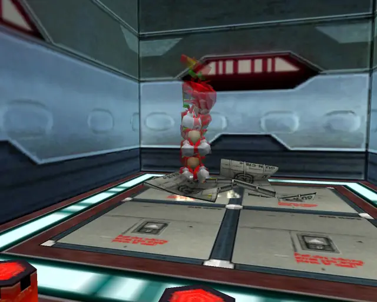
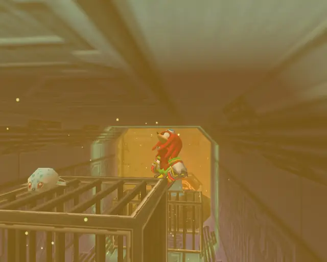
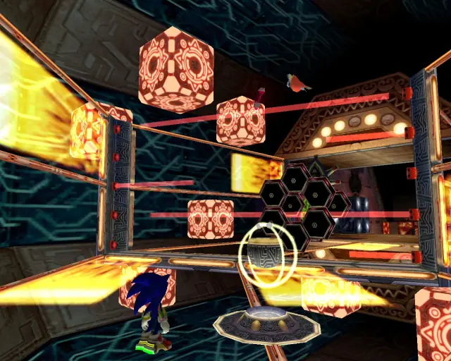

# Cannon's Core (Animalsanity)

## Cannon's Core Animal 1

[Back to Top](#)

## Cannon's Core Animal 2

[Back to Top](#)

## Cannon's Core Animal 3

[Back to Top](#)

## Cannon's Core Animal 4

[Back to Top](#)

## Cannon's Core Animal 5

[Back to Top](#)

## Cannon's Core Animal 6

[Back to Top](#)

## Cannon's Core Animal 7

[Back to Top](#)

## Cannon's Core Animal 8

[Back to Top](#)

## Cannon's Core Animal 9

[Back to Top](#)

## Cannon's Core Animal 10

[Back to Top](#)

## Cannon's Core Animal 11

[Back to Top](#)

## Cannon's Core Animal Bonus
- This animal isn't a check, but it is in the level.
- It is completely invisible, the screenshot shows its rough location

[Back to Top](#)

## Cannon's Core Animal 12

[Back to Top](#)

## Cannon's Core Animal 13

[Back to Top](#)

## Cannon's Core Animal 14

[Back to Top](#)

## Cannon's Core Animal 15

[Back to Top](#)

## Cannon's Core Animal 16

[Back to Top](#)

## Cannon's Core Animal 17

[Back to Top](#)

## Cannon's Core Animal 18

[Back to Top](#)

## Cannon's Core Animal 19

[Back to Top](#)
