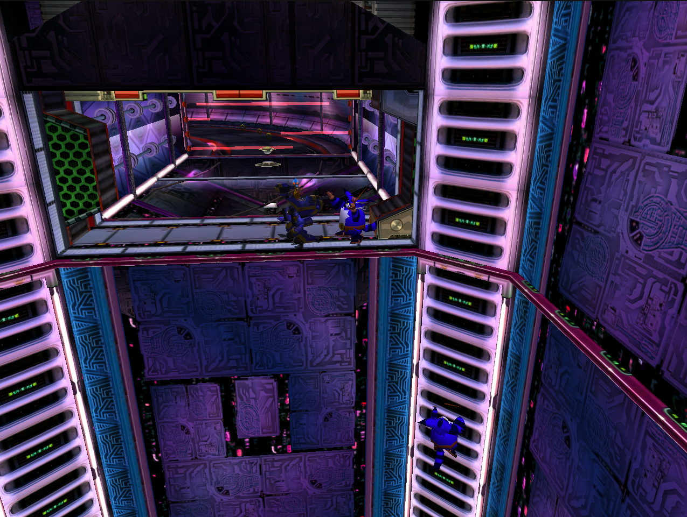
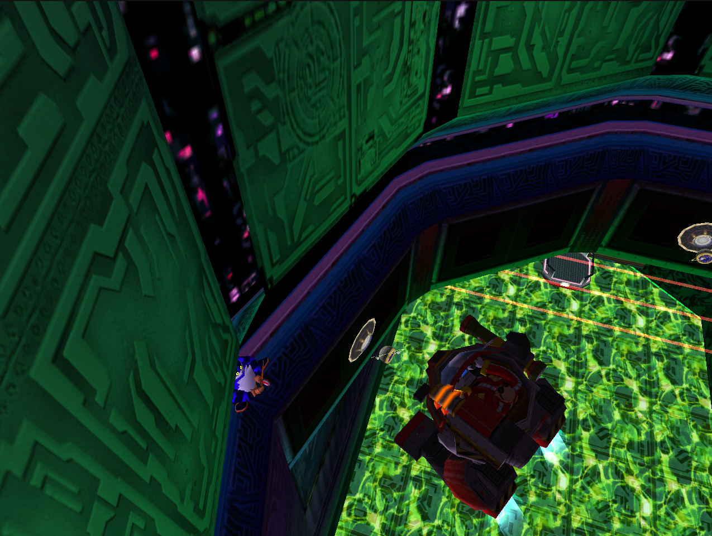
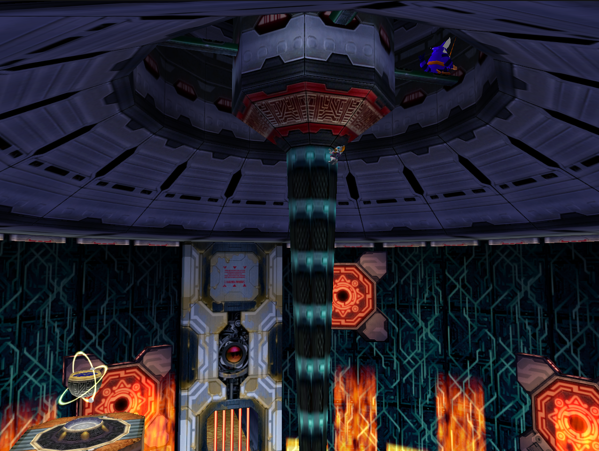
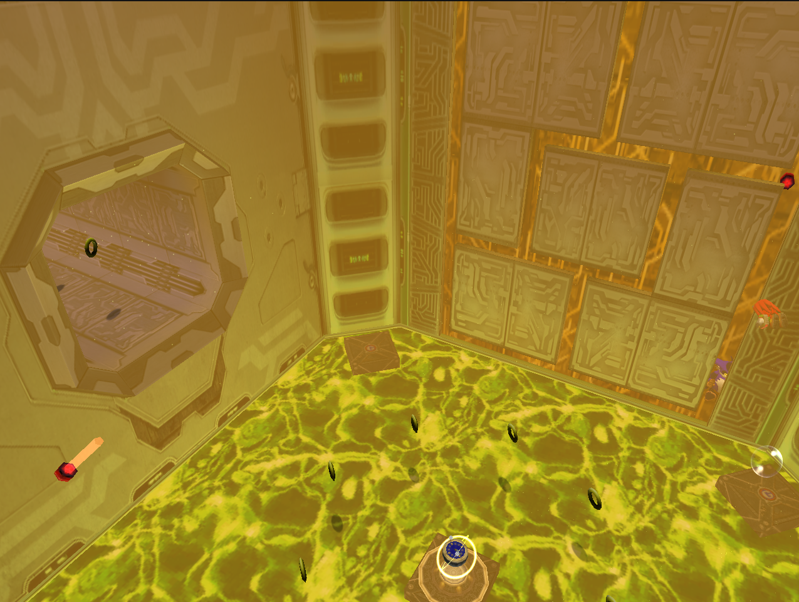
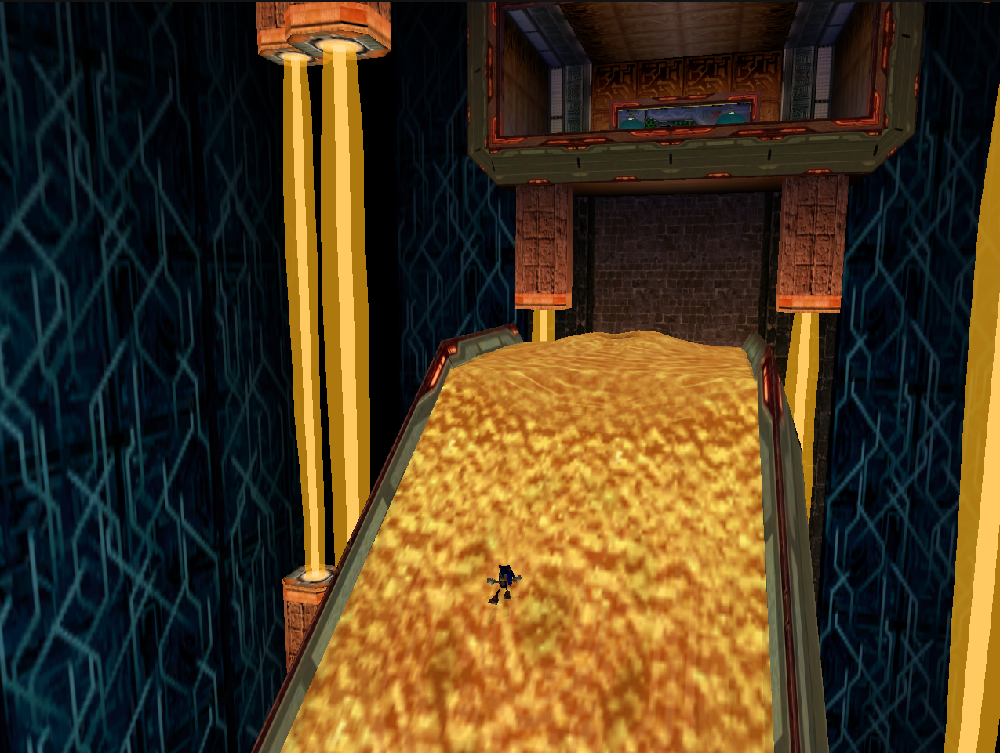
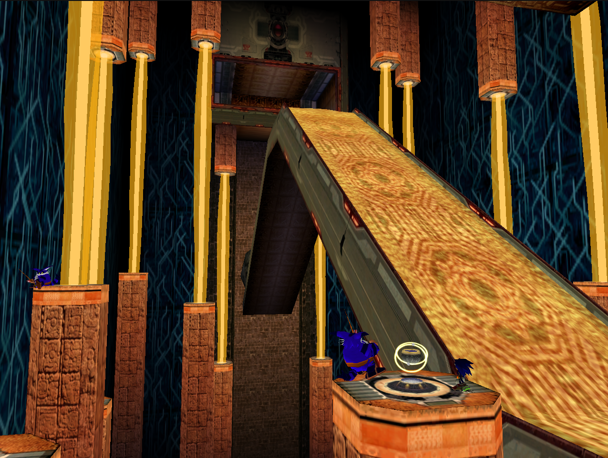

## big 1

## big 2

## big 3

## big 4

## big 5

## item 1

## item 10

## item 11

## item 12

## item 2

## item 3

## item 4

## item 5

## item 6

## item 7

## item 8

## item 9

## life 1

