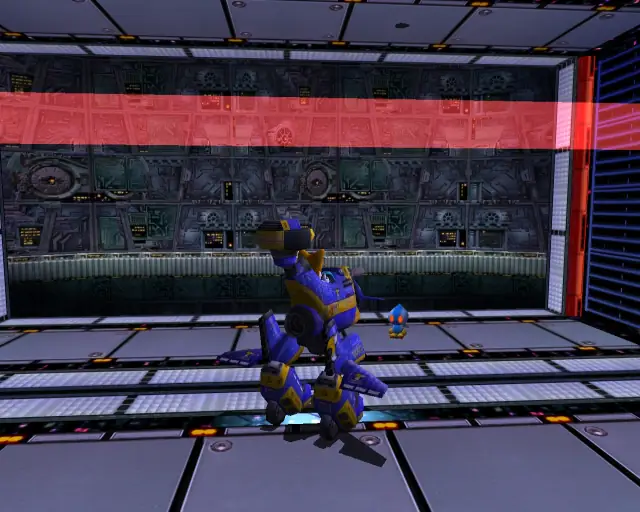

# Cannon's Core (Omosanity)

## Cannon's Core Omochao 1

[Back to Top](#)

## Cannon's Core Omochao 2

[Back to Top](#)

## Cannon's Core Omochao 3

[Back to Top](#)

## Cannon's Core Omochao 4

[Back to Top](#)

## Cannon's Core Omochao 5

[Back to Top](#)

## Cannon's Core Omochao 6

[Back to Top](#)

## Cannon's Core Omochao 7

[Back to Top](#)

## Cannon's Core Omochao 8

[Back to Top](#)

## Cannon's Core Omochao 9

[Back to Top](#)
