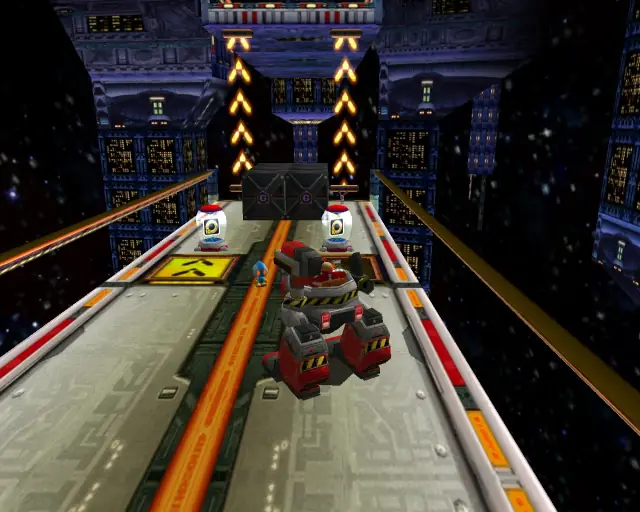
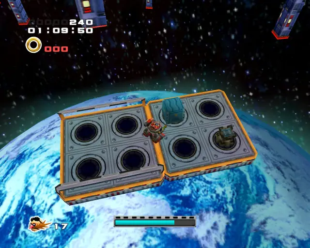
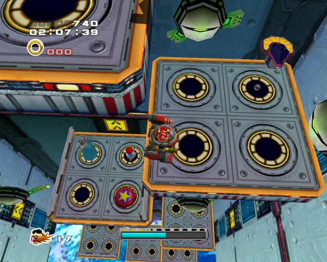
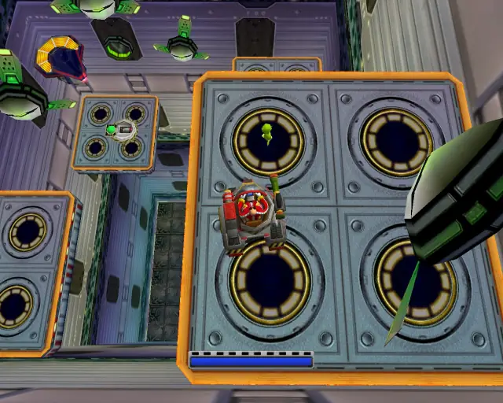
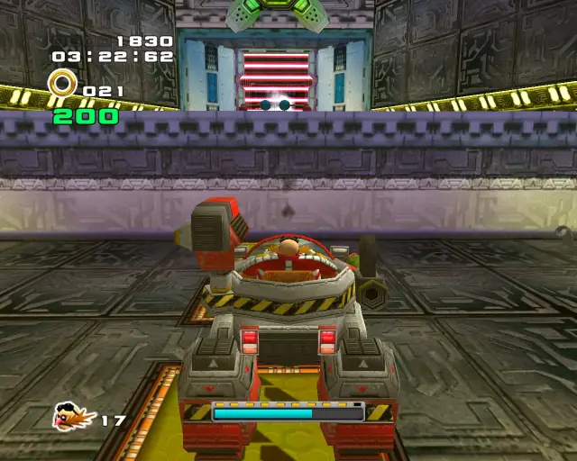
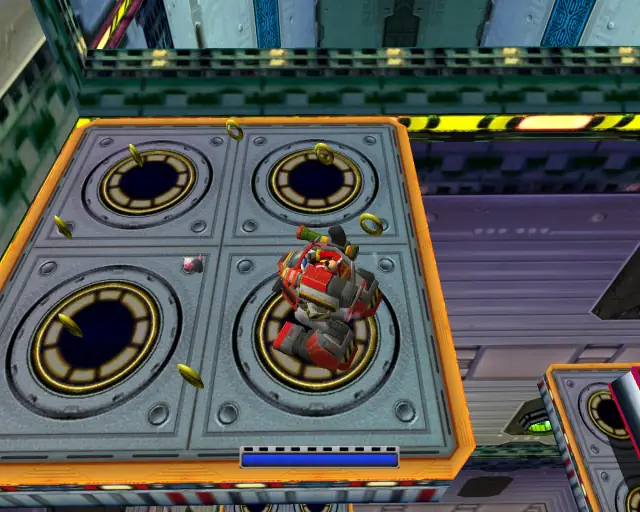
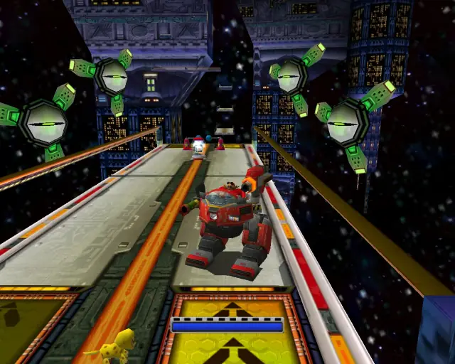
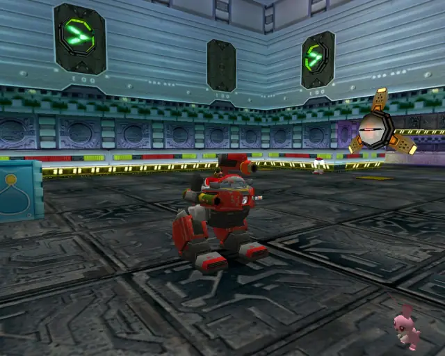
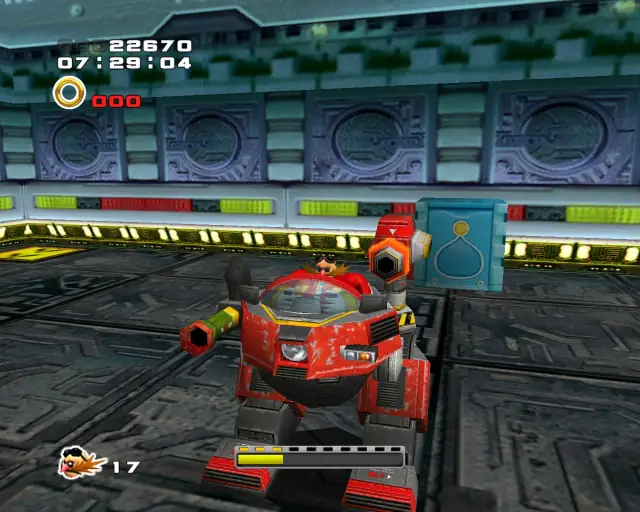

# Cosmic Wall (Chronological)

## Cosmic Wall Omochao 1

[Back to Top](#)

## Cosmic Wall Animal 1

[Back to Top](#)

## Cosmic Wall Pipe 1 & Animal 2

[Back to Top](#)

## Cosmic Wall Gold Beetle
  

[Back to Top](#)

## Cosmic Wall Animal 3

[Back to Top](#)

## Cosmic Wall Chao Box 1

  

[Back to Top](#)

## Cosmic Wall Animal 4

[Back to Top](#)

## Cosmic Wall Animal 5

[Back to Top](#)

## Cosmic Wall Pipe 2 & Animal 6

[Back to Top](#)

## Cosmic Wall Animal 7

[Back to Top](#)

## Cosmic Wall Animal 8

[Back to Top](#)

## Cosmic Wall Pipe 3 & Animal 9

[Back to Top](#)

## Cosmic Wall Chao Box 2
  
  

[Back to Top](#)

## Cosmic Wall Pipe 4 & Animal 10

[Back to Top](#)

## Cosmic Wall Animal 11

[Back to Top](#)

## Cosmic Wall Animal 12

[Back to Top](#)

## Cosmic Wall Pipe 5 & Animal 13

[Back to Top](#)

## Cosmic Wall Animal 14

[Back to Top](#)

## Cosmic Wall Animal 15

[Back to Top](#)

## Cosmic Wall Chao Box 3
  

[Back to Top](#)
