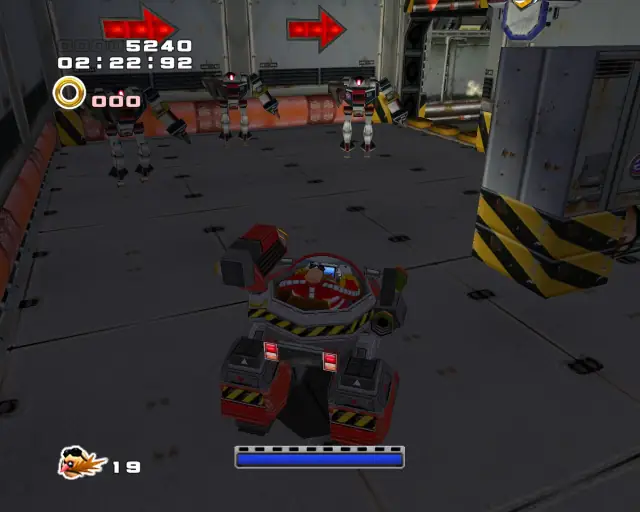

# Iron Gate (Chronological)

## Iron Gate Animal 1

[Back to Top](#)

## Iron Gate Omochao 1

[Back to Top](#)

## Iron Gate Omochao 2

[Back to Top](#)

## Iron Gate Chao Box 1

  

[Back to Top](#)

## Iron Gate Omochao 3

[Back to Top](#)

## Iron Gate Animal 2

[Back to Top](#)

## Iron Gate Omochao 4

[Back to Top](#)

## Iron Gate Pipe 1 & Animal 3

[Back to Top](#)

## Iron Gate Animal 4

[Back to Top](#)

## Iron Gate Gold Beetle

[Back to Top](#)

## Iron Gate Animal 5

[Back to Top](#)

## Iron Gate Pipe 2 & Animal 6

[Back to Top](#)

## Iron Gate Chao Box 2
  
  

[Back to Top](#)

## Iron Gate Animal 7

[Back to Top](#)

## Iron Gate Animal 8

[Back to Top](#)

## Iron Gate Animal 9

[Back to Top](#)  

## Iron Gate Pipe 3 & Animal 10

[Back to Top](#)

## Iron Gate Animal 11

[Back to Top](#)

## Iron Gate Animal 12

[Back to Top](#)

## Iron Gate Omochao 5

[Back to Top](#)

## Iron Gate Pipe 4 & Animal 13

[Back to Top](#)

## Iron Gate Omochao 6

[Back to Top](#)

## Iron Gate Pipe 5 & Animal 14

[Back to Top](#)

## Iron Gate Chao Box 3
  

[Back to Top](#)

## Iron Gate Animal 15

[Back to Top](#)
