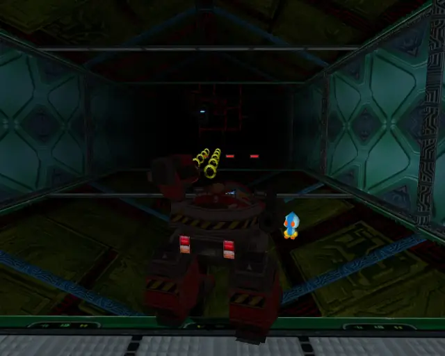
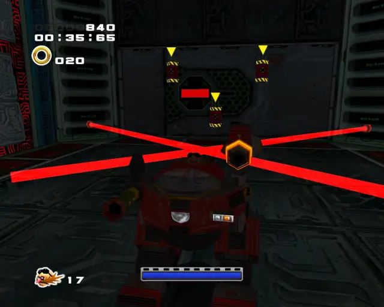
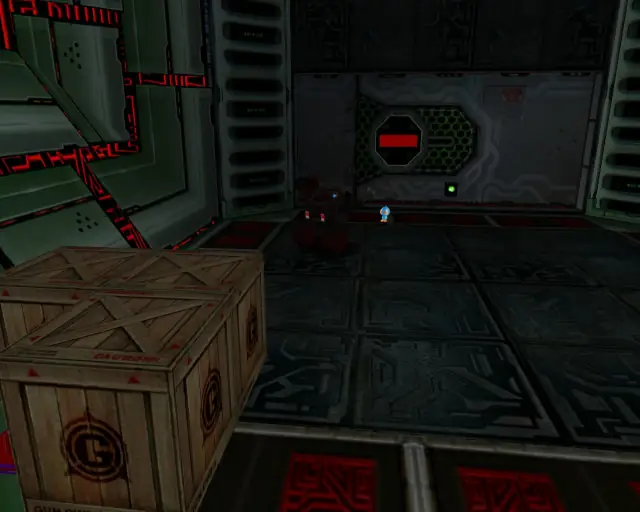
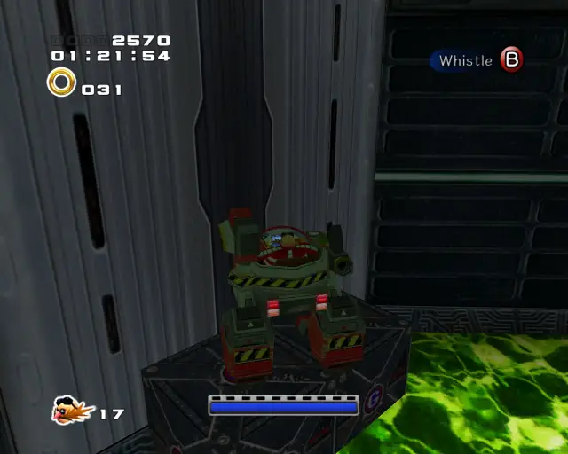
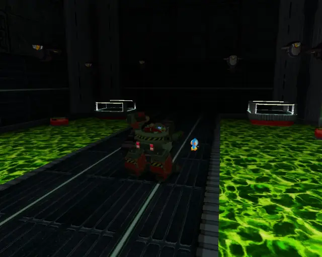
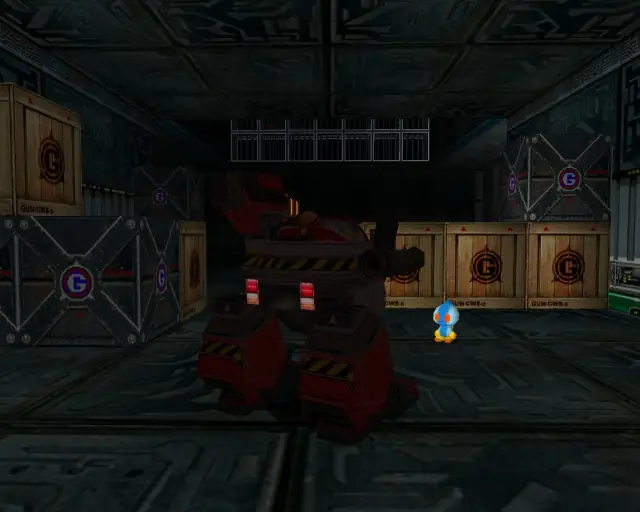
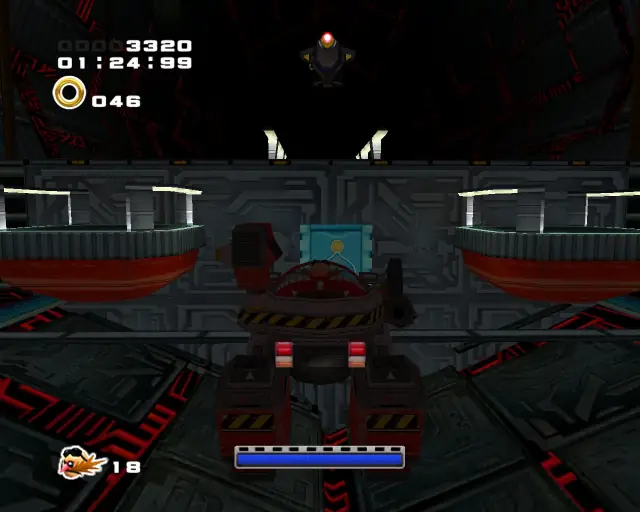
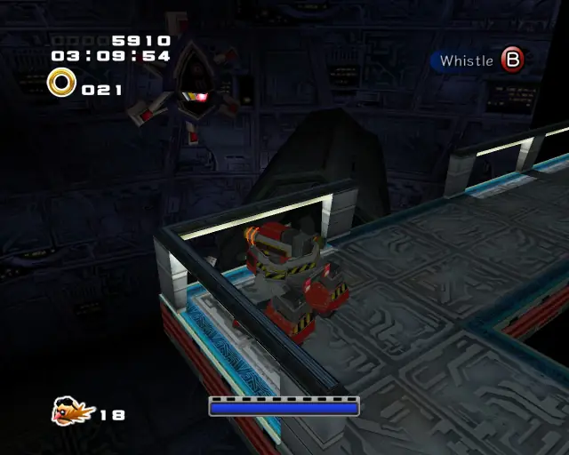

# Lost Colony (Chronological)

## Lost Colony Omochao 1

[Back to Top](#)

## Lost Colony Animal 1

[Back to Top](#)

## Lost Colony Pipe 1 & Animal 2

[Back to Top](#)

## Lost Colony Omochao 2

[Back to Top](#)

## Lost Colony Animal 3

[Back to Top](#)

## Lost Colony Animal 4

[Back to Top](#)

## Lost Colony Hidden 1 & Animal 5

[Back to Top](#)

## Lost Colony Omochao 3

[Back to Top](#)

## Lost Colony Animal 6

[Back to Top](#)

## Lost Colony Animal 7

[Back to Top](#)

## Lost Colony Animal 8

[Back to Top](#)

## Lost Colony Omochao 4

[Back to Top](#)

## Lost Colony Chao Box 1

  

[Back to Top](#)

## Lost Colony Omochao 5

[Back to Top](#)

## Lost Colony Chao Box 2
  

[Back to Top](#)

## Lost Colony Animal 9

[Back to Top](#)

## Lost Colony Animal 10

[Back to Top](#)

## Lost Colony Omochao 6

[Back to Top](#)

## Lost Colony Pipe 2 & Animal 11

[Back to Top](#)

## Lost Colony Gold Beetle

[Back to Top](#)

## Lost Colony Animal 12

[Back to Top](#)

## Lost Colony Chao Box 3
  

[Back to Top](#)

## Lost Colony Omochao 7

[Back to Top](#)

## Lost Colony Animal 13

[Back to Top](#)

## Lost Colony Animal 14

[Back to Top](#)

## Lost Colony Omochao 8

[Back to Top](#)
