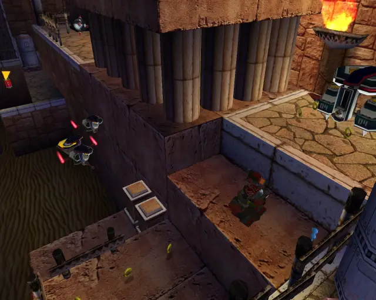
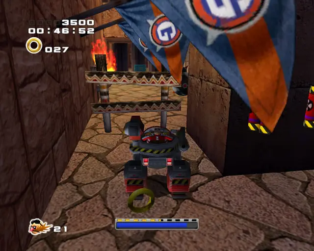
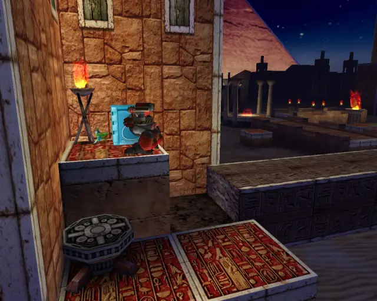
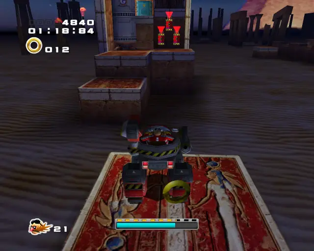
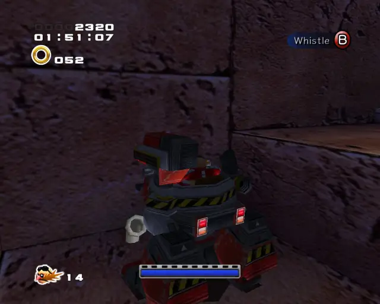
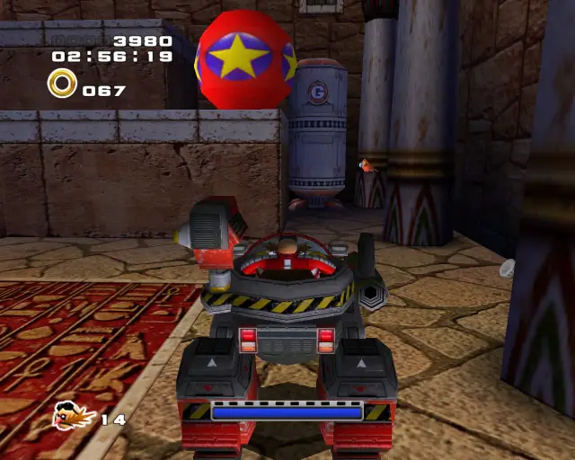

# Sand Ocean (Chronological)

## Sand Ocean Animal 1

[Back to Top](#)

## Sand Ocean Omochao 1

[Back to Top](#)

## Sand Ocean Animal 2

[Back to Top](#)

## Sand Ocean Omochao 2

[Back to Top](#)

## Sand Ocean Animal 3

[Back to Top](#)

## Sand Ocean Animal 4

[Back to Top](#)

## Sand Ocean Chao Box 1

[Back to Top](#)

## Sand Ocean Animal 5

[Back to Top](#)

## Sand Ocean Chao Box 2
  

[Back to Top](#)

## Sand Ocean Gold Beetle

[Back to Top](#)

## Sand Ocean Pipe 1 & Animal 6

[Back to Top](#)

## Sand Ocean Pipe 2 & Animal 7

[Back to Top](#)

## Sand Ocean Animal 8

[Back to Top](#)

## Sand Ocean Animal 9

[Back to Top](#)

## Sand Ocean Animal 10

[Back to Top](#)

## Sand Ocean Chao Box 3
  

[Back to Top](#)

## Sand Ocean Pipe 3 & Animal 11

[Back to Top](#)

## Sand Ocean Animal 12

[Back to Top](#)

## Sand Ocean Pipe 4 & Animal 13

[Back to Top](#)

## Sand Ocean Pipe 5 & Animal 14

[Back to Top](#)

## Sand Ocean Animal 15

[Back to Top](#)
