
## omochao 1
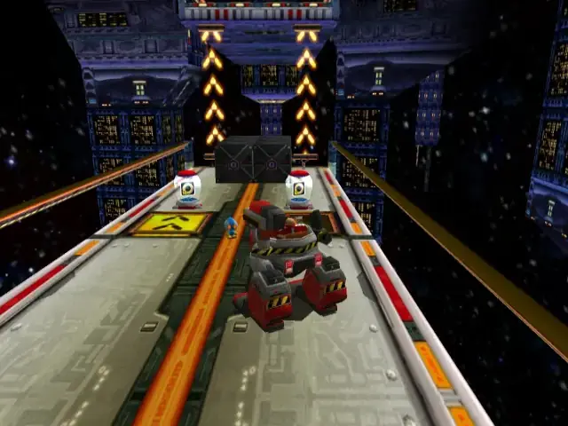

## animal 1
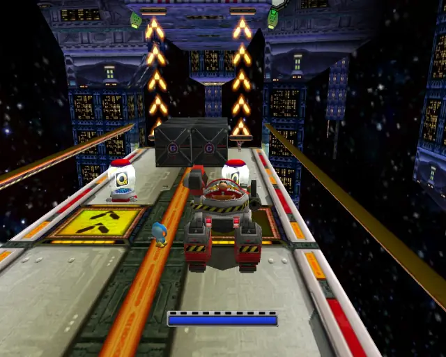

## pipe 1
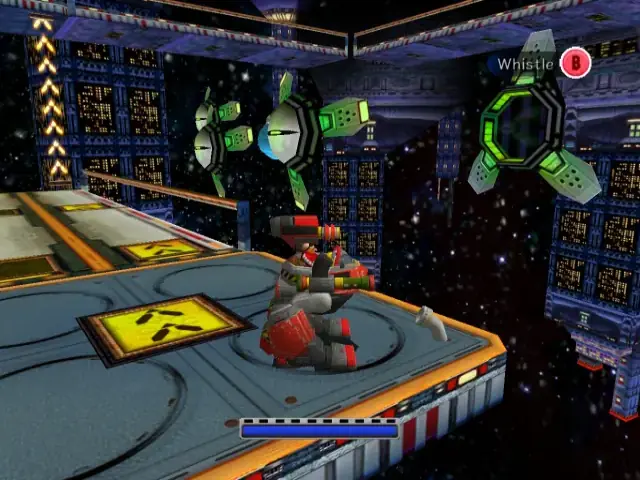

## animal 2

## goldbeetle 1
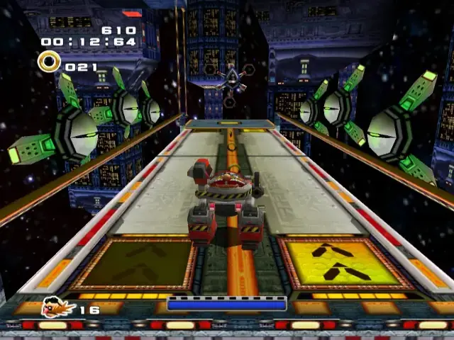
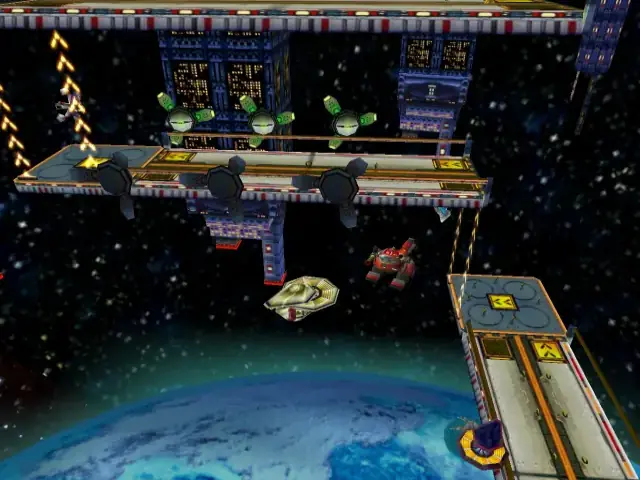

## animal 3
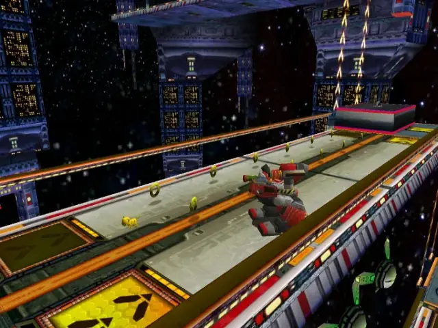

## chaobox 1

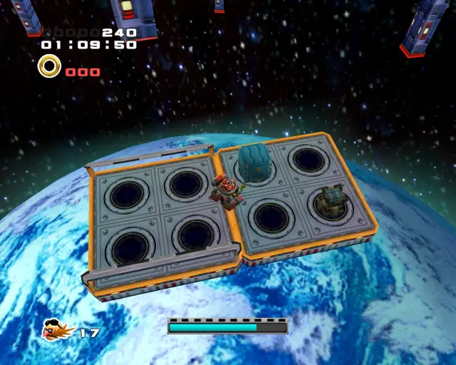

## animal 4
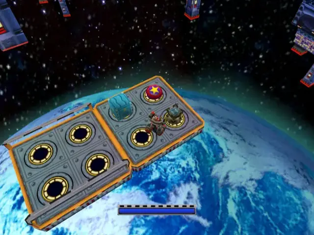
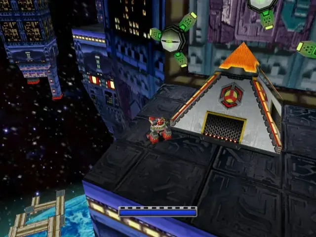
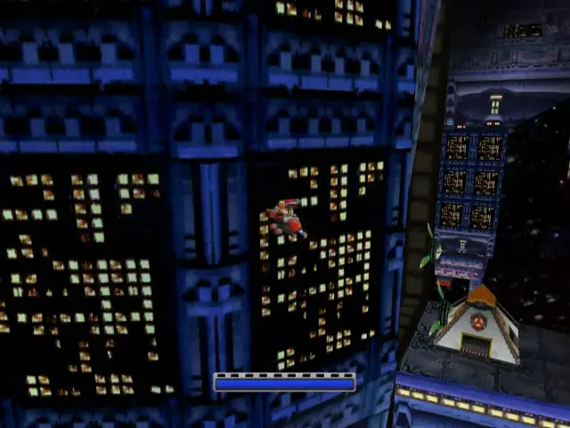
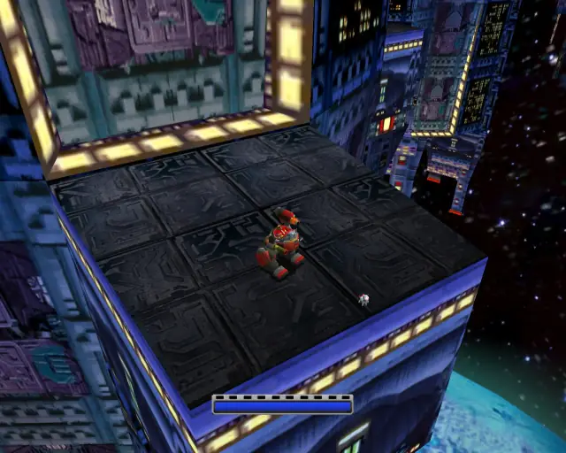

## animal 5
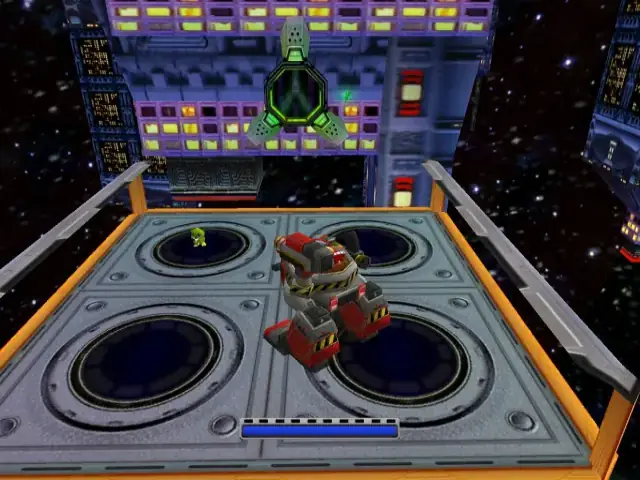

## pipe 2

## animal 6
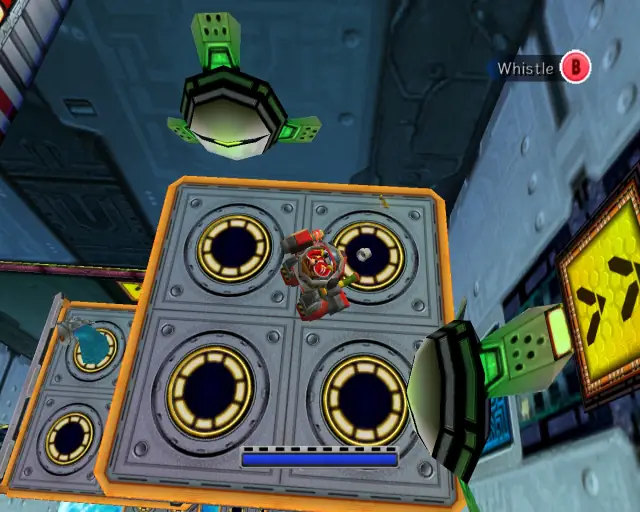

## animal 7
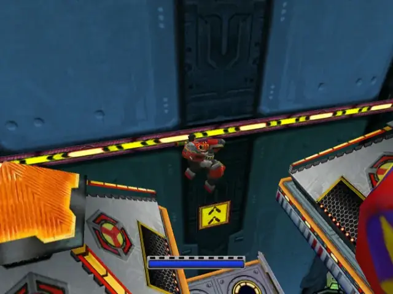
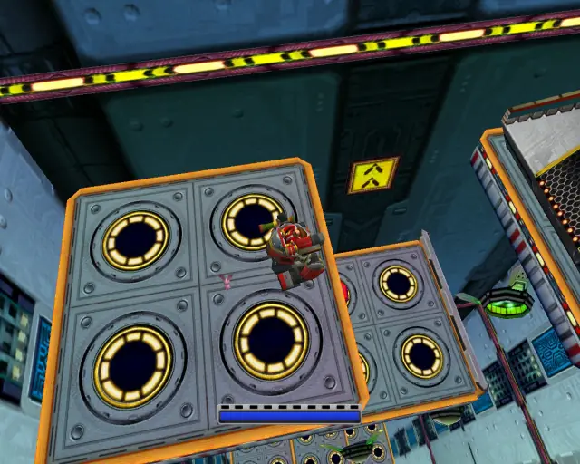

## animal 8
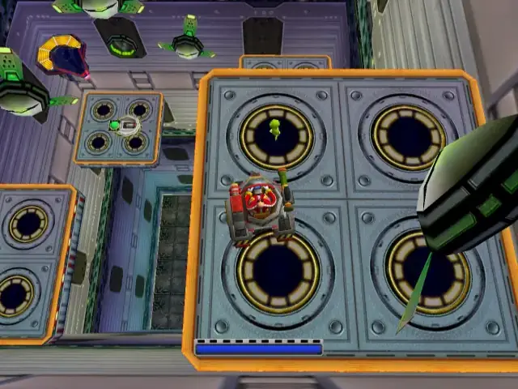

## pipe 3
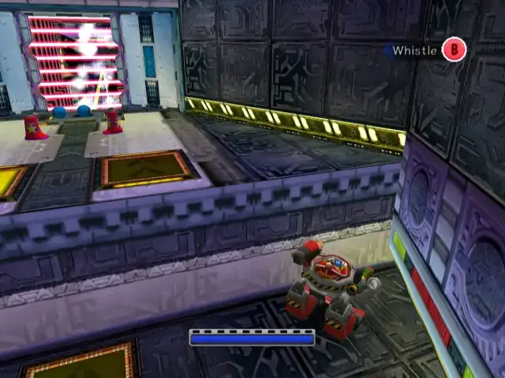

## animal 9

## chaobox 2
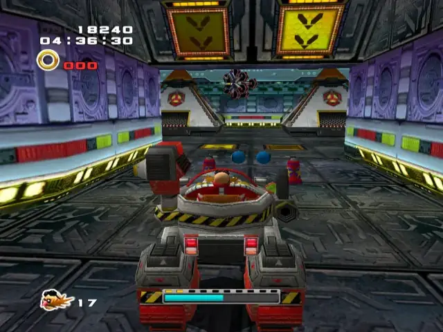
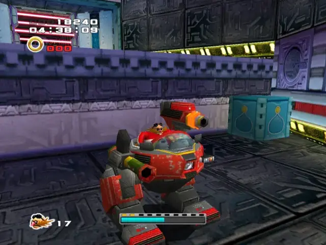

## pipe 4
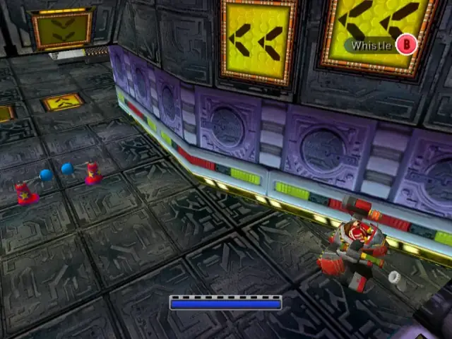

## animal 10

## animal 11
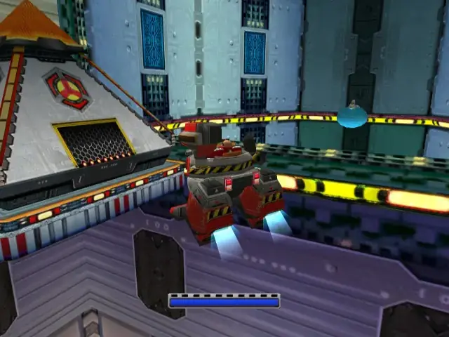
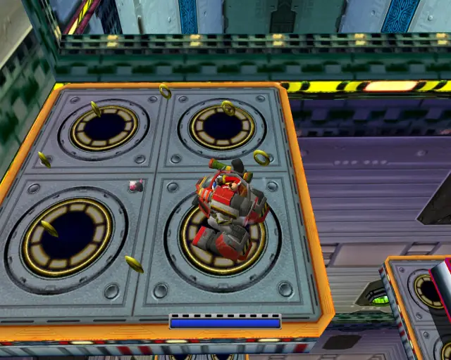

## animal 12
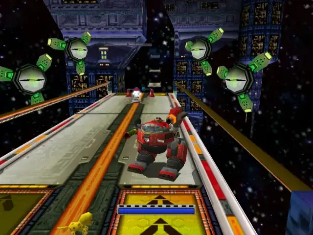

## pipe 5
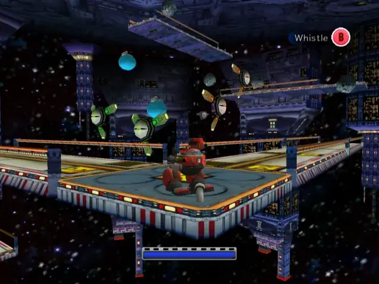

## animal 13

## animal 14
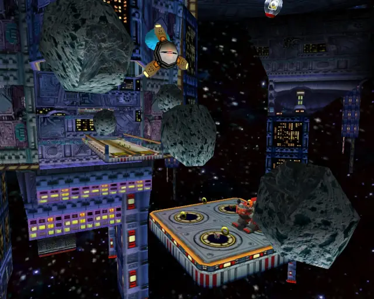

## animal 15
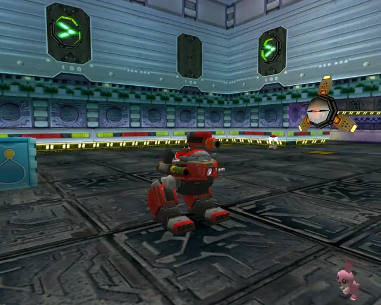

## chaobox 3
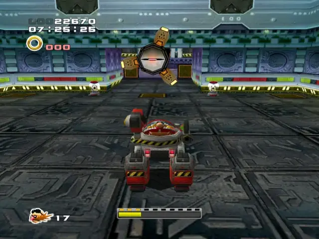
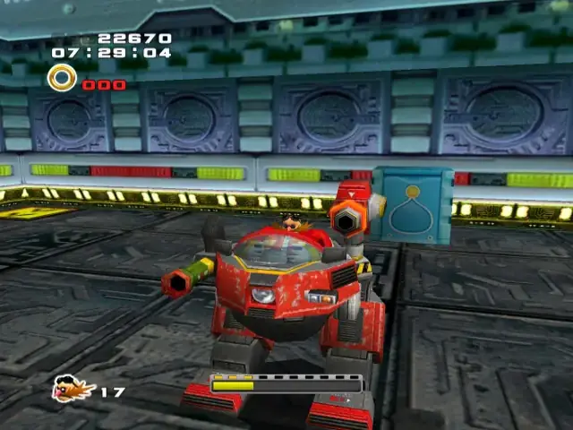

