# Eggman Stages

## Table of Contents:
1. [ Iron Gate ](#iron-gate)
1. [ Sand Ocean ](#sand-ocean)
1. [ Lost Colony ](#lost-colony)
1. [ Weapons Bed ](#weapons-bed)
1. [ Cosmic Wall ](#cosmic-wall)

# Iron Gate

## Iron Gate Gold Beetle

[Back to Top](#)

## Iron Gate Chao Box 1
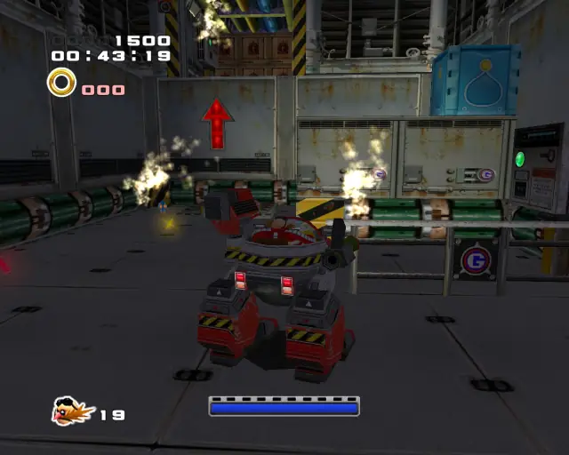
  

[Back to Top](#)

## Iron Gate Chao Box 2
  
  

[Back to Top](#)

## Iron Gate Chao Box 3
  

[Back to Top](#)

## Iron Gate Pipe 1

[Back to Top](#)

## Iron Gate Pipe 2
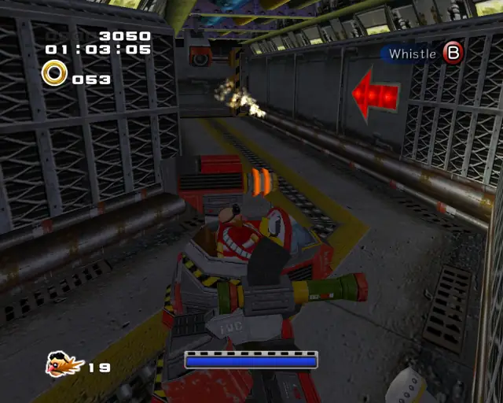

[Back to Top](#)

## Iron Gate Pipe 3

[Back to Top](#)

## Iron Gate Pipe 4

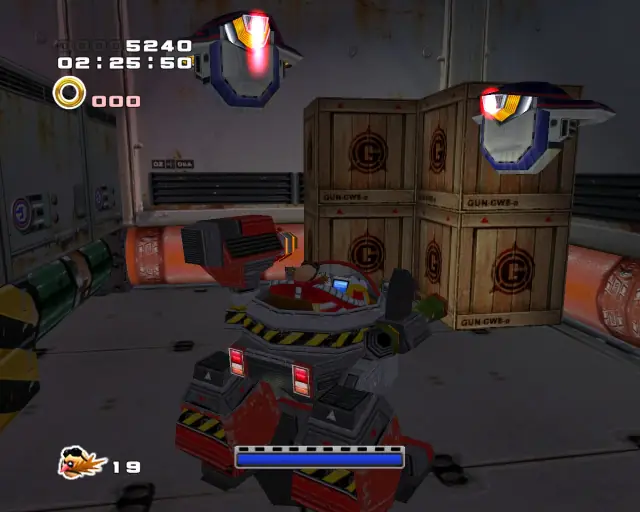
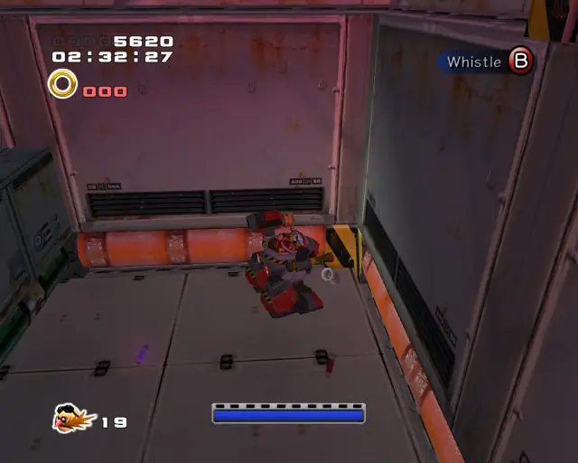

[Back to Top](#)

## Iron Gate Pipe 5

[Back to Top](#)

# Sand Ocean

## Sand Ocean Gold Beetle

[Back to Top](#)

## Sand Ocean Chao Box 1

[Back to Top](#)

## Sand Ocean Chao Box 2
  

[Back to Top](#)

## Sand Ocean Chao Box 3
  
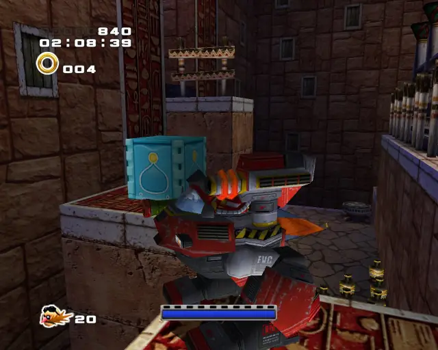

[Back to Top](#)

## Sand Ocean Pipe 1
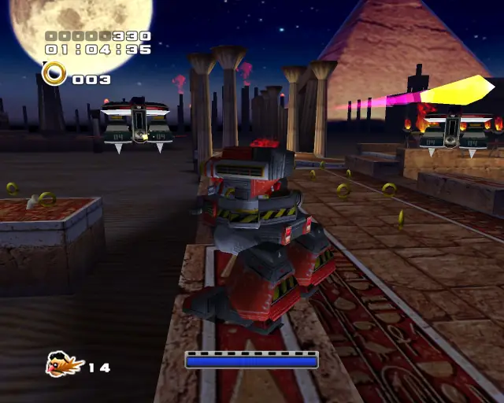
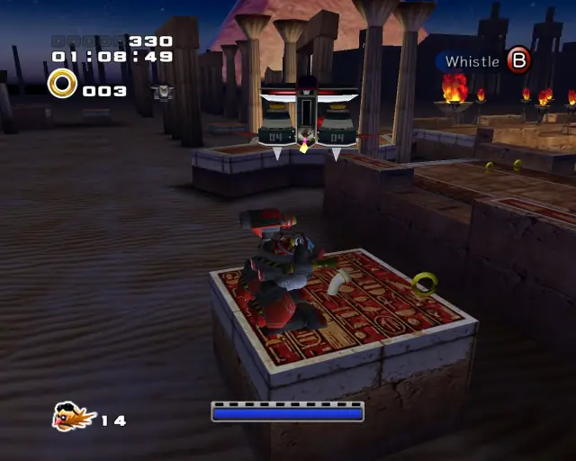

[Back to Top](#)

## Sand Ocean Pipe 2
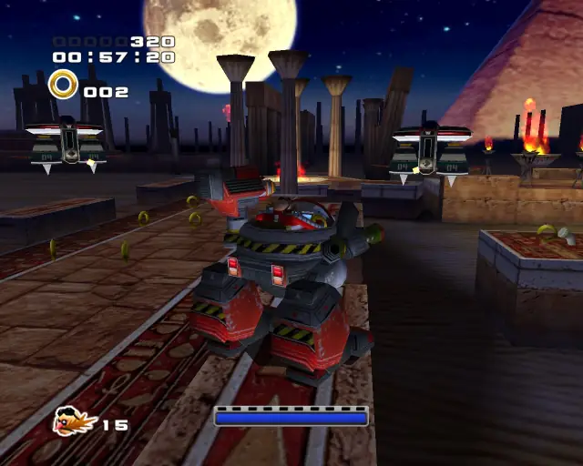

[Back to Top](#)

## Sand Ocean Pipe 3

[Back to Top](#)

## Sand Ocean Pipe 4

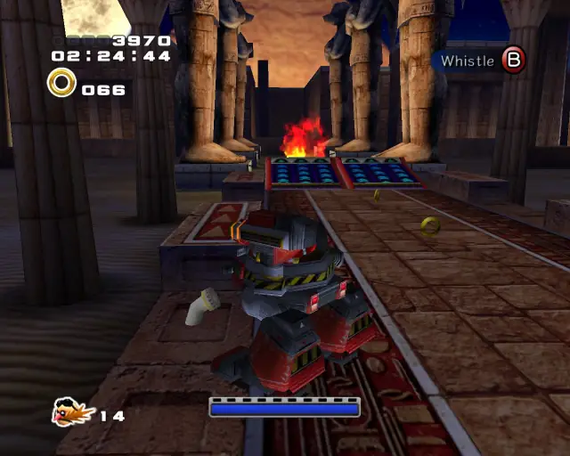

[Back to Top](#)

## Sand Ocean Pipe 5

[Back to Top](#)

# Lost Colony

## Lost Colony Gold Beetle

[Back to Top](#)

## Lost Colony Chao Box 1

  

[Back to Top](#)

## Lost Colony Chao Box 2
  

[Back to Top](#)

## Lost Colony Chao Box 3
  

[Back to Top](#)

## Lost Colony Pipe 1

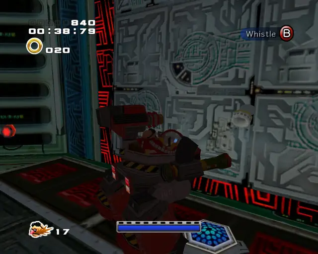

[Back to Top](#)

## Lost Colony Pipe 2
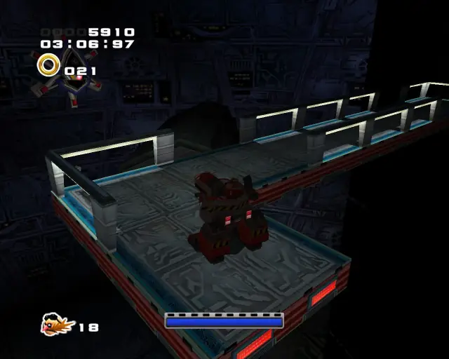

[Back to Top](#)

## Lost Colony Hidden 1
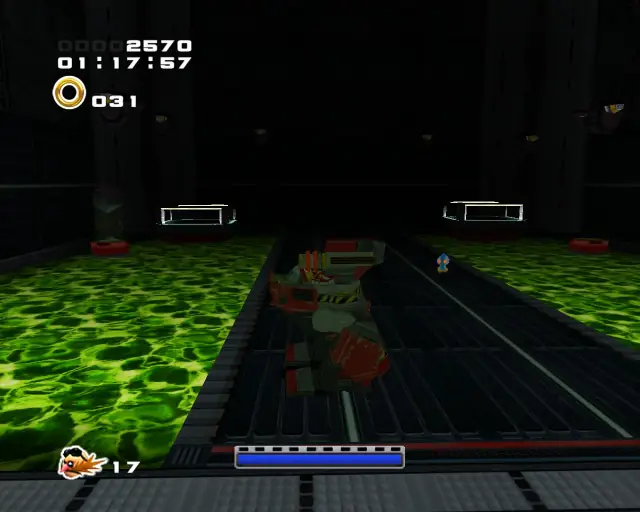

[Back to Top](#)

# Weapons Bed

## Weapons Bed Chao Box 1

  

[Back to Top](#)

## Weapons Bed Chao Box 2
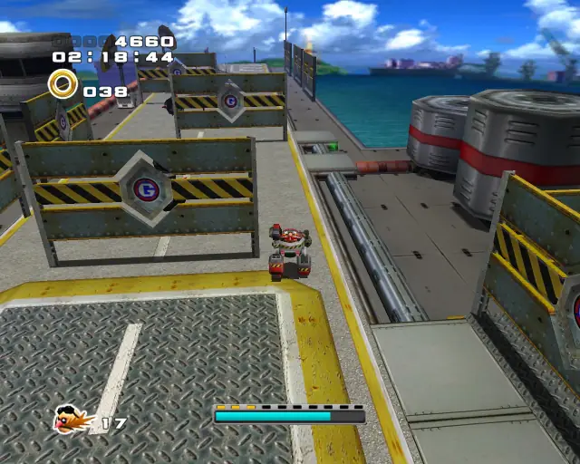  
  

[Back to Top](#)

## Weapons Bed Chao Box 3
  

[Back to Top](#)

## Weapons Bed Pipe 1

[Back to Top](#)

## Weapons Bed Pipe 2

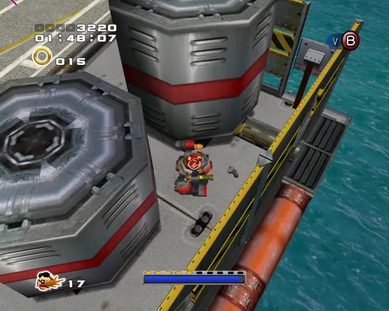

[Back to Top](#)

## Weapons Bed Pipe 3
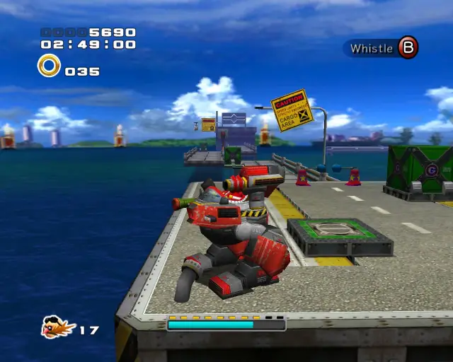

[Back to Top](#)

## Weapons Bed Pipe 4

[Back to Top](#)

## Weapons Bed Pipe 5

[Back to Top](#)

# Cosmic Wall

## Cosmic Wall Gold Beetle
  

[Back to Top](#)

## Cosmic Wall Chao Box 1

  

[Back to Top](#)

## Cosmic Wall Chao Box 2
  
  

[Back to Top](#)

## Cosmic Wall Chao Box 3
  

[Back to Top](#)

## Cosmic Wall Pipe 1

[Back to Top](#)

## Cosmic Wall Pipe 2

[Back to Top](#)

## Cosmic Wall Pipe 3

[Back to Top](#)

## Cosmic Wall Pipe 4
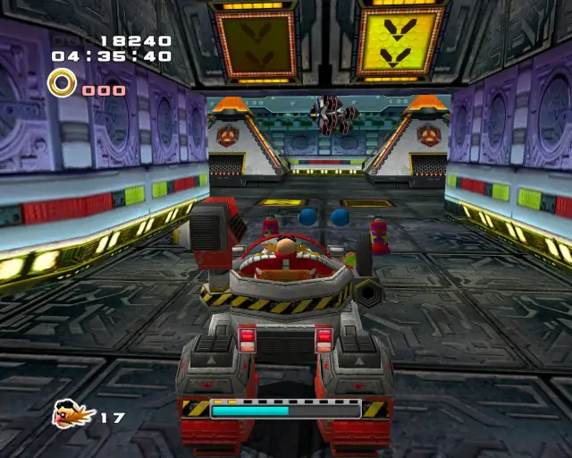

[Back to Top](#)

## Cosmic Wall Pipe 5

[Back to Top](#)
