# Eggman Stages (Animalsanity)

## Table of Contents:
1. [ Iron Gate ](#iron-gate)
1. [ Sand Ocean ](#sand-ocean)
1. [ Lost Colony ](#lost-colony)
1. [ Weapons Bed ](#weapons-bed)
1. [ Cosmic Wall ](#cosmic-wall)

# Iron Gate

## Iron Gate Animal 1

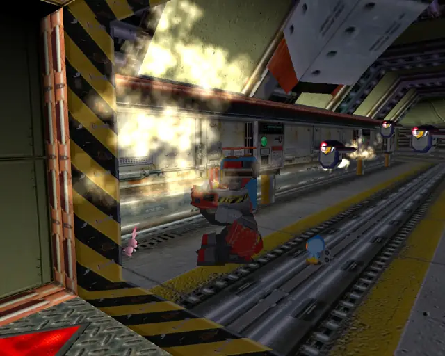

[Back to Top](#)

## Iron Gate Animal 2

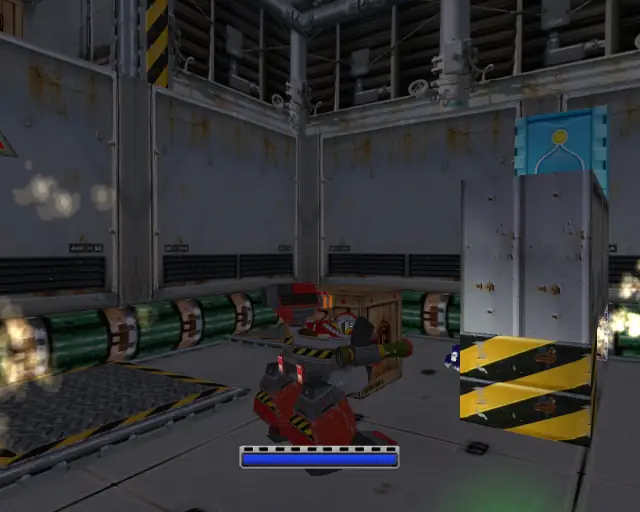

[Back to Top](#)

## Iron Gate Animal 3

[Back to Top](#)

## Iron Gate Animal 4

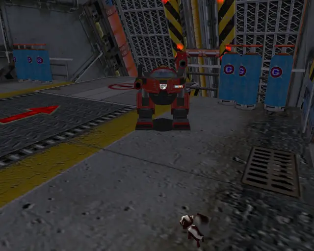

[Back to Top](#)

## Iron Gate Animal 5

[Back to Top](#)

## Iron Gate Animal 6

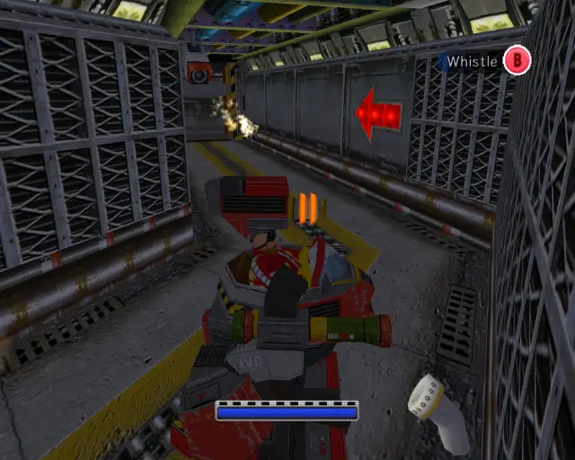

[Back to Top](#)

## Iron Gate Animal 7
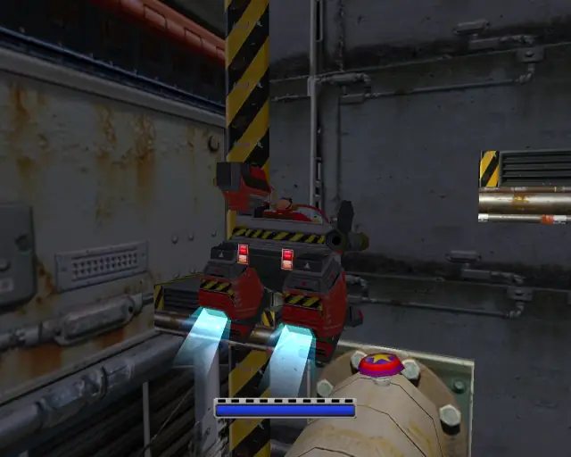

[Back to Top](#)

## Iron Gate Animal 8

[Back to Top](#)

## Iron Gate Animal 9

[Back to Top](#)

## Iron Gate Animal 10

[Back to Top](#)

## Iron Gate Animal 11

[Back to Top](#)

## Iron Gate Animal 12

[Back to Top](#)

## Iron Gate Animal 13
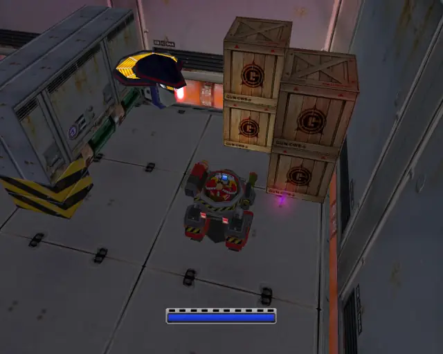

[Back to Top](#)

## Iron Gate Animal 14

[Back to Top](#)

## Iron Gate Animal 15

[Back to Top](#)

# Sand Ocean

## Sand Ocean Animal 1

[Back to Top](#)

## Sand Ocean Animal 2

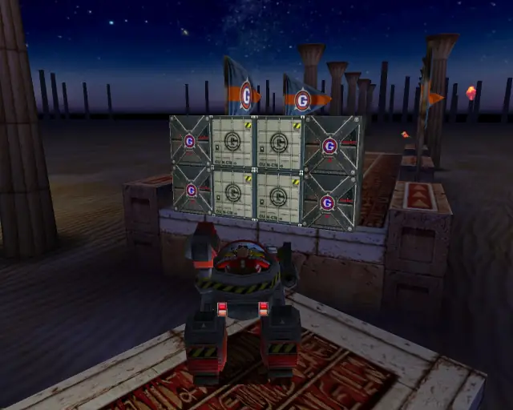

[Back to Top](#)

## Sand Ocean Animal 3

[Back to Top](#)

## Sand Ocean Animal 4

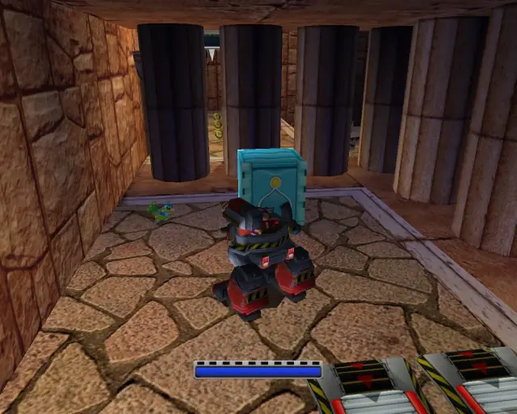

[Back to Top](#)

## Sand Ocean Animal 5

[Back to Top](#)

## Sand Ocean Animal 6

[Back to Top](#)

## Sand Ocean Animal 7

[Back to Top](#)

## Sand Ocean Animal 8

[Back to Top](#)

## Sand Ocean Animal 9

[Back to Top](#)

## Sand Ocean Animal 10

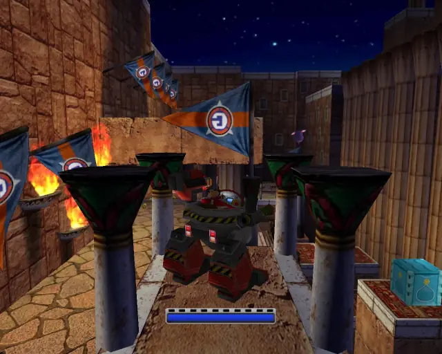

[Back to Top](#)

## Sand Ocean Animal 11

[Back to Top](#)

## Sand Ocean Animal 12

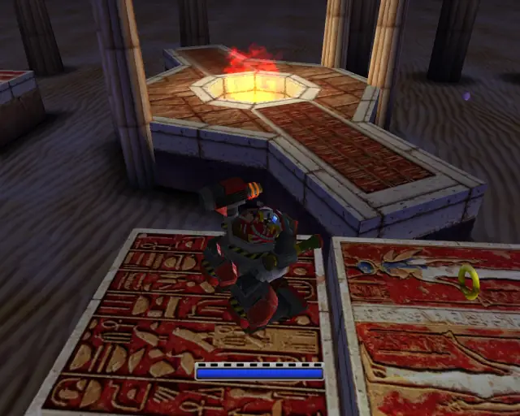

[Back to Top](#)

## Sand Ocean Animal 13

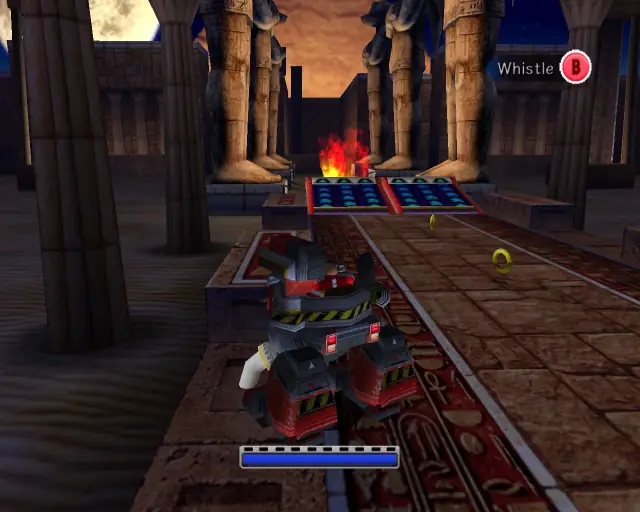

[Back to Top](#)

## Sand Ocean Animal 14

[Back to Top](#)

## Sand Ocean Animal 15

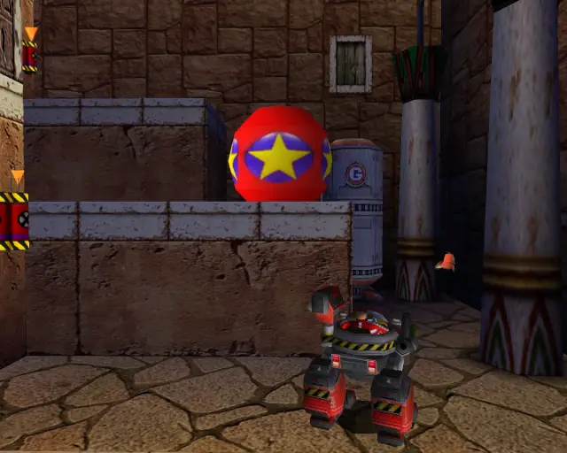

[Back to Top](#)

# Lost Colony

## Lost Colony Animal 1

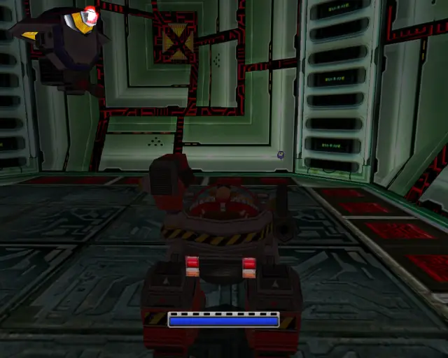

[Back to Top](#)

## Lost Colony Animal 2

[Back to Top](#)

## Lost Colony Animal 3

[Back to Top](#)

## Lost Colony Animal 4

[Back to Top](#)

## Lost Colony Animal 5

[Back to Top](#)

## Lost Colony Animal 6

[Back to Top](#)

## Lost Colony Animal 7

[Back to Top](#)

## Lost Colony Animal 8

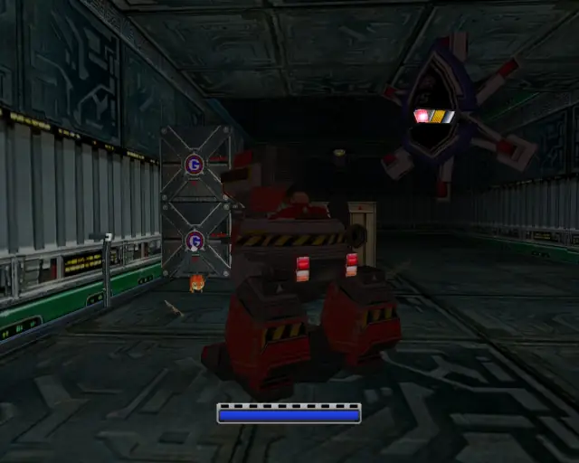

[Back to Top](#)

## Lost Colony Animal 9

[Back to Top](#)

## Lost Colony Animal 10

[Back to Top](#)

## Lost Colony Animal 11

[Back to Top](#)

## Lost Colony Animal 12

[Back to Top](#)

## Lost Colony Animal 13

[Back to Top](#)

## Lost Colony Animal 14

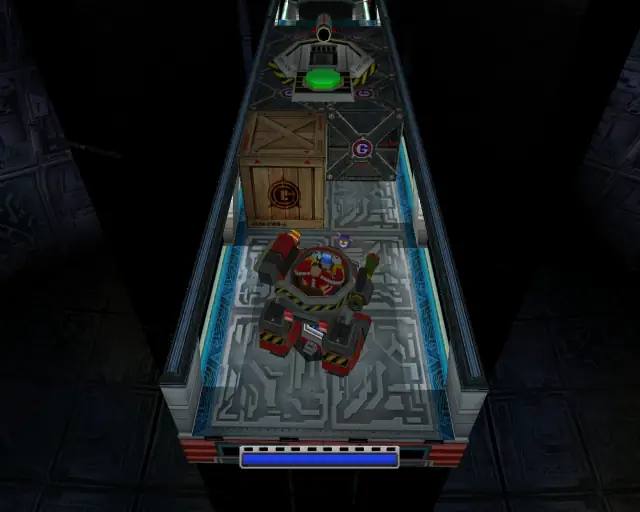

[Back to Top](#)

## Lost Colony Animal Bonus
- This animal isn't required to get all of the checks, but it is in the level.
- Under some circumstances you can collect it by running into it at the right time. Otherwise it's pure rng.

[Back to Top](#)

# Weapons Bed

## Weapons Bed Animal 1

[Back to Top](#)

## Weapons Bed Animal 2

[Back to Top](#)

## Weapons Bed Animal 3

[Back to Top](#)

## Weapons Bed Animal 4

[Back to Top](#)

## Weapons Bed Animal 5

[Back to Top](#)

## Weapons Bed Animal 6

[Back to Top](#)

## Weapons Bed Animal 7

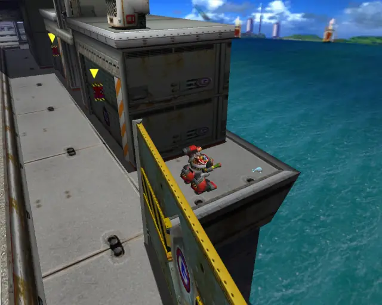

[Back to Top](#)

## Weapons Bed Animal 8

[Back to Top](#)

## Weapons Bed Animal 9

[Back to Top](#)

## Weapons Bed Animal 10

[Back to Top](#)

## Weapons Bed Animal 11

[Back to Top](#)

## Weapons Bed Animal 12

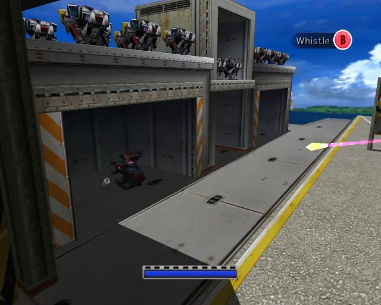

[Back to Top](#)

## Weapons Bed Animal 13

[Back to Top](#)

## Weapons Bed Animal 14

[Back to Top](#)

## Weapons Bed Animal 15

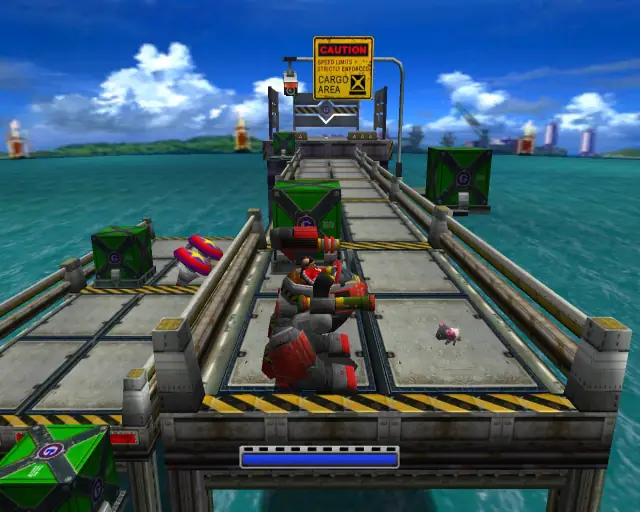

[Back to Top](#)

# Cosmic Wall

## Cosmic Wall Animal 1

[Back to Top](#)

## Cosmic Wall Animal 2

[Back to Top](#)

## Cosmic Wall Animal 3

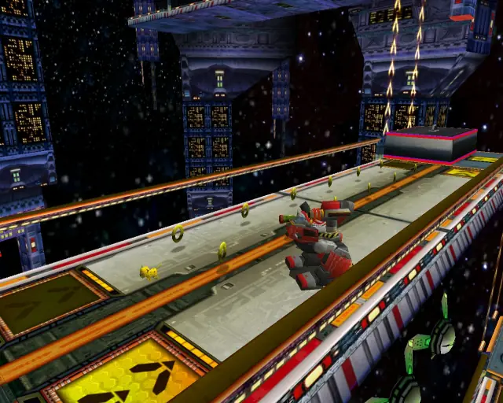

[Back to Top](#)

## Cosmic Wall Animal 4

[Back to Top](#)

## Cosmic Wall Animal 5

[Back to Top](#)

## Cosmic Wall Animal 6

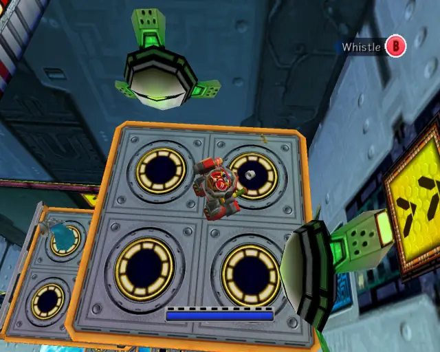

[Back to Top](#)

## Cosmic Wall Animal 7

[Back to Top](#)

## Cosmic Wall Animal 8

[Back to Top](#)

## Cosmic Wall Animal 9

[Back to Top](#)

## Cosmic Wall Animal 10

[Back to Top](#)

## Cosmic Wall Animal 11

[Back to Top](#)

## Cosmic Wall Animal 12

[Back to Top](#)

## Cosmic Wall Animal 13

[Back to Top](#)

## Cosmic Wall Animal 14

[Back to Top](#)

## Cosmic Wall Animal 15

[Back to Top](#)
