# Eggman Stages (Chronological)

## Table of Contents:
1. [ Iron Gate ](#iron-gate)
1. [ Sand Ocean ](#sand-ocean)
1. [ Lost Colony ](#lost-colony)
1. [ Weapons Bed ](#weapons-bed)
1. [ Cosmic Wall ](#cosmic-wall)

# Iron Gate

## Iron Gate Animal 1

[Back to Top](#)

## Iron Gate Omochao 1

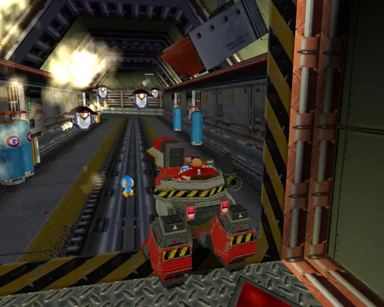

[Back to Top](#)

## Iron Gate Omochao 2

[Back to Top](#)

## Iron Gate Chao Box 1

  

[Back to Top](#)

## Iron Gate Omochao 3

[Back to Top](#)

## Iron Gate Animal 2

[Back to Top](#)

## Iron Gate Omochao 4

[Back to Top](#)

## Iron Gate Pipe 1 & Animal 3

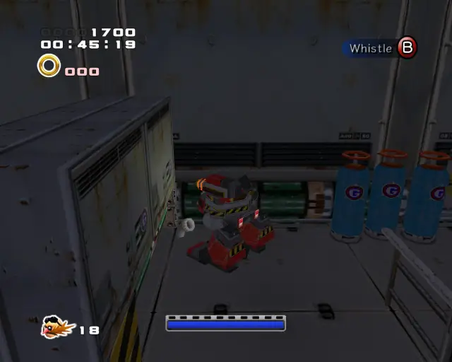

[Back to Top](#)

## Iron Gate Animal 4

[Back to Top](#)

## Iron Gate Gold Beetle
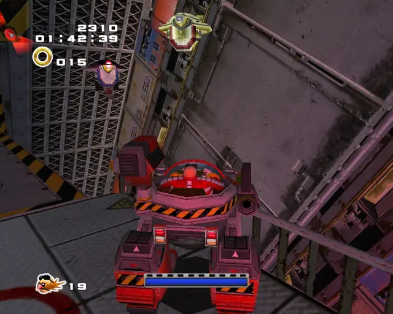

[Back to Top](#)

## Iron Gate Animal 5

[Back to Top](#)

## Iron Gate Pipe 2 & Animal 6

[Back to Top](#)

## Iron Gate Chao Box 2
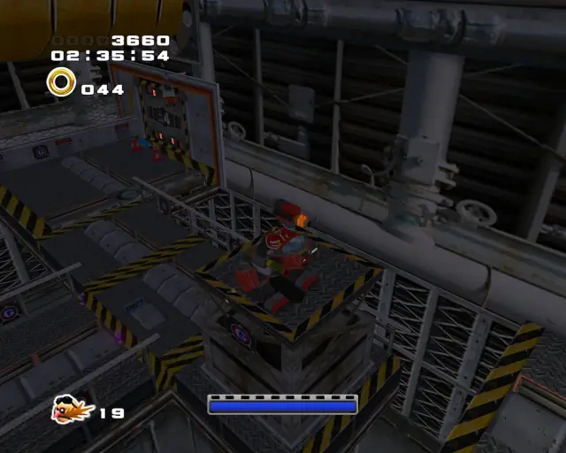  
  

[Back to Top](#)

## Iron Gate Animal 7

[Back to Top](#)

## Iron Gate Animal 8

[Back to Top](#)

## Iron Gate Animal 9

[Back to Top](#)  

## Iron Gate Pipe 3 & Animal 10

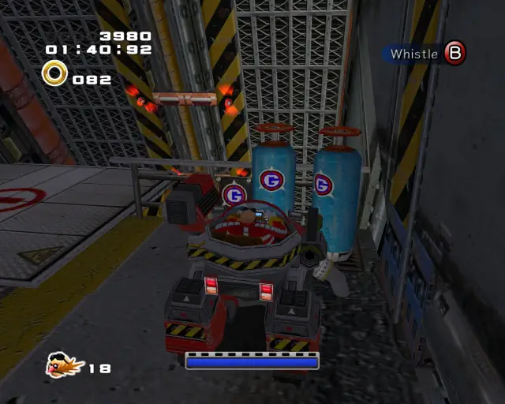

[Back to Top](#)

## Iron Gate Animal 11

[Back to Top](#)

## Iron Gate Animal 12

[Back to Top](#)

## Iron Gate Omochao 5

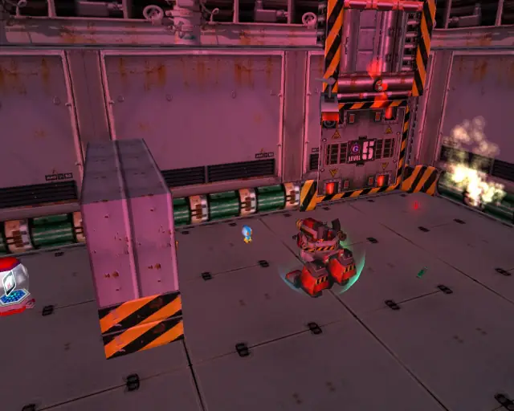

[Back to Top](#)

## Iron Gate Pipe 4 & Animal 13

[Back to Top](#)

## Iron Gate Omochao 6

[Back to Top](#)

## Iron Gate Pipe 5 & Animal 14
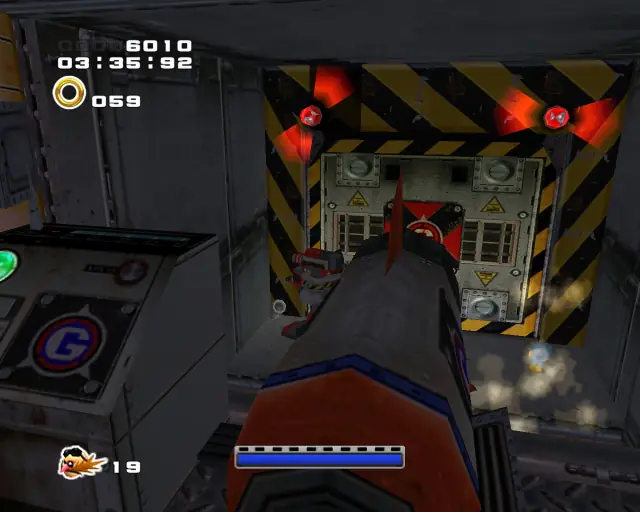

[Back to Top](#)

## Iron Gate Chao Box 3
  

[Back to Top](#)

## Iron Gate Animal 15

[Back to Top](#)

# Sand Ocean

## Sand Ocean Animal 1

[Back to Top](#)

## Sand Ocean Omochao 1

[Back to Top](#)

## Sand Ocean Animal 2

[Back to Top](#)

## Sand Ocean Omochao 2

[Back to Top](#)

## Sand Ocean Animal 3

[Back to Top](#)

## Sand Ocean Animal 4

[Back to Top](#)

## Sand Ocean Chao Box 1

[Back to Top](#)

## Sand Ocean Animal 5

[Back to Top](#)

## Sand Ocean Chao Box 2
  

[Back to Top](#)

## Sand Ocean Gold Beetle

[Back to Top](#)

## Sand Ocean Pipe 1 & Animal 6

[Back to Top](#)

## Sand Ocean Pipe 2 & Animal 7

[Back to Top](#)

## Sand Ocean Animal 8

[Back to Top](#)

## Sand Ocean Animal 9

[Back to Top](#)

## Sand Ocean Animal 10

[Back to Top](#)

## Sand Ocean Chao Box 3
  

[Back to Top](#)

## Sand Ocean Pipe 3 & Animal 11

[Back to Top](#)

## Sand Ocean Animal 12

[Back to Top](#)

## Sand Ocean Pipe 4 & Animal 13

[Back to Top](#)

## Sand Ocean Pipe 5 & Animal 14

[Back to Top](#)

## Sand Ocean Animal 15

[Back to Top](#)

# Lost Colony

## Lost Colony Omochao 1

[Back to Top](#)

## Lost Colony Animal 1

[Back to Top](#)

## Lost Colony Pipe 1 & Animal 2

[Back to Top](#)

## Lost Colony Omochao 2

[Back to Top](#)

## Lost Colony Animal 3

[Back to Top](#)

## Lost Colony Animal 4

[Back to Top](#)

## Lost Colony Hidden 1 & Animal 5

[Back to Top](#)

## Lost Colony Omochao 3

[Back to Top](#)

## Lost Colony Animal 6

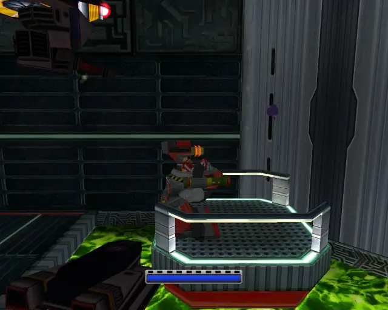

[Back to Top](#)

## Lost Colony Animal 7
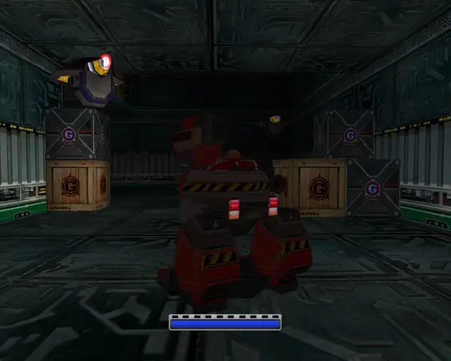
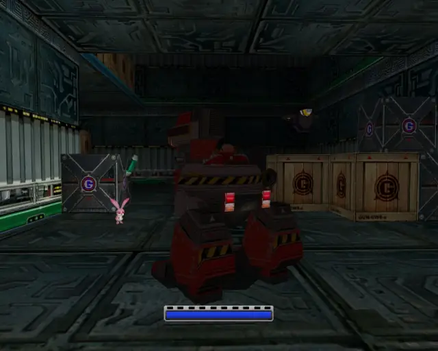

[Back to Top](#)

## Lost Colony Animal 8

[Back to Top](#)

## Lost Colony Omochao 4

[Back to Top](#)

## Lost Colony Chao Box 1

  

[Back to Top](#)

## Lost Colony Omochao 5

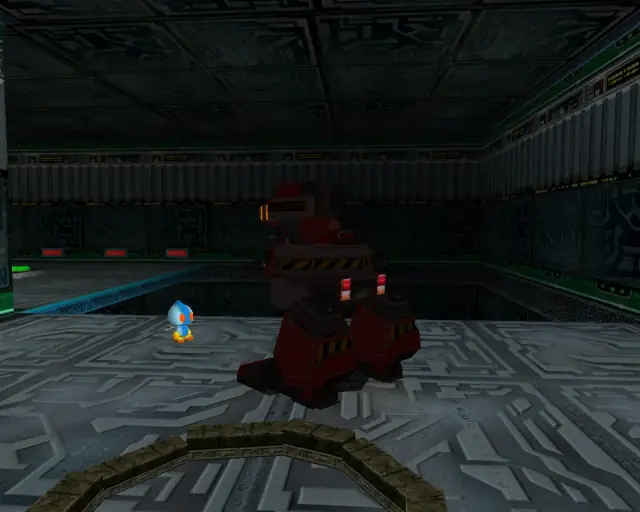

[Back to Top](#)

## Lost Colony Chao Box 2
  

[Back to Top](#)

## Lost Colony Animal 9

[Back to Top](#)

## Lost Colony Animal 10

[Back to Top](#)

## Lost Colony Omochao 6

[Back to Top](#)

## Lost Colony Pipe 2 & Animal 11

[Back to Top](#)

## Lost Colony Gold Beetle

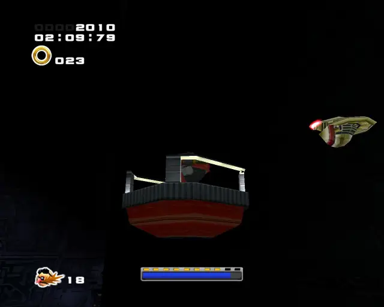

[Back to Top](#)

## Lost Colony Animal 12
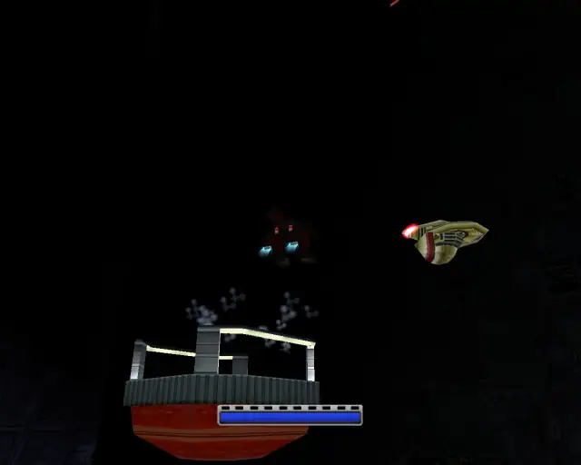

[Back to Top](#)

## Lost Colony Chao Box 3
  

[Back to Top](#)

## Lost Colony Omochao 7

[Back to Top](#)

## Lost Colony Animal 13

[Back to Top](#)

## Lost Colony Animal 14

[Back to Top](#)

## Lost Colony Omochao 8

[Back to Top](#)

# Weapons Bed

## Weapons Bed Pipe 1 & Animal 1

[Back to Top](#)

## Weapons Bed Animal 2

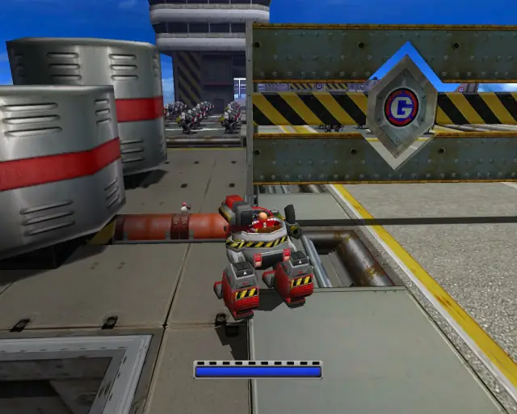

[Back to Top](#)

## Weapons Bed Chao Box 1

  

[Back to Top](#)

## Weapons Bed Pipe 2 & Animal 3

[Back to Top](#)

## Weapons Bed Omochao 1

[Back to Top](#)

## Weapons Bed Omochao 2

[Back to Top](#)

## Weapons Bed Animal 4

[Back to Top](#)

## Weapons Bed Animal 5

[Back to Top](#)

## Weapons Bed Animal 6

[Back to Top](#)

## Weapons Bed Omochao 3

[Back to Top](#)

## Weapons Bed Animal 7

[Back to Top](#)

## Weapons Bed Chao Box 2
  
  

[Back to Top](#)

## Weapons Bed Animal 8

[Back to Top](#)

## Weapons Bed Pipe 3 & Animal 9

[Back to Top](#)

## Weapons Bed Animal 10
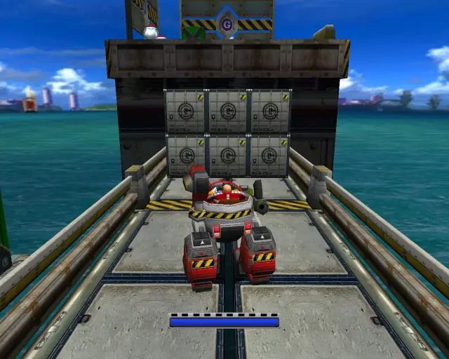

[Back to Top](#)

## Weapons Bed Animal 11

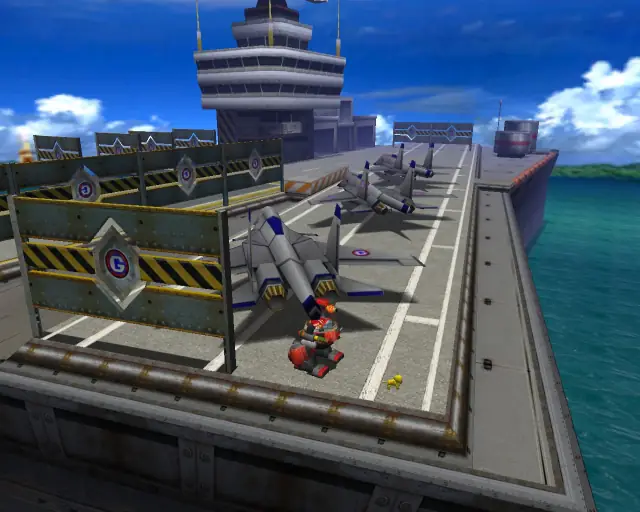

[Back to Top](#)

## Weapons Bed Pipe 4 & Animal 12
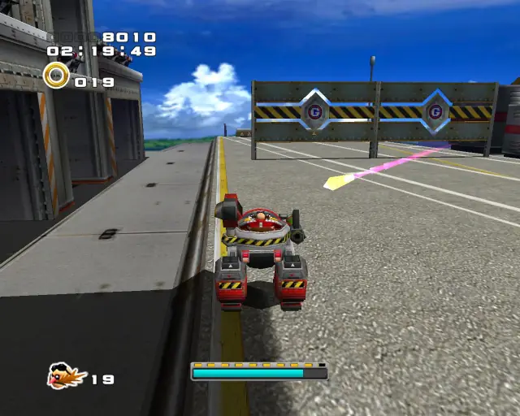

[Back to Top](#)

## Weapons Bed Chao Box 3
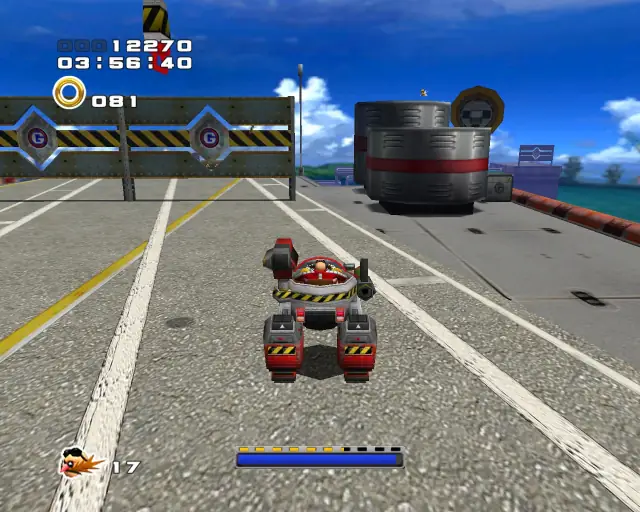  

[Back to Top](#)

## Weapons Bed Animal 13

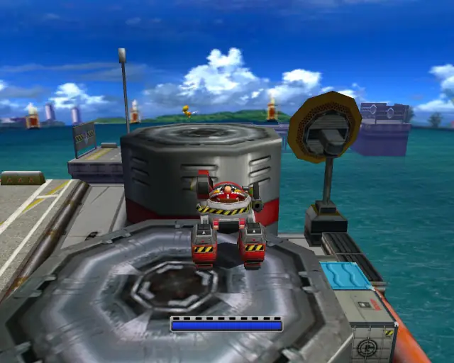

[Back to Top](#)

## Weapons Bed Pipe 5 & Animal 14
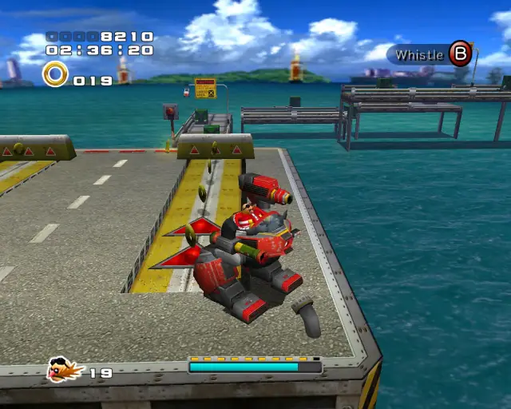

[Back to Top](#)

## Weapons Bed Animal 15

[Back to Top](#)

# Cosmic Wall

## Cosmic Wall Omochao 1

[Back to Top](#)

## Cosmic Wall Animal 1

[Back to Top](#)

## Cosmic Wall Pipe 1 & Animal 2

[Back to Top](#)

## Cosmic Wall Gold Beetle
  

[Back to Top](#)

## Cosmic Wall Animal 3

[Back to Top](#)

## Cosmic Wall Chao Box 1

  

[Back to Top](#)

## Cosmic Wall Animal 4

[Back to Top](#)

## Cosmic Wall Animal 5

[Back to Top](#)

## Cosmic Wall Pipe 2 & Animal 6

[Back to Top](#)

## Cosmic Wall Animal 7

[Back to Top](#)

## Cosmic Wall Animal 8

[Back to Top](#)

## Cosmic Wall Pipe 3 & Animal 9

[Back to Top](#)

## Cosmic Wall Chao Box 2
  
  

[Back to Top](#)

## Cosmic Wall Pipe 4 & Animal 10

[Back to Top](#)

## Cosmic Wall Animal 11

[Back to Top](#)

## Cosmic Wall Animal 12

[Back to Top](#)

## Cosmic Wall Pipe 5 & Animal 13

[Back to Top](#)

## Cosmic Wall Animal 14

[Back to Top](#)

## Cosmic Wall Animal 15

[Back to Top](#)

## Cosmic Wall Chao Box 3
  

[Back to Top](#)
