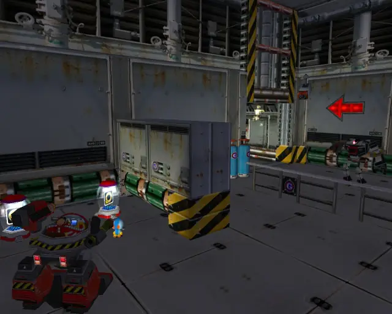
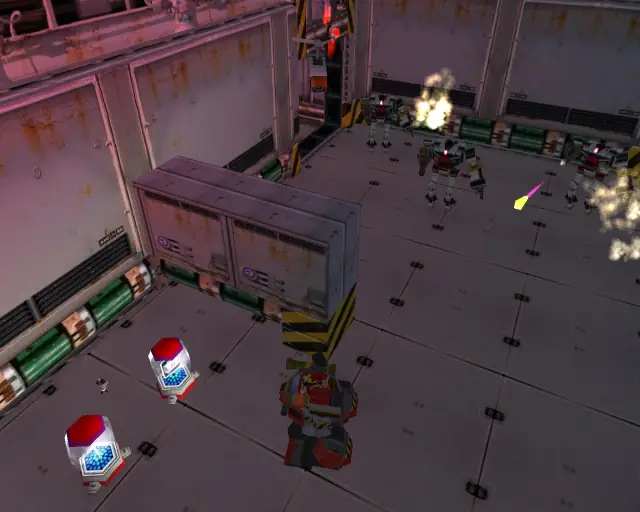
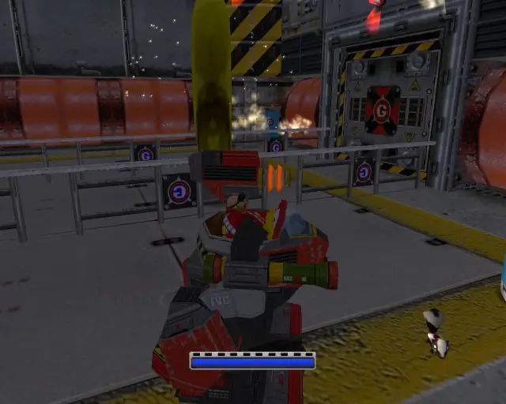

## animal 1

## omochao 1

## omochao 2

## chaobox 1

## omochao 3

## animal 2

## omochao 4

## item 1

## item 2

## pipe 1

## animal 3

## animal 4

## goldbeetle 1

## big 1

## item 3

## item 4

## item 5

## item 6

## animal 5

## pipe 2

## animal 6

## item 7

## animal 7

## item 8

## life 1

## life 2

## animal 8

## item 9

## item 10

## item 11

## life 3

## item 12

## item 13

## animal 9

## chaobox 2

## item 14

## pipe 3

## animal 10

## item 15

## life 4

## animal 11

## animal 12

## omochao 5

## pipe 4

## animal 13

## item 16

## omochao 6

## pipe 5

## animal 14

## chaobox 3

## animal 15

