
## omochao 1
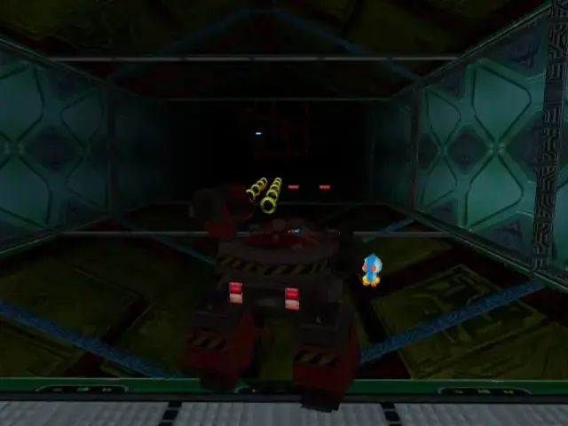

## animal 1
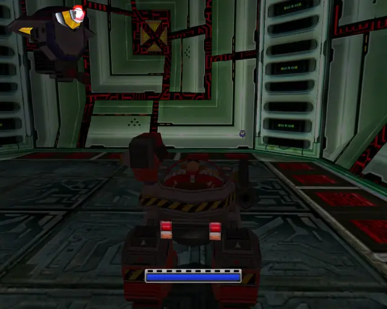

## pipe 1
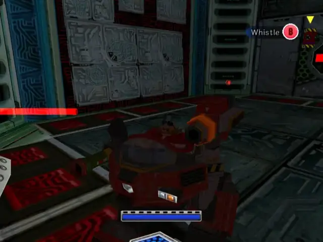

## animal 2

## animal 3
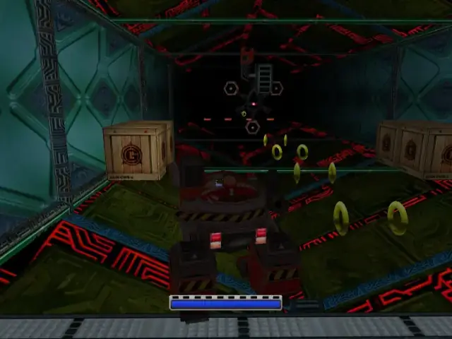
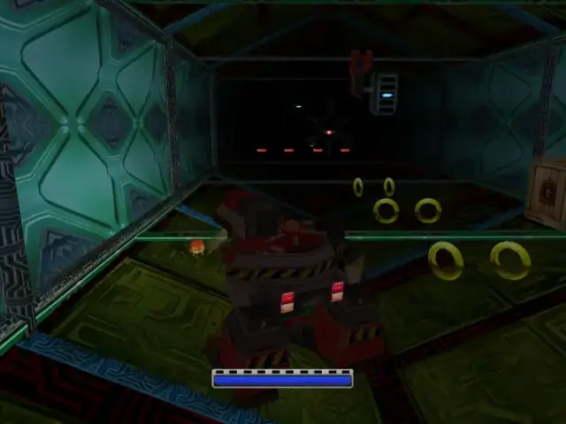

## omochao 2
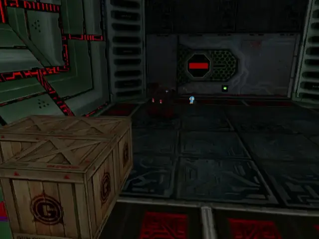

## animal 4

## hidden 1
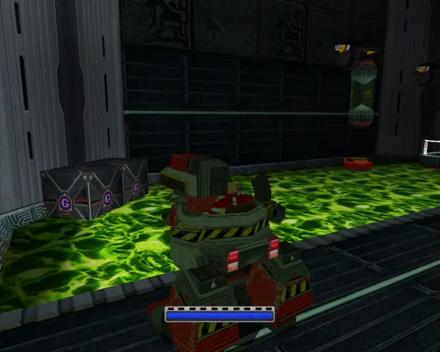

## animal 5

## omochao 3
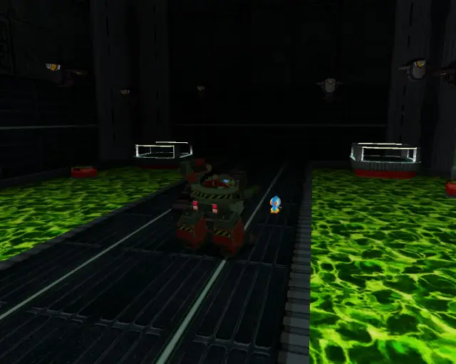

## animal 6
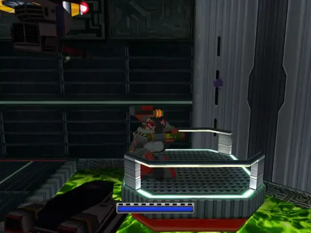

## animal 7
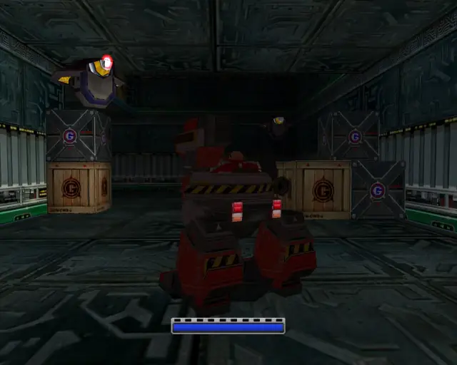
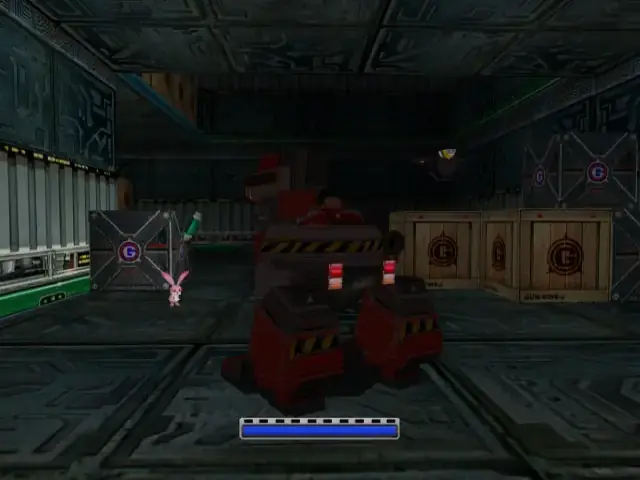

## animal 8

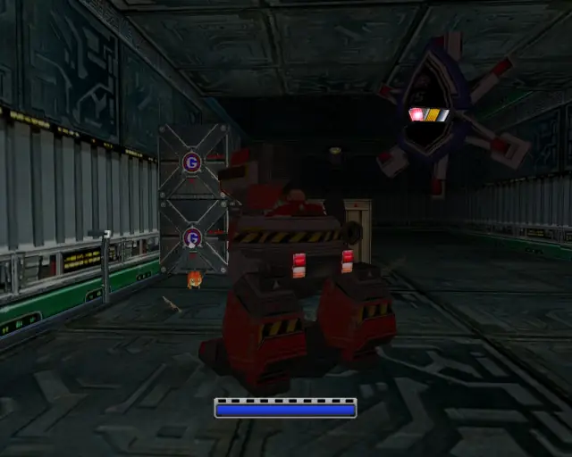

## omochao 4
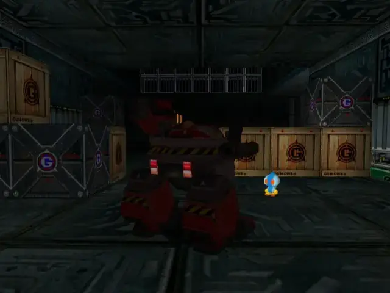

## chaobox 1

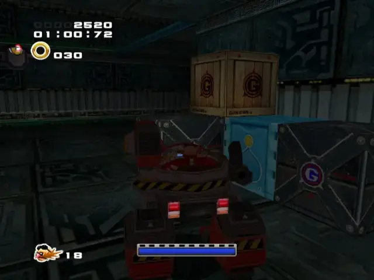

## omochao 5
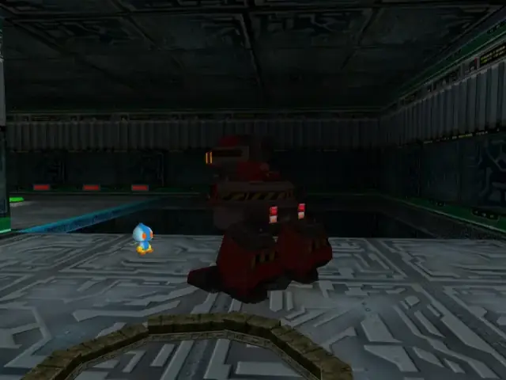

## chaobox 2
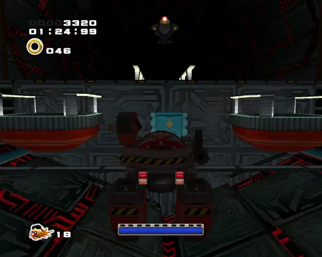

## animal 9
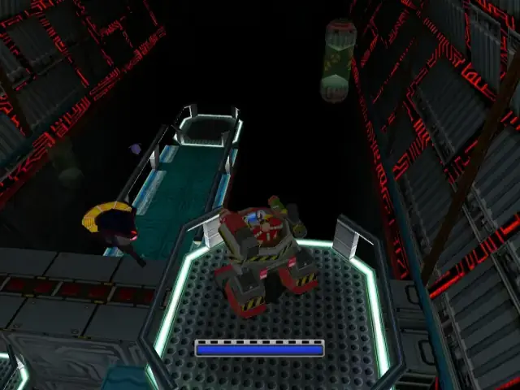

## animal 10
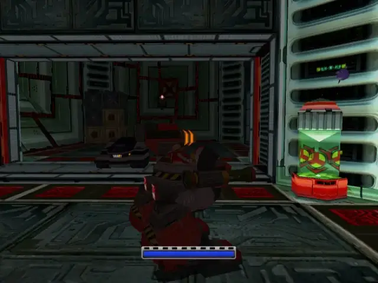

## omochao 6
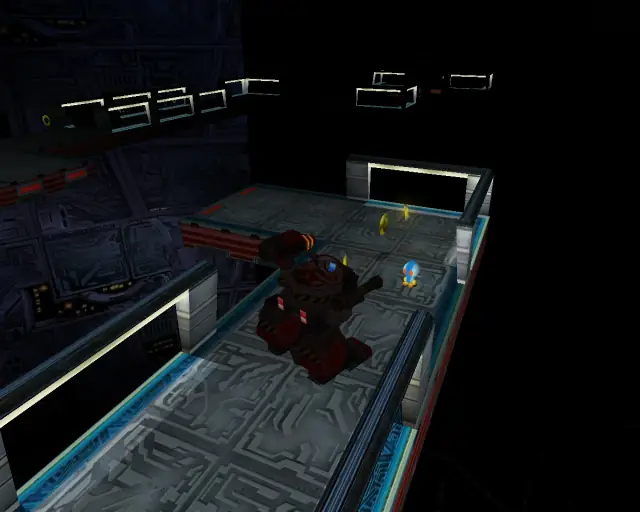

## pipe 2
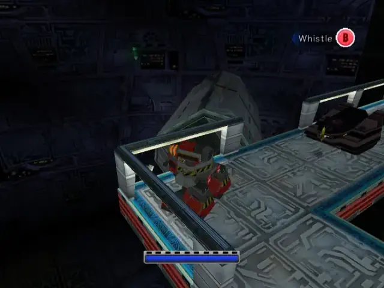

## animal 11
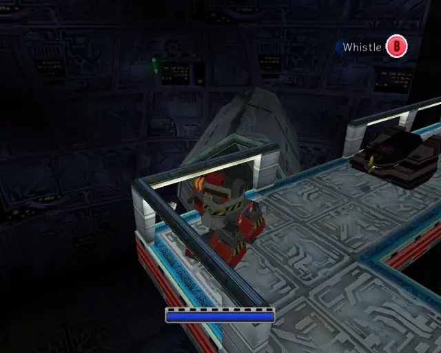

## goldbeetle 1

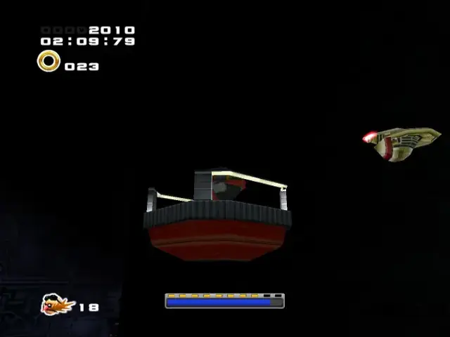

## animal 12

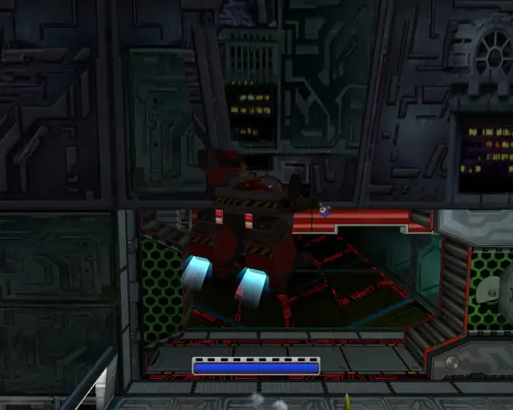

## chaobox 3

## animal 13
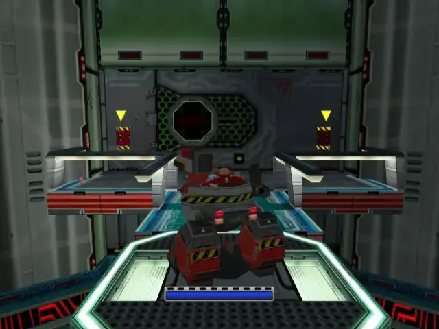

## omochao 7
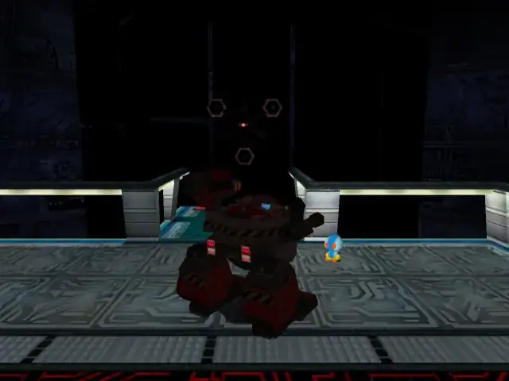

## animal 14
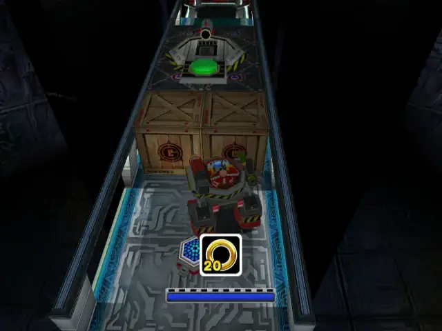
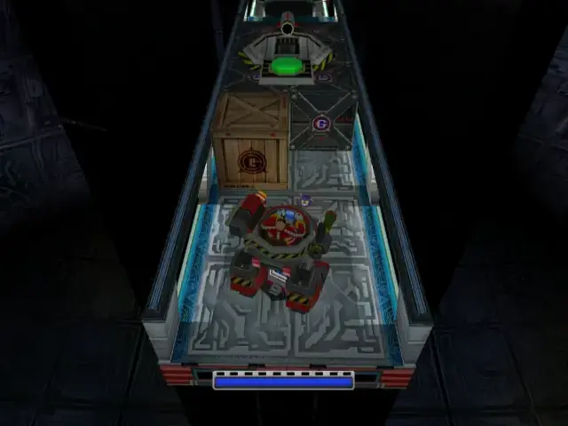

## omochao 8

