
## pipe 1
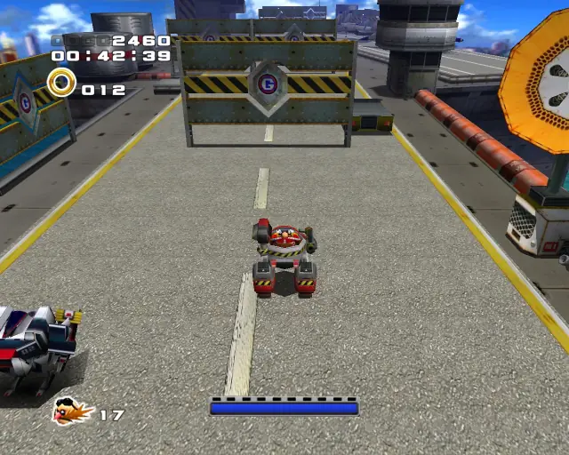
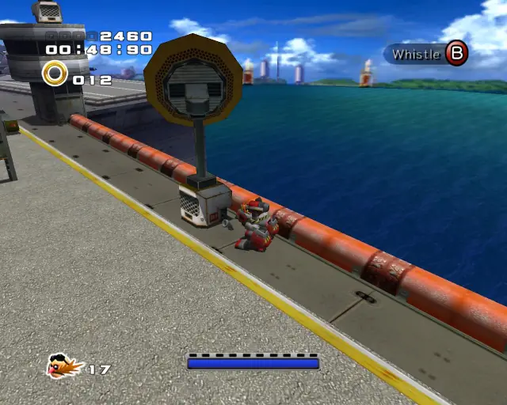

## animal 1

## animal 2

## chaobox 1
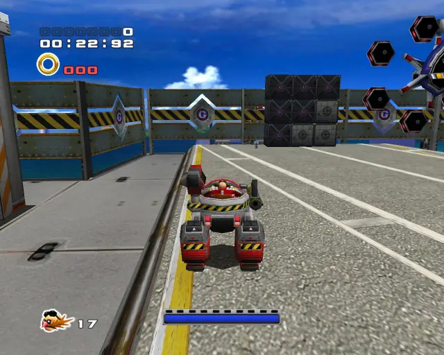
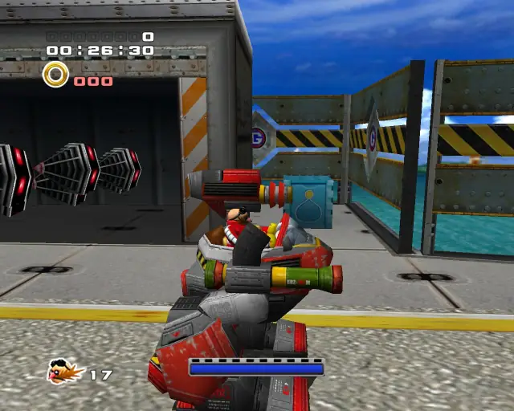

## pipe 2

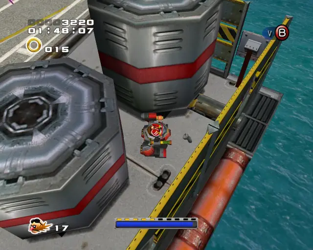

## animal 3

## omochao 1
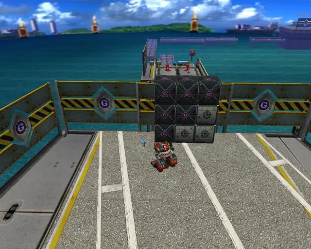

## omochao 2

## animal 4

## animal 5
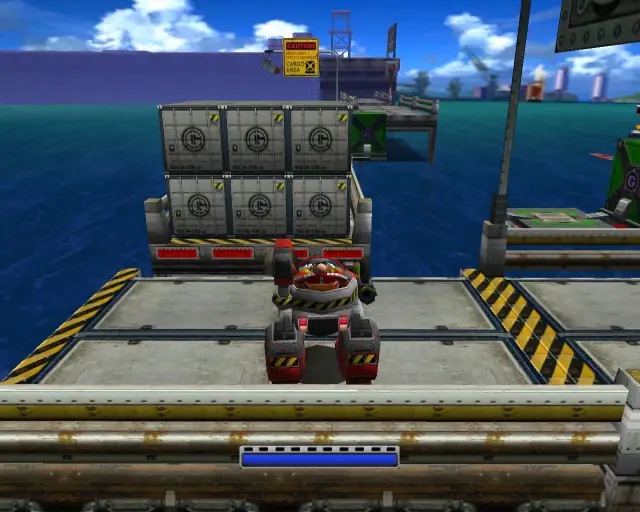

## animal 6
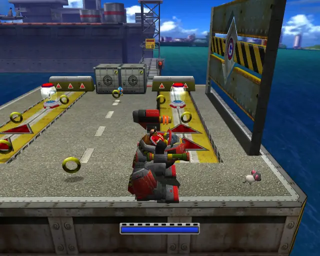

## omochao 3
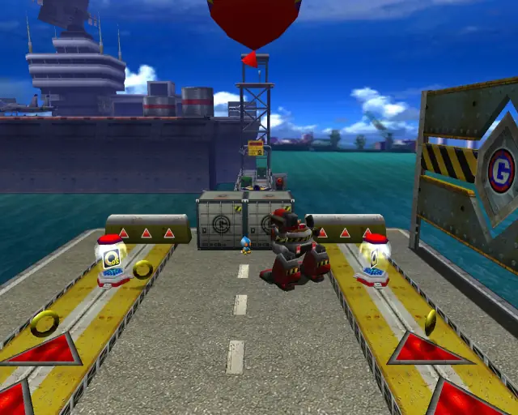

## animal 7
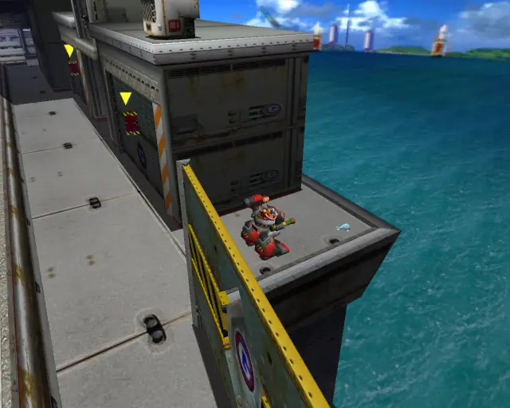

## chaobox 2

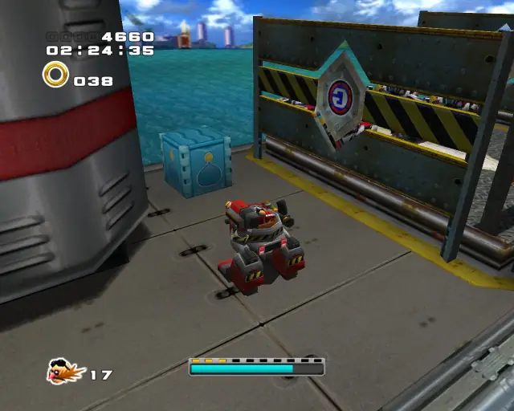

## animal 8

## pipe 3

## animal 9
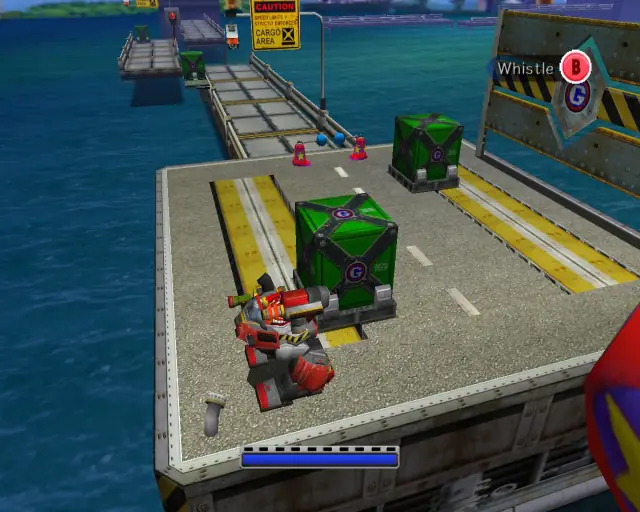

## animal 10

## animal 11

## pipe 4

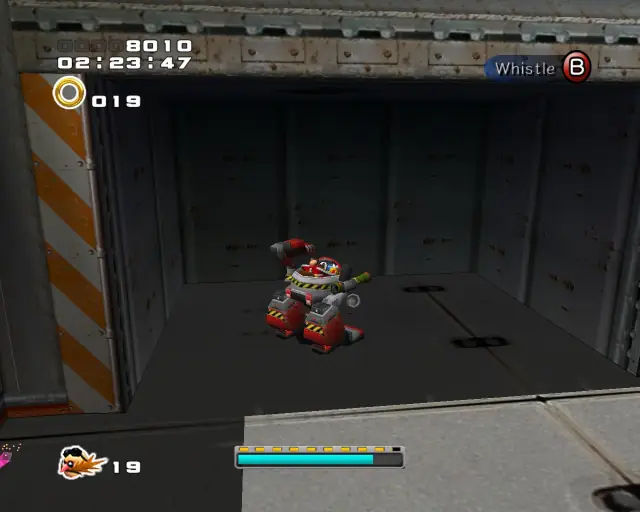

## animal 12

## chaobox 3

## animal 13

## pipe 5

## animal 14

## animal 15

