
## omochao 1
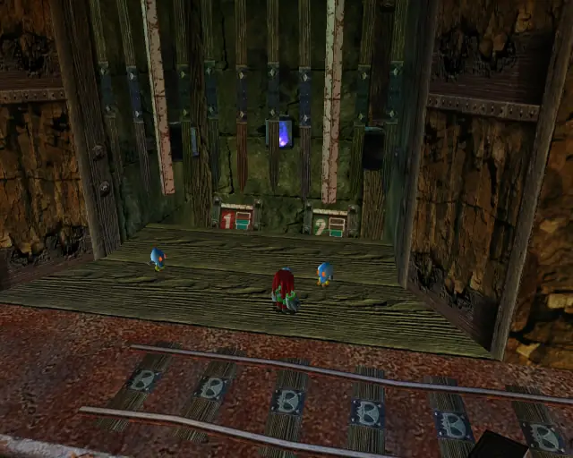

## omochao 2

## animal 1
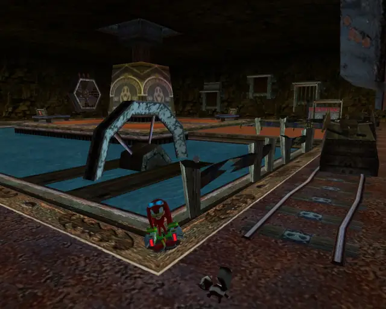

## goldbeetle 1
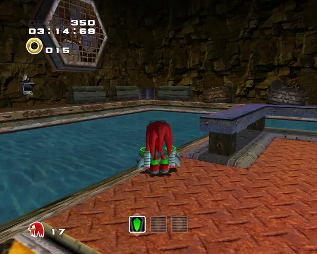
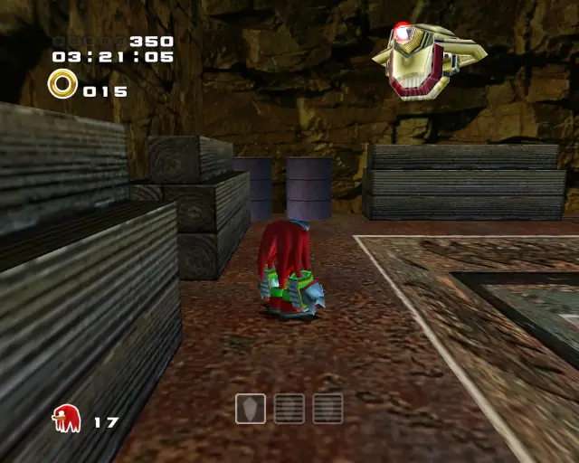

## pipe 1
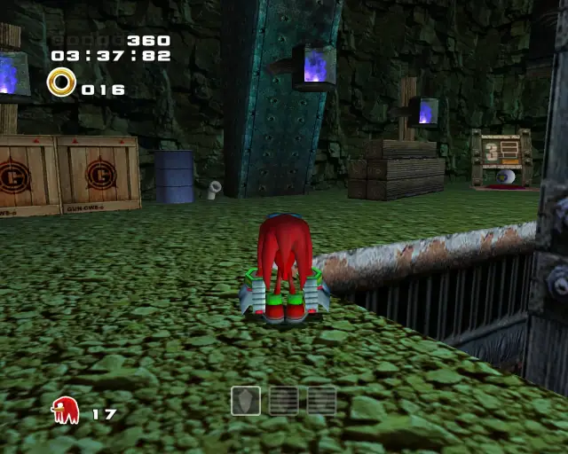

## animal 2
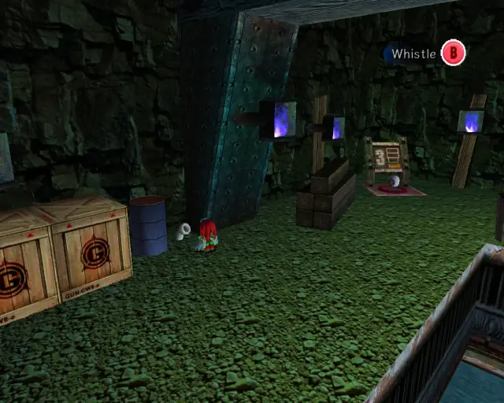

## omochao 3

## animal 3
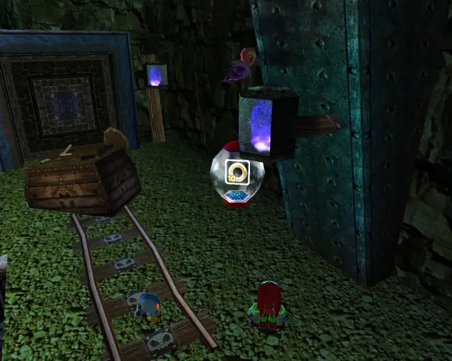

## chaobox 1
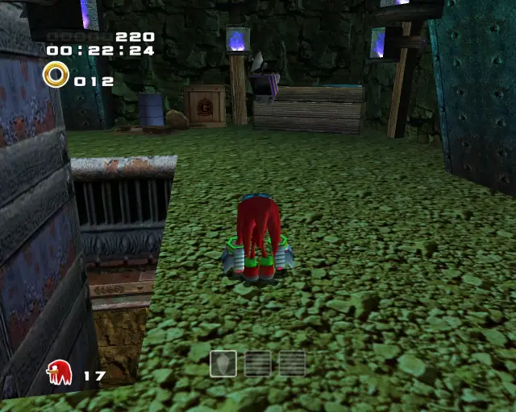

## animal 4

## chaobox 2
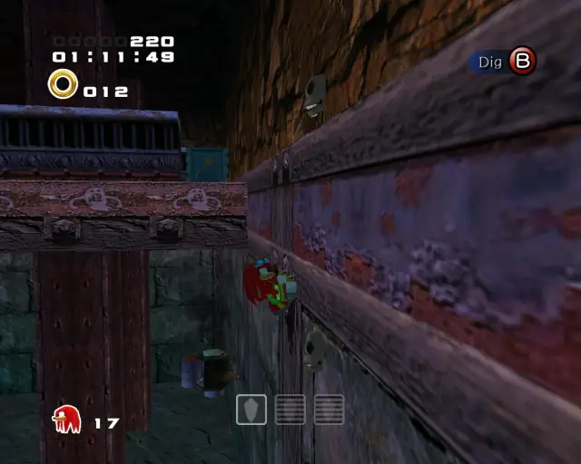
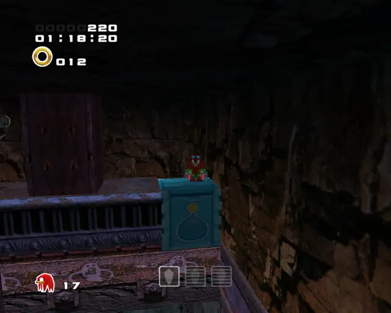

## omochao 4
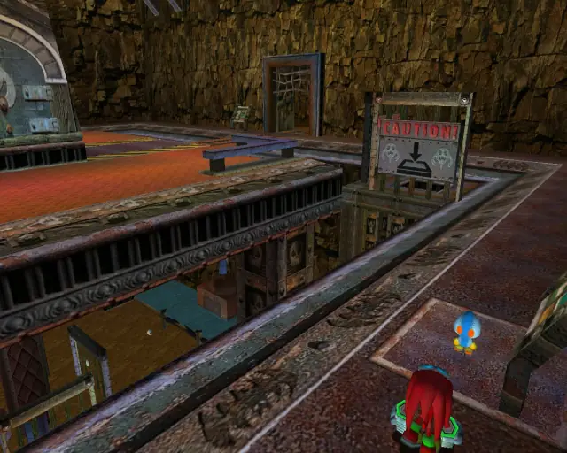

## omochao 6

## animal 5
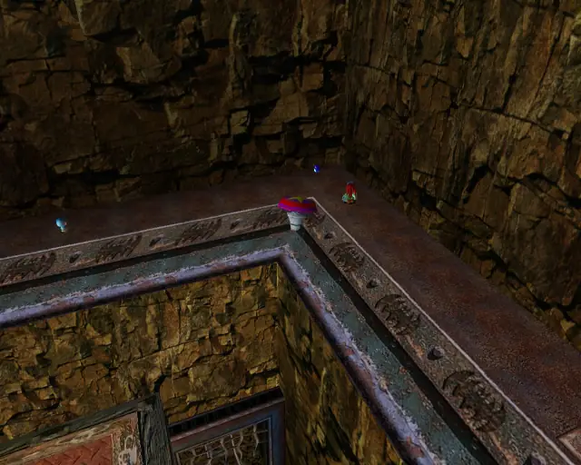

## omochao 5

## pipe 2
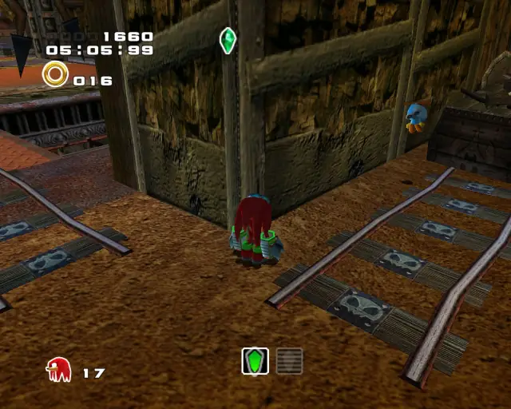

## animal 6
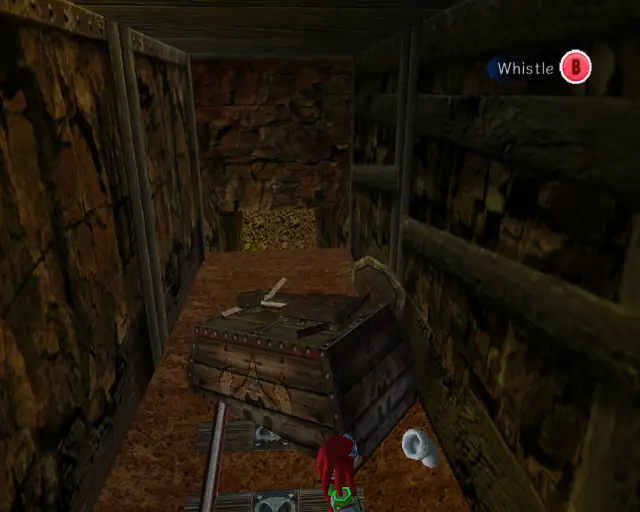

## animal 7
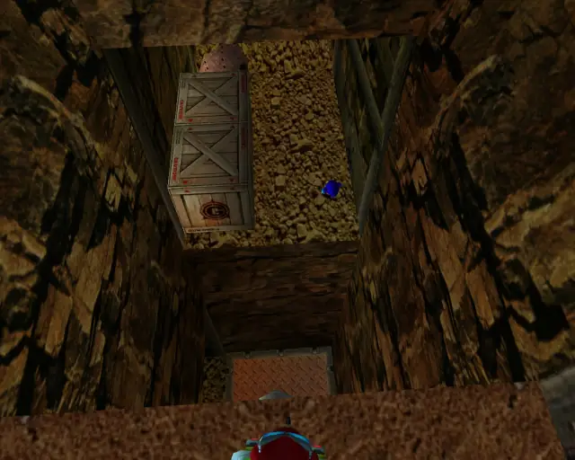

## pipe 3
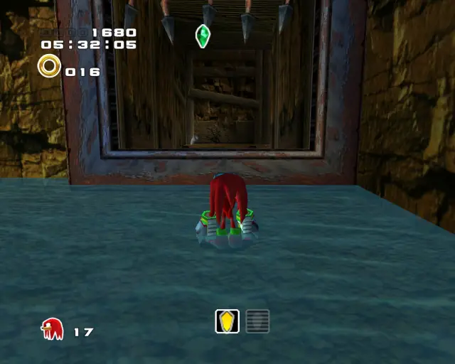

## animal 9
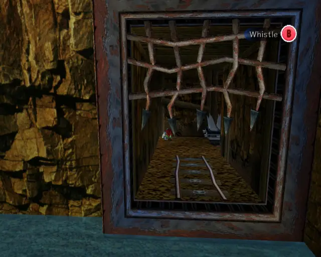

## animal 8

## chaobox 3

## animal 10
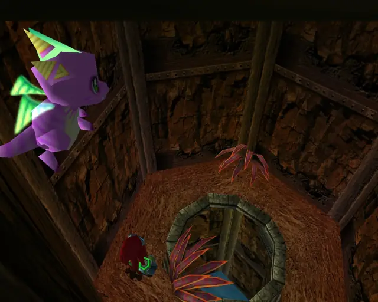

## omochao 7
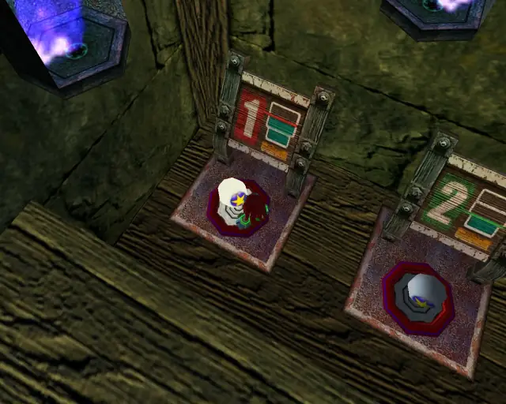
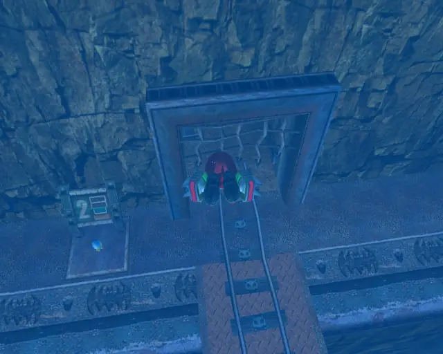

