
## omochao 1
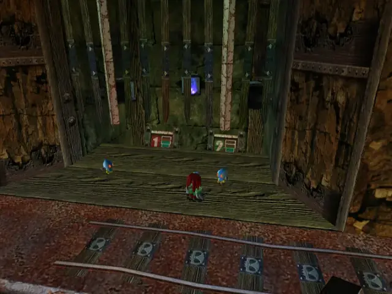

## omochao 2
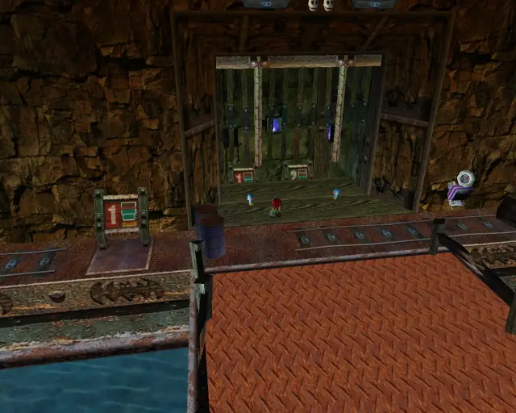

## animal 1

## goldbeetle 1
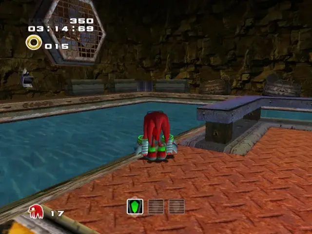

## pipe 1
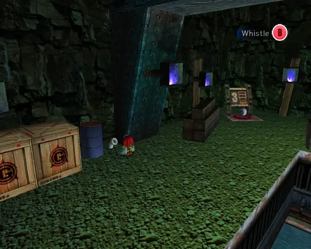

## animal 2

## omochao 3
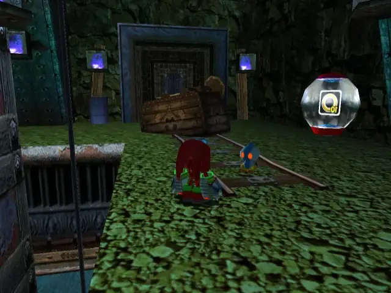

## animal 3
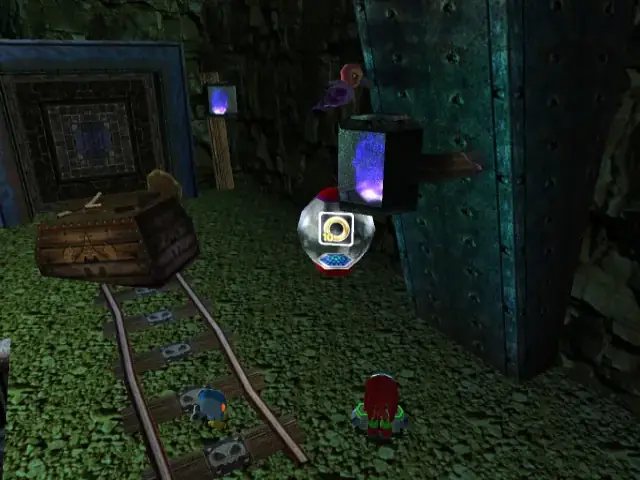

## chaobox 1
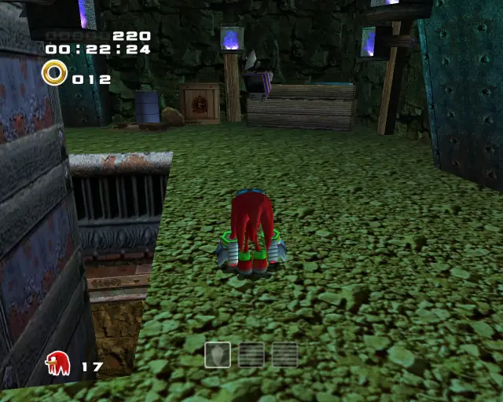
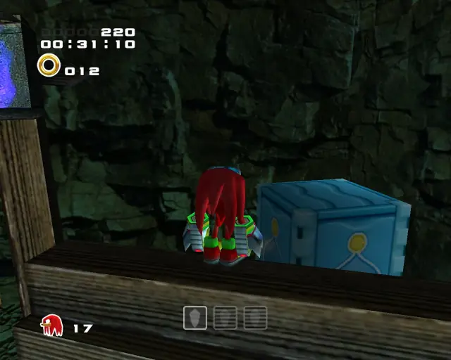

## animal 4
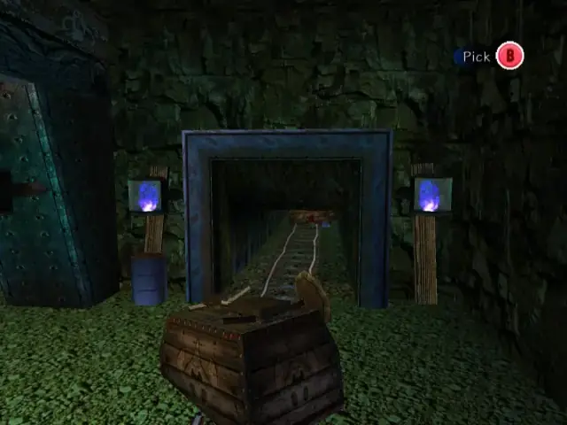
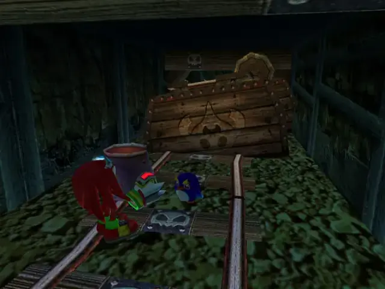

## chaobox 2
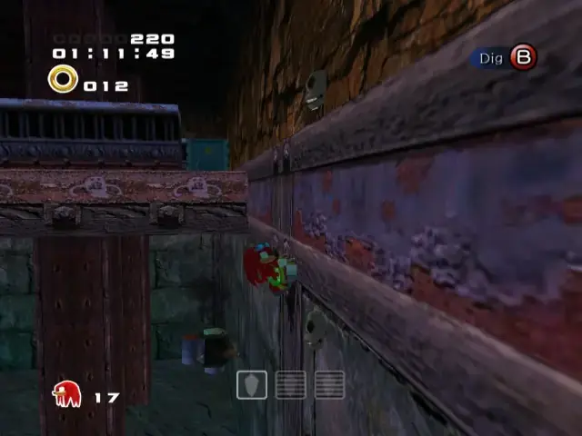

## omochao 4
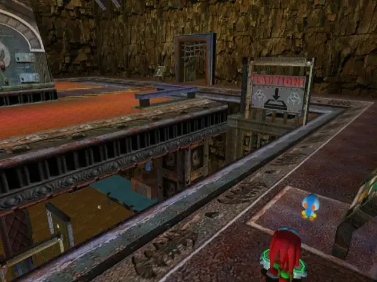

## omochao 6
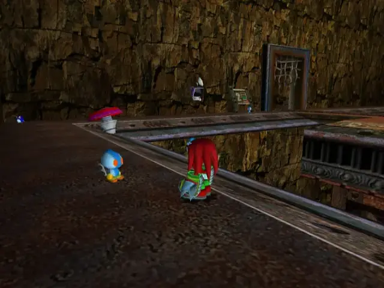

## animal 5

## omochao 5
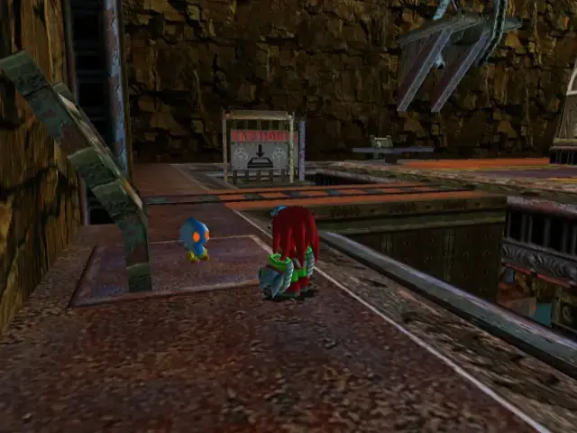

## pipe 2

## animal 6

## animal 7
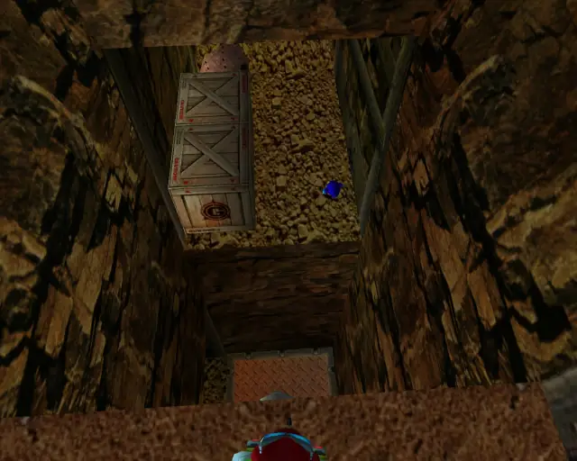

## pipe 3
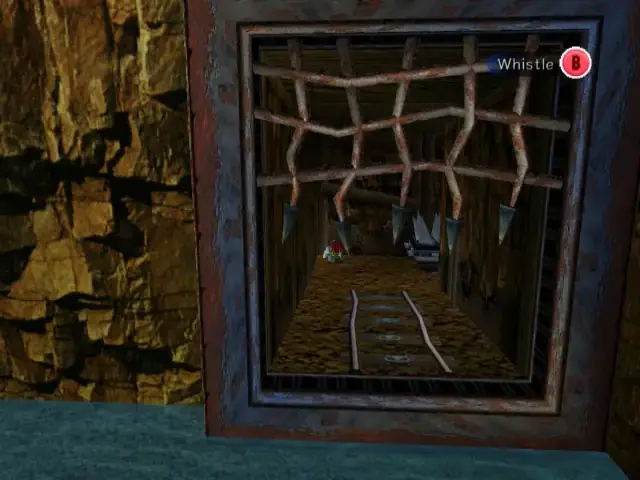

## animal 9

## animal 8
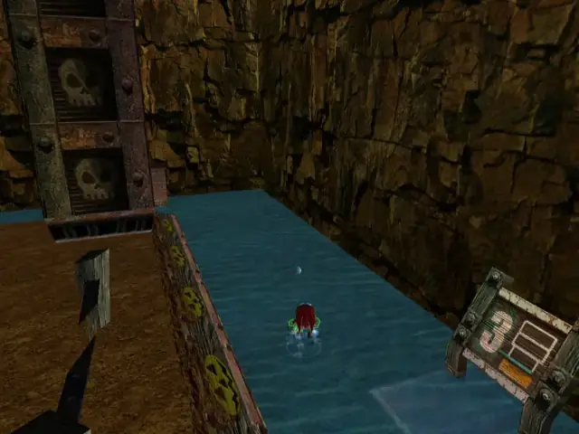

## chaobox 3
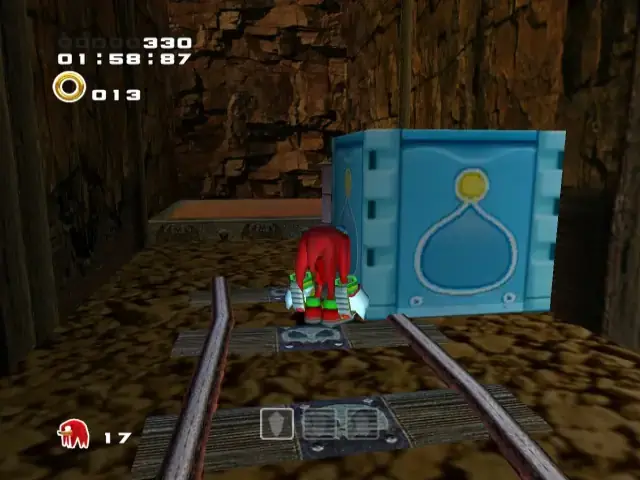

## animal 10
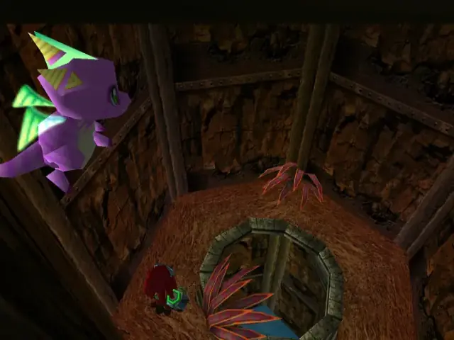

## omochao 7
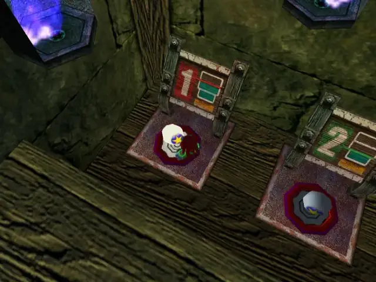
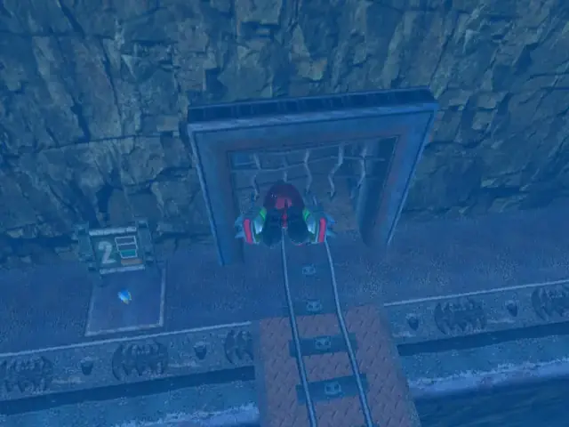
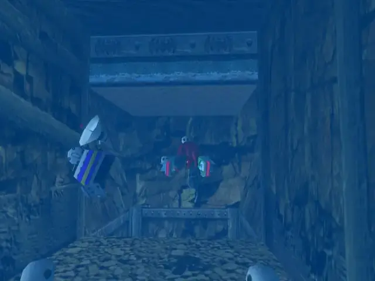
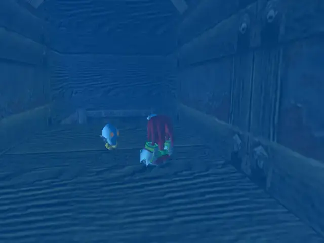

