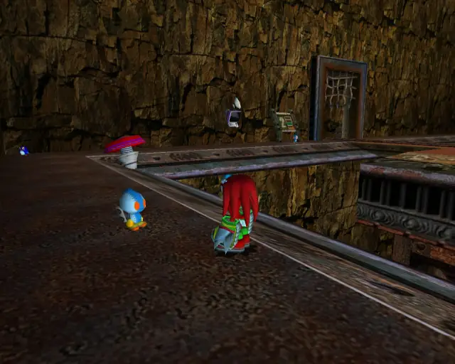

## omochao 1

## omochao 2

## animal 1

## goldbeetle 1

## pipe 1

## animal 2

## omochao 3

## animal 3

## chaobox 1

## animal 4

## chaobox 2

## omochao 4

## omochao 6

## animal 5

## omochao 5

## pipe 2

## animal 6

## animal 7

## pipe 3

## animal 9

## animal 8

## chaobox 3

## animal 10

## omochao 7

