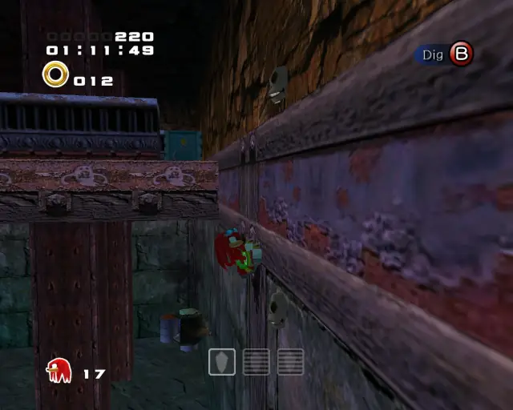
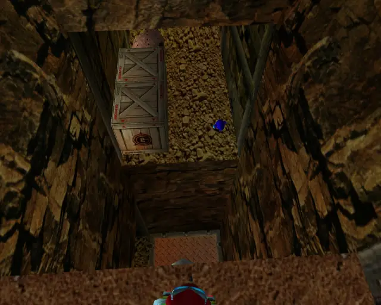

# Aquatic Mine Chronological

## Aquatic Mine Omochao 1

[Back to Top](#)

## Aquatic Mine Omochao 2

[Back to Top](#)

## Aquatic Mine Animal 1

[Back to Top](#)

## Aquatic Mine Gold Beetle
  

[Back to Top](#)

## Aquatic Mine Pipe 1 & Animal 2

[Back to Top](#)

## Aquatic Mine Omochao 3

[Back to Top](#)

## Aquatic Mine Animal 3

[Back to Top](#)

## Aquatic Mine Chao Box 1

  

[Back to Top](#)

## Aquatic Mine Animal 4

[Back to Top](#)

## Aquatic Mine Chao Box 2
  
  

[Back to Top](#)

## Aquatic Mine Omochao 4

[Back to Top](#)

## Aquatic Mine Omochao 6

[Back to Top](#)

## Aquatic Mine Animal 5

[Back to Top](#)

## Aquatic Mine Omochao 5

[Back to Top](#)

## Aquatic Mine Pipe 2 & Animal 6

[Back to Top](#)

## Aquatic Mine Animal 7

[Back to Top](#)

## Aquatic Mine Pipe 3 & Animal 9

[Back to Top](#)

## Aquatic Mine Animal 8

[Back to Top](#)

## Aquatic Mine Chao Box 3

[Back to Top](#)

## Aquatic Mine Animal 10

[Back to Top](#)

## Aquatic Mine Omochao 7

[Back to Top](#)
