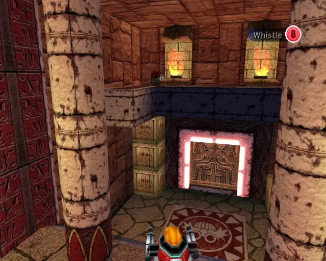
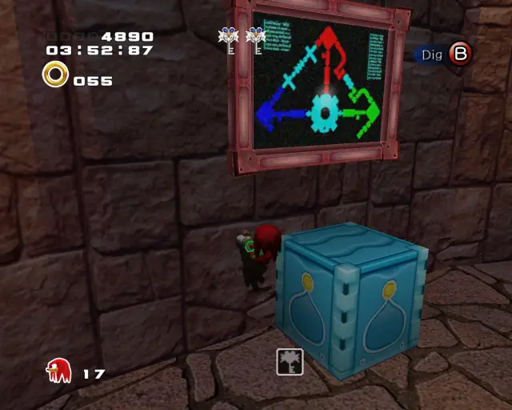
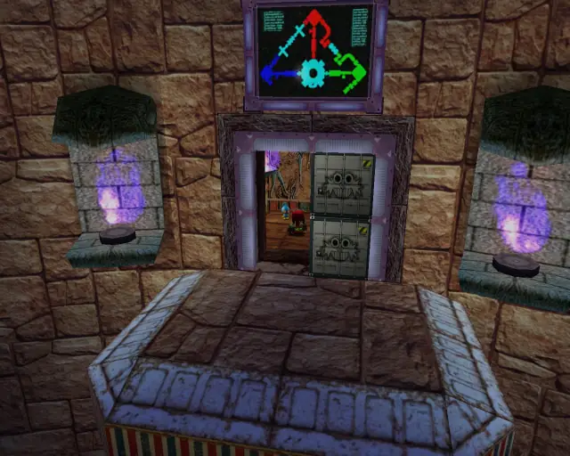
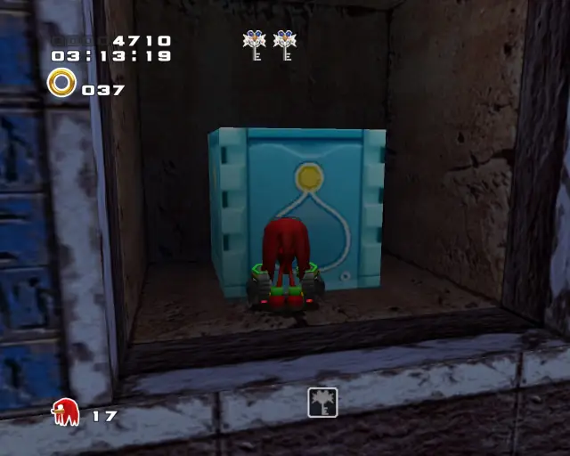
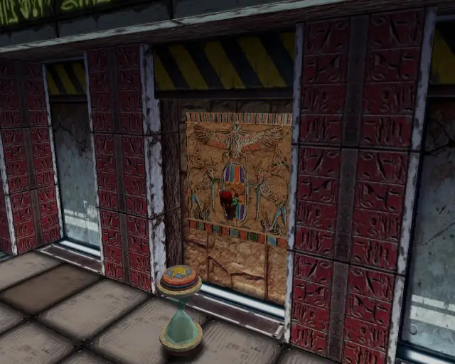
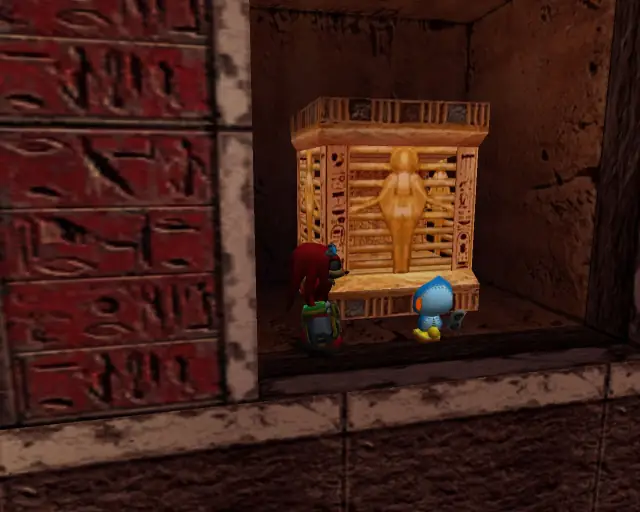
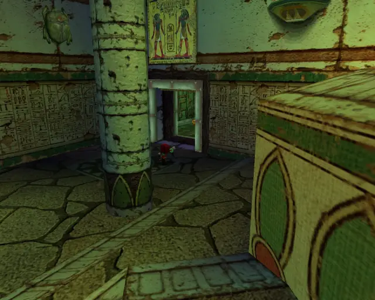
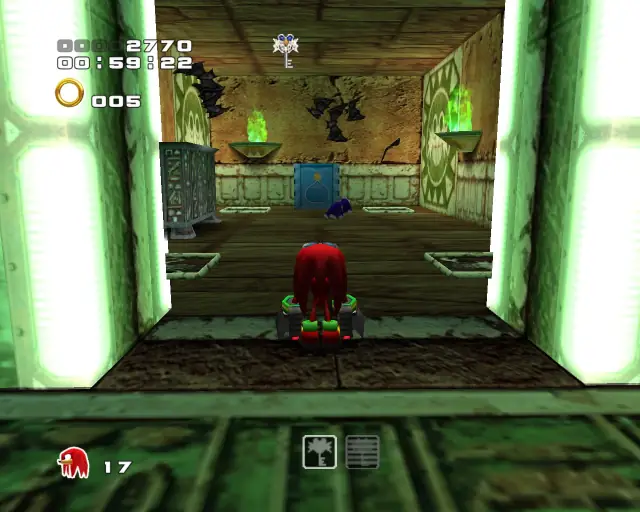

# Death Chamber (Chronological)

## Death Chamber Omochao 1

[Back to Top](#)

## Death Chamber Omochao 2

[Back to Top](#)

## Death Chamber Omochao 3

[Back to Top](#)

## Death Chamber Animal 1

[Back to Top](#)

## Death Chamber Pipe 1 & Animal 2

[Back to Top](#)

## Death Chamber Omochao 4

[Back to Top](#)

## Death Chamber Animal 3

[Back to Top](#)

## Death Chamber Chao Box 1
  

[Back to Top](#)

## Death Chamber Omochao 8

[Back to Top](#)

## Death Chamber Pipe 2 & Animal 4

[Back to Top](#)

## Death Chamber Chao Box 3
  

[Back to Top](#)

## Death Chamber Hidden 1 & Animal 5

[Back to Top](#)

## Death Chamber Pipe 3 & Animal 6

[Back to Top](#)

## Death Chamber Animal 7

[Back to Top](#)

## Death Chamber Omochao 7

[Back to Top](#)

## Death Chamber Gold Beetle
  

[Back to Top](#)

## Death Chamber Omochao 6

[Back to Top](#)

## Death Chamber Hidden 2 & Animal 10
Animal Count: 8

[Back to Top](#)

## Death Chamber Omochao 5

[Back to Top](#)

## Death Chamber Animal 8
Animal Count: 9

[Back to Top](#)

## Death Chamber Animal 9
Animal Count: 10

[Back to Top](#)

## Death Chamber Chao Box 2
  
  

[Back to Top](#)

## Death Chamber Omochao 9

[Back to Top](#)
