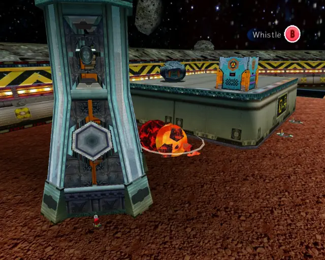
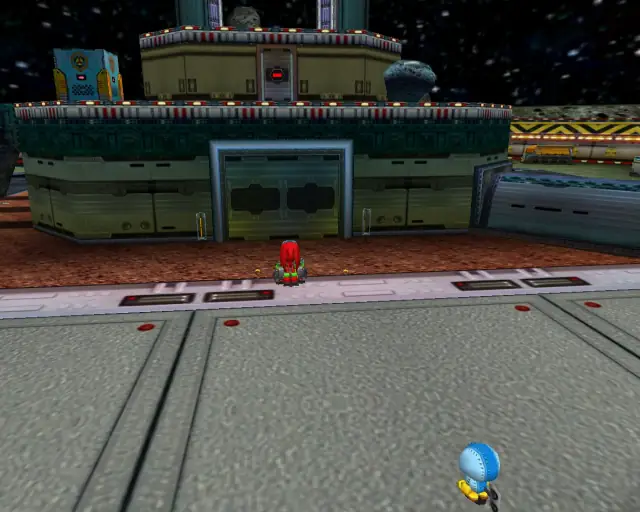
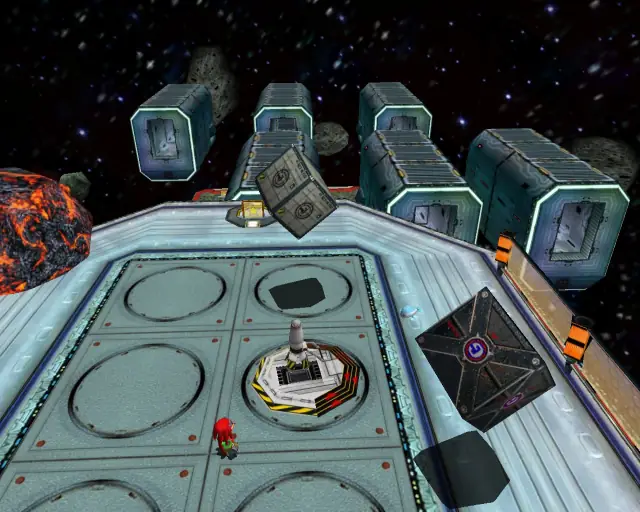

# Meteor Herd (Chronological)

## Meteor Herd Animal 1

[Back to Top](#)

## Meteor Herd Omochao 1

[Back to Top](#)

## Meteor Herd Pipe 1 & Animal 2

[Back to Top](#)

## Meteor Herd Omochao 2

[Back to Top](#)

## Meteor Herd Chao Box 1

  

[Back to Top](#)

## Meteor Herd Animal 3

[Back to Top](#)

## Meteor Herd Animal 4

[Back to Top](#)

## Meteor Herd Gold Beetle
  
  

[Back to Top](#)

## Meteor Herd Pipe 2 & Animal 5

[Back to Top](#)

## Meteor Herd Chao Box 2
  
  

[Back to Top](#)

## Meteor Herd Animal 6

[Back to Top](#)

## Meteor Herd Pipe 3 & Animal 7

[Back to Top](#)

## Meteor Herd Omochao 3

[Back to Top](#)

## Meteor Herd Animal 8

[Back to Top](#)

## Meteor Herd Chao Box 3
  

[Back to Top](#)

## Meteor Herd Animal 9

[Back to Top](#)

## Meteor Herd Animal 10

[Back to Top](#)

## Meteor Herd Animal 11

[Back to Top](#)