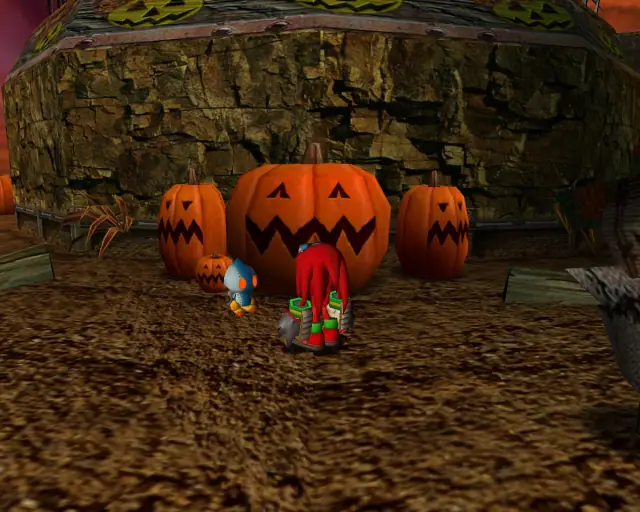
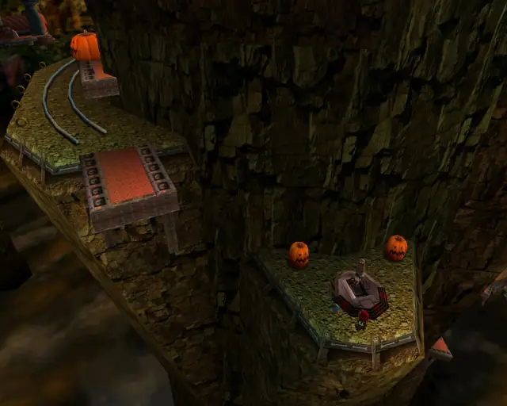
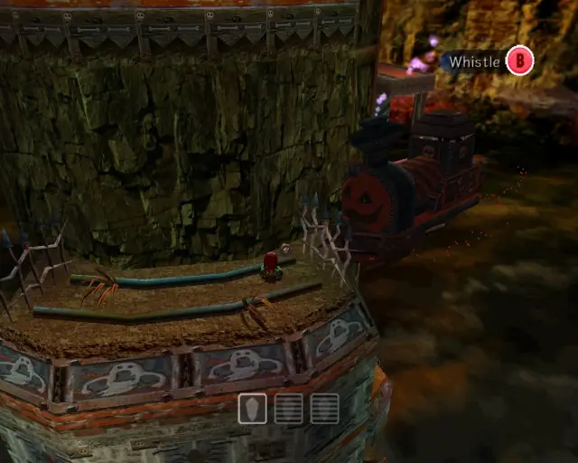
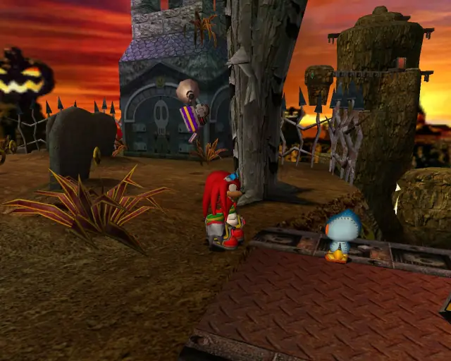
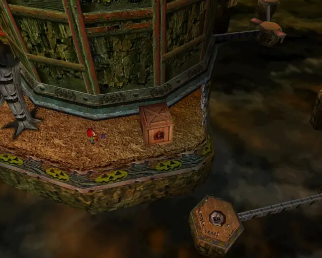
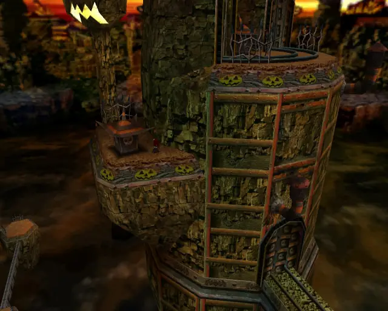
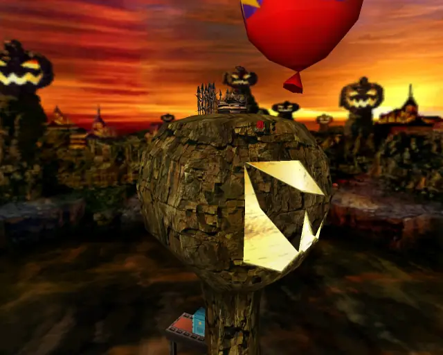

# Pumpkin Hill (Chronological)

## Pumpkin Hill Omochao 1

[Back to Top](#)

## Pumpkin Hill Omochao 2

[Back to Top](#)

## Pumpkin Hill Omochao 3

[Back to Top](#)

## Pumpkin Hill Omochao 4

[Back to Top](#)

## Pumpkin Hill Animal 1
Animal Count: 1

[Back to Top](#)

## Pumpkin Hill Omochao 5

[Back to Top](#)

## Pumpkin Hill Animal 10
Animal Count: 2

[Back to Top](#)

## Pumpkin Hill Animal 11
Animal Count: 3

[Back to Top](#)

## Pumpkin Hill Omochao 6

[Back to Top](#)

## Pumpkin Hill Chao Box 1
  

[Back to Top](#)

## Pumpkin Hill Animal 9
Animal Count: 4

[Back to Top](#)

## Pumpkin Hill Omochao 7

[Back to Top](#)

## Pumpkin Hill Omochao 8

[Back to Top](#)

## Pumpkin Hill Chao Box 2
  

[Back to Top](#)

## Pumpkin Hill Animal 6
Animal Count: 5

[Back to Top](#)

## Pumpkin Hill Omochao 10

[Back to Top](#)

## Pumpkin Hill Pipe 1 & Animal 7
Animal Count: 6

[Back to Top](#)

## Pumpkin Hill Animal 8
Animal Count: 7

[Back to Top](#)

## Pumpkin Hill Omochao 9

[Back to Top](#)

## Pumpkin Hill Animal 2
Animal Count: 8

[Back to Top](#)

## Pumpkin Hill Hidden 1 & Animal 3
Animal Count: 9

[Back to Top](#)

## Pumpkin Hill Animal 5
Animal Count: 10

[Back to Top](#)

## Pumpkin Hill Animal 4
Animal Count: 11

[Back to Top](#)

## Pumpkin Hill Omochao 11

[Back to Top](#)

## Pumpkin Hill Chao Box 3

[Back to Top](#)
