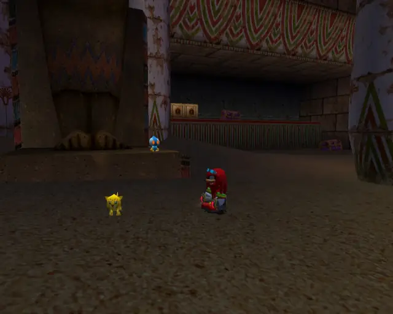
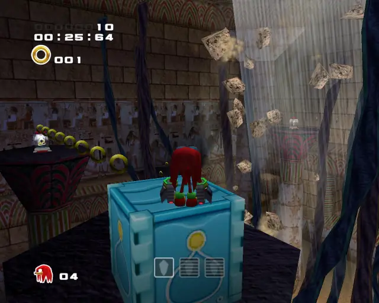
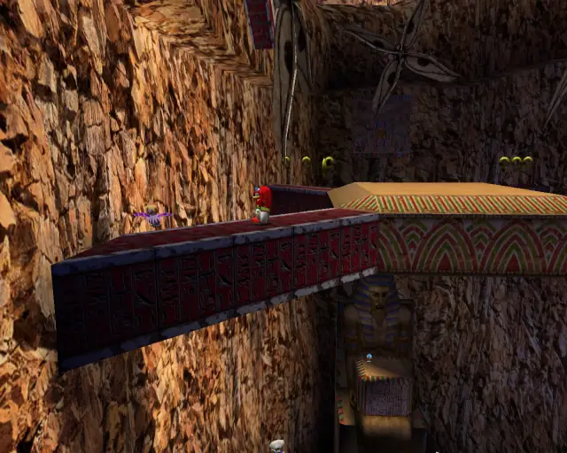

# Wild Canyon (Chronological)

## Wild Canyon Omochao 1

[Back to Top](#)

## Wild Canyon Animal 1

[Back to Top](#)

## Wild Canyon Pipe 1 & Animal 2

[Back to Top](#)

## Wild Canyon Omochao 2

[Back to Top](#)

## Wild Canyon Animal 3

[Back to Top](#)

## Wild Canyon Omochao 3

[Back to Top](#)

## Wild Canyon Omochao 4

[Back to Top](#)

## Wild Canyon Animal 4

[Back to Top](#)

## Wild Canyon Chao Box 1
  

[Back to Top](#)

## Wild Canyon Omochao 5

[Back to Top](#)

## Wild Canyon Omochao 6

[Back to Top](#)

## Wild Canyon Animal 5

[Back to Top](#)

## Wild Canyon Omochao 7

[Back to Top](#)

## Wild Canyon Omochao 8

[Back to Top](#)

## Wild Canyon Chao Box 3
  

[Back to Top](#)

## Wild Canyon Animal 6

[Back to Top](#)

## Wild Canyon Gold Beetle

[Back to Top](#)

## Wild Canyon Omochao 9

[Back to Top](#)

## Wild Canyon Animal 7

[Back to Top](#)

## Wild Canyon Animal 8

[Back to Top](#)

## Wild Canyon Animal 9

[Back to Top](#)

## Wild Canyon Omochao 10

[Back to Top](#)

## Wild Canyon Chao Box 2
  
  

[Back to Top](#)

## Wild Canyon Animal 10

[Back to Top](#)
