
## omochao 1

## omochao 2

## omochao 3
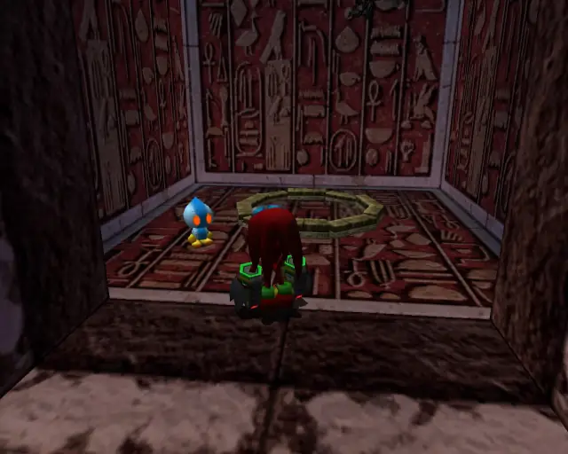

## animal 1

## pipe 1

## animal 2

## omochao 4

## animal 3

## chaobox 1

## big 1

## item 1
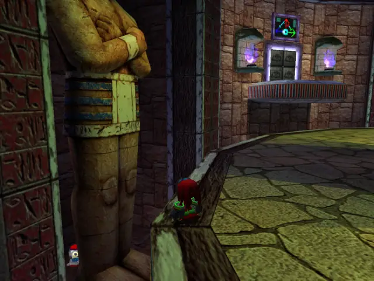
## omochao 8

## pipe 2

## animal 4

## item 11

## item 4

## chaobox 3

## hidden 1

## animal 5

## item 3

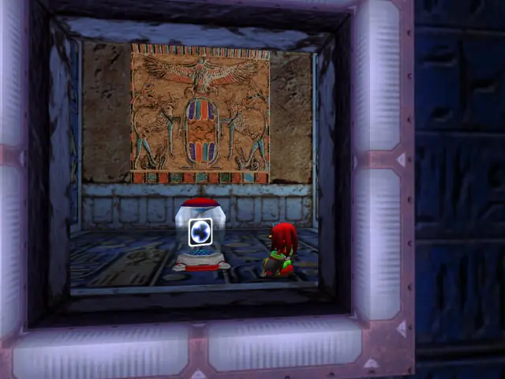
## item 5
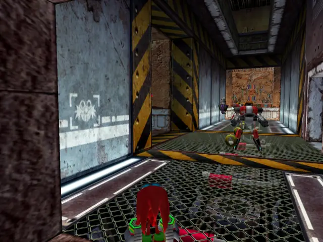
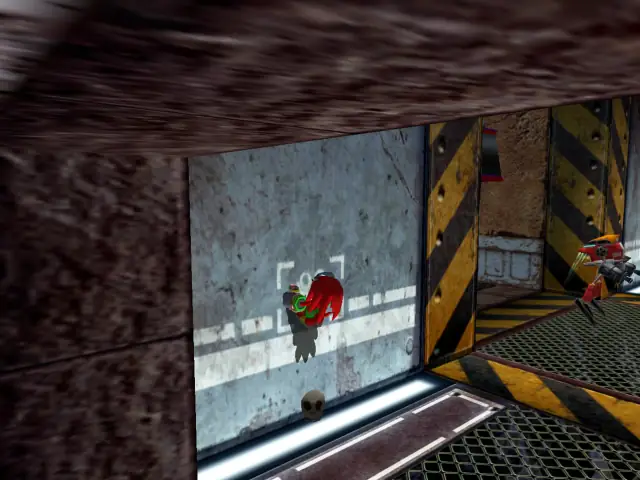
## pipe 3

## animal 6

## animal 7

## item 7

## item 8

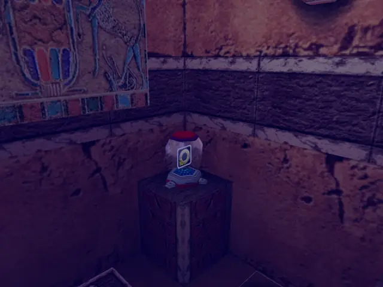

## item 9

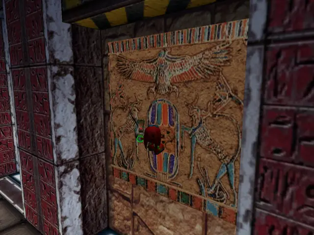
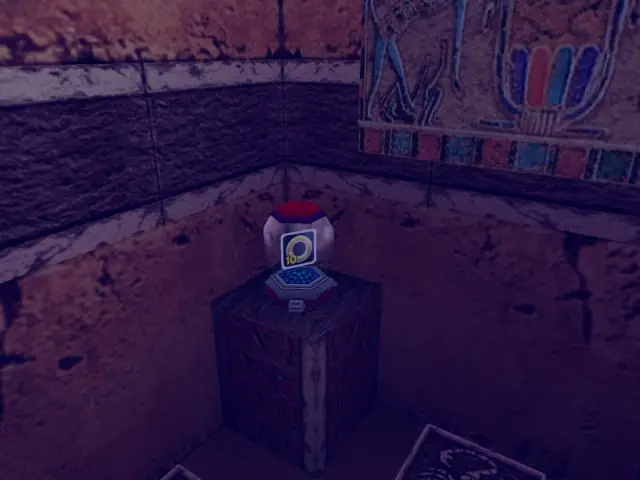

## item 10

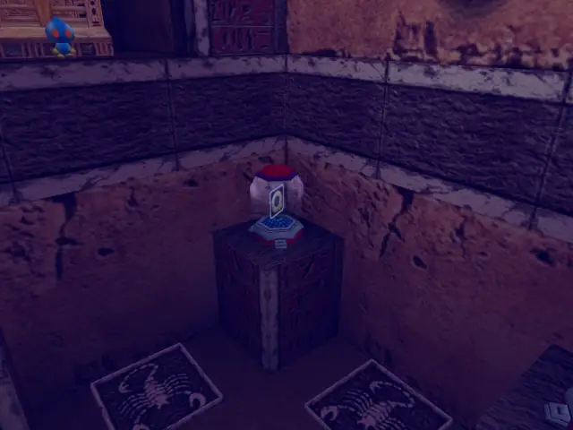
## omochao 7
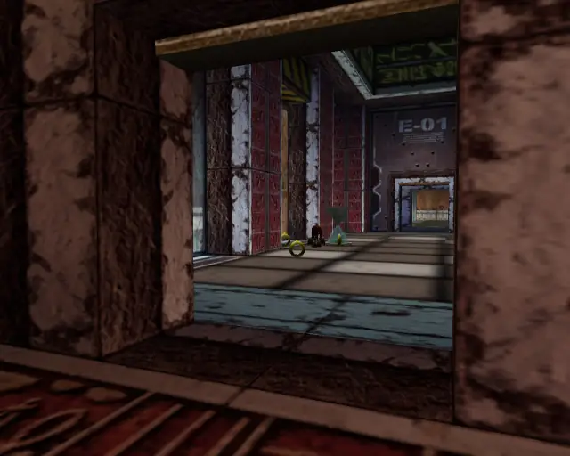
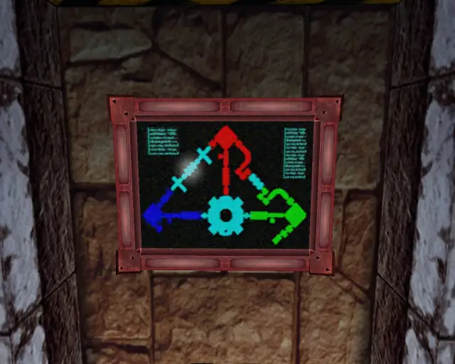

## goldbeetle 1

## omochao 6

## hidden 2

## animal 10

## omochao 5

## animal 8

## animal 9

## chaobox 2

## item 2

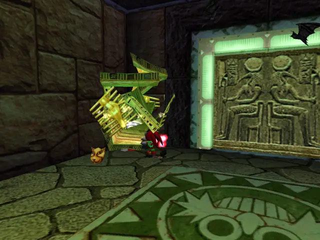

## omochao 9

## item 6

## life 1

