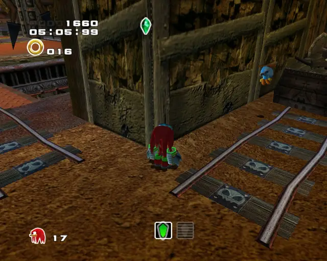
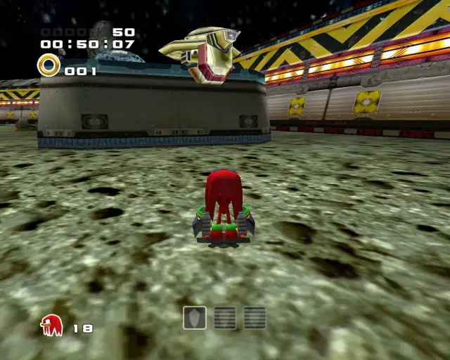
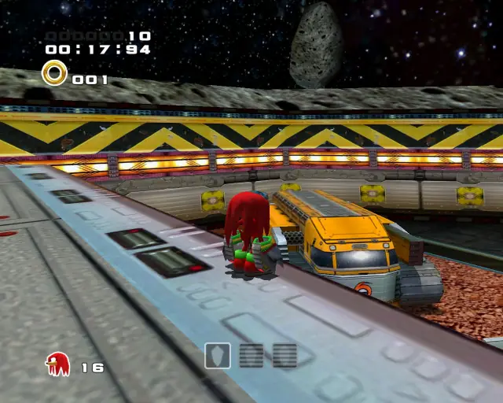
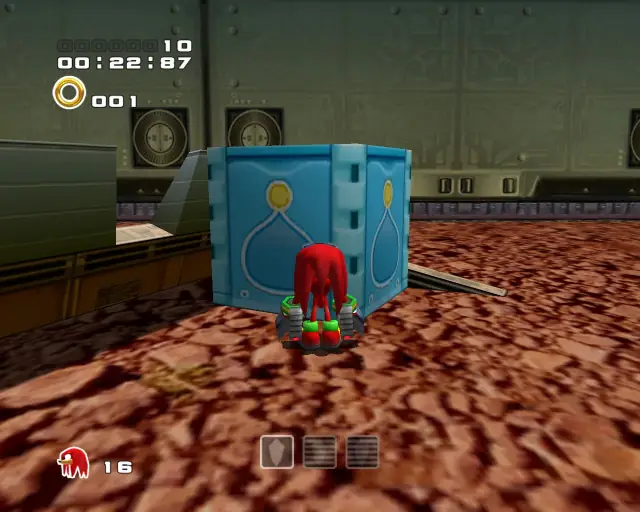
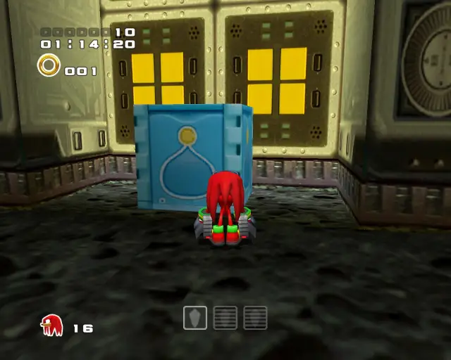
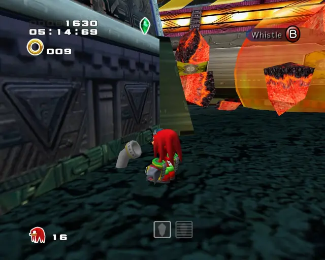

# Knuckles Stages

## Table of Contents:
1. [ Wild Canyon ](#wild-canyon)
1. [ Pumpkin Hill ](#pumpkin-hill)
1. [ Aquatic Mine ](#aquatic-mine)
1. [ Death Chamber ](#death-chamber)
1. [ Meteor Herd ](#meteor-herd)

# Wild Canyon

## Wild Canyon Gold Beetle

[Back to Top](#)

## Wild Canyon Chao Box 1
  

[Back to Top](#)

## Wild Canyon Chao Box 2
  
  

[Back to Top](#)

## Wild Canyon Chao Box 3
  

[Back to Top](#)

## Wild Canyon Pipe 1

[Back to Top](#)

## Wild Canyon Pipe 2

[Back to Top](#)

## Wild Canyon Pipe 3

[Back to Top](#)

# Pumpkin Hill

## Pumpkin Hill Chao Box 1
  

[Back to Top](#)

## Pumpkin Hill Chao Box 2
  

[Back to Top](#)

## Pumpkin Hill Chao Box 3

[Back to Top](#)

## Pumpkin Hill Pipe 1

[Back to Top](#)

## Pumpkin Hill Hidden 1

# Aquatic Mine

## Aquatic Mine Gold Beetle
  

[Back to Top](#)

## Aquatic Mine Chao Box 1

  

[Back to Top](#)

## Aquatic Mine Chao Box 2
  
  

[Back to Top](#)

## Aquatic Mine Chao Box 3

[Back to Top](#)

## Aquatic Mine Pipe 1

[Back to Top](#)

## Aquatic Mine Pipe 2

[Back to Top](#)

## Aquatic Mine Pipe 3

[Back to Top](#)

# Death Chamber

## Death Chamber Gold Beetle
  

[Back to Top](#)

## Death Chamber Chao Box 1
  

[Back to Top](#)

## Death Chamber Chao Box 2
  
  

[Back to Top](#)

## Death Chamber Chao Box 3
  

[Back to Top](#)

## Death Chamber Pipe 1

[Back to Top](#)

## Death Chamber Pipe 2

[Back to Top](#)

## Death Chamber Pipe 3

[Back to Top](#)

## Death Chamber Hidden 1

[Back to Top](#)

## Death Chamber Hidden 2

[Back to Top](#)

# Meteor Herd

## Meteor Herd Gold Beetle
  
  

[Back to Top](#)

## Meteor Herd Chao Box 1

  

[Back to Top](#)

## Meteor Herd Chao Box 2
  
  

[Back to Top](#)

## Meteor Herd Chao Box 3
  

[Back to Top](#)

## Meteor Herd Pipe 1

[Back to Top](#)

## Meteor Herd Pipe 2

[Back to Top](#)

## Meteor Herd Pipe 3

[Back to Top](#)
