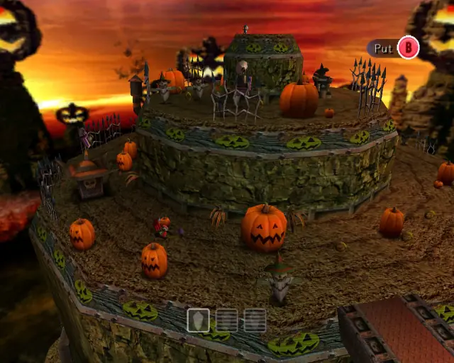
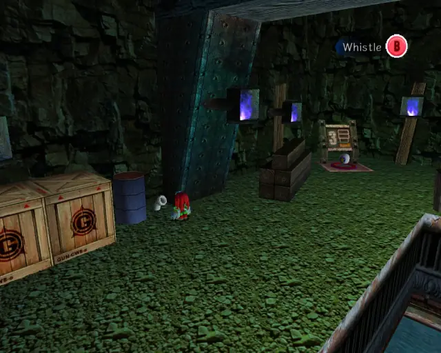
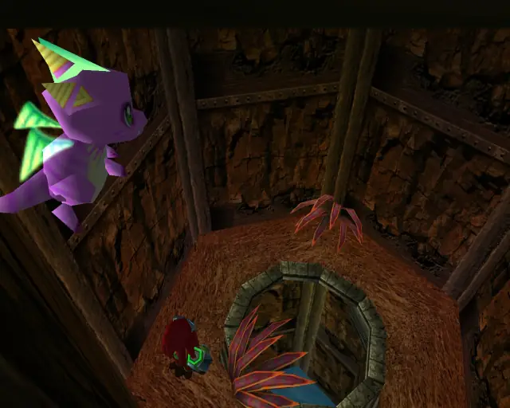
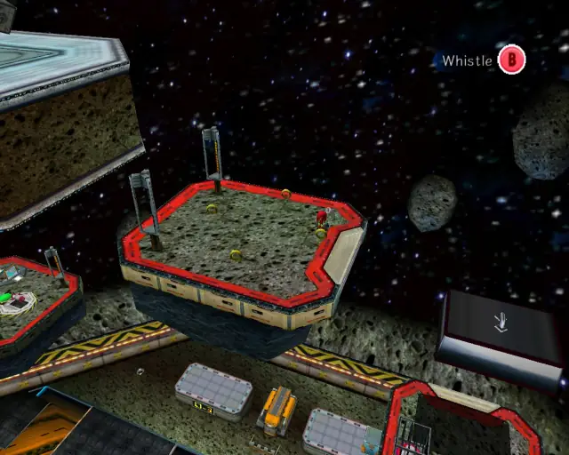
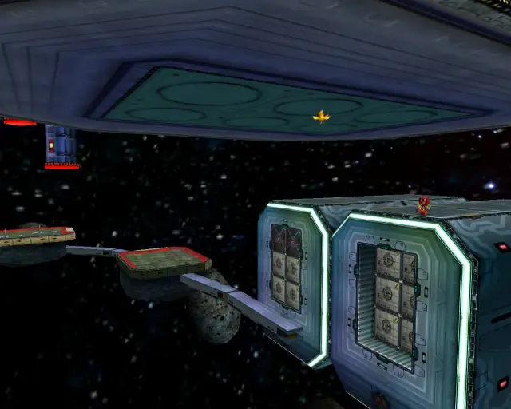

# Knuckles Stages (Animalsanity)

## Table of Contents:
1. [ Wild Canyon ](#wild-canyon)
1. [ Pumpkin Hill ](#pumpkin-hill)
1. [ Aquatic Mine ](#aquatic-mine)
1. [ Death Chamber ](#death-chamber)
1. [ Meteor Herd ](#meteor-herd)

# Wild Canyon

## Wild Canyon Animal 1

[Back to Top](#)

## Wild Canyon Animal 2

[Back to Top](#)

## Wild Canyon Animal 3

[Back to Top](#)

## Wild Canyon Animal 4

[Back to Top](#)

## Wild Canyon Animal 5

[Back to Top](#)

## Wild Canyon Animal 6

[Back to Top](#)

## Wild Canyon Animal 7

[Back to Top](#)

## Wild Canyon Animal 8

[Back to Top](#)

## Wild Canyon Animal 9

[Back to Top](#)

## Wild Canyon Animal 10

[Back to Top](#)

# Pumpkin Hill

## Pumpkin Hill Animal 1

[Back to Top](#)

## Pumpkin Hill Animal 2

[Back to Top](#)

## Pumpkin Hill Animal 3

[Back to Top](#)

## Pumpkin Hill Animal 4

[Back to Top](#)

## Pumpkin Hill Animal 5

[Back to Top](#)

## Pumpkin Hill Animal 6

[Back to Top](#)

## Pumpkin Hill Animal 7

[Back to Top](#)

## Pumpkin Hill Animal 8

[Back to Top](#)

## Pumpkin Hill Animal 9

[Back to Top](#)

## Pumpkin Hill Animal 10

[Back to Top](#)

## Pumpkin Hill Animal 11

[Back to Top](#)

# Aquatic Mine

## Aquatic Mine Animal 1

[Back to Top](#)

## Aquatic Mine Animal 2

[Back to Top](#)

## Aquatic Mine Animal 3

[Back to Top](#)

## Aquatic Mine Animal 4

[Back to Top](#)

## Aquatic Mine Animal 5

[Back to Top](#)

## Aquatic Mine Animal 6

[Back to Top](#)

## Aquatic Mine Animal 7

[Back to Top](#)

## Aquatic Mine Animal 8

[Back to Top](#)

## Aquatic Mine Animal 9

[Back to Top](#)

## Aquatic Mine Animal 10

[Back to Top](#)

# Death Chamber

## Death Chamber Animal 1

[Back to Top](#)

## Death Chamber Animal 2

[Back to Top](#)

## Death Chamber Animal 3

[Back to Top](#)

## Death Chamber Animal 4

[Back to Top](#)

## Death Chamber Animal 5

[Back to Top](#)

## Death Chamber Animal 6

[Back to Top](#)

## Death Chamber Animal 7

[Back to Top](#)

## Death Chamber Animal 8

[Back to Top](#)

## Death Chamber Animal 9

[Back to Top](#)

# Meteor Herd

## Meteor Herd Animal 1

[Back to Top](#)

## Meteor Herd Animal 2

[Back to Top](#)

## Meteor Herd Animal 3

[Back to Top](#)

## Meteor Herd Animal 4

[Back to Top](#)

## Meteor Herd Animal 5

[Back to Top](#)

## Meteor Herd Animal 6

[Back to Top](#)

## Meteor Herd Animal 7

[Back to Top](#)

## Meteor Herd Animal 8

[Back to Top](#)

## Meteor Herd Animal 9

[Back to Top](#)

## Meteor Herd Animal 10

[Back to Top](#)

## Meteor Herd Animal 11

[Back to Top](#)
