# Knuckles Stages (Chronological)

## Table of Contents:
1. [ Wild Canyon ](#wild-canyon)
1. [ Pumpkin Hill ](#pumpkin-hill)
1. [ Aquatic Mine ](#aquatic-mine)
1. [ Death Chamber ](#death-chamber)
1. [ Meteor Herd ](#meteor-herd)

# Wild Canyon

## Wild Canyon Omochao 1

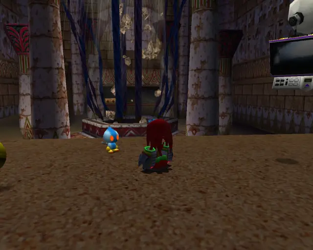

[Back to Top](#)

## Wild Canyon Animal 1

[Back to Top](#)

## Wild Canyon Pipe 1 & Animal 2

[Back to Top](#)

## Wild Canyon Omochao 2

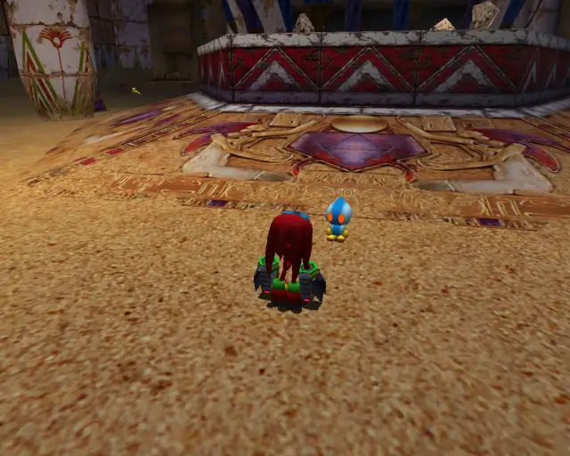

[Back to Top](#)

## Wild Canyon Animal 3

[Back to Top](#)

## Wild Canyon Omochao 3

[Back to Top](#)

## Wild Canyon Omochao 4

[Back to Top](#)

## Wild Canyon Animal 4

[Back to Top](#)

## Wild Canyon Chao Box 1
  

[Back to Top](#)

## Wild Canyon Omochao 5

[Back to Top](#)

## Wild Canyon Omochao 6

[Back to Top](#)

## Wild Canyon Animal 5

[Back to Top](#)

## Wild Canyon Omochao 7

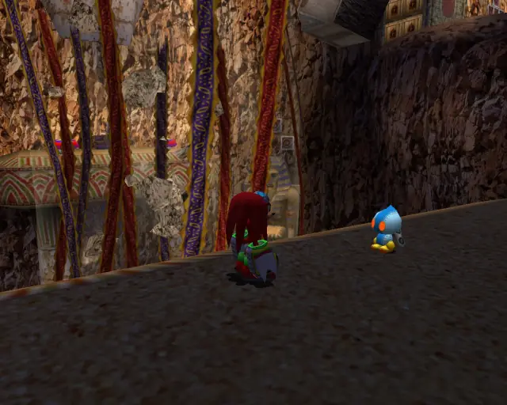

[Back to Top](#)

## Wild Canyon Omochao 8

[Back to Top](#)

## Wild Canyon Chao Box 3
  

[Back to Top](#)

## Wild Canyon Animal 6

[Back to Top](#)

## Wild Canyon Gold Beetle

[Back to Top](#)

## Wild Canyon Omochao 9

[Back to Top](#)

## Wild Canyon Animal 7

[Back to Top](#)

## Wild Canyon Animal 8

[Back to Top](#)

## Wild Canyon Animal 9

[Back to Top](#)

## Wild Canyon Omochao 10

[Back to Top](#)

## Wild Canyon Chao Box 2
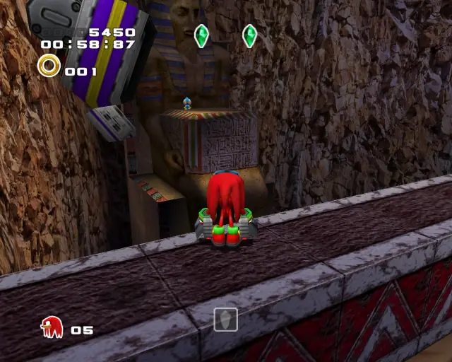  
  

[Back to Top](#)

## Wild Canyon Animal 10

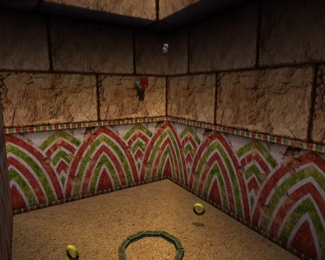

[Back to Top](#)

# Pumpkin Hill

## Pumpkin Hill Omochao 1

[Back to Top](#)

## Pumpkin Hill Omochao 2

[Back to Top](#)

## Pumpkin Hill Omochao 3

[Back to Top](#)

## Pumpkin Hill Omochao 4

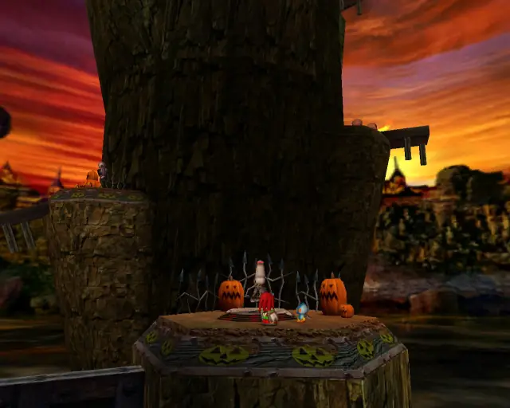

[Back to Top](#)

## Pumpkin Hill Animal 1
Animal Count: 1

[Back to Top](#)

## Pumpkin Hill Omochao 5

[Back to Top](#)

## Pumpkin Hill Animal 10
Animal Count: 2
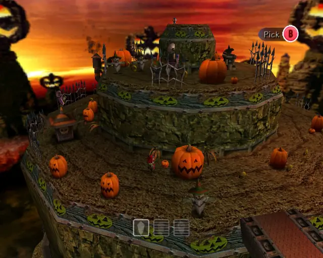

[Back to Top](#)

## Pumpkin Hill Animal 11
Animal Count: 3

[Back to Top](#)

## Pumpkin Hill Omochao 6

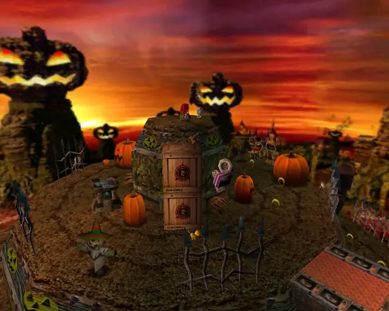

[Back to Top](#)

## Pumpkin Hill Chao Box 1
  

[Back to Top](#)

## Pumpkin Hill Animal 9
Animal Count: 4

[Back to Top](#)

## Pumpkin Hill Omochao 7

[Back to Top](#)

## Pumpkin Hill Omochao 8

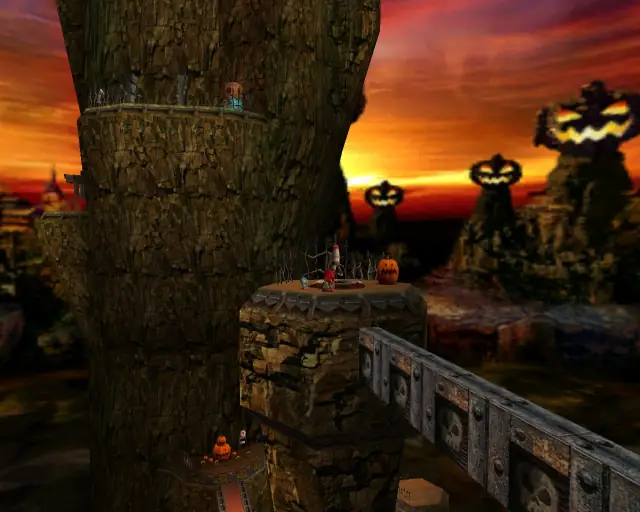

[Back to Top](#)

## Pumpkin Hill Chao Box 2
  

[Back to Top](#)

## Pumpkin Hill Animal 6
Animal Count: 5
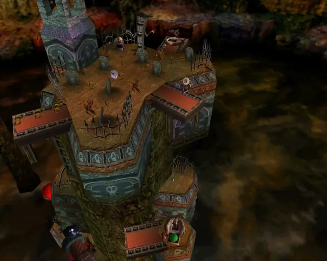

[Back to Top](#)

## Pumpkin Hill Omochao 10

[Back to Top](#)

## Pumpkin Hill Pipe 1 & Animal 7
Animal Count: 6

[Back to Top](#)

## Pumpkin Hill Animal 8
Animal Count: 7

[Back to Top](#)

## Pumpkin Hill Omochao 9

[Back to Top](#)

## Pumpkin Hill Animal 2
Animal Count: 8

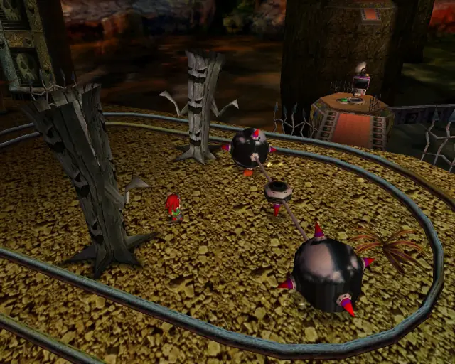

[Back to Top](#)

## Pumpkin Hill Hidden 1 & Animal 3
Animal Count: 9

[Back to Top](#)

## Pumpkin Hill Animal 5
Animal Count: 10

[Back to Top](#)

## Pumpkin Hill Animal 4
Animal Count: 11

[Back to Top](#)

## Pumpkin Hill Omochao 11

[Back to Top](#)

## Pumpkin Hill Chao Box 3

[Back to Top](#)

# Aquatic Mine

## Aquatic Mine Omochao 1

[Back to Top](#)

## Aquatic Mine Omochao 2

[Back to Top](#)

## Aquatic Mine Animal 1

[Back to Top](#)

## Aquatic Mine Gold Beetle
  

[Back to Top](#)

## Aquatic Mine Pipe 1 & Animal 2

[Back to Top](#)

## Aquatic Mine Omochao 3

[Back to Top](#)

## Aquatic Mine Animal 3

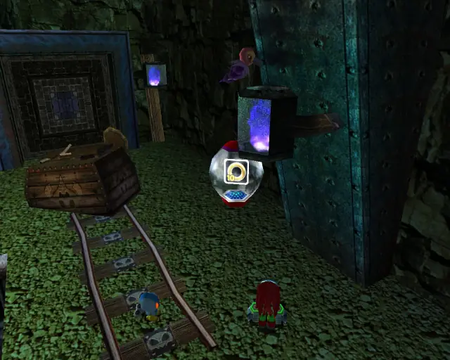

[Back to Top](#)

## Aquatic Mine Chao Box 1

  

[Back to Top](#)

## Aquatic Mine Animal 4

[Back to Top](#)

## Aquatic Mine Chao Box 2
  
  

[Back to Top](#)

## Aquatic Mine Omochao 4

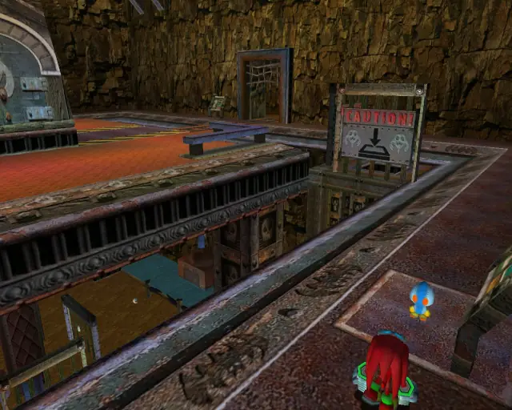

[Back to Top](#)

## Aquatic Mine Omochao 6

[Back to Top](#)

## Aquatic Mine Animal 5

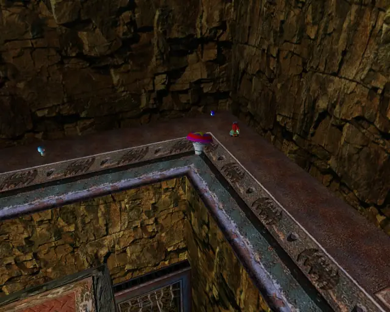

[Back to Top](#)

## Aquatic Mine Omochao 5

[Back to Top](#)

## Aquatic Mine Pipe 2 & Animal 6

[Back to Top](#)

## Aquatic Mine Animal 7

[Back to Top](#)

## Aquatic Mine Pipe 3 & Animal 9

[Back to Top](#)

## Aquatic Mine Animal 8

[Back to Top](#)

## Aquatic Mine Chao Box 3

[Back to Top](#)

## Aquatic Mine Animal 10

[Back to Top](#)

## Aquatic Mine Omochao 7

[Back to Top](#)

# Death Chamber

## Death Chamber Animal 1

[Back to Top](#)

## Death Chamber Animal 2

[Back to Top](#)

## Death Chamber Animal 3

[Back to Top](#)

## Death Chamber Animal 4

[Back to Top](#)

## Death Chamber Animal 5

[Back to Top](#)

## Death Chamber Animal 6

[Back to Top](#)

## Death Chamber Animal 7

[Back to Top](#)

## Death Chamber Animal 8

[Back to Top](#)

## Death Chamber Animal 9

[Back to Top](#)

## Death Chamber Animal 10

[Back to Top](#)

# Meteor Herd

## Meteor Herd Animal 1

[Back to Top](#)

## Meteor Herd Omochao 1

[Back to Top](#)

## Meteor Herd Pipe 1 & Animal 2

[Back to Top](#)

## Meteor Herd Omochao 2

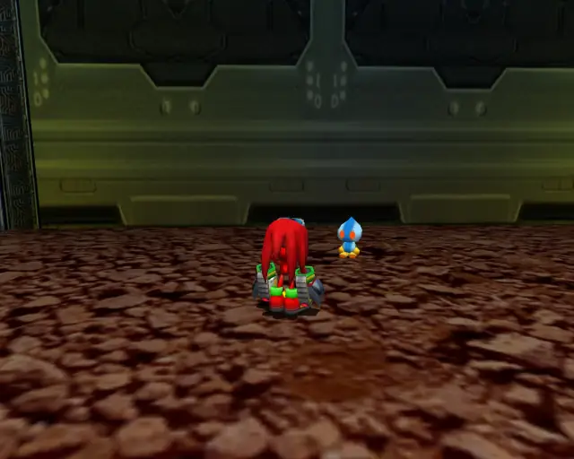

[Back to Top](#)

## Meteor Herd Chao Box 1

  

[Back to Top](#)

## Meteor Herd Animal 3

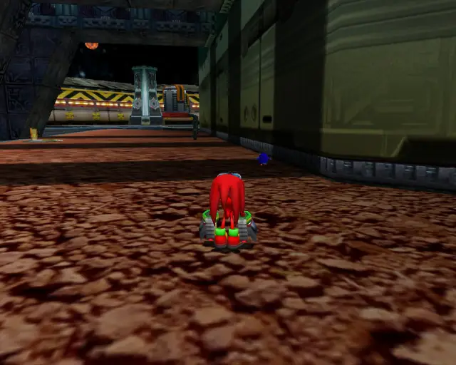

[Back to Top](#)

## Meteor Herd Animal 4

[Back to Top](#)

## Meteor Herd Gold Beetle
  
  

[Back to Top](#)

## Meteor Herd Animal 5

[Back to Top](#)

## Meteor Herd Chao Box 2
  
  

[Back to Top](#)

## Meteor Herd Animal 6

[Back to Top](#)

## Meteor Herd Pipe 3 & Animal 7

[Back to Top](#)

## Meteor Herd Omochao 3

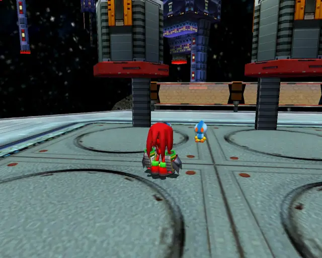

[Back to Top](#)

## Meteor Herd Animal 8

[Back to Top](#)

## Meteor Herd Chao Box 3
  

[Back to Top](#)

## Meteor Herd Animal 9

[Back to Top](#)

## Meteor Herd Animal 10

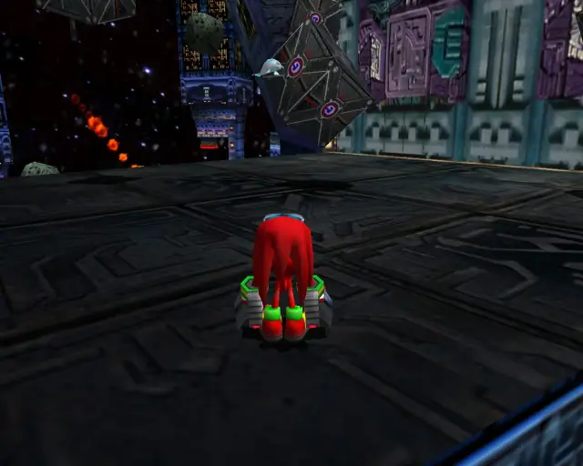

[Back to Top](#)

## Meteor Herd Animal 11

[Back to Top](#)
