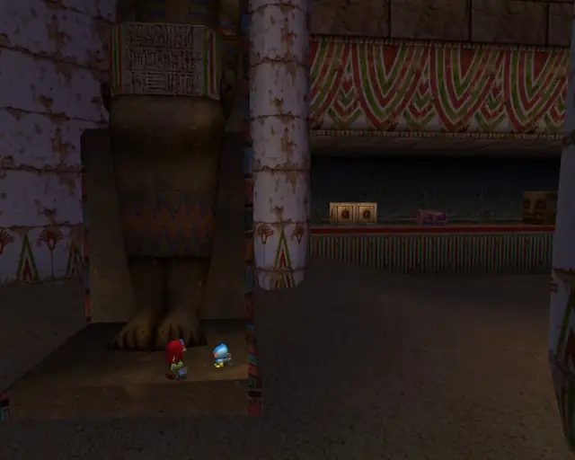
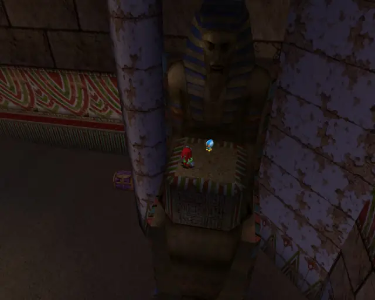
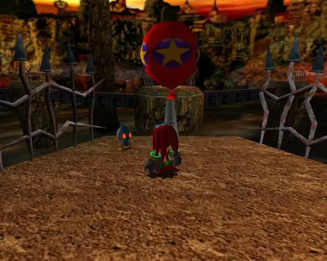
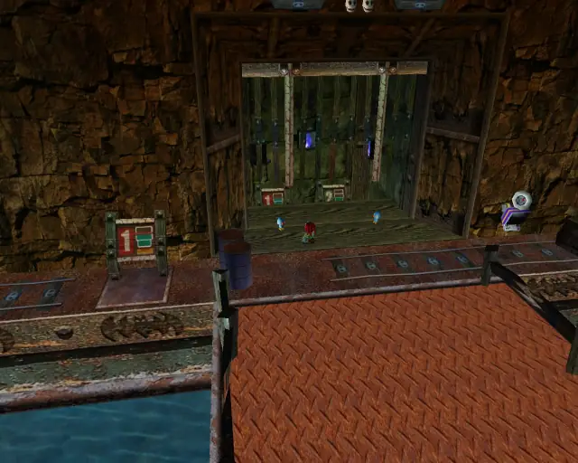
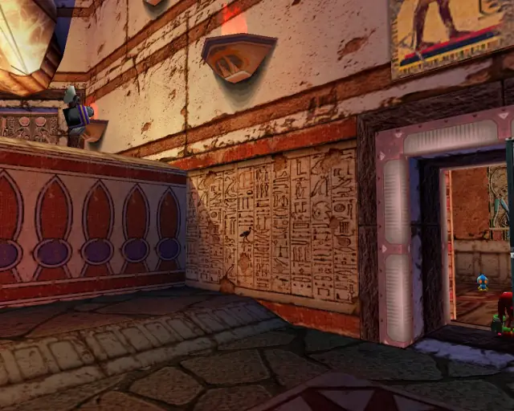

# Knuckles Stages (Omosanity)

## Table of Contents:
1. [ Wild Canyon ](#wild-canyon)
1. [ Pumpkin Hill ](#pumpkin-hill)
1. [ Aquatic Mine ](#aquatic-mine)
1. [ Death Chamber ](#death-chamber)
1. [ Meteor Herd ](#meteor-herd)

# Wild Canyon

## Wild Canyon Omochao 1

[Back to Top](#)

## Wild Canyon Omochao 2

[Back to Top](#)

## Wild Canyon Omochao 3

[Back to Top](#)

## Wild Canyon Omochao 4

[Back to Top](#)

## Wild Canyon Omochao 5

[Back to Top](#)

## Wild Canyon Omochao 6

[Back to Top](#)

## Wild Canyon Omochao 7

[Back to Top](#)

## Wild Canyon Omochao 8

[Back to Top](#)

## Wild Canyon Omochao 9

[Back to Top](#)

## Wild Canyon Omochao 10

[Back to Top](#)

# Pumpkin Hill

## Pumpkin Hill Omochao 1

[Back to Top](#)

## Pumpkin Hill Omochao 2

[Back to Top](#)

## Pumpkin Hill Omochao 3

[Back to Top](#)

## Pumpkin Hill Omochao 4

[Back to Top](#)

## Pumpkin Hill Omochao 5

[Back to Top](#)

## Pumpkin Hill Omochao 6

[Back to Top](#)

## Pumpkin Hill Omochao 7

[Back to Top](#)

## Pumpkin Hill Omochao 8

[Back to Top](#)

## Pumpkin Hill Omochao 9

[Back to Top](#)

## Pumpkin Hill Omochao 10

[Back to Top](#)

## Pumpkin Hill Omochao 11

[Back to Top](#)

# Aquatic Mine

## Aquatic Mine Omochao 1

[Back to Top](#)

## Aquatic Mine Omochao 2

[Back to Top](#)

## Aquatic Mine Omochao 3

[Back to Top](#)

## Aquatic Mine Omochao 4

[Back to Top](#)

## Aquatic Mine Omochao 5

[Back to Top](#)

## Aquatic Mine Omochao 6

[Back to Top](#)

## Aquatic Mine Omochao 7

[Back to Top](#)

# Death Chamber

## Death Chamber Omochao 1

[Back to Top](#)

## Death Chamber Omochao 2

[Back to Top](#)

## Death Chamber Omochao 3

[Back to Top](#)

## Death Chamber Omochao 4

[Back to Top](#)

## Death Chamber Omochao 5

[Back to Top](#)

## Death Chamber Omochao 6

[Back to Top](#)

## Death Chamber Omochao 7

[Back to Top](#)

## Death Chamber Omochao 8

[Back to Top](#)

## Death Chamber Omochao 9

[Back to Top](#)

# Meteor Herd

## Meteor Herd Omochao 1

[Back to Top](#)

## Meteor Herd Omochao 2

[Back to Top](#)

## Meteor Herd Omochao 3

[Back to Top](#)
