
## animal 1

## omochao 1

## pipe 1
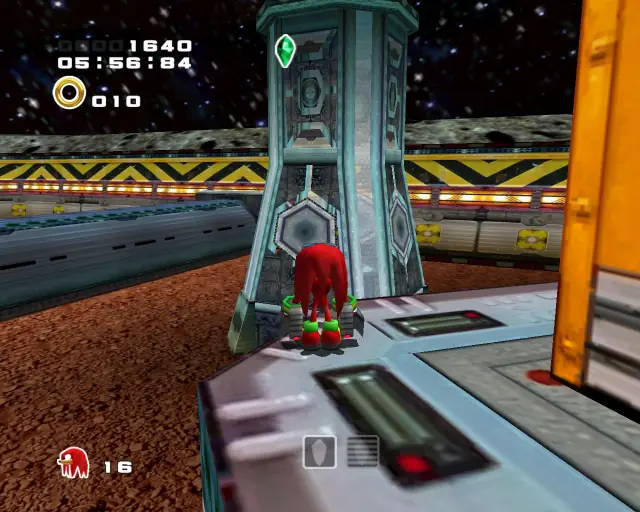
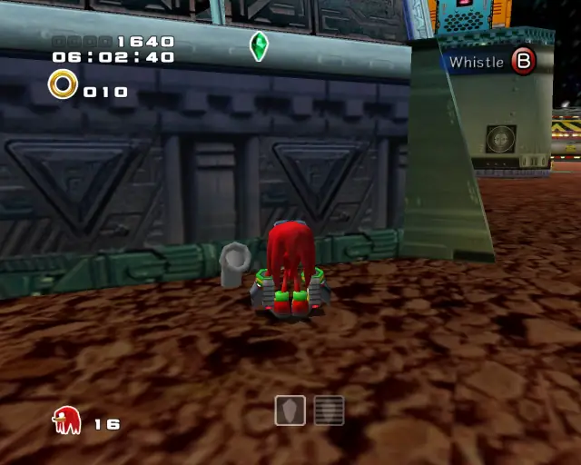

## animal 2

## omochao 2

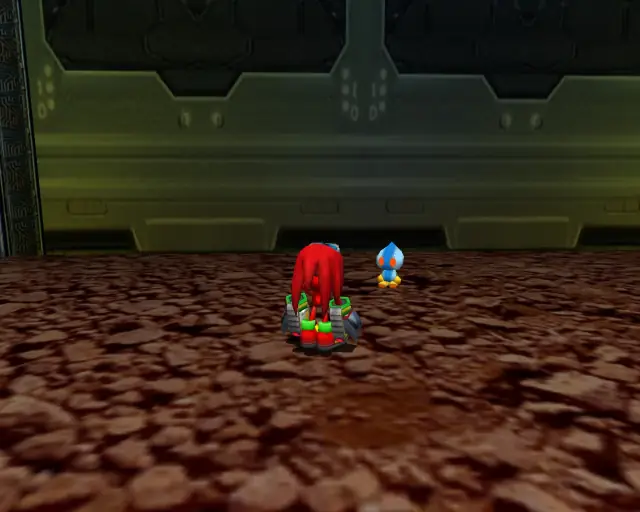

## chaobox 1

## animal 3
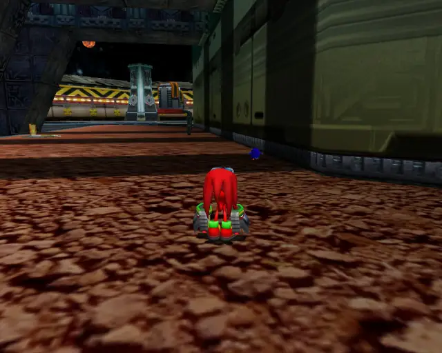

## animal 4

## goldbeetle 1

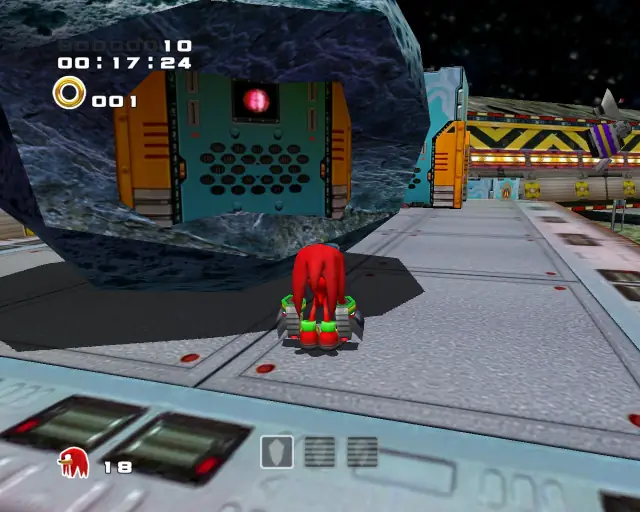
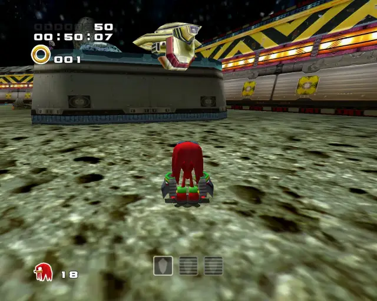

## pipe 2
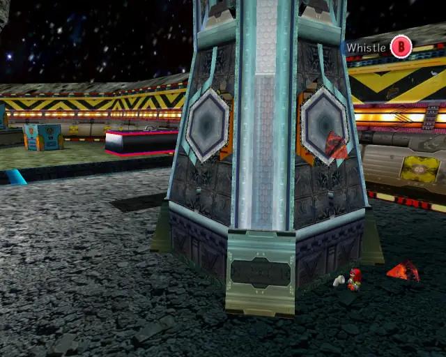
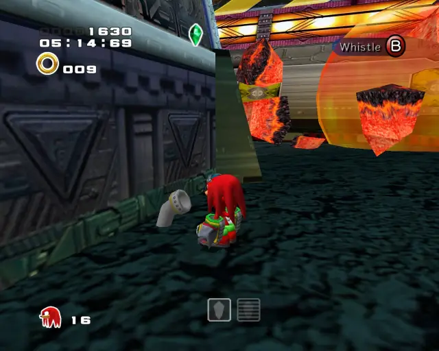

## animal 5

## chaobox 2

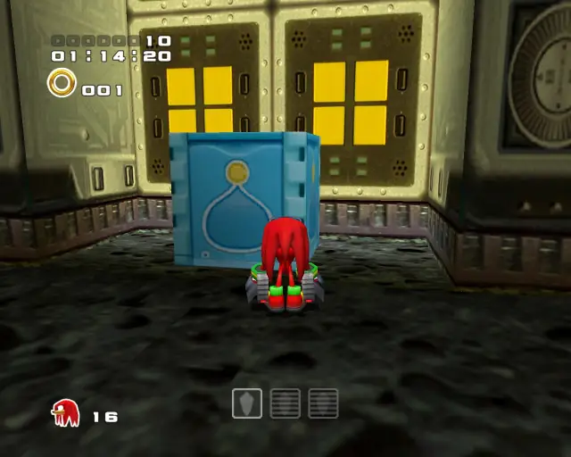

## animal 6

## pipe 3
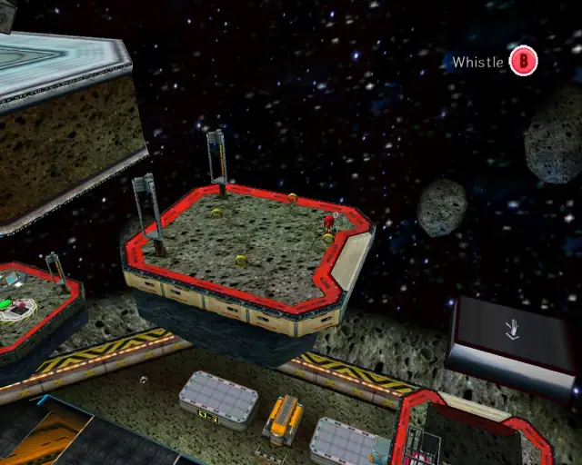

## animal 7

## omochao 3

## animal 8
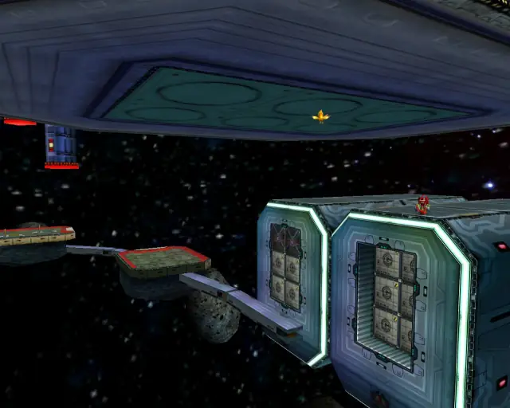

## chaobox 3
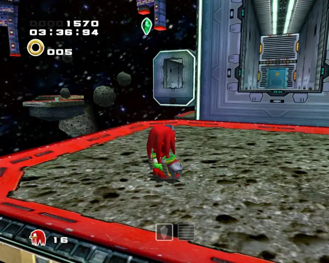

## animal 9
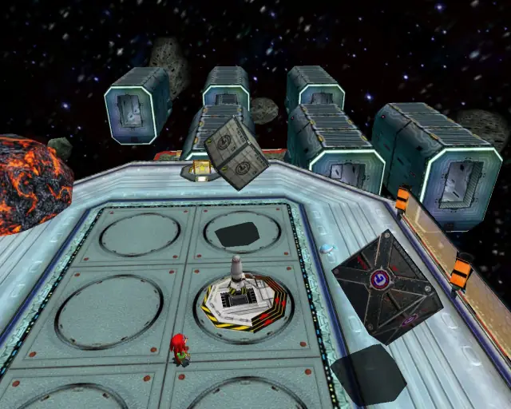

## animal 10

## animal 11

