
## big 1

## item 1

## item 2

## item 3

## item 4
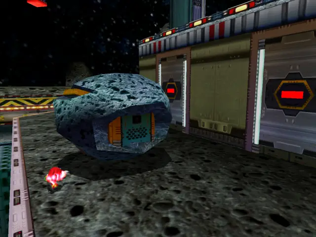

## item 5

## item 6

## item 7
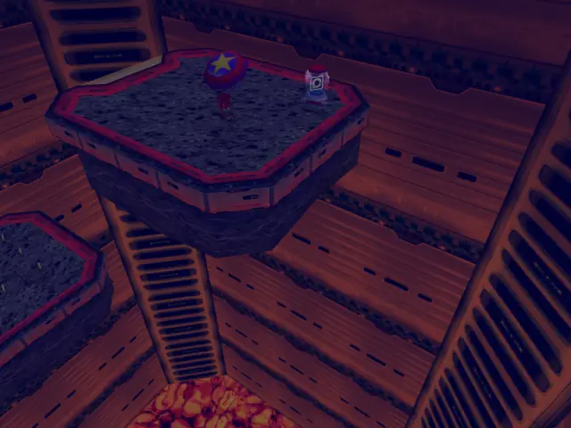

## item 8
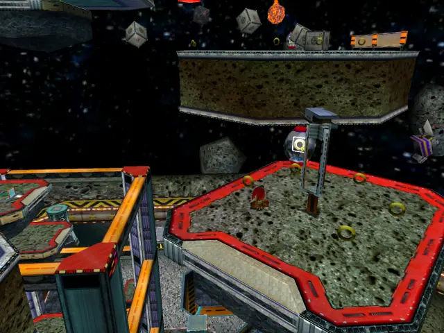

## item 9
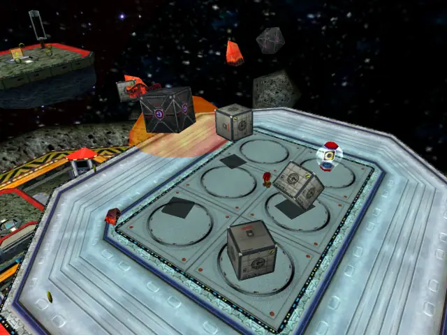

## item 10

## item 11
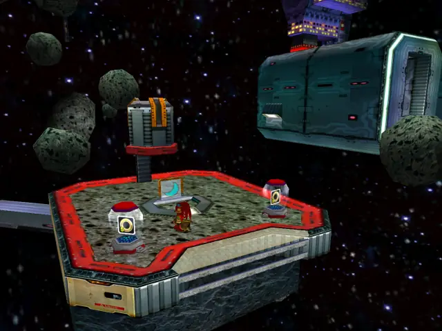

## item 12
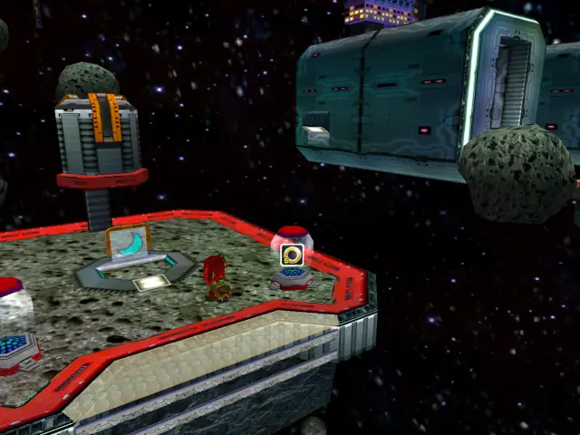

## life 1
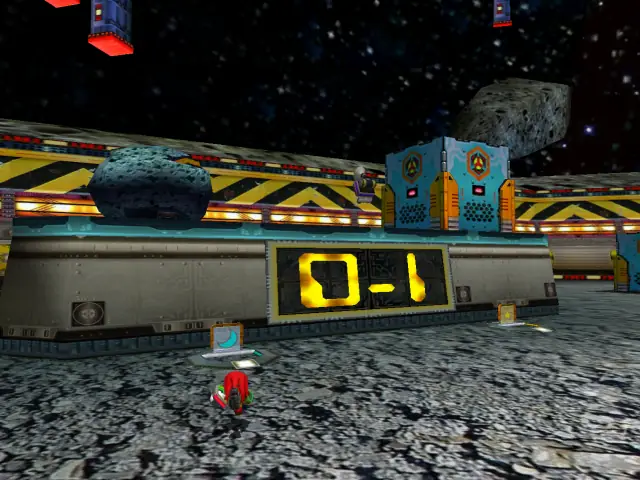
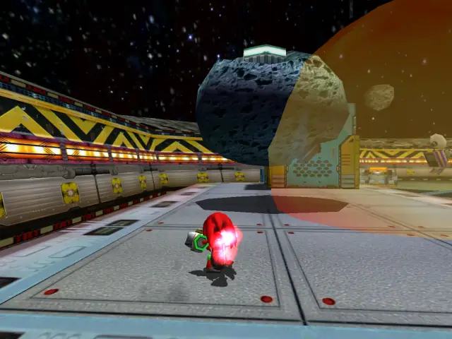

## life 2
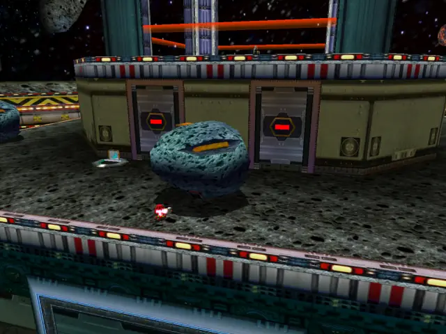
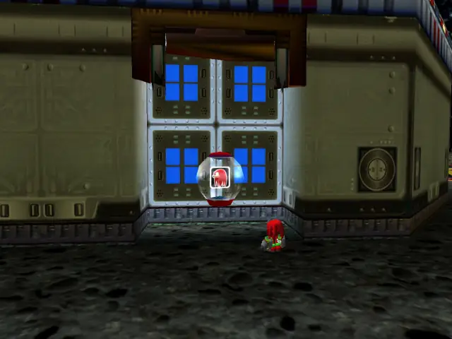

## life 3
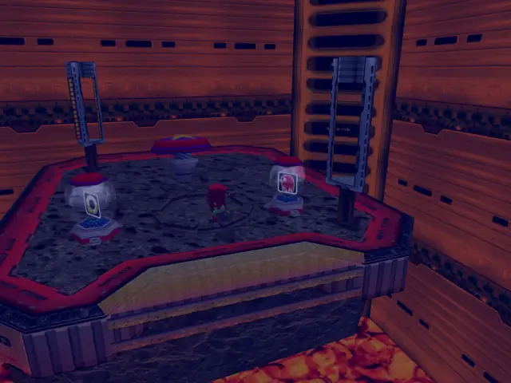

## life 4

## life 5

