
## omochao 1
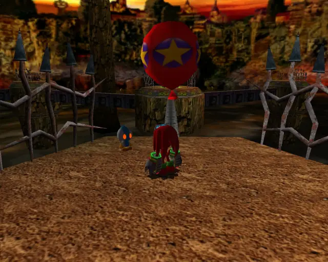

## omochao 2

## omochao 3

## omochao 4
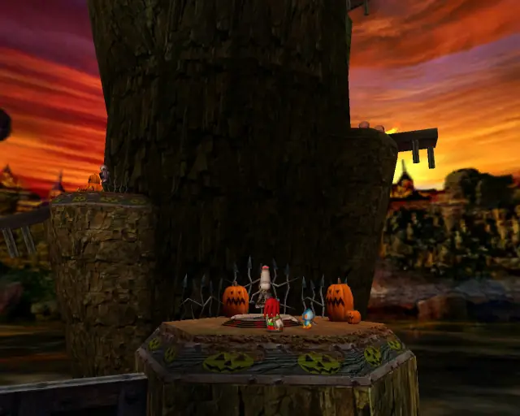

## animal 1
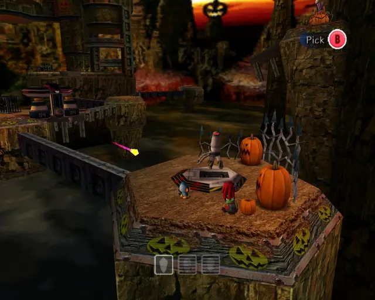
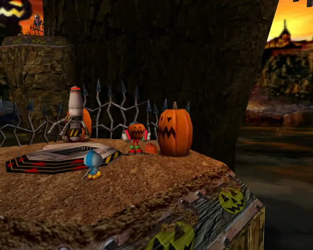

## omochao 5

## animal 10

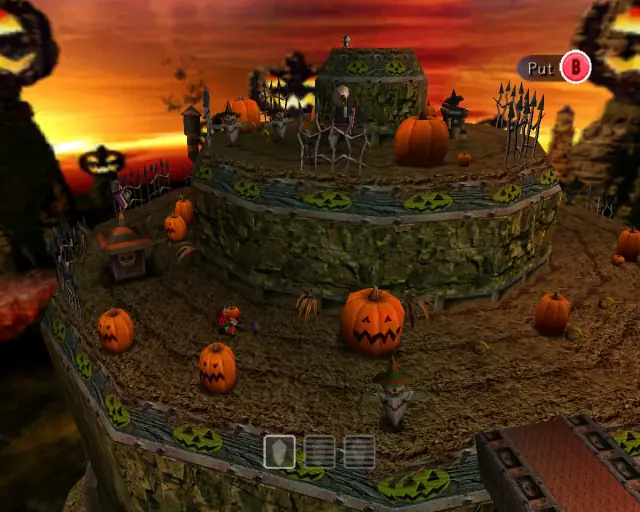

## animal 11

## omochao 6
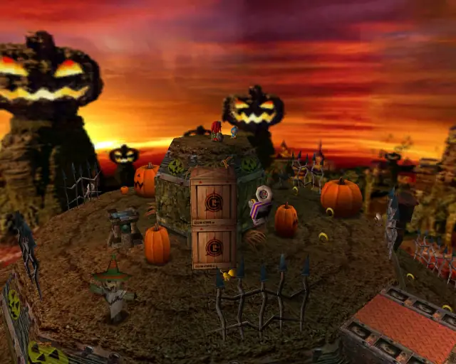

## chaobox 1

## animal 9
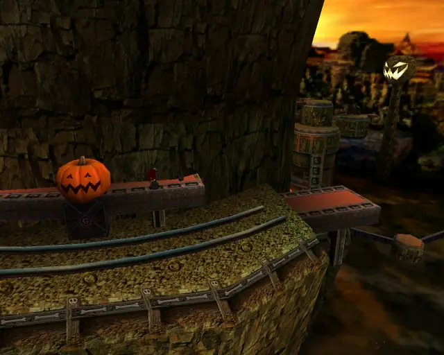

## omochao 7
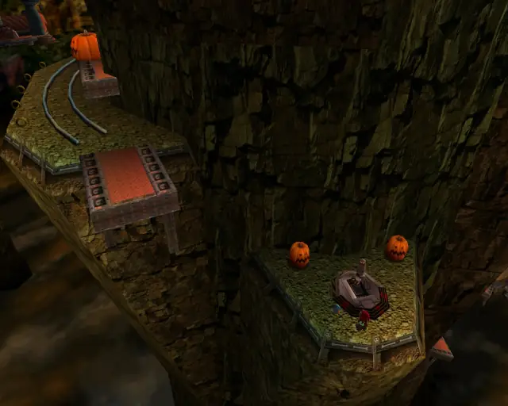

## omochao 8
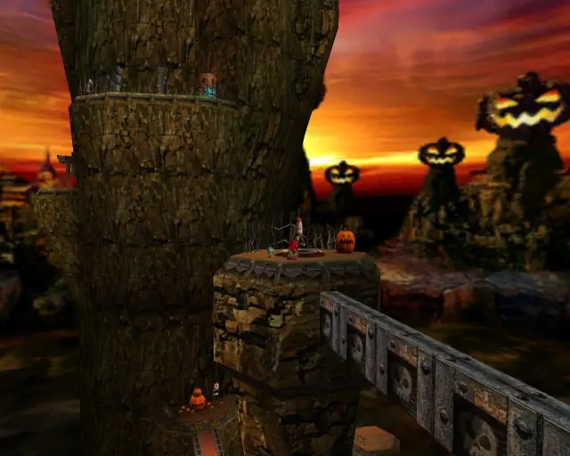

## chaobox 2
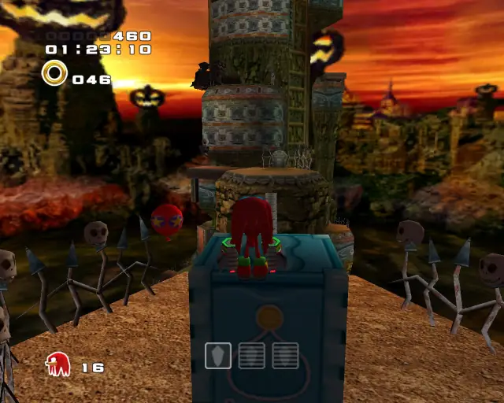

## animal 6
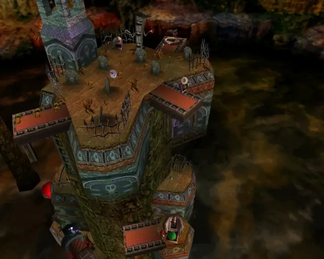

## omochao 10
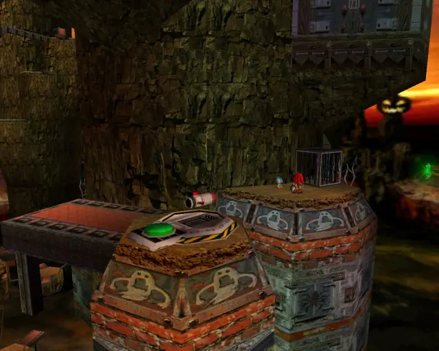

## pipe 1
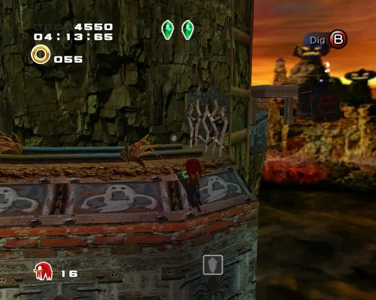

## animal 7

## animal 8
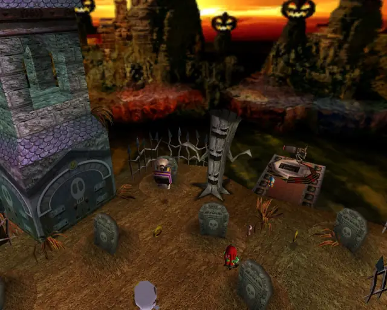

## omochao 9

## animal 2
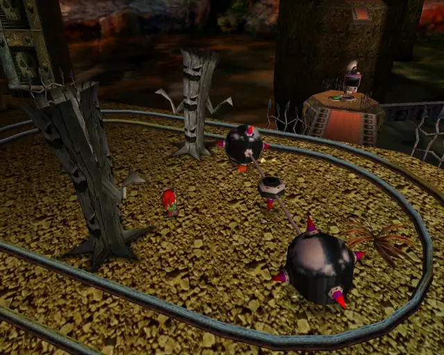

## hidden 1
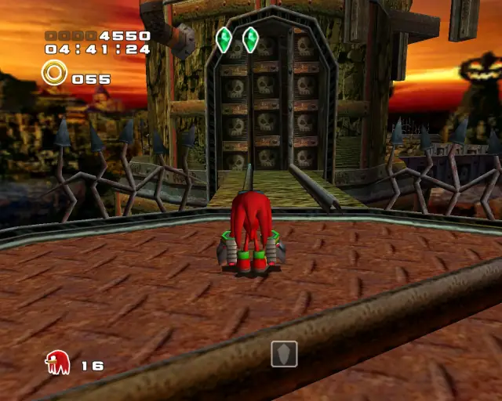

## animal 3

## animal 5

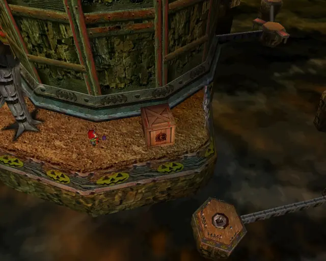

## animal 4
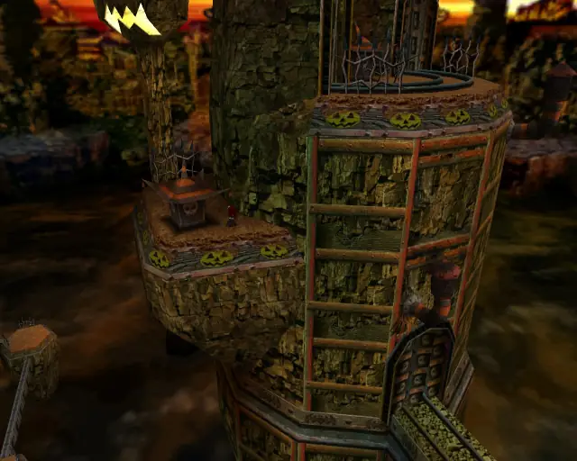

## omochao 11
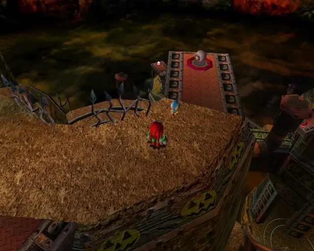

## chaobox 3
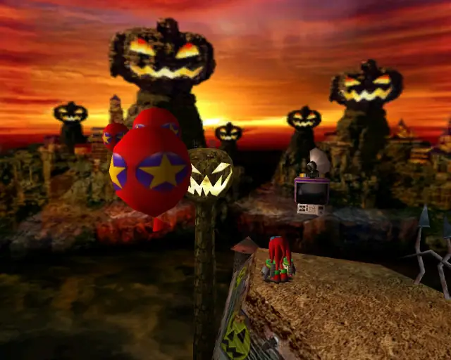
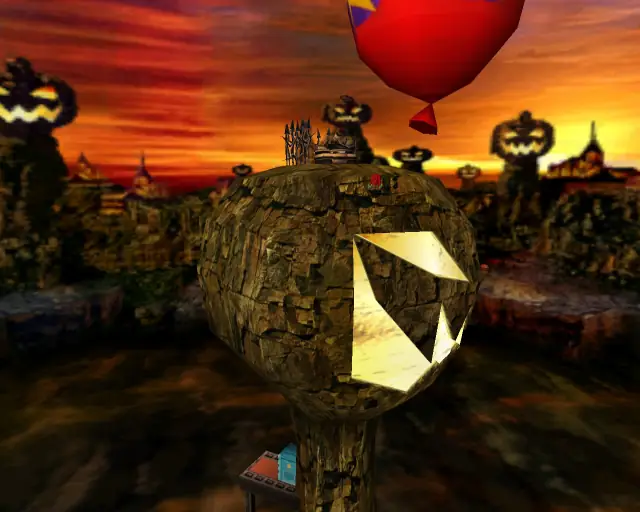

