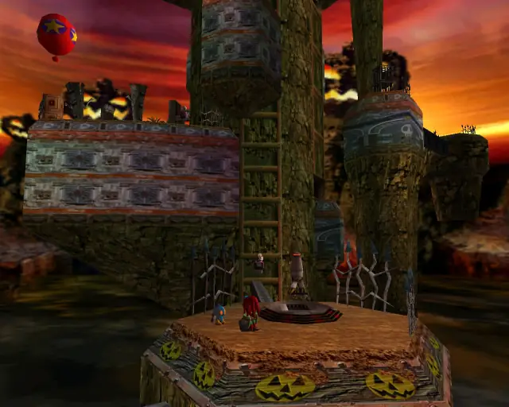
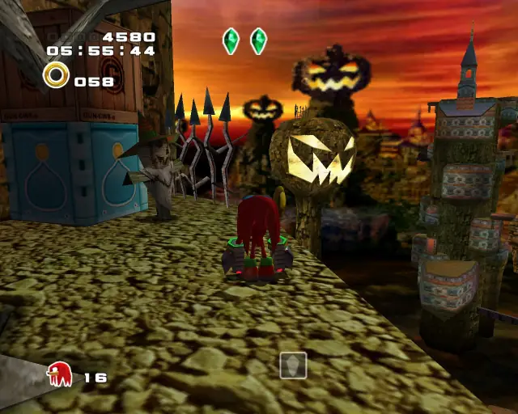
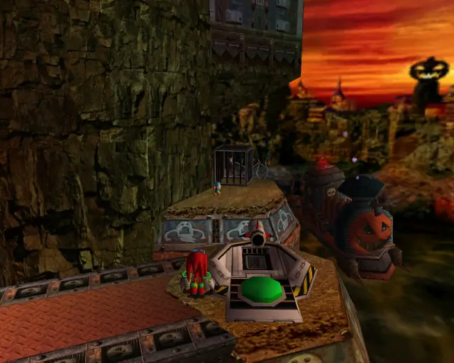

## omochao 1

## omochao 2

## omochao 3

## omochao 4

## animal 1

## omochao 5

## animal 10

## animal 11

## omochao 6

## chaobox 1

## animal 9

## omochao 7

## omochao 8

## chaobox 2

## animal 6

## omochao 10

## pipe 1

## animal 7

## animal 8

## omochao 9

## animal 2

## hidden 1

## animal 3

## animal 5

## animal 4

## omochao 11

## chaobox 3

