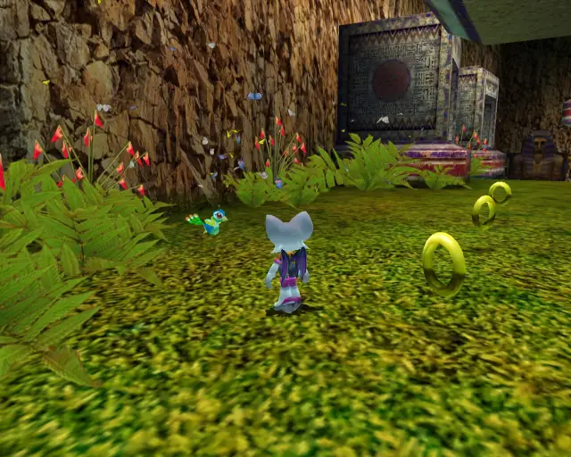
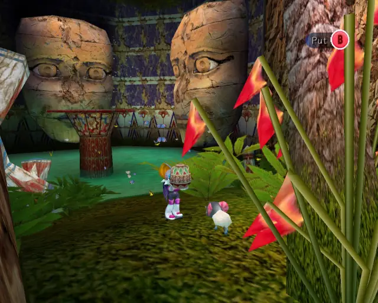

# Dry Lagoon (Chronological)

## Dry Lagoon Omochao 1

[Back to Top](#)

## Dry Lagoon Animal 1

[Back to Top](#)

## Dry Lagoon Omochao 2

[Back to Top](#)

## Dry Lagoon Animal 2

[Back to Top](#)

## Dry Lagoon Omochao 3

[Back to Top](#)

## Dry Lagoon Chao Box 1
  

[Back to Top](#)

## Dry Lagoon Omochao 4

[Back to Top](#)

## Dry Lagoon Omochao 5

[Back to Top](#)

## Dry Lagoon Omochao 6

[Back to Top](#)

## Dry Lagoon Chao Box 2
  

[Back to Top](#)

## Dry Lagoon Pipe 1 & Animal 3

[Back to Top](#)

## Dry Lagoon Gold Beetle
  

[Back to Top](#)

## Dry Lagoon Animal 4

[Back to Top](#)

## Dry Lagoon Omochao 7

[Back to Top](#)

## Dry Lagoon Hidden 1 & Animal 5

[Back to Top](#)

## Dry Lagoon Animal 6

[Back to Top](#)

## Dry Lagoon Omochao 8

[Back to Top](#)

## Dry Lagoon Omochao 9

[Back to Top](#)

## Dry Lagoon Omochao 10

[Back to Top](#)

## Dry Lagoon Animal 7

[Back to Top](#)

## Dry Lagoon Animal 8

[Back to Top](#)

## Dry Lagoon Omochao 11

[Back to Top](#)

## Dry Lagoon Animal 9

[Back to Top](#)

## Dry Lagoon Chao Box 3

[Back to Top](#)

## Dry Lagoon Animal 10

[Back to Top](#)

## Dry Lagoon Animal 11

[Back to Top](#)

## Dry Lagoon Omochao 12

[Back to Top](#)

## Dry Lagoon Animal 12

[Back to Top](#)
