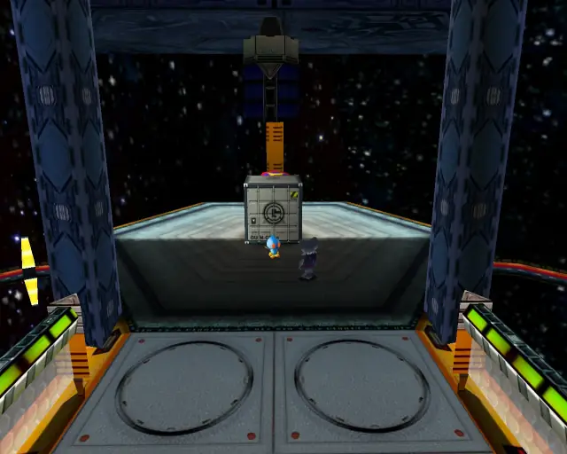
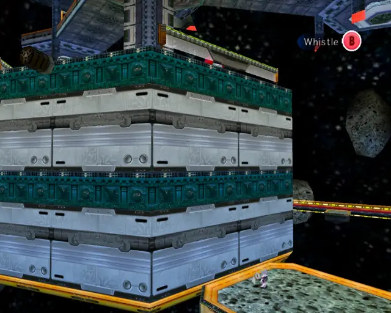
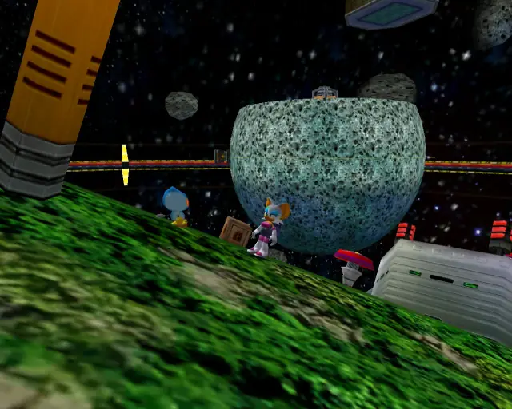
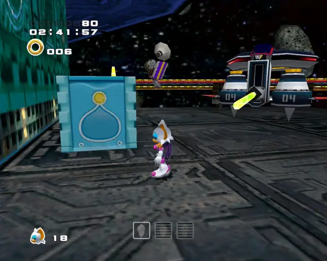
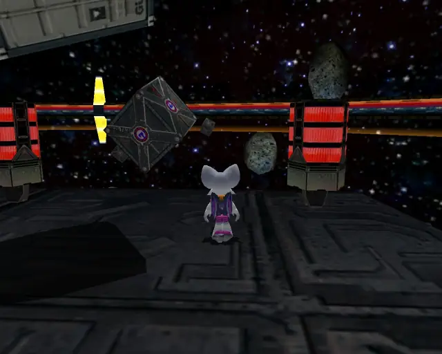
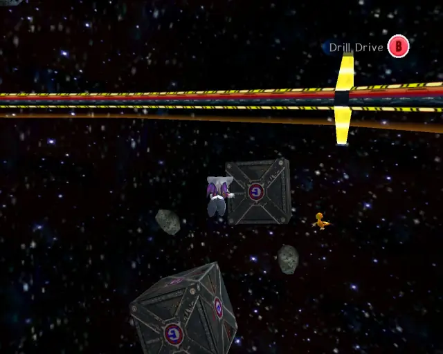

# Mad Space (Chronological)

## Mad Space Animal 1

[Back to Top](#)

## Mad Space Omochao 1

[Back to Top](#)

## Mad Space Omochao 2

[Back to Top](#)

## Mad Space Pipe 1 & Animal 2

[Back to Top](#)

## Mad Space Chao Box 1

[Back to Top](#)

## Mad Space Pipe 2 & Animal 3

[Back to Top](#)

## Mad Space Omochao 3

[Back to Top](#)

## Mad Space Animal 4

[Back to Top](#)

## Mad Space Omochao 4

[Back to Top](#)

## Mad Space Animal 5

[Back to Top](#)

## Mad Space Animal 6

[Back to Top](#)

## Mad Space Chao Box 2
  

[Back to Top](#)

## Mad Space Animal 7

[Back to Top](#)

## Mad Space Omochao 5

[Back to Top](#)

## Mad Space Gold Beetle

[Back to Top](#)

## Mad Space Pipe 3 & Animal 8

[Back to Top](#)

## Mad Space Chao Box 3

[Back to Top](#)

## Mad Space Pipe 4 & Animal 9

[Back to Top](#)

## Mad Space Animal 10

[Back to Top](#)
