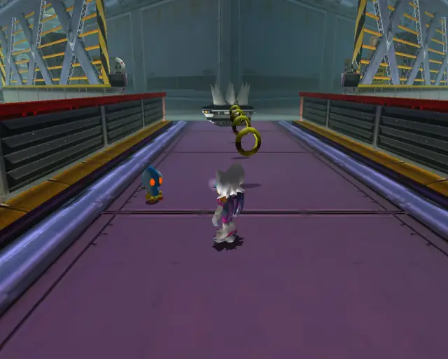
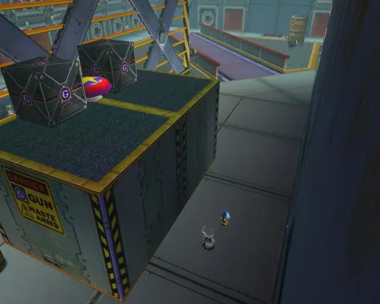
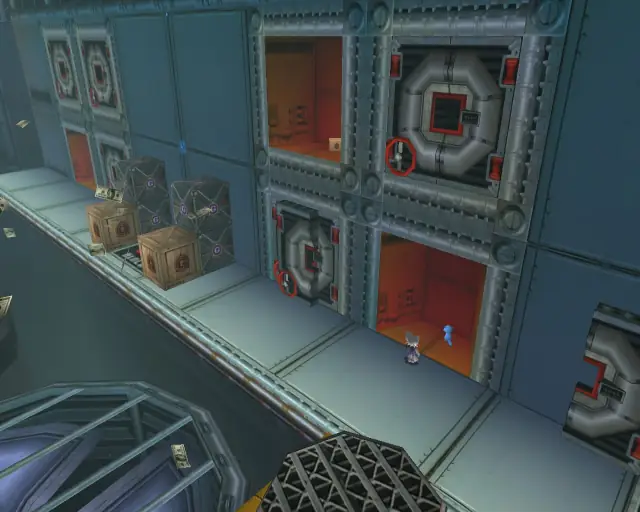
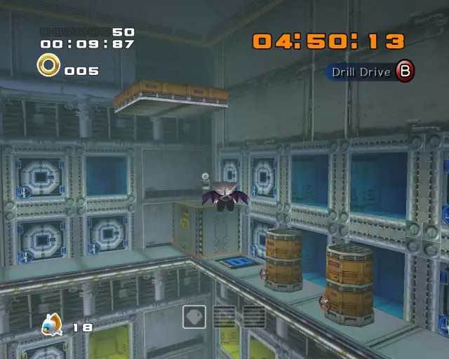
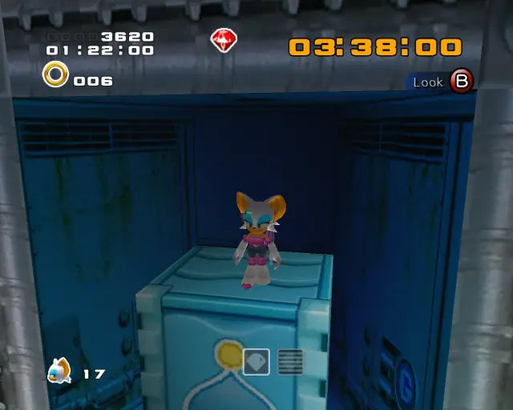
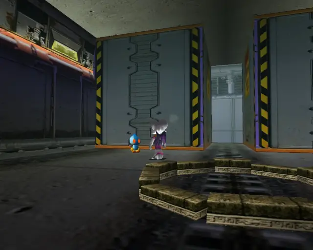
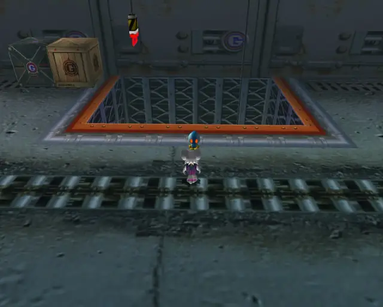
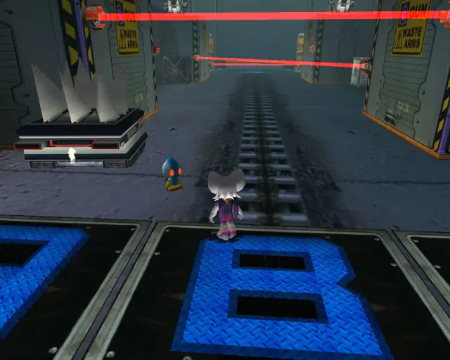

# Security Hall (Chronological)

## Security Hall Omochao 1

[Back to Top](#)

## Security Hall Omochao 2

[Back to Top](#)

## Security Hall Pipe 1 & Animal 1

[Back to Top](#)

## Security Hall Chao Box 1
  

[Back to Top](#)

## Security Hall Omochao 3

[Back to Top](#)

## Security Hall Animal 2

[Back to Top](#)

## Security Hall Omochao 4

[Back to Top](#)

## Security Hall Animal 3

[Back to Top](#)

## Security Hall Omochao 5

[Back to Top](#)

## Security Hall Animal 4

[Back to Top](#)

## Security Hall Chao Box 3
  
  

[Back to Top](#)

## Security Hall Omochao 6

[Back to Top](#)

## Security Hall Omochao 7

[Back to Top](#)

## Security Hall Omochao 8

[Back to Top](#)

## Security Hall Omochao 9

[Back to Top](#)

## Security Hall Animal 5

[Back to Top](#)

## Security Hall Animal 6

[Back to Top](#)

## Security Hall Gold Beetle

[Back to Top](#)

## Security Hall Omochao 10

[Back to Top](#)

## Security Hall Omochao 11

[Back to Top](#)

## Security Hall Chao Box 2
  

[Back to Top](#)

## Security Hall Animal 7

[Back to Top](#)

## Security Hall Omochao 12

[Back to Top](#)

## Security Hall Hidden 1 & Animal 8

[Back to Top](#)
