
## omochao 1
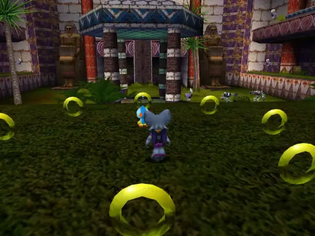

## animal 1
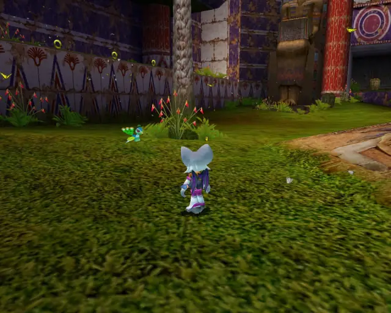

## omochao 2

## animal 2
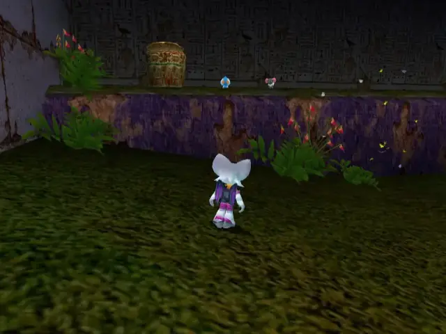

## omochao 3
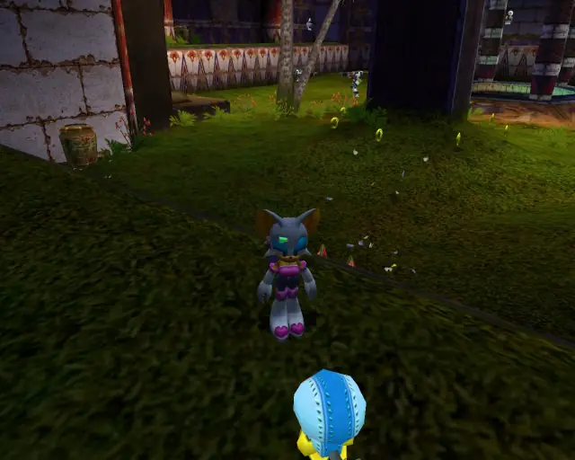

## chaobox 1
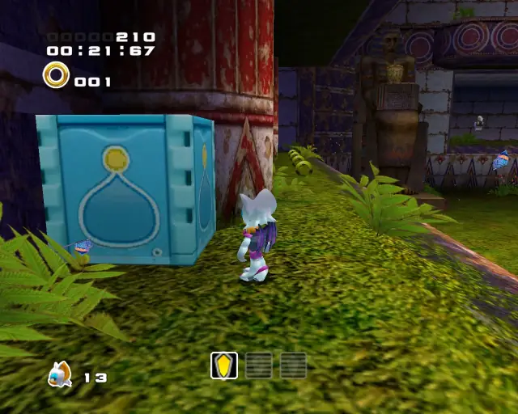

## omochao 4
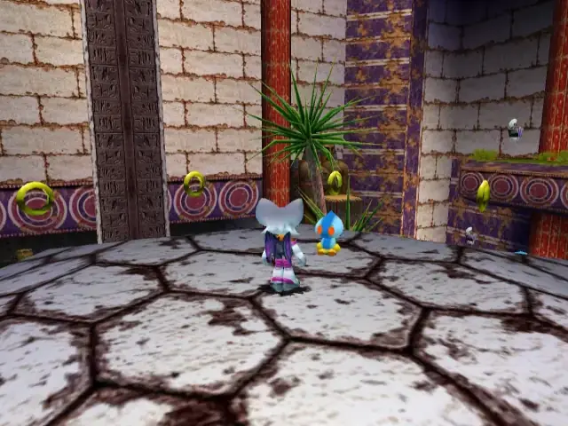

## omochao 5
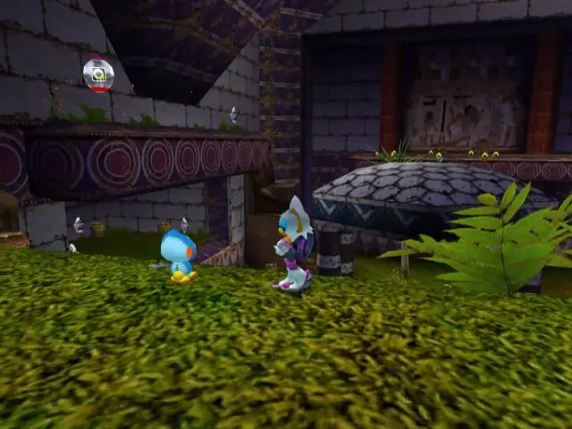

## omochao 6
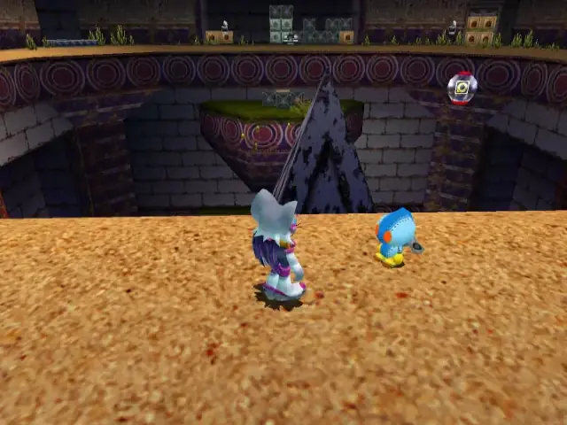

## chaobox 2
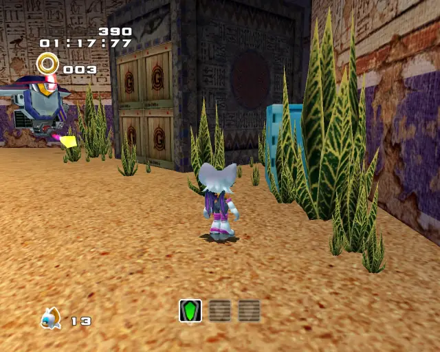

## pipe 1

## animal 3
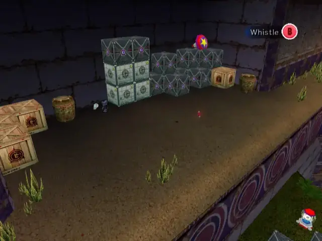

## goldbeetle 1
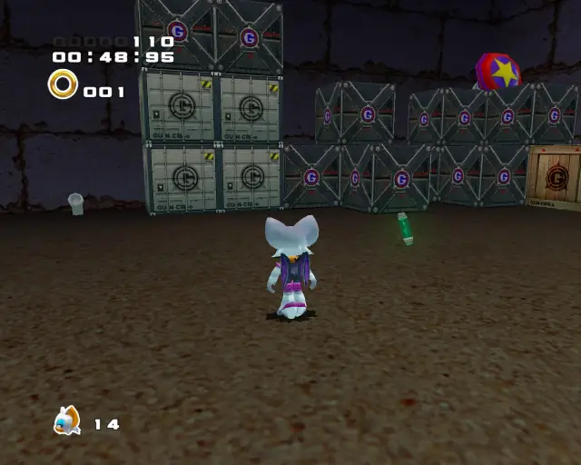
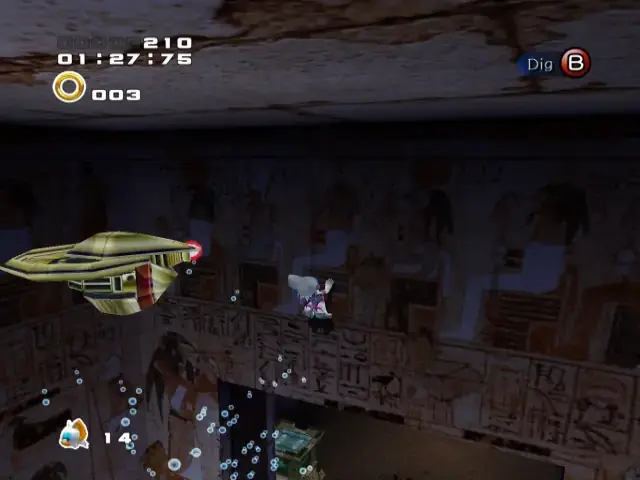

## animal 4
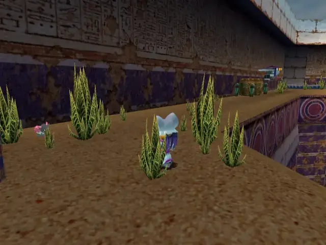

## omochao 7
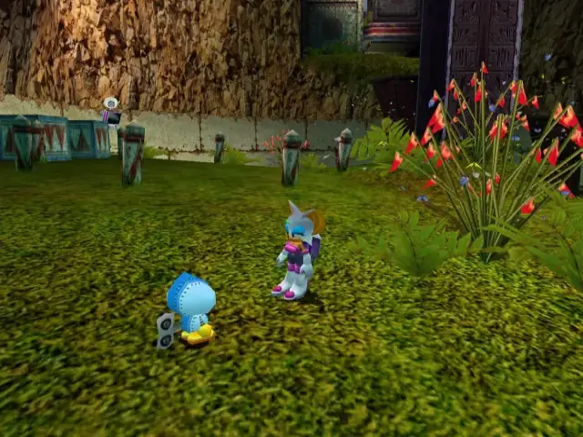

## hidden 1
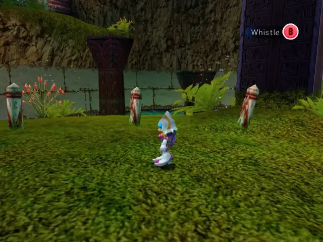

## animal 5

## animal 6
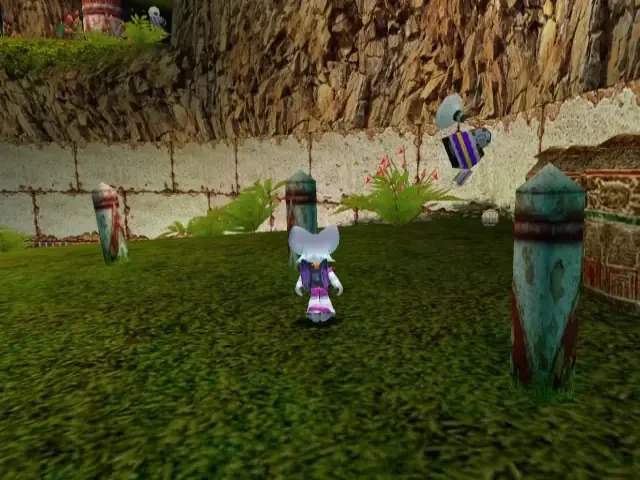

## omochao 8
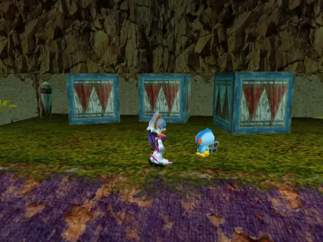

## omochao 9
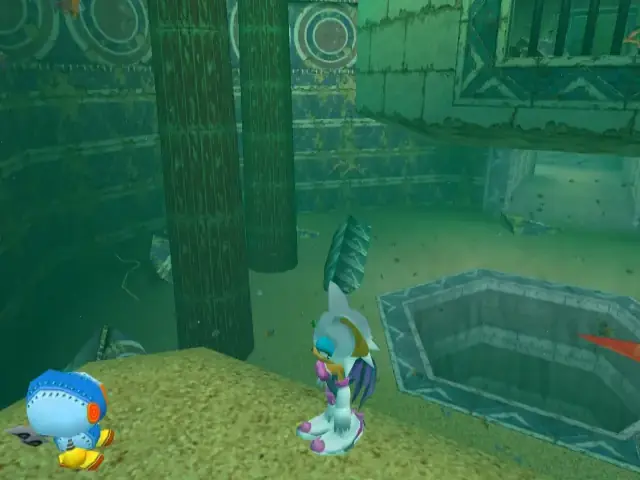

## omochao 10
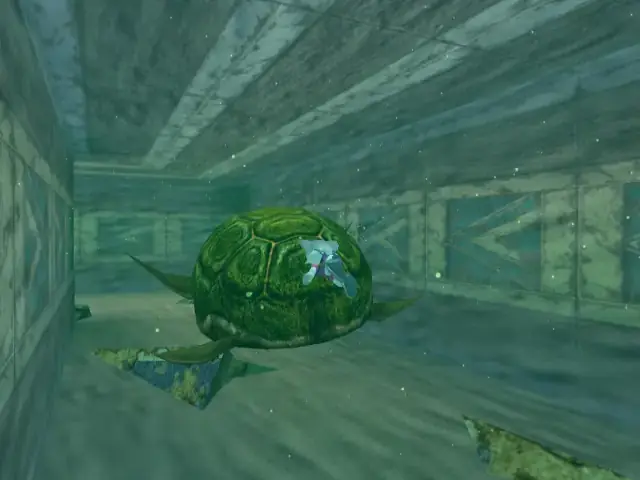
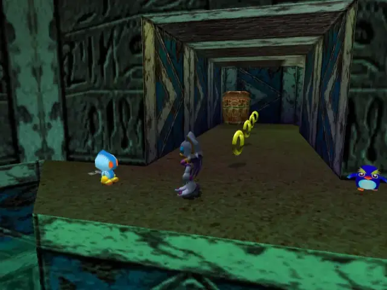

## animal 7
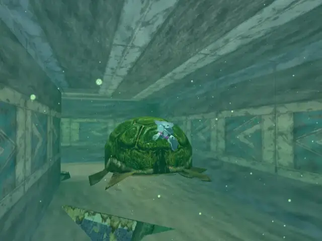
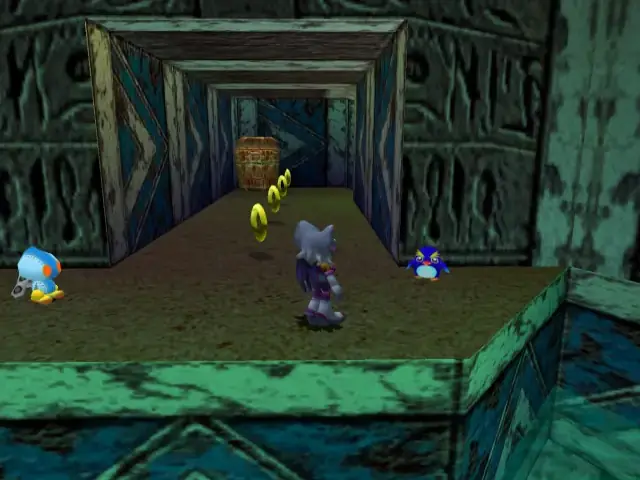

## animal 8
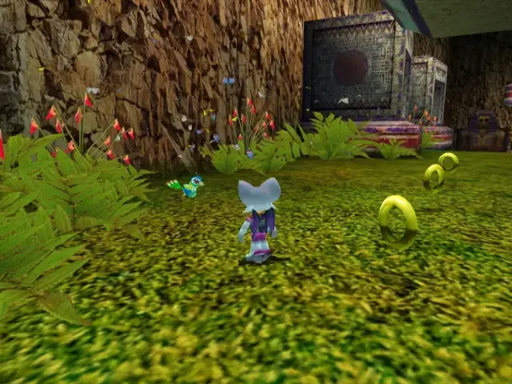

## omochao 11

## animal 9
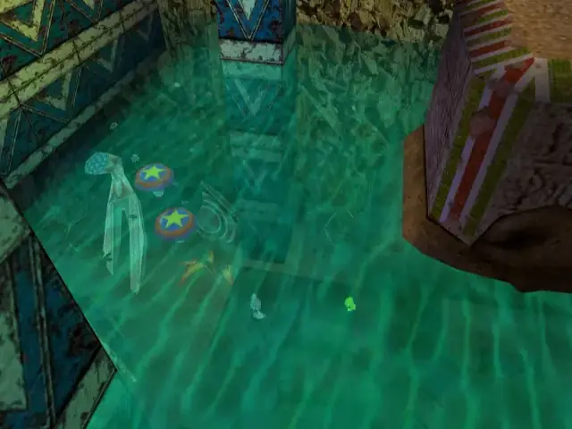

## chaobox 3

## animal 10
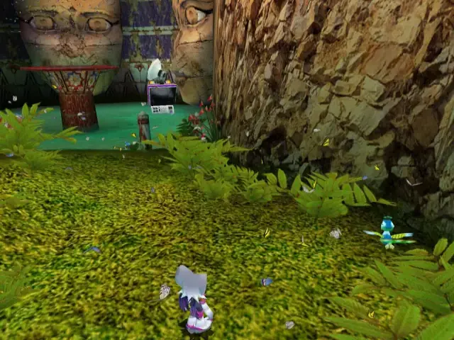

## animal 11
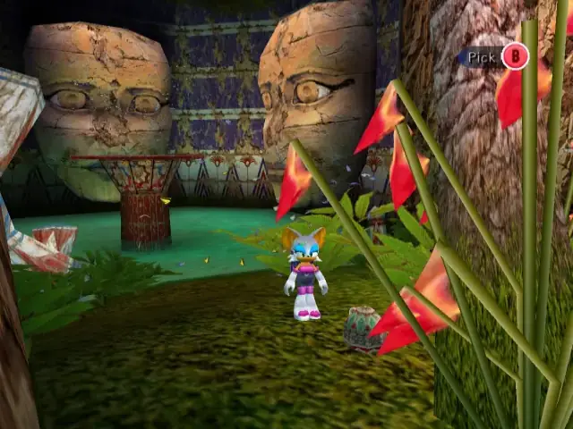

## omochao 12
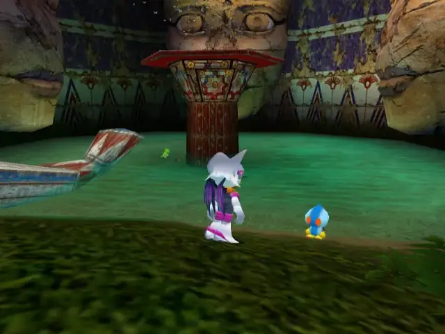

## animal 12
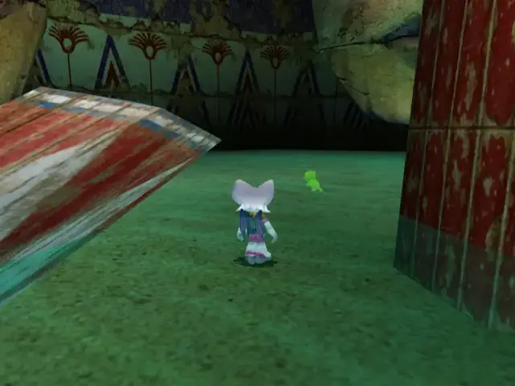

