
## omochao 1

## animal 1

## omochao 2
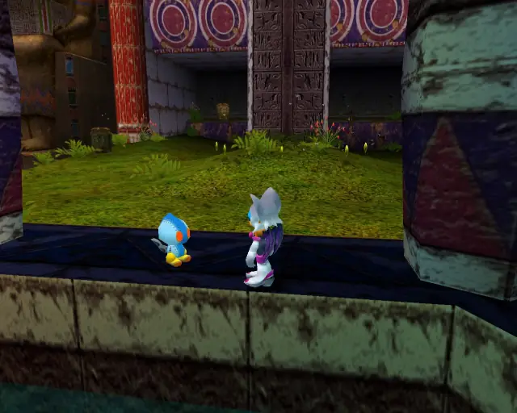

## animal 2
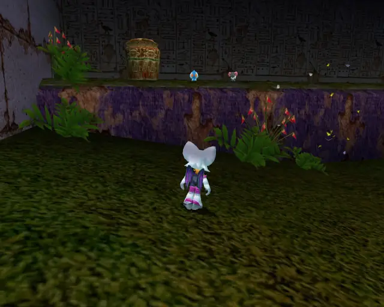

## omochao 3
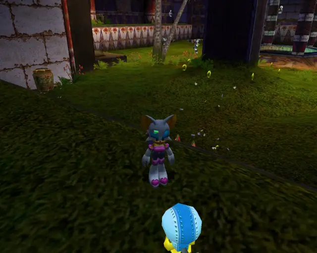

## chaobox 1

## omochao 4

## omochao 5

## omochao 6

## chaobox 2
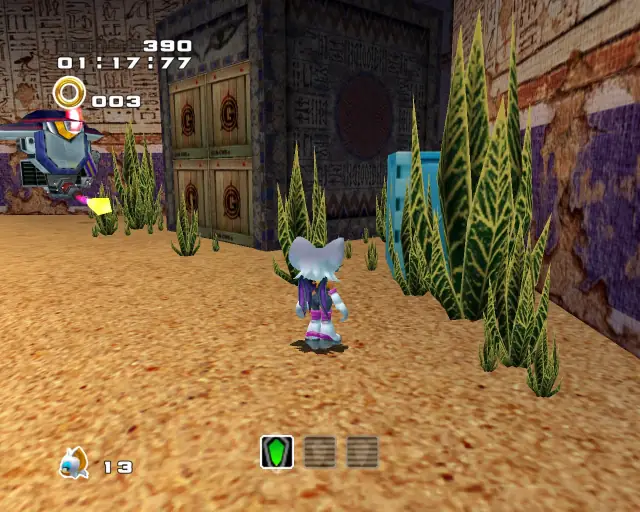

## pipe 1

## animal 3

## goldbeetle 1

## animal 4

## omochao 7

## hidden 1

## animal 5

## animal 6

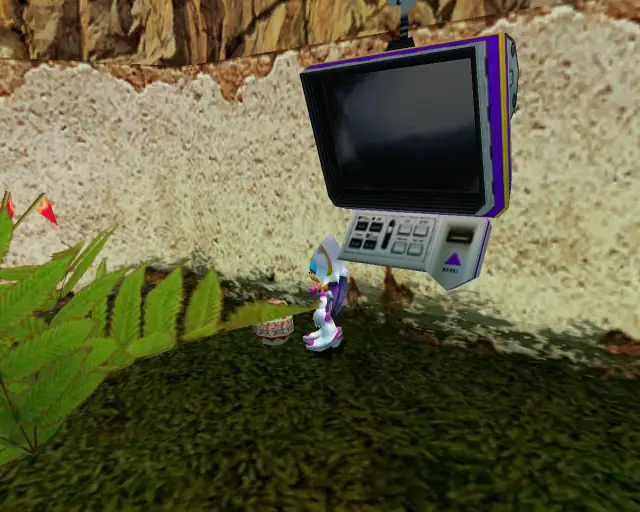
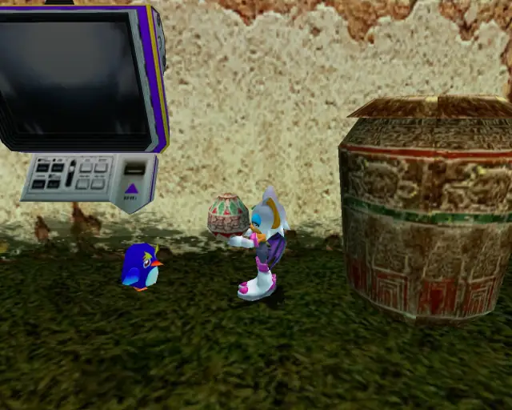

## omochao 8

## omochao 9

## omochao 10

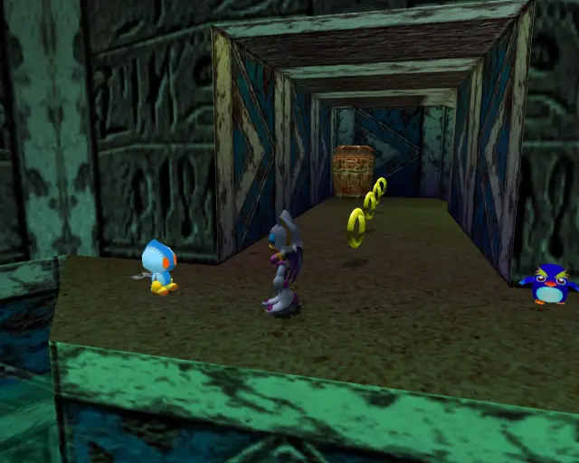

## animal 7

## animal 8
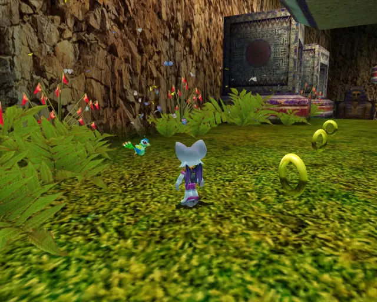

## omochao 11
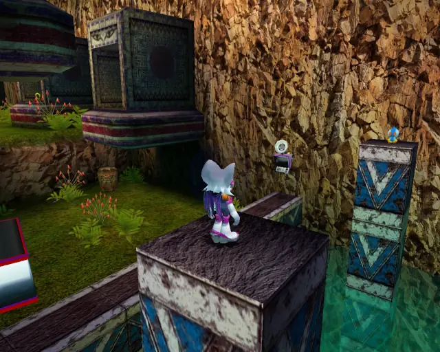

## animal 9
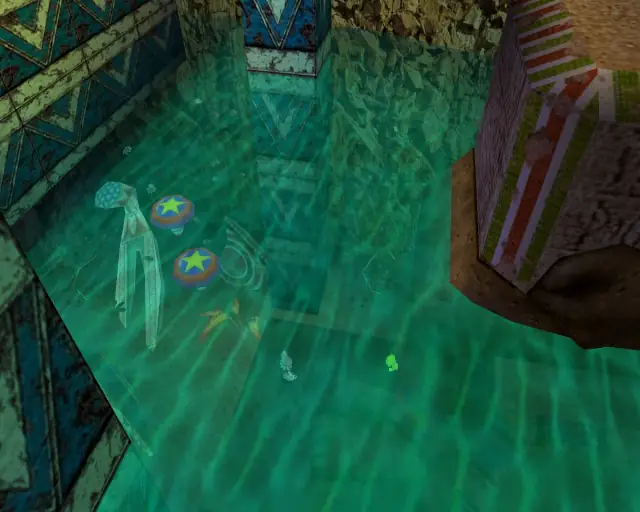

## chaobox 3
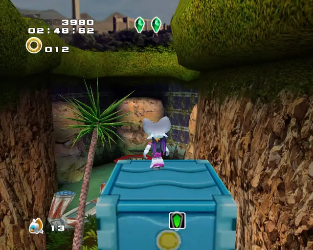

## animal 10
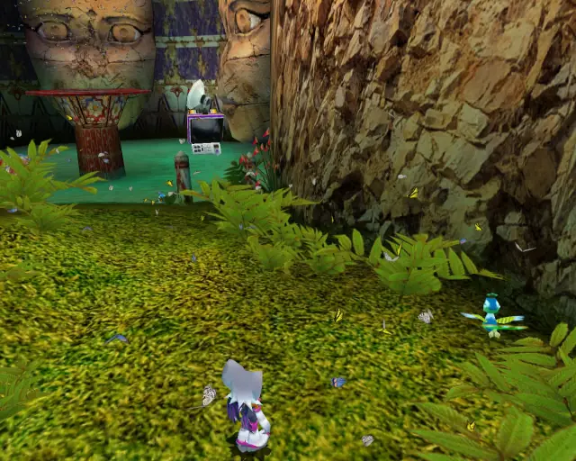

## animal 11

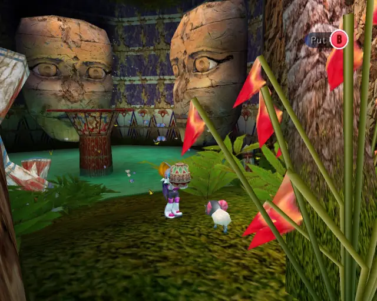

## omochao 12
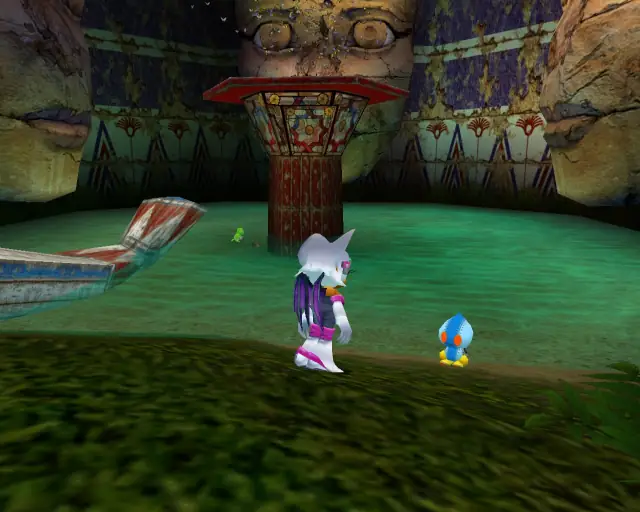

## animal 12

