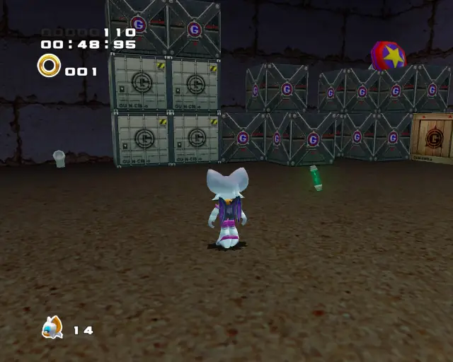
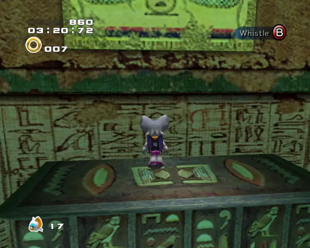
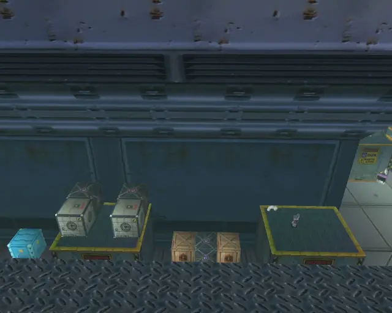
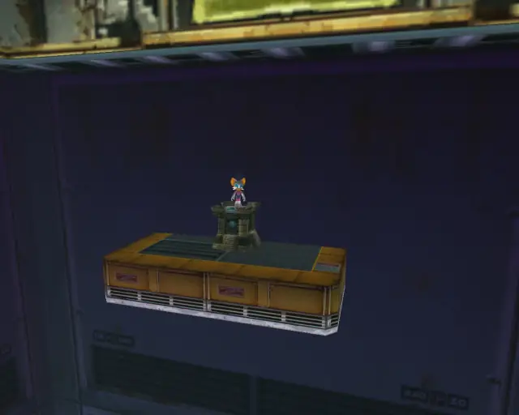

# Rouge Stages

## Table of Contents:
1. [ Dry Lagoon ](#dry-lagoon)
1. [ Egg Quarters ](#egg-quarters)
1. [ Security Hall ](#security-hall)
1. [ Mad Space ](#mad-space)

# Dry Lagoon

## Dry Lagoon Gold Beetle
  

[Back to Top](#)

## Dry Lagoon Chao Box 1
  

[Back to Top](#)

## Dry Lagoon Chao Box 2
  

[Back to Top](#)

## Dry Lagoon Chao Box 3

[Back to Top](#)

## Dry Lagoon Pipe 1

[Back to Top](#)

## Dry Lagoon Hidden 1

[Back to Top](#)

# Egg Quarters

## Egg Quarters Gold Beetle
  

[Back to Top](#)

## Egg Quarters Chao Box 1
  

[Back to Top](#)

## Egg Quarters Chao Box 2
  
  

[Back to Top](#)

## Egg Quarters Chao Box 3
  

[Back to Top](#)

## Egg Quarters Pipe 1

[Back to Top](#)

## Egg Quarters Pipe 2

[Back to Top](#)

## Egg Quarters Hidden 1

[Back to Top](#)

## Egg Quarters Hidden 2

[Back to Top](#)

# Security Hall

## Security Hall Gold Beetle

[Back to Top](#)

## Security Hall Chao Box 1
  

[Back to Top](#)

## Security Hall Chao Box 2
  

[Back to Top](#)

## Security Hall Chao Box 3
  
  

[Back to Top](#)

## Security Hall Pipe 1

[Back to Top](#)

## Security Hall Hidden 1

[Back to Top](#)

# Mad Space

## Mad Space Gold Beetle

[Back to Top](#)

## Mad Space Chao Box 1

[Back to Top](#)

## Mad Space Chao Box 2
  

[Back to Top](#)

## Mad Space Chao Box 3

[Back to Top](#)

## Mad Space Pipe 1

[Back to Top](#)

## Mad Space Pipe 2

[Back to Top](#)

## Mad Space Pipe 3

[Back to Top](#)

## Mad Space Pipe 4

[Back to Top](#)
