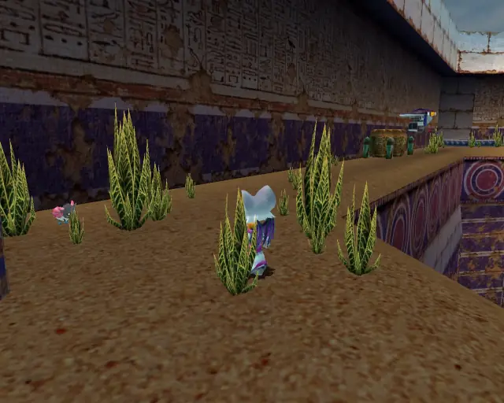
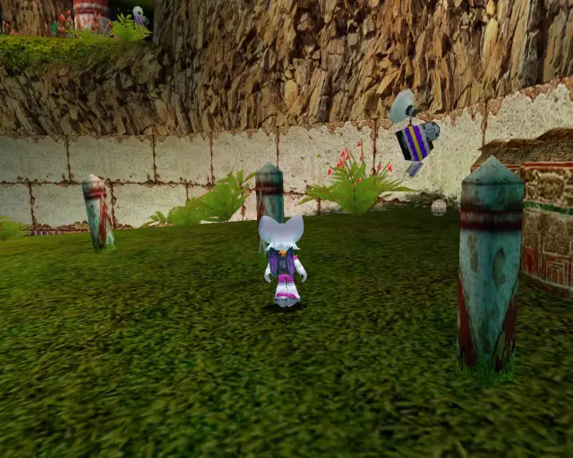
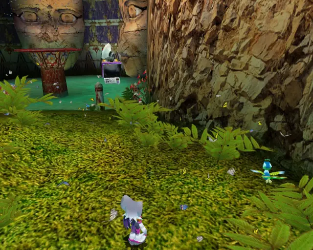
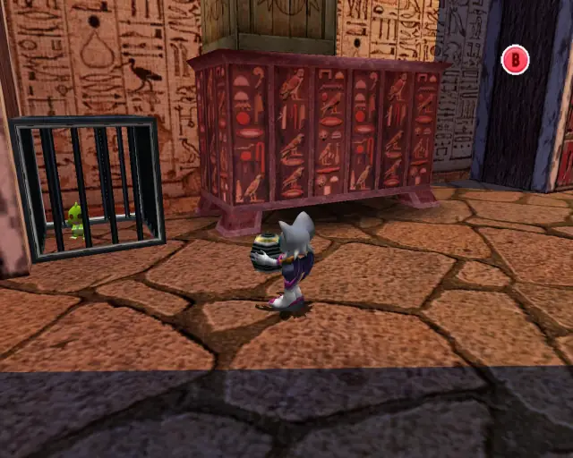
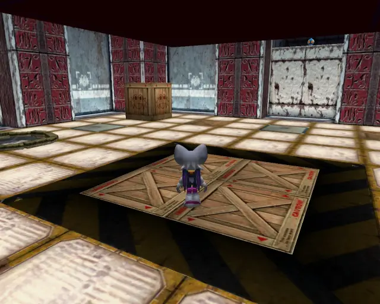
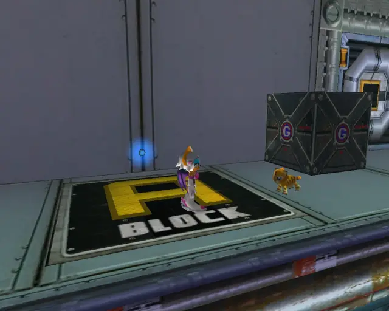

# Rouge Stages (Animalsanity)

## Table of Contents:
1. [ Dry Lagoon ](#dry-lagoon)
1. [ Egg Quarters ](#egg-quarters)
1. [ Security Hall ](#security-hall)
1. [ Mad Space ](#mad-space)

# Dry Lagoon

## Dry Lagoon Animal 1

[Back to Top](#)

## Dry Lagoon Animal 2

[Back to Top](#)

## Dry Lagoon Animal 3

[Back to Top](#)

## Dry Lagoon Animal 4

[Back to Top](#)

## Dry Lagoon Animal 5

[Back to Top](#)

## Dry Lagoon Animal 6

[Back to Top](#)

## Dry Lagoon Animal 7

[Back to Top](#)

## Dry Lagoon Animal 8

[Back to Top](#)

## Dry Lagoon Animal 9

[Back to Top](#)

## Dry Lagoon Animal 10

[Back to Top](#)

# Egg Quarters

## Egg Quarters Animal 1

[Back to Top](#)

## Egg Quarters Animal 2

[Back to Top](#)

## Egg Quarters Animal 3

[Back to Top](#)

## Egg Quarters Animal 4

[Back to Top](#)

## Egg Quarters Animal 5

[Back to Top](#)

## Egg Quarters Animal 6

[Back to Top](#)

## Egg Quarters Animal 7

[Back to Top](#)

## Egg Quarters Animal 8

[Back to Top](#)

## Egg Quarters Animal 9

[Back to Top](#)

## Egg Quarters Animal 10

[Back to Top](#)

# Security Hall

## Security Hall Animal 1

[Back to Top](#)

## Security Hall Animal 2

[Back to Top](#)

## Security Hall Animal 3

[Back to Top](#)

## Security Hall Animal 4

[Back to Top](#)

## Security Hall Animal 5

[Back to Top](#)

## Security Hall Animal 6

[Back to Top](#)

## Security Hall Animal 7

[Back to Top](#)

## Security Hall Animal 8

[Back to Top](#)

# Mad Space

## Mad Space Animal 1

[Back to Top](#)

## Mad Space Animal 2

[Back to Top](#)

## Mad Space Animal 3

[Back to Top](#)

## Mad Space Animal 4

[Back to Top](#)

## Mad Space Animal 5

[Back to Top](#)

## Mad Space Animal 6

[Back to Top](#)

## Mad Space Animal 7

[Back to Top](#)

## Mad Space Animal 8

[Back to Top](#)

## Mad Space Animal 9

[Back to Top](#)

## Mad Space Animal 10

[Back to Top](#)
