# Rouge Stages (Chronological)

## Table of Contents:
1. [ Dry Lagoon ](#dry-lagoon)
1. [ Egg Quarters ](#egg-quarters)
1. [ Security Hall ](#security-hall)
1. [ Mad Space ](#mad-space)

# Dry Lagoon

## Dry Lagoon Omochao 1

[Back to Top](#)

## Dry Lagoon Animal 1

[Back to Top](#)

## Dry Lagoon Omochao 2

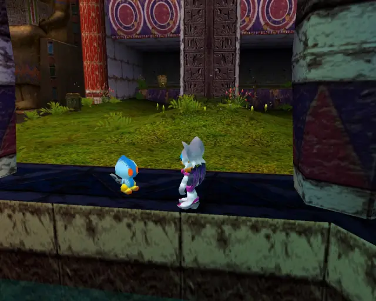

[Back to Top](#)

## Dry Lagoon Animal 2

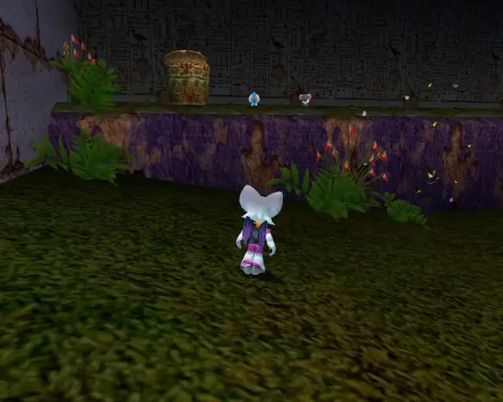

[Back to Top](#)

## Dry Lagoon Omochao 3

[Back to Top](#)

## Dry Lagoon Chao Box 1
  

[Back to Top](#)

## Dry Lagoon Omochao 4

[Back to Top](#)

## Dry Lagoon Omochao 5

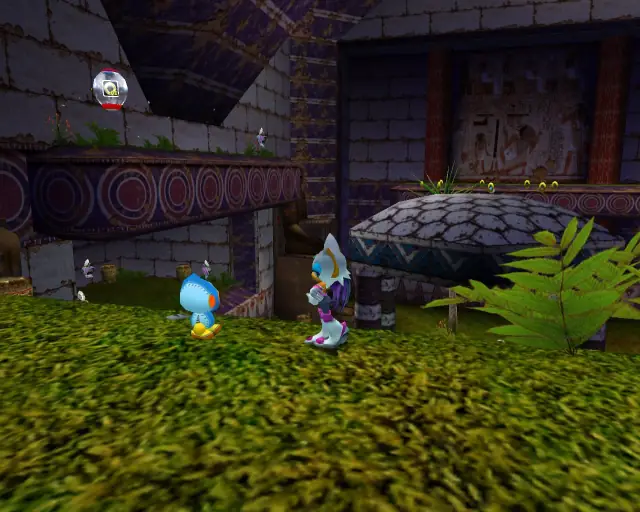

[Back to Top](#)

## Dry Lagoon Omochao 6

[Back to Top](#)

## Dry Lagoon Chao Box 2
  

[Back to Top](#)

## Dry Lagoon Animal 3

[Back to Top](#)

## Dry Lagoon Gold Beetle
  

[Back to Top](#)

## Dry Lagoon Animal 4

[Back to Top](#)

## Dry Lagoon Omochao 7

[Back to Top](#)

## Dry Lagoon Animal 5

[Back to Top](#)

## Dry Lagoon Omochao 8

[Back to Top](#)

## Dry Lagoon Omochao 9

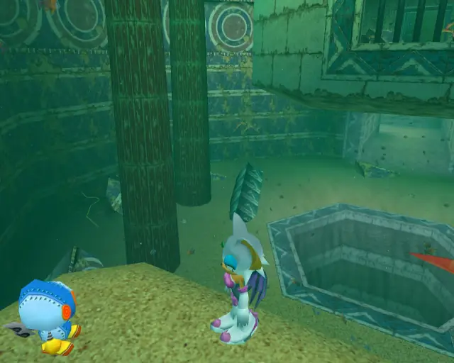

[Back to Top](#)

## Dry Lagoon Omochao 10

[Back to Top](#)

## Dry Lagoon Animal 6

[Back to Top](#)

## Dry Lagoon Animal 7

[Back to Top](#)

## Dry Lagoon Omochao 11

[Back to Top](#)

## Dry Lagoon Animal 8

[Back to Top](#)

## Dry Lagoon Chao Box 3
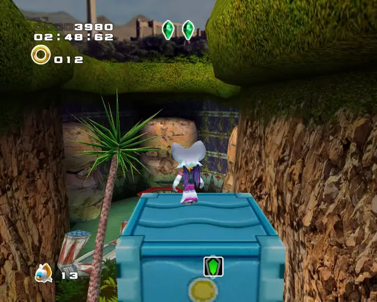

[Back to Top](#)

## Dry Lagoon Animal 9

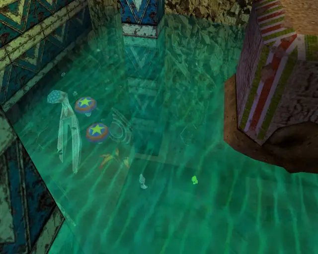

[Back to Top](#)

## Dry Lagoon Animal 10

[Back to Top](#)

## Dry Lagoon Omochao 12

[Back to Top](#)

## Dry Lagoon Animal 11

[Back to Top](#)

# Egg Quarters

## Egg Quarters Omochao 1

[Back to Top](#)

## Egg Quarters Omochao 2

[Back to Top](#)

## Egg Quarters Animal 1

[Back to Top](#)

## Egg Quarters Animal 2

[Back to Top](#)

## Egg Quarters Hidden 1 & Animal 3
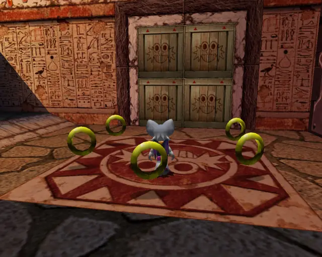
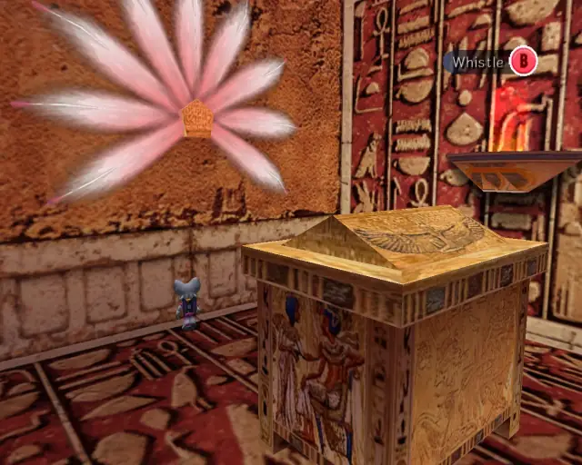

[Back to Top](#)

## Egg Quarters Pipe 1 & Animal 4

[Back to Top](#)

## Egg Quarters Animal 5

[Back to Top](#)

## Egg Quarters Animal 6
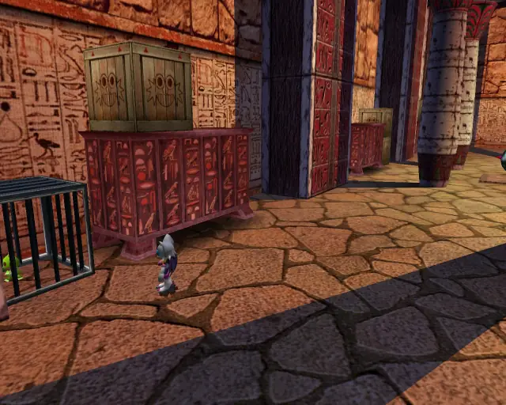

[Back to Top](#)

## Egg Quarters Chao Box 3
  

[Back to Top](#)

## Egg Quarters Omochao 3

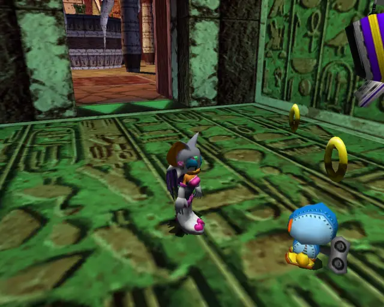

[Back to Top](#)

## Egg Quarters Chao Box 1
  

[Back to Top](#)

## Egg Quarters Hidden 2 & Animal 7

[Back to Top](#)

## Egg Quarters Gold Beetle
  

[Back to Top](#)

## Egg Quarters Omochao 4

[Back to Top](#)

## Egg Quarters Omochao 5

[Back to Top](#)

## Egg Quarters Pipe 2 & Animal 8

[Back to Top](#)

## Egg Quarters Animal 9

[Back to Top](#)

## Egg Quarters Animal 10

[Back to Top](#)

## Egg Quarters Chao Box 2
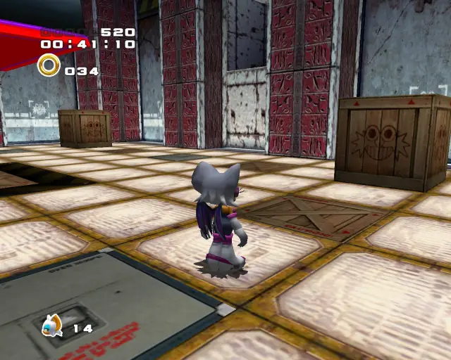  
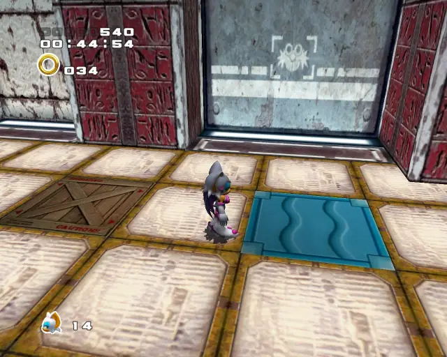  

[Back to Top](#)

## Egg Quarters Omochao 6

[Back to Top](#)

## Egg Quarters Omochao 7

[Back to Top](#)

# Security Hall

## Security Hall Omochao 1

[Back to Top](#)

## Security Hall Omochao 2

[Back to Top](#)

## Security Hall Pipe 1 & Animal 1

[Back to Top](#)

## Security Hall Chao Box 1
  

[Back to Top](#)

## Security Hall Omochao 3

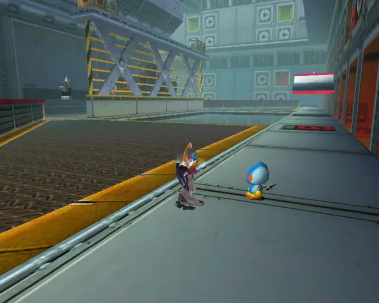

[Back to Top](#)

## Security Hall Animal 2
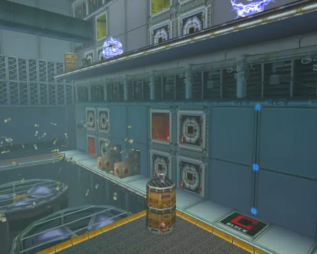

[Back to Top](#)

## Security Hall Omochao 4

[Back to Top](#)

## Security Hall Animal 3

[Back to Top](#)

## Security Hall Omochao 5

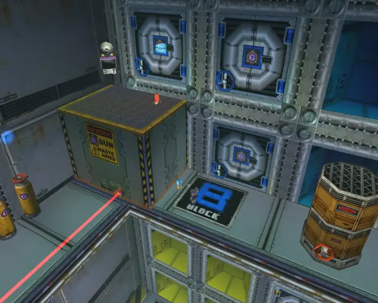

[Back to Top](#)

## Security Hall Animal 4

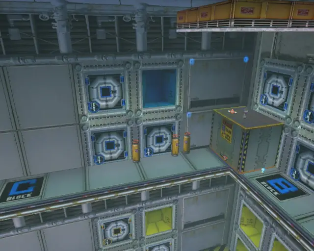

[Back to Top](#)

## Security Hall Chao Box 3
  
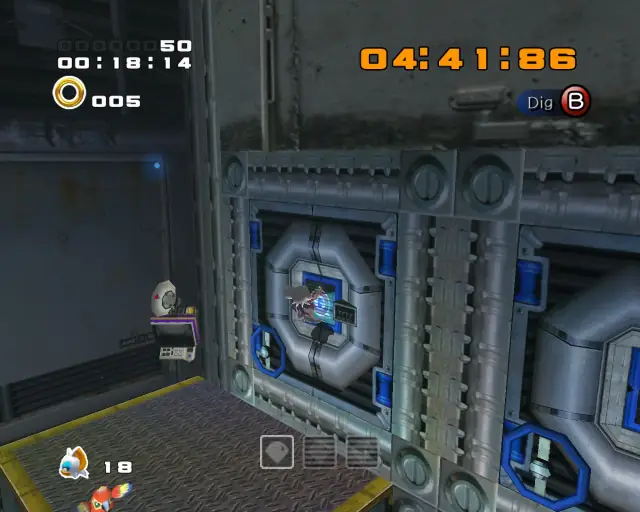  

[Back to Top](#)

## Security Hall Omochao 6

[Back to Top](#)

## Security Hall Omochao 7

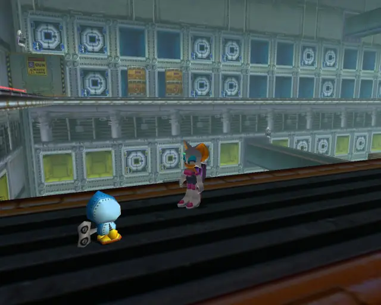

[Back to Top](#)

## Security Hall Omochao 8

[Back to Top](#)

## Security Hall Omochao 9

[Back to Top](#)

## Security Hall Animal 5

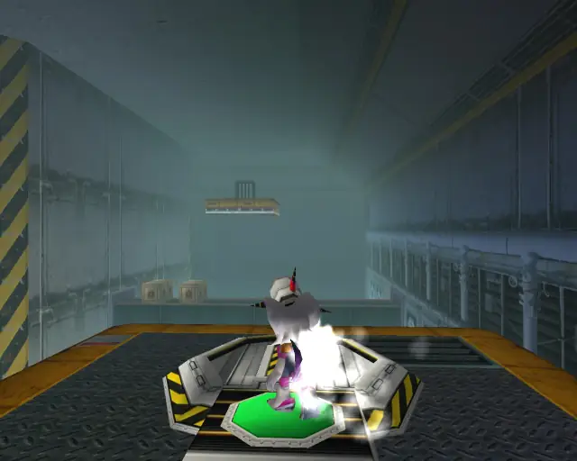

[Back to Top](#)

## Security Hall Animal 6
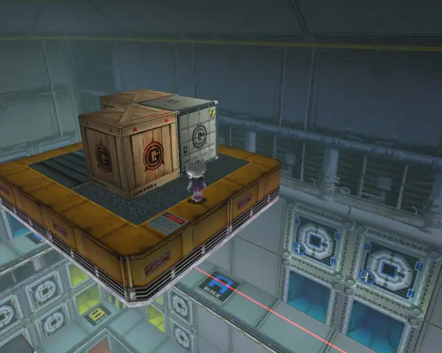

[Back to Top](#)

## Security Hall Gold Beetle

[Back to Top](#)

## Security Hall Omochao 10

[Back to Top](#)

## Security Hall Omochao 11

[Back to Top](#)

## Security Hall Chao Box 2
  

[Back to Top](#)

## Security Hall Animal 7

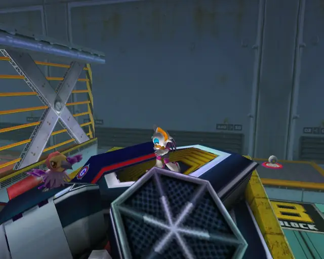

[Back to Top](#)

## Security Hall Omochao 12

[Back to Top](#)

## Security Hall Hidden 1 & Animal 8

[Back to Top](#)

# Mad Space

## Mad Space Animal 1

[Back to Top](#)

## Mad Space Omochao 1

[Back to Top](#)

## Mad Space Omochao 2

[Back to Top](#)

## Mad Space Pipe 1 & Animal 2

[Back to Top](#)

## Mad Space Chao Box 1

[Back to Top](#)

## Mad Space Pipe 2 & Animal 3

[Back to Top](#)

## Mad Space Omochao 3

[Back to Top](#)

## Mad Space Animal 4

[Back to Top](#)

## Mad Space Omochao 4

[Back to Top](#)

## Mad Space Animal 5

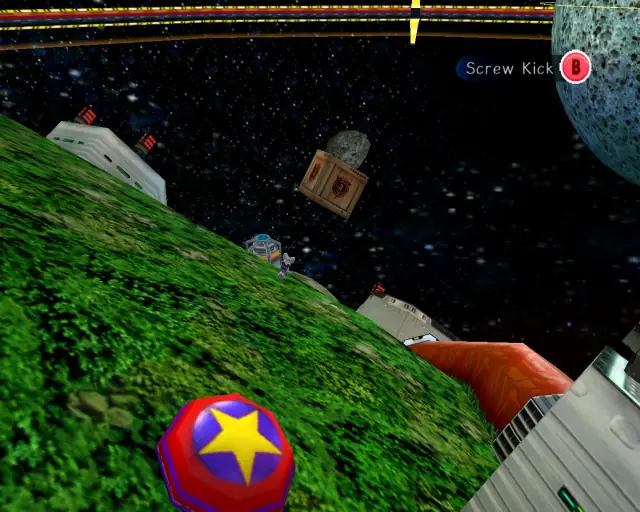

[Back to Top](#)

## Mad Space Animal 6

[Back to Top](#)

## Mad Space Chao Box 2
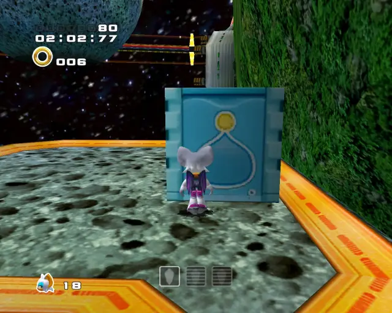  

[Back to Top](#)

## Mad Space Animal 7

[Back to Top](#)

## Mad Space Omochao 5

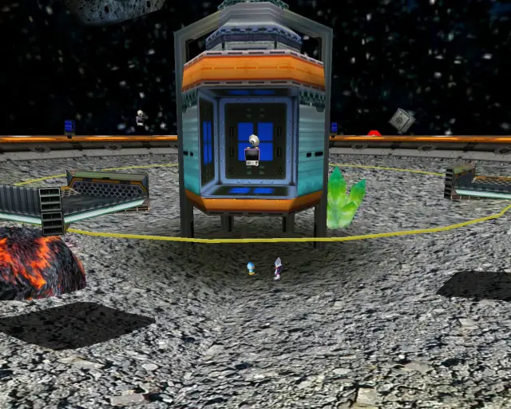

[Back to Top](#)

## Mad Space Gold Beetle

[Back to Top](#)

## Mad Space Pipe 3 & Animal 8

[Back to Top](#)

## Mad Space Chao Box 3

[Back to Top](#)

## Mad Space Pipe 4 & Animal 9

[Back to Top](#)

## Mad Space Animal 10

[Back to Top](#)
