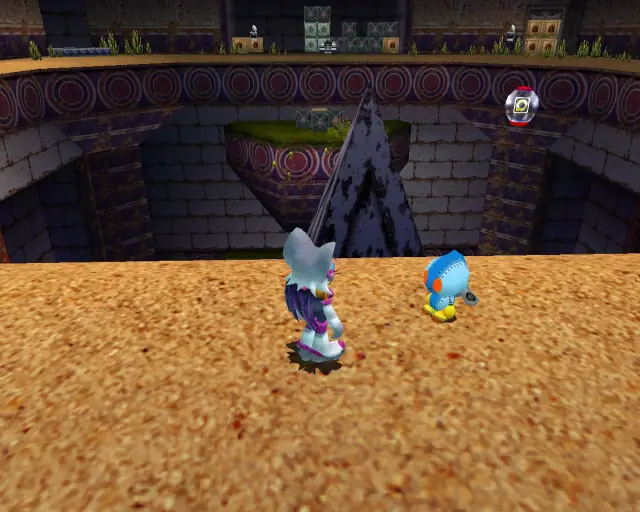
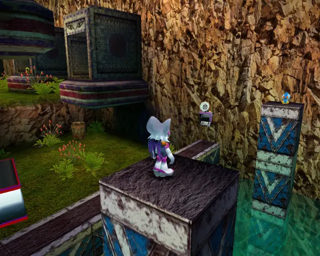
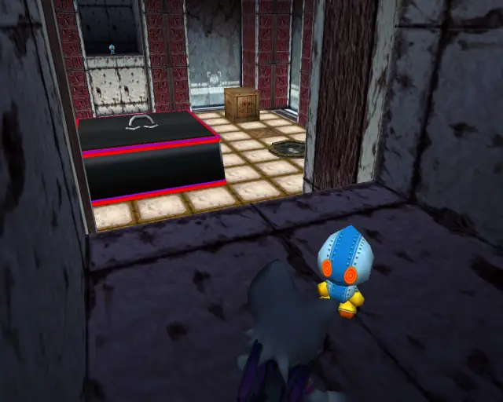
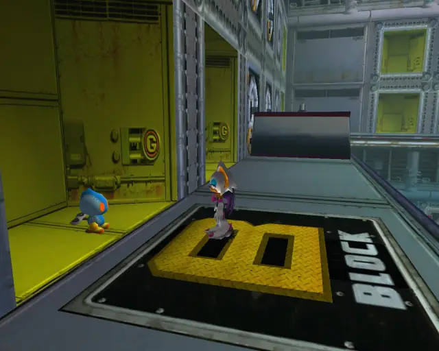
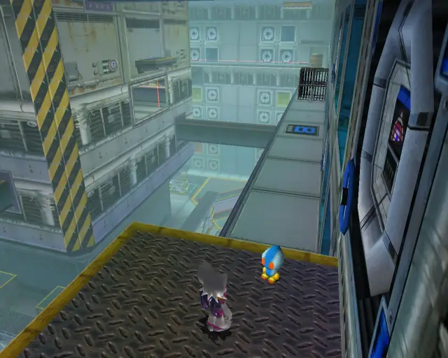
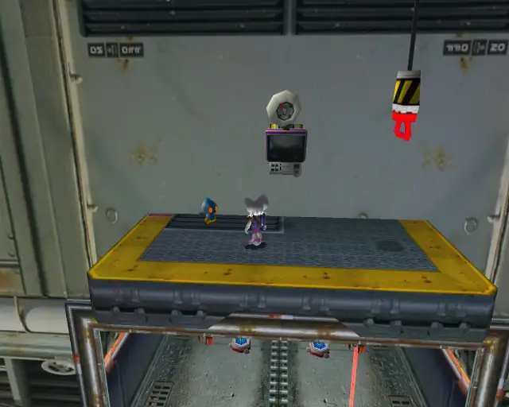
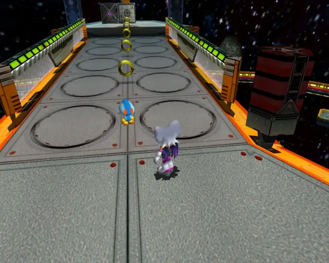

# Rouge Stages (Omosanity)

## Table of Contents:
1. [ Dry Lagoon ](#dry-lagoon)
1. [ Egg Quarters ](#egg-quarters)
1. [ Security Hall ](#security-hall)
1. [ Mad Space ](#mad-space)

# Dry Lagoon

## Dry Lagoon Omochao 1

[Back to Top](#)

## Dry Lagoon Omochao 2

[Back to Top](#)

## Dry Lagoon Omochao 3

[Back to Top](#)

## Dry Lagoon Omochao 4

[Back to Top](#)

## Dry Lagoon Omochao 5

[Back to Top](#)

## Dry Lagoon Omochao 6

[Back to Top](#)

## Dry Lagoon Omochao 7

[Back to Top](#)

## Dry Lagoon Omochao 8

[Back to Top](#)

## Dry Lagoon Omochao 9

[Back to Top](#)

## Dry Lagoon Omochao 10

[Back to Top](#)

## Dry Lagoon Omochao 11

[Back to Top](#)

## Dry Lagoon Omochao 12

[Back to Top](#)

# Egg Quarters

## Egg Quarters Omochao 1

[Back to Top](#)

## Egg Quarters Omochao 2

[Back to Top](#)

## Egg Quarters Omochao 3

[Back to Top](#)

## Egg Quarters Omochao 4

[Back to Top](#)

## Egg Quarters Omochao 5

[Back to Top](#)

## Egg Quarters Omochao 6

[Back to Top](#)

## Egg Quarters Omochao 7

[Back to Top](#)

# Security Hall

## Security Hall Omochao 1

[Back to Top](#)

## Security Hall Omochao 2

[Back to Top](#)

## Security Hall Omochao 3

[Back to Top](#)

## Security Hall Omochao 4

[Back to Top](#)

## Security Hall Omochao 5

[Back to Top](#)

## Security Hall Omochao 6

[Back to Top](#)

## Security Hall Omochao 7

[Back to Top](#)

## Security Hall Omochao 8

[Back to Top](#)

## Security Hall Omochao 9

[Back to Top](#)

## Security Hall Omochao 10

[Back to Top](#)

## Security Hall Omochao 11

[Back to Top](#)

## Security Hall Omochao 12

[Back to Top](#)

# Mad Space

## Mad Space Omochao 1

[Back to Top](#)

## Mad Space Omochao 2

[Back to Top](#)

## Mad Space Omochao 3

[Back to Top](#)

## Mad Space Omochao 4

[Back to Top](#)

## Mad Space Omochao 5

[Back to Top](#)
