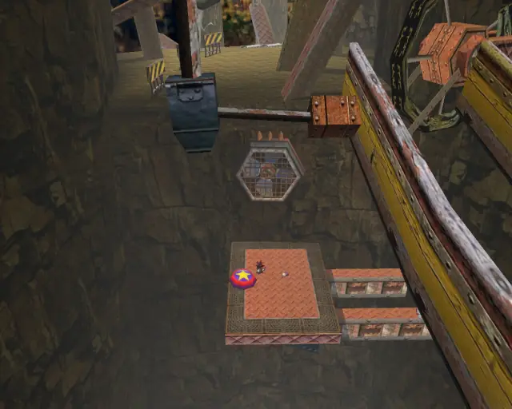
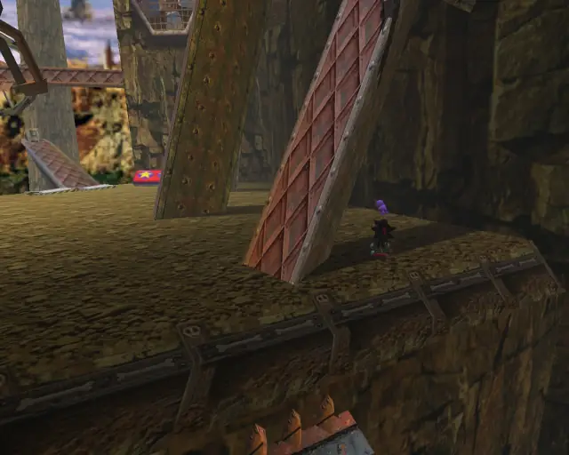
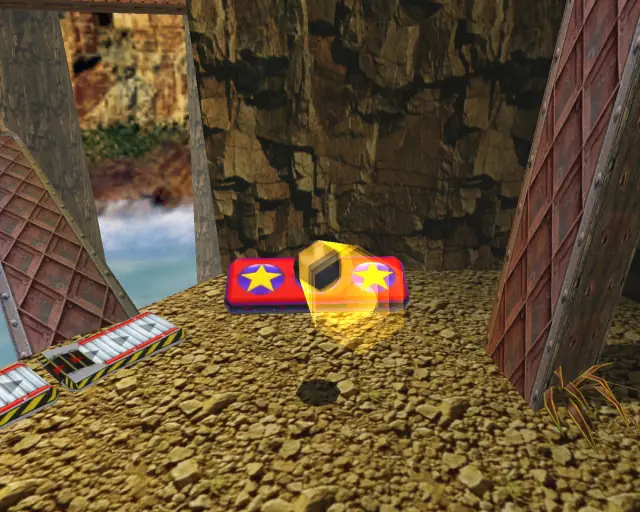
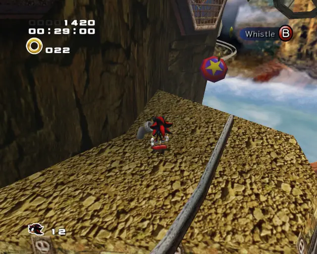
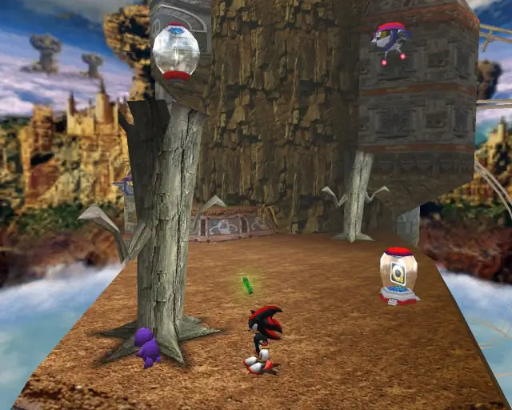
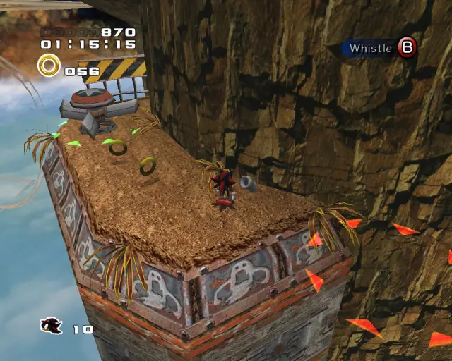
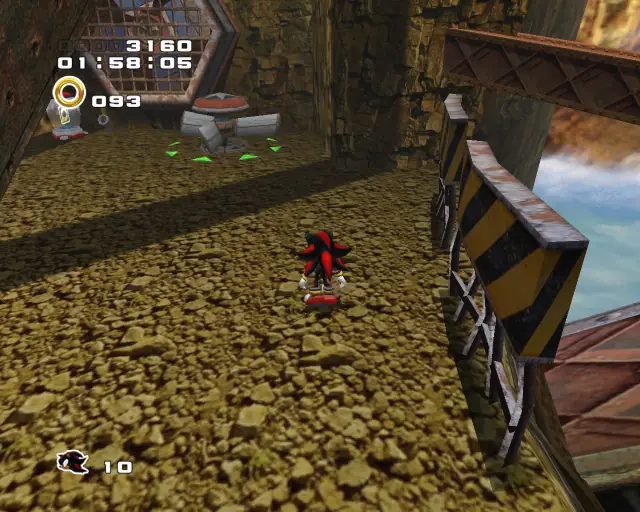
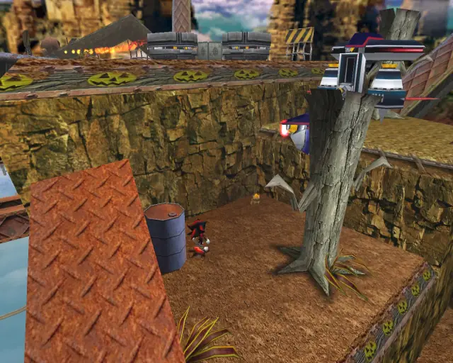

# Sky Rail (Chronological)

## Sky Rail Animal 1

[Back to Top](#)

## Sky Rail Animal 2

[Back to Top](#)

## Sky Rail Animal 3

[Back to Top](#)

## Sky Rail Animal 4

[Back to Top](#)

## Sky Rail Pipe 1 & Animal 5

[Back to Top](#)

## Sky Rail Chao Box 1
  

[Back to Top](#)

## Sky Rail Animal 6

[Back to Top](#)

## Sky Rail Pipe 2 & Animal 7

[Back to Top](#)

## Sky Rail Pipe 3 & Animal 8

[Back to Top](#)

## Sky Rail Chao Box 2
  
  

[Back to Top](#)

## Sky Rail Animal 9

[Back to Top](#)

## Sky Rail Animal 10

[Back to Top](#)

## Sky Rail Animal 11

[Back to Top](#)

## Sky Rail Animal 12

[Back to Top](#)

## Sky Rail Pipe 4 & Animal 13

[Back to Top](#)

## Sky Rail Chao Box 3

[Back to Top](#)

## Sky Rail Animal 14

[Back to Top](#)

## Sky Rail Gold Beetle

[Back to Top](#)

## Sky Rail Pipe 5 & Animal 15

[Back to Top](#)

## Sky Rail Animal 16

[Back to Top](#)

## Sky Rail Pipe 6 & Animal 17

[Back to Top](#)

## Sky Rail Animal 18

[Back to Top](#)

## Sky Rail Animal 19

[Back to Top](#)

## Sky Rail Animal 20

[Back to Top](#)
