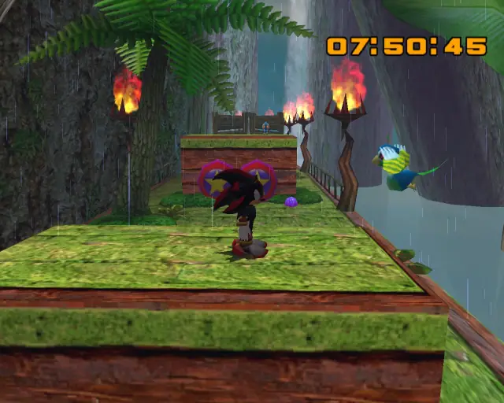
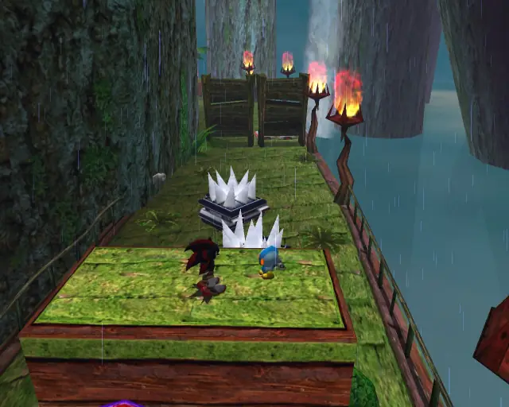
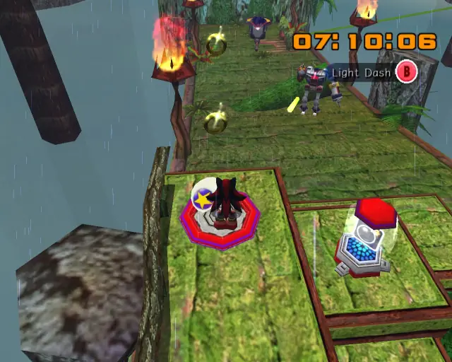
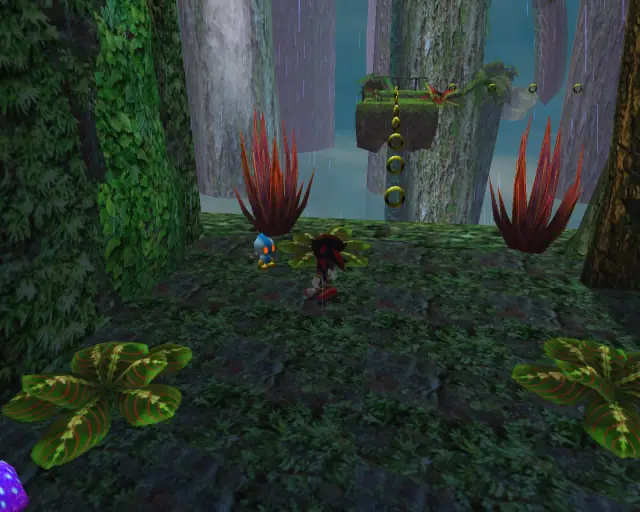
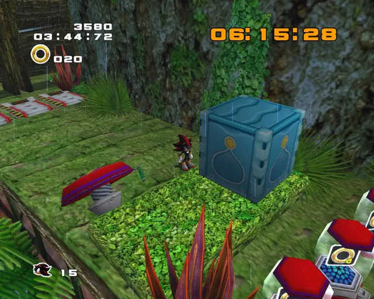
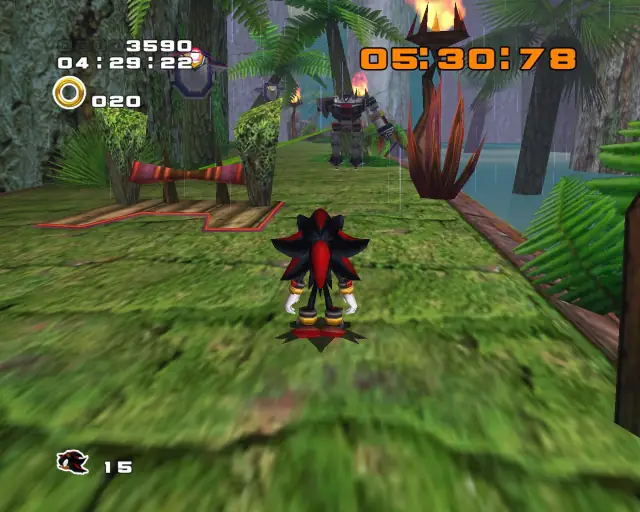

# White Jungle (Chronological)

## White Jungle Hidden 1 & Animal 1

[Back to Top](#)

## White Jungle Animal 2

[Back to Top](#)

## White Jungle Omochao 1

[Back to Top](#)

## White Jungle Animal 3

[Back to Top](#)

## White Jungle Omochao 2

[Back to Top](#)

## White Jungle Pipe 1 & Animal 4

[Back to Top](#)

## White Jungle Animal 5

[Back to Top](#)

## White Jungle Chao Box 1

  

[Back to Top](#)

## White Jungle Animal 6

[Back to Top](#)

## White Jungle Animal 7

[Back to Top](#)

## White Jungle Hidden 2 & Animal 8

[Back to Top](#)

## White Jungle Animal 9

[Back to Top](#)

## White Jungle Pipe 2 & Animal 10

[Back to Top](#)

## White Jungle Animal 11

[Back to Top](#)

## White Jungle Omochao 3

[Back to Top](#)

## White Jungle Omochao 4

[Back to Top](#)

## White Jungle Gold Beetle

[Back to Top](#)

## White Jungle Pipe 3 & Animal 12

[Back to Top](#)

## White Jungle Animal 13

[Back to Top](#)

## White Jungle Animal 14

[Back to Top](#)

## White Jungle Chao Box 2
  

[Back to Top](#)

## White Jungle Pipe 4 & Animal 15

[Back to Top](#)

## White Jungle Hidden 3 & Animal 16

[Back to Top](#)

## White Jungle Chao Box 3
  

[Back to Top](#)

## White Jungle Omochao 5

[Back to Top](#)
