# Shadow Stages (Animalsanity)

## Table of Contents:
1. [ Radical Highway ](#radical-highway)
1. [ White Jungle ](#white-jungle)
1. [ Sky Rail ](#sky-rail)
1. [ Final Chase ](#final-Chase)

# Radical Highway

## Radical Highway Animal 1

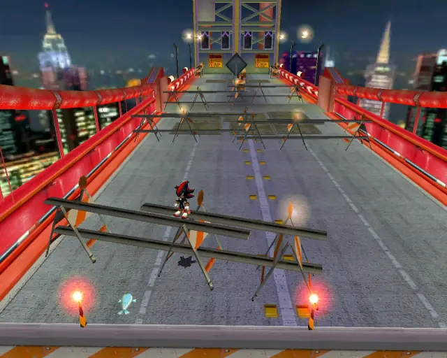

[Back to Top](#)

## Radical Highway Animal 2

[Back to Top](#)

## Radical Highway Animal 3

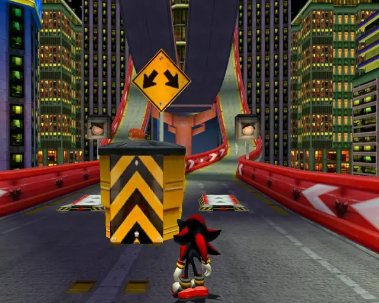

[Back to Top](#)

## Radical Highway Animal 4

[Back to Top](#)

## Radical Highway Animal 5

[Back to Top](#)

## Radical Highway Animal 6

[Back to Top](#)

## Radical Highway Animal 7

[Back to Top](#)

## Radical Highway Animal 8

[Back to Top](#)

## Radical Highway Animal 9

[Back to Top](#)

## Radical Highway Animal 10

[Back to Top](#)

## Radical Highway Animal 11

[Back to Top](#)

## Radical Highway Animal 12

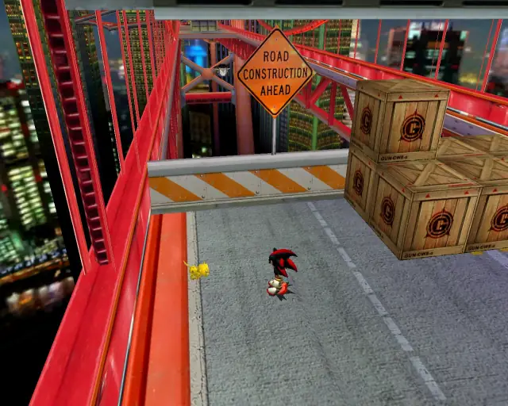

[Back to Top](#)

## Radical Highway Animal 13

[Back to Top](#)

## Radical Highway Animal 14

[Back to Top](#)

## Radical Highway Animal 15

[Back to Top](#)

## Radical Highway Animal 16

[Back to Top](#)

## Radical Highway Animal 17

[Back to Top](#)

## Radical Highway Animal 18

[Back to Top](#)

## Radical Highway Animal 19

[Back to Top](#)

## Radical Highway Animal 20

[Back to Top](#)

# White Jungle

## White Jungle Animal 1

[Back to Top](#)

## White Jungle Animal 2

[Back to Top](#)

## White Jungle Animal 3

[Back to Top](#)

## White Jungle Animal 4

[Back to Top](#)

## White Jungle Animal 5

[Back to Top](#)

## White Jungle Animal 6

[Back to Top](#)

## White Jungle Animal 7

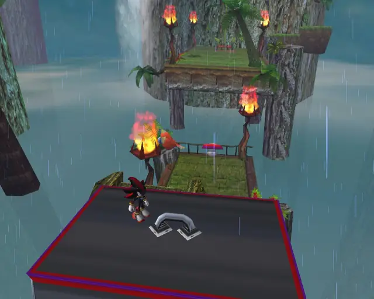

[Back to Top](#)

## White Jungle Animal 8

[Back to Top](#)

## White Jungle Animal 9

[Back to Top](#)

## White Jungle Animal 10

[Back to Top](#)

## White Jungle Animal 11

[Back to Top](#)

## White Jungle Animal 12

[Back to Top](#)

## White Jungle Animal 13

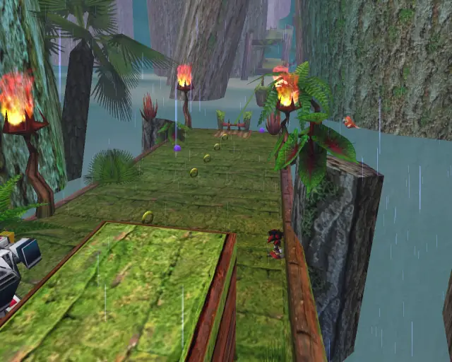

[Back to Top](#)

## White Jungle Animal 14

[Back to Top](#)

## White Jungle Animal 15

[Back to Top](#)

## White Jungle Animal 16

[Back to Top](#)

# Sky Rail

## Sky Rail Animal 1

[Back to Top](#)

## Sky Rail Animal 2

[Back to Top](#)

## Sky Rail Animal 3

[Back to Top](#)

## Sky Rail Animal 4

[Back to Top](#)

## Sky Rail Animal 5

[Back to Top](#)

## Sky Rail Animal 6

[Back to Top](#)

## Sky Rail Animal 7

[Back to Top](#)

## Sky Rail Animal 8

[Back to Top](#)

## Sky Rail Animal 9

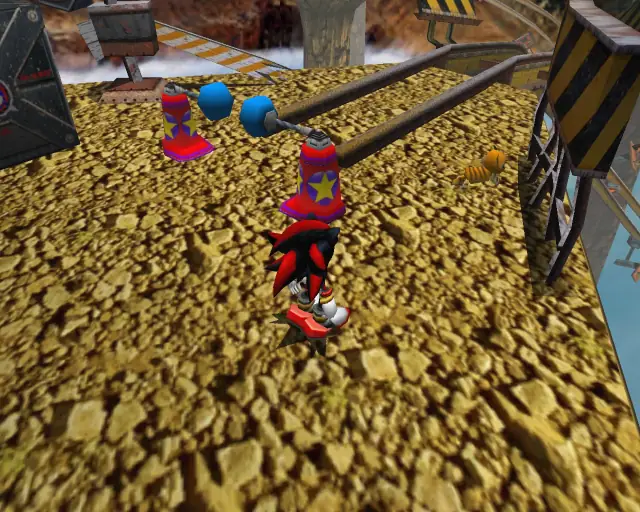

[Back to Top](#)

## Sky Rail Animal 10

[Back to Top](#)

## Sky Rail Animal 11

[Back to Top](#)

## Sky Rail Animal 12

[Back to Top](#)

## Sky Rail Animal 13

[Back to Top](#)

## Sky Rail Animal 14

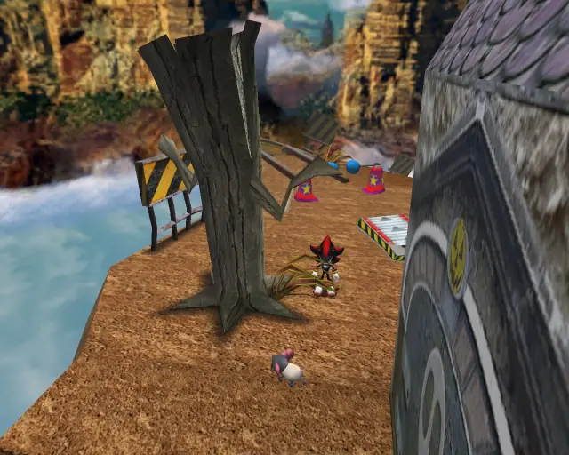

[Back to Top](#)

## Sky Rail Animal 15

[Back to Top](#)

## Sky Rail Animal 16

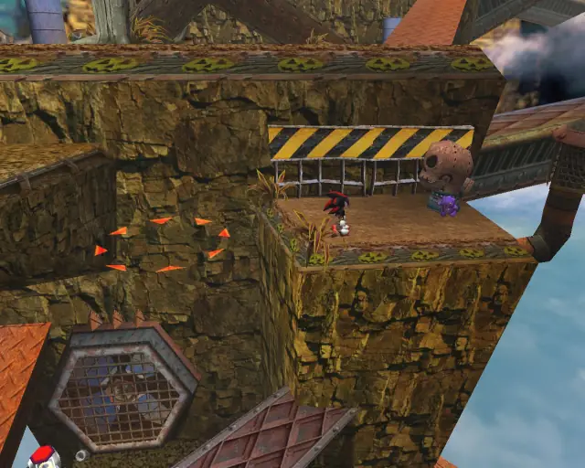

[Back to Top](#)

## Sky Rail Animal 17

[Back to Top](#)

## Sky Rail Animal 18

[Back to Top](#)

## Sky Rail Animal 19

[Back to Top](#)

## Sky Rail Animal 20

[Back to Top](#)

# Final Chase

## Final Chase Animal 1

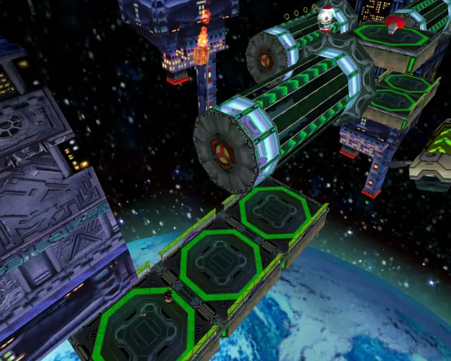

[Back to Top](#)

## Final Chase Animal 2

[Back to Top](#)

## Final Chase Animal 3

[Back to Top](#)

## Final Chase Animal 4

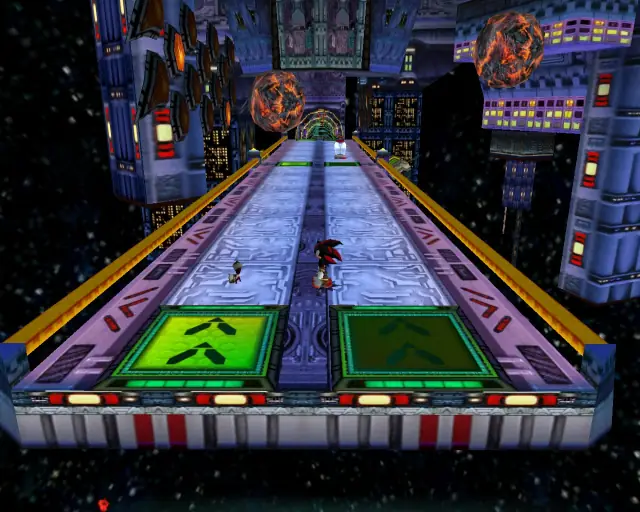

[Back to Top](#)

## Final Chase Animal 5

[Back to Top](#)

## Final Chase Animal 6

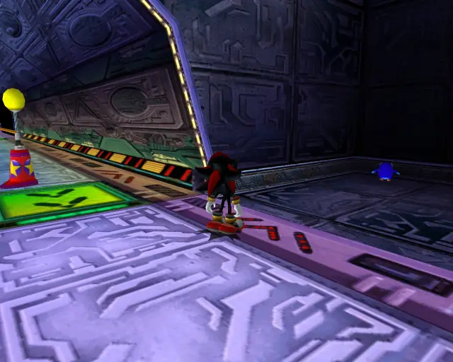

[Back to Top](#)

## Final Chase Animal 7

[Back to Top](#)

## Final Chase Animal 8

[Back to Top](#)

## Final Chase Animal 9

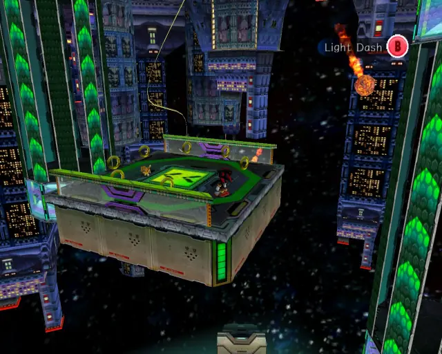

[Back to Top](#)

## Final Chase Animal 10

[Back to Top](#)

## Final Chase Animal 11

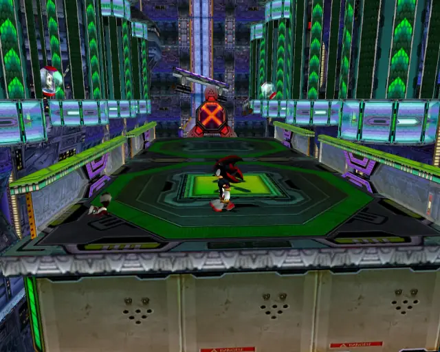

[Back to Top](#)

## Final Chase Animal 12

[Back to Top](#)

## Final Chase Animal 13

[Back to Top](#)

## Final Chase Animal 14

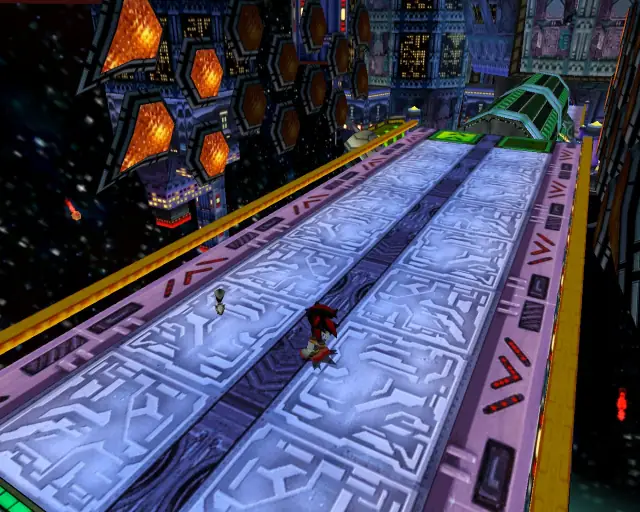

[Back to Top](#)

## Final Chase Animal 15
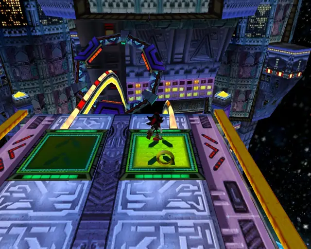

[Back to Top](#)

## Final Chase Animal 16

[Back to Top](#)

## Final Chase Animal 17
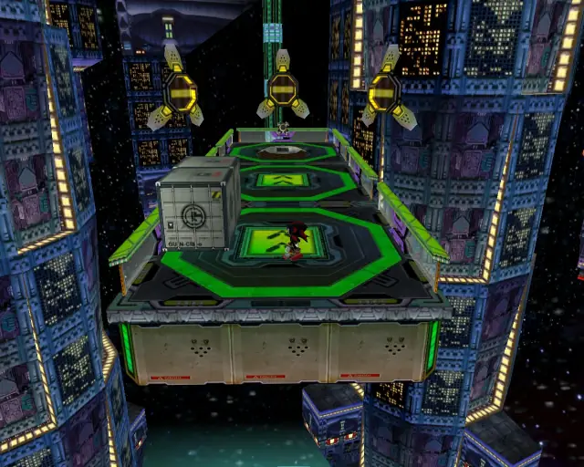

[Back to Top](#)
