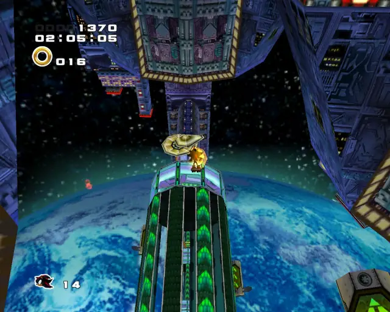
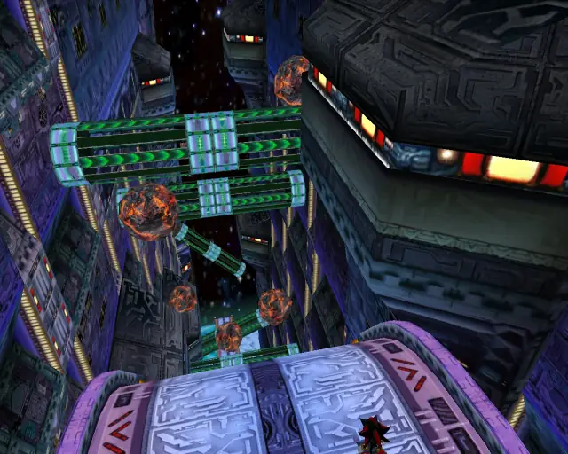

# Shadow Stages (Chronological)

## Table of Contents:
1. [ Radical Highway ](#radical-highway)
1. [ White Jungle ](#white-jungle)
1. [ Sky Rail ](#sky-rail)
1. [ Final Chase ](#final-Chase)

# Radical Highway

## Radical Highway Hidden 1

[Back to Top](#)

## Radical Highway Chao Box 1

[Back to Top](#)

## Radical Highway Omochao 1

[Back to Top](#)

## Radical Highway Omochao 2

[Back to Top](#)

## Radical Highway Omochao 3

[Back to Top](#)

## Radical Highway Omochao 4

[Back to Top](#)

## Radical Highway Chao Box 2
  

[Back to Top](#)

## Radical Highway Pipe 1

[Back to Top](#)

## Radical Highway Omochao 5

[Back to Top](#)

## Radical Highway Gold Beetle
  

[Back to Top](#)

## Radical Highway Pipe 2

[Back to Top](#)

## Radical Highway Omochao 7

[Back to Top](#)

## Radical Highway Omochao 8

[Back to Top](#)

## Radical Highway Omochao 6

[Back to Top](#)

## Radical Highway Chao Box 3
  

[Back to Top](#)

## Radical Highway Hidden 2

[Back to Top](#)

## Radical Highway Pipe 3

[Back to Top](#)

## Radical Highway Hidden 3

[Back to Top](#)

# White Jungle

## White Jungle Hidden 1 & Animal 1

[Back to Top](#)

## White Jungle Animal 2

[Back to Top](#)

## White Jungle Omochao 1

[Back to Top](#)

## White Jungle Animal 3

[Back to Top](#)

## White Jungle Omochao 2

[Back to Top](#)

## White Jungle Pipe 1 & Animal 4

[Back to Top](#)

## White Jungle Animal 5

[Back to Top](#)

## White Jungle Chao Box 1

  

[Back to Top](#)

## White Jungle Animal 6

[Back to Top](#)

## White Jungle Animal 7

[Back to Top](#)

## White Jungle Hidden 2 & Animal 8

[Back to Top](#)

## White Jungle Animal 9

[Back to Top](#)

## White Jungle Pipe 2 & Animal 10

[Back to Top](#)

## White Jungle Animal 11

[Back to Top](#)

## White Jungle Omochao 3

[Back to Top](#)

## White Jungle Omochao 4

[Back to Top](#)

## White Jungle Gold Beetle

[Back to Top](#)

## White Jungle Pipe 3 & Animal 12

[Back to Top](#)

## White Jungle Animal 13

[Back to Top](#)

## White Jungle Animal 14

[Back to Top](#)

## White Jungle Chao Box 2
  

[Back to Top](#)

## White Jungle Pipe 4 & Animal 15

[Back to Top](#)

## White Jungle Hidden 3 & Animal 16

[Back to Top](#)

## White Jungle Chao Box 3
  

[Back to Top](#)

## White Jungle Omochao 5

[Back to Top](#)

# Sky Rail

## Sky Rail Animal 1

[Back to Top](#)

## Sky Rail Animal 2

[Back to Top](#)

## Sky Rail Animal 3

[Back to Top](#)

## Sky Rail Animal 4

[Back to Top](#)

## Sky Rail Pipe 1 & Animal 5

[Back to Top](#)

## Sky Rail Chao Box 1
  

[Back to Top](#)

## Sky Rail Animal 6

[Back to Top](#)

## Sky Rail Pipe 2 & Animal 7

[Back to Top](#)

## Sky Rail Pipe 3 & Animal 8

[Back to Top](#)

## Sky Rail Chao Box 2
  
  

[Back to Top](#)

## Sky Rail Animal 9

[Back to Top](#)

## Sky Rail Animal 10

[Back to Top](#)

## Sky Rail Animal 11

[Back to Top](#)

## Sky Rail Animal 12

[Back to Top](#)

## Sky Rail Pipe 4 & Animal 13

[Back to Top](#)

## Sky Rail Chao Box 3

[Back to Top](#)

## Sky Rail Animal 14

[Back to Top](#)

## Sky Rail Gold Beetle

[Back to Top](#)

## Sky Rail Pipe 5 & Animal 15

[Back to Top](#)

## Sky Rail Animal 16

[Back to Top](#)

## Sky Rail Pipe 6 & Animal 17

[Back to Top](#)

## Sky Rail Animal 18

[Back to Top](#)

## Sky Rail Animal 19

[Back to Top](#)

## Sky Rail Animal 20

[Back to Top](#)

# Final Chase

## Final Chase Omochao 1

[Back to Top](#)

## Final Chase Chao Box 1

  

[Back to Top](#)

## Final Chase Animal 1

[Back to Top](#)

## Final Chase Animal 2

[Back to Top](#)

## Final Chase Pipe 1 & Animal 3

[Back to Top](#)

## Final Chase Gold Beetle
  
  

[Back to Top](#)

## Final Chase Animal 4

[Back to Top](#)

## Final Chase Animal 5

[Back to Top](#)

## Final Chase Animal 6

[Back to Top](#)

## Final Chase Chao Box 2
  
  

[Back to Top](#)

## Final Chase Pipe 2 & Animal 7

[Back to Top](#)

## Final Chase Animal 8

[Back to Top](#)

## Final Chase Animal 9

[Back to Top](#)

## Final Chase Animal 10

[Back to Top](#)

## Final Chase Animal 11

[Back to Top](#)

## Final Chase Animal 12

[Back to Top](#)

## Final Chase Chao Box 3
  
  

[Back to Top](#)

## Final Chase Pipe 3 & Animal 13

[Back to Top](#)

## Final Chase Animal 14

[Back to Top](#)

## Final Chase Animal 15

[Back to Top](#)

## Final Chase Animal 16

[Back to Top](#)

## Final Chase Animal 17

[Back to Top](#)
