
## animal 1

## animal 2
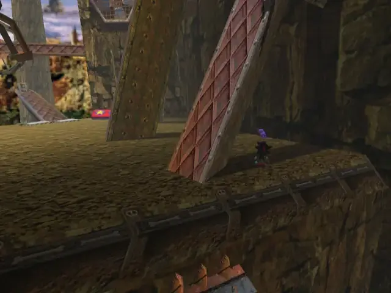

## animal 3
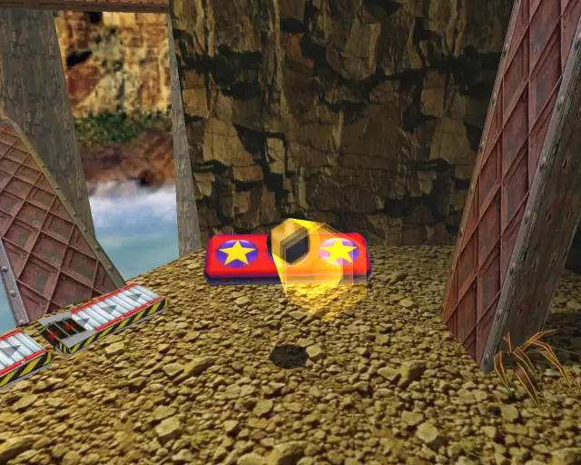
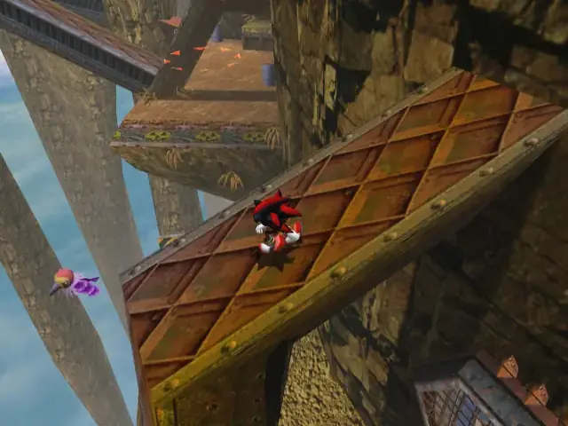

## animal 4
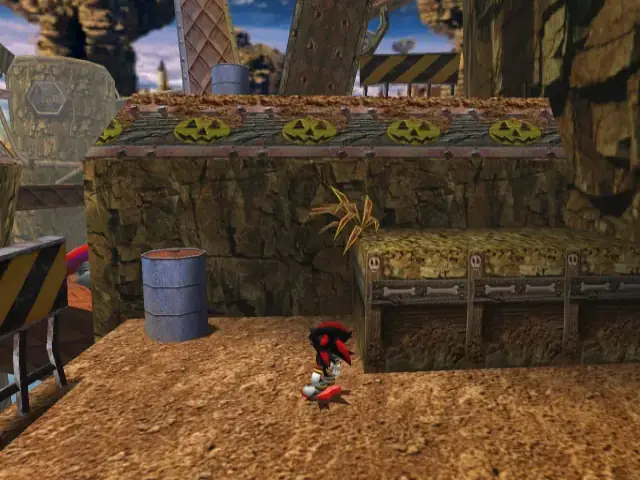
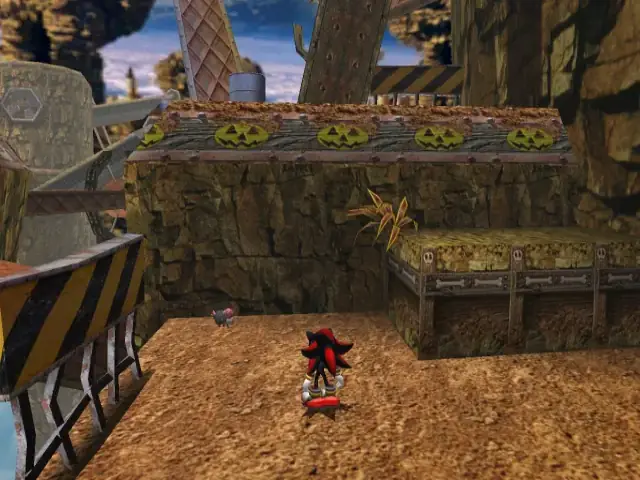

## pipe 1

## animal 5
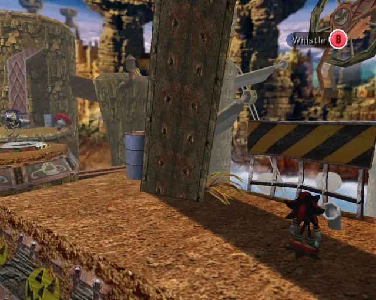

## chaobox 1
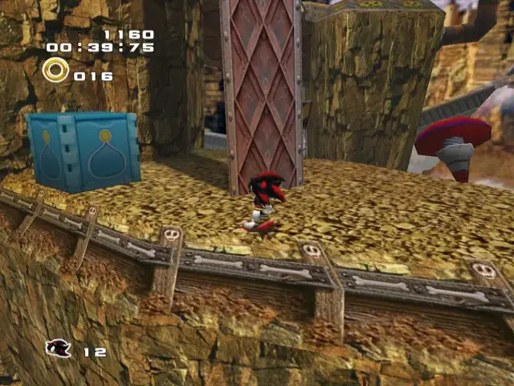

## animal 6
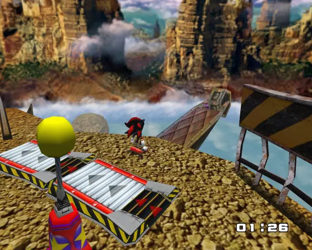

## pipe 2
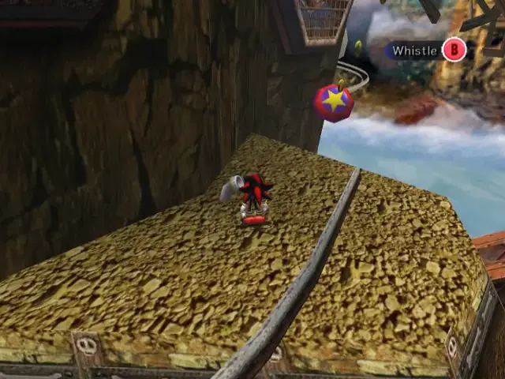

## animal 7

## pipe 3
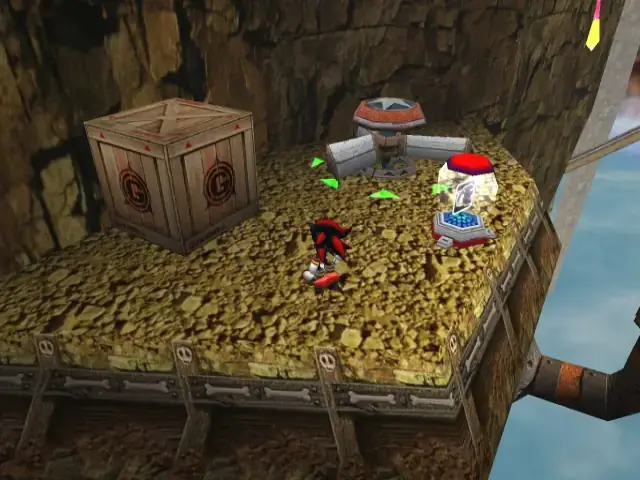
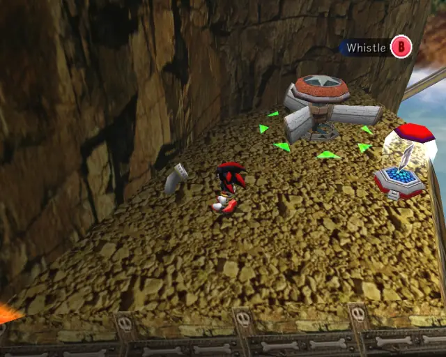

## animal 8
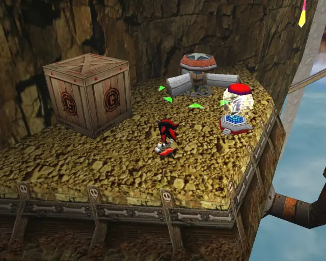
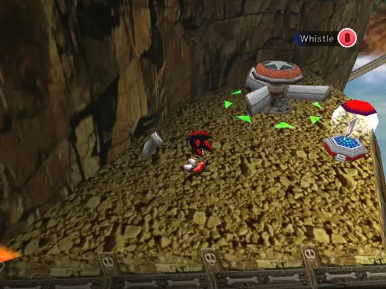

## chaobox 2
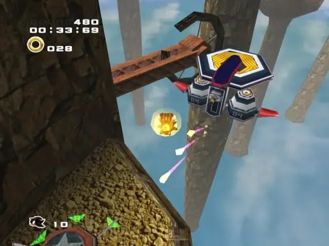
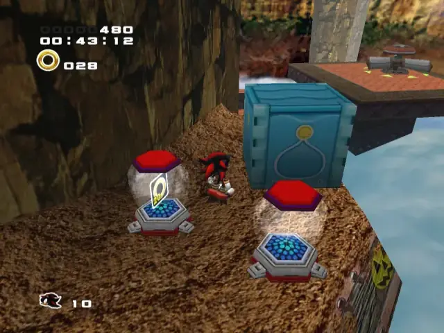

## animal 9
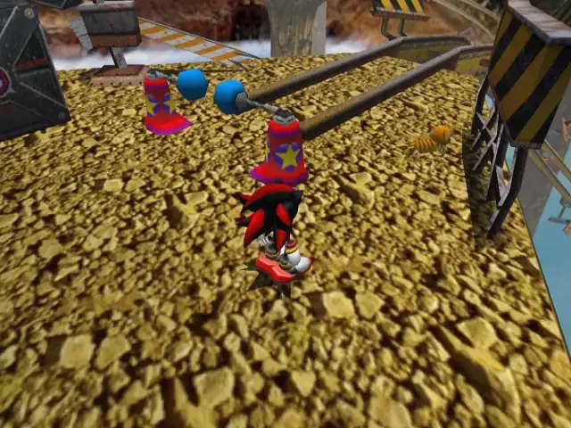

## animal 10
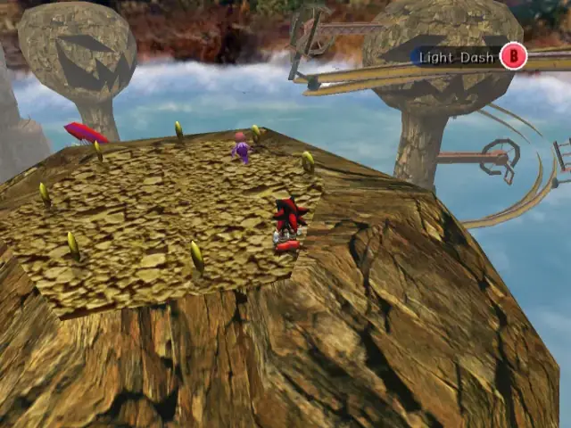

## animal 11
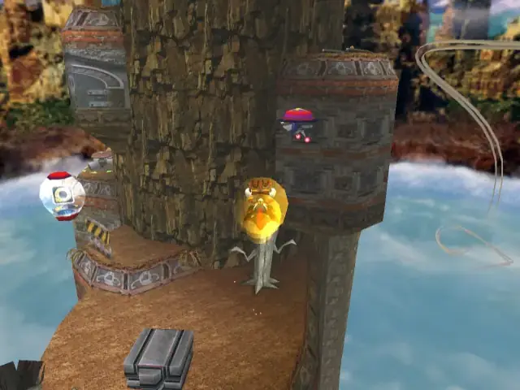
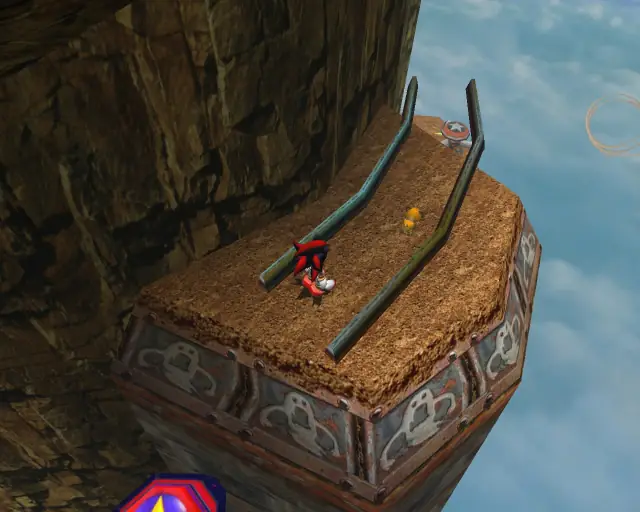

## animal 12
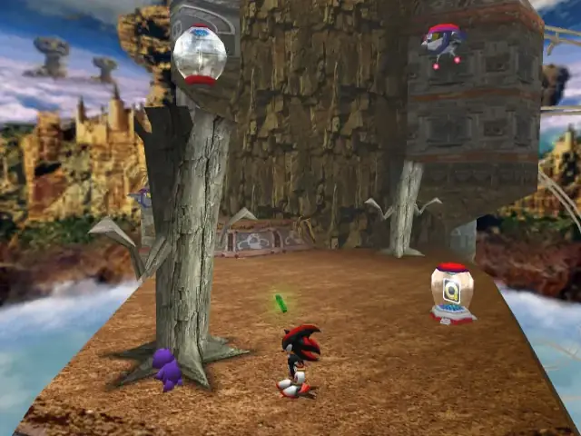

## pipe 4

## animal 13
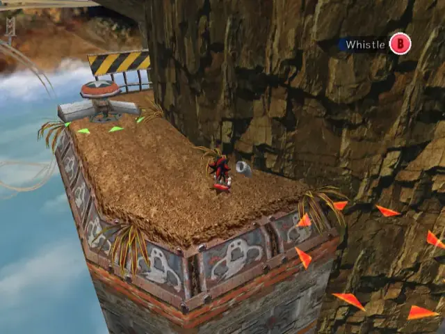

## chaobox 3
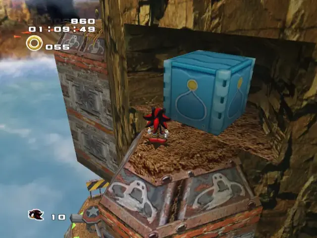

## animal 14
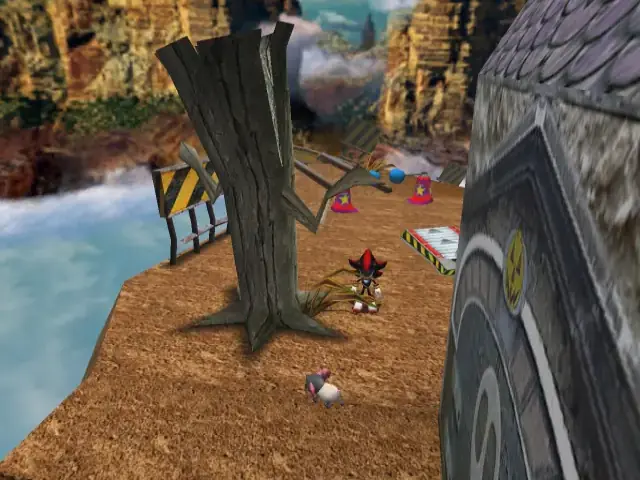

## goldbeetle 1
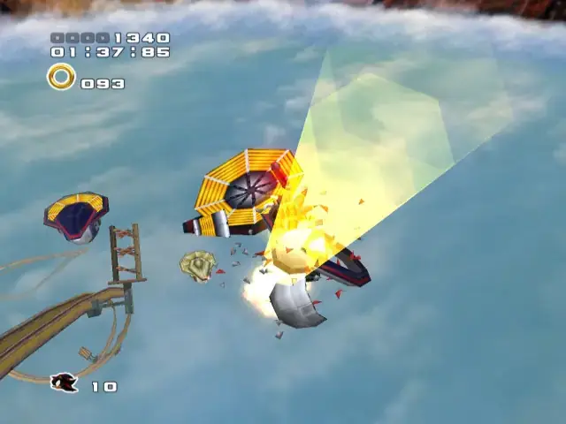

## pipe 5

## animal 15
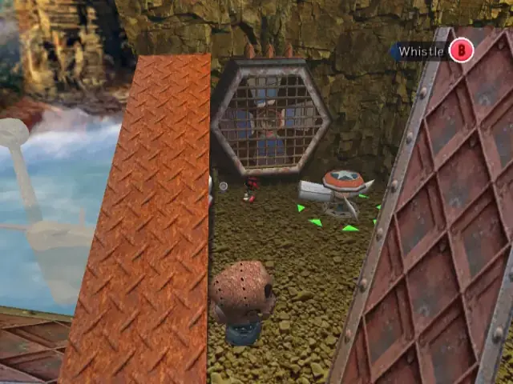

## animal 16
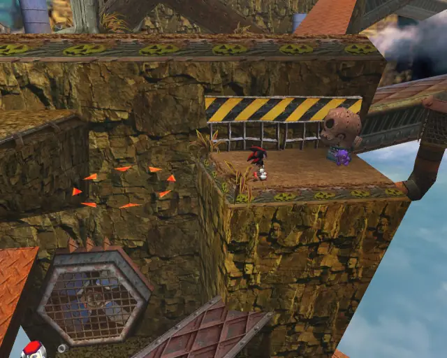

## pipe 6

## animal 17
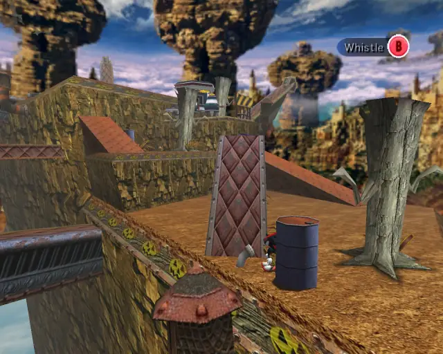

## animal 18
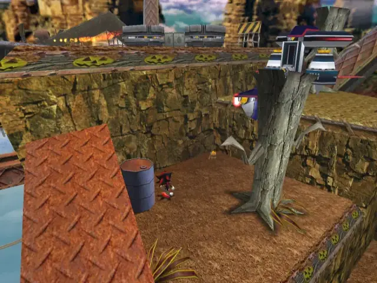

## animal 19
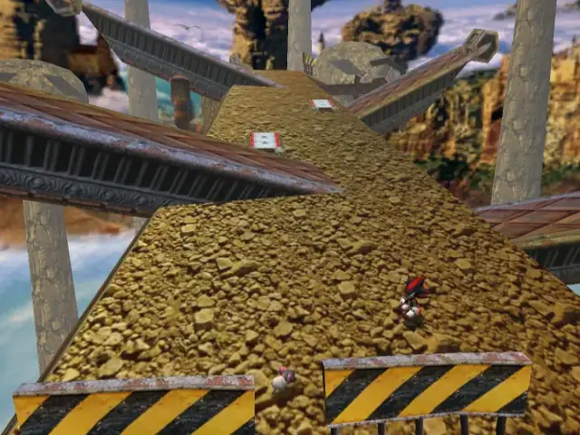

## animal 20
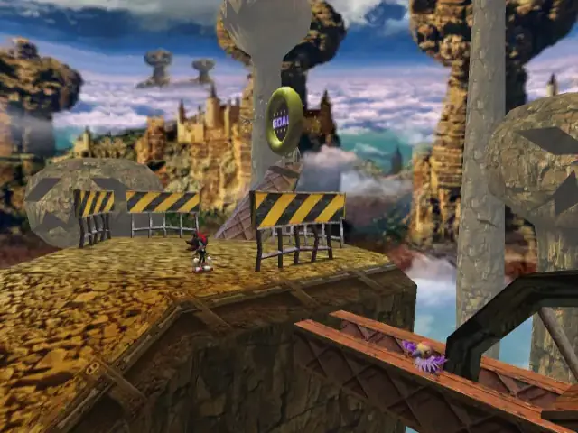

