
## big 1

## animal 1

## life 1
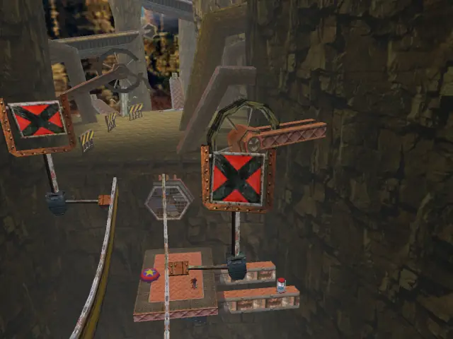
## animal 2

## animal 3

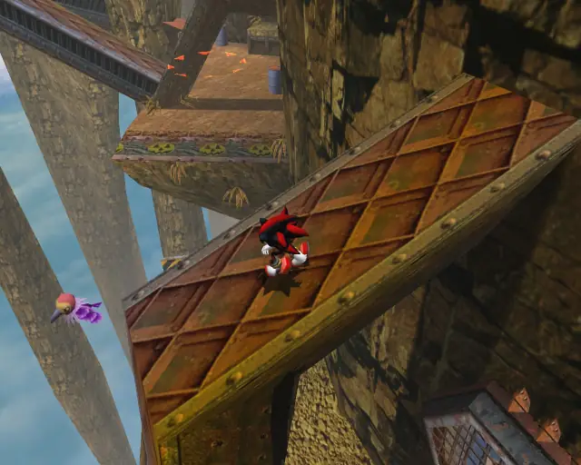
## item 1

## animal 4

## pipe 1

## animal 5

## chaobox 1

## item 2
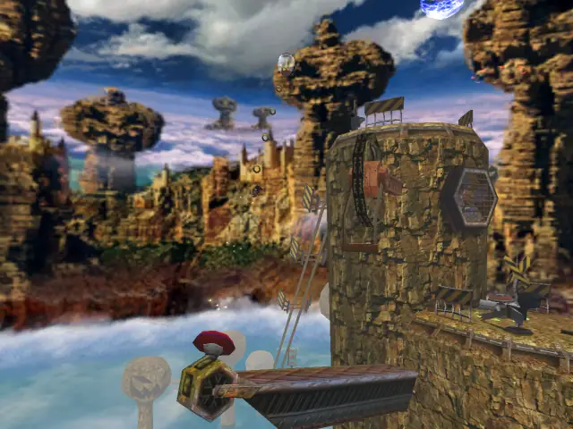
## animal 6

## item 3
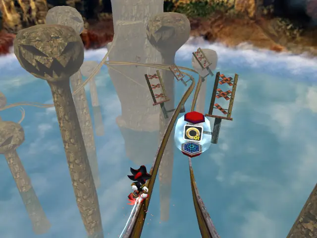

## item 4
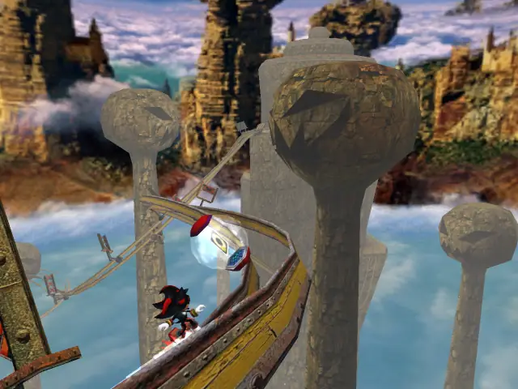
## life 2

## pipe 2

## animal 7

## pipe 3

## animal 8

## life 3
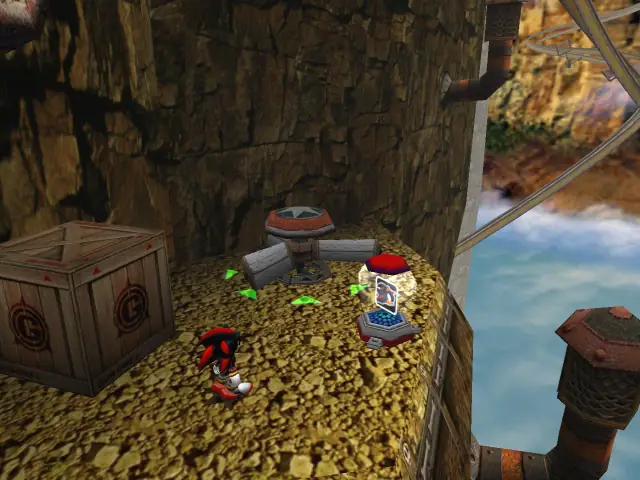
## chaobox 2

## item 5

## item 6

## animal 9

## item 7
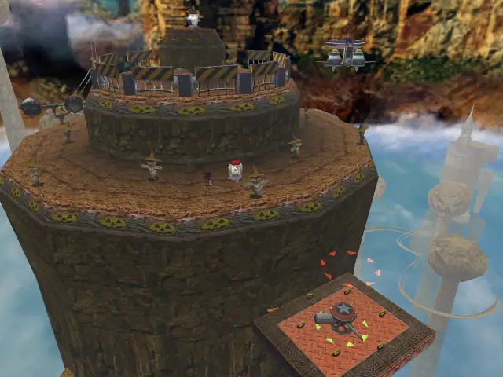

## item 8

## animal 10

## life 4

## item 9

## item 10

## item 11
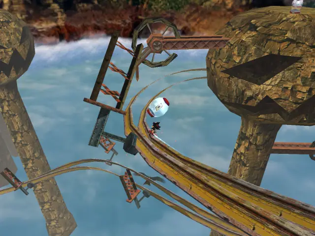
## animal 11

## item 12

## item 13
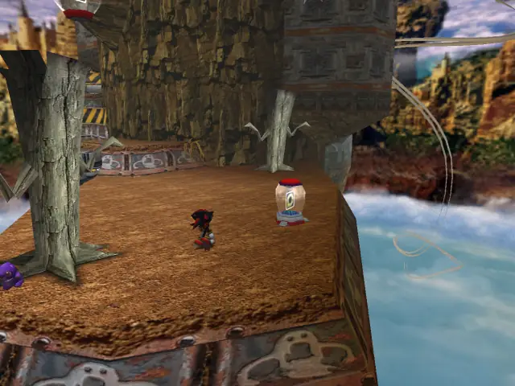

## animal 12

## pipe 4

## animal 13

## chaobox 3

## life 5

## life 6

## item 14
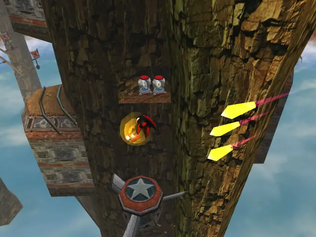

## item 15
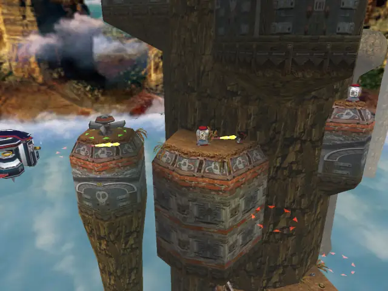
## life 7

## life 8
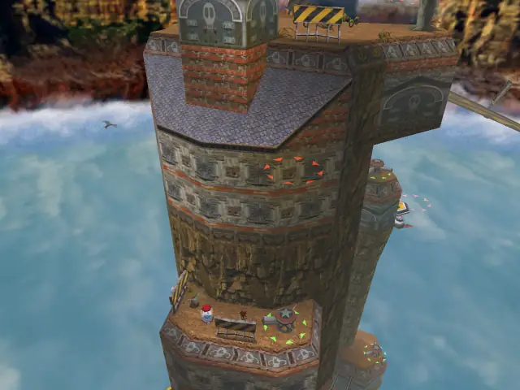
## animal 14

## item 16
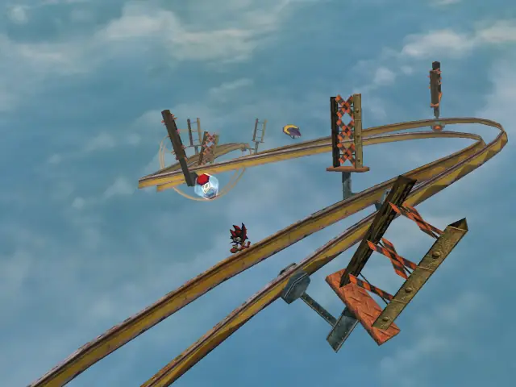
## goldbeetle 1

## item 17

## item 18

## item 19

## item 20

## item 21
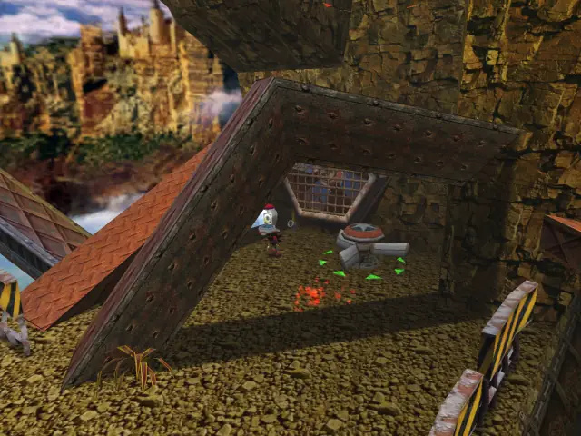
## pipe 5

## animal 15

## animal 16

## pipe 6

## animal 17

## item 22
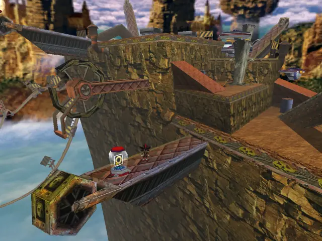
## animal 18

## life 9
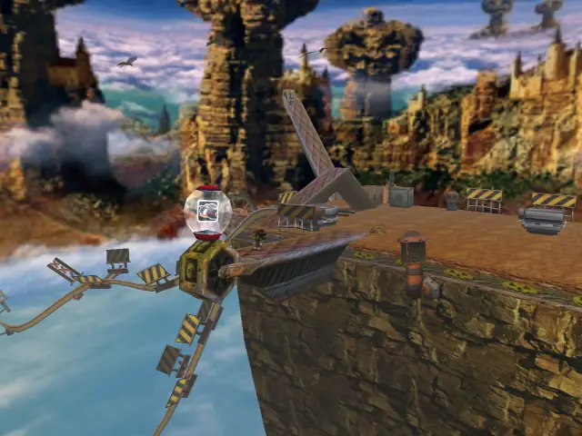    
## item 23

## animal 19

## animal 20

