
## big 1
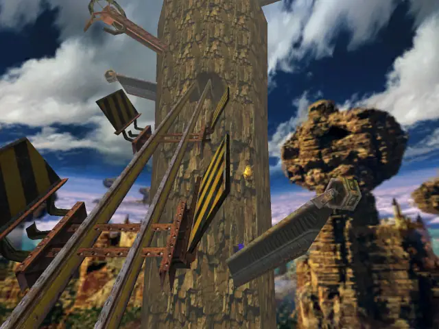

## item 1
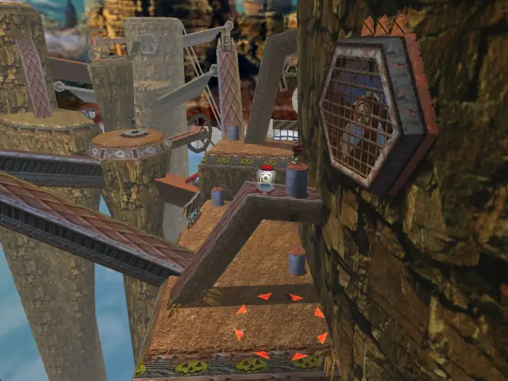

## item 2
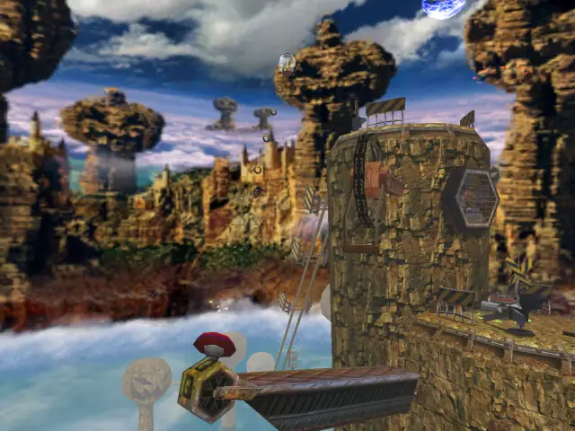

## item 3
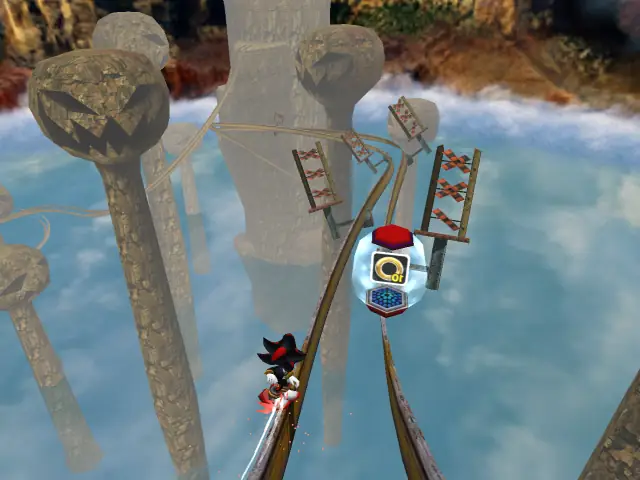

## item 4

## item 5
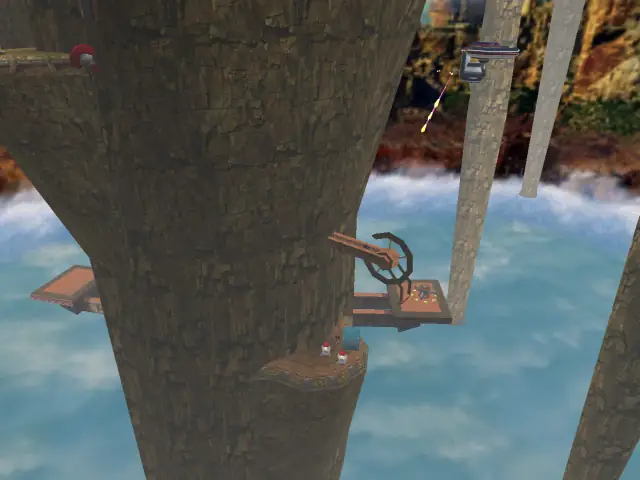

## item 6

## item 7

## item 8

## item 9

## item 10

## item 11
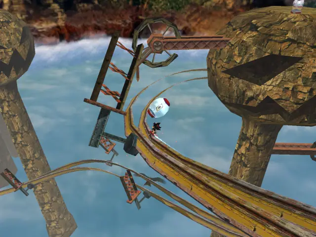

## item 12
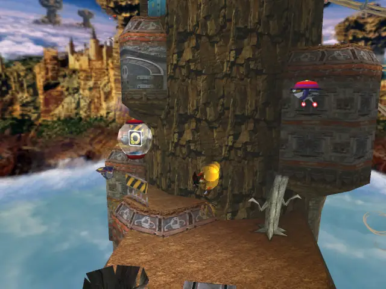

## item 13
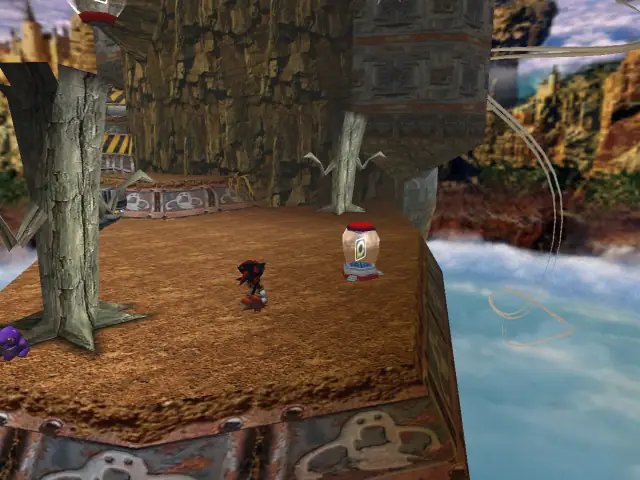

## item 14
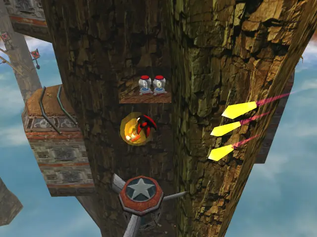

## item 15
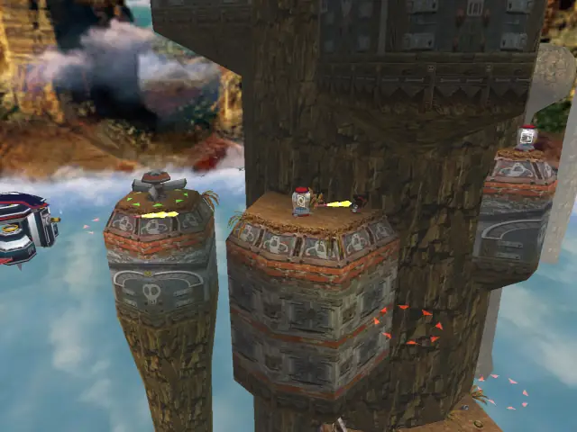

## item 16
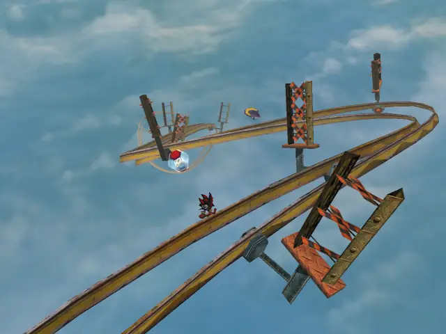

## item 17
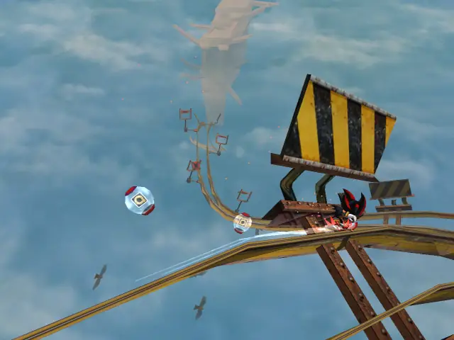

## item 18

## item 19
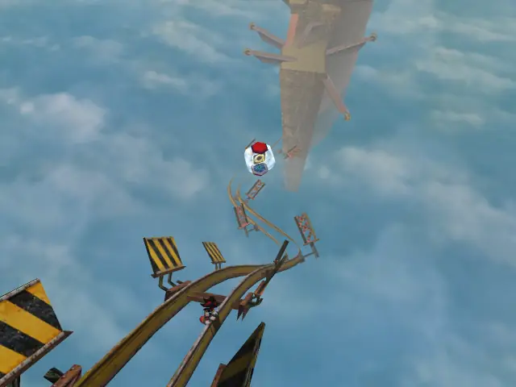

## item 20
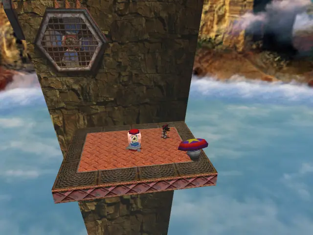

## item 21
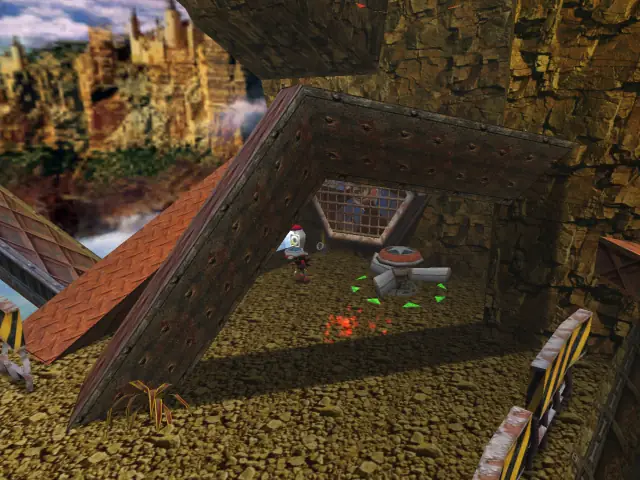

## item 22
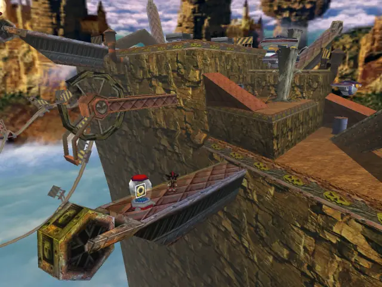

## item 23
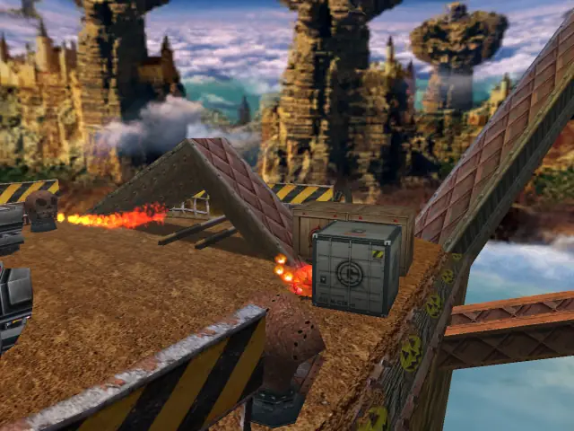

## life 1
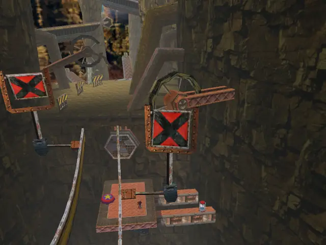

## life 2
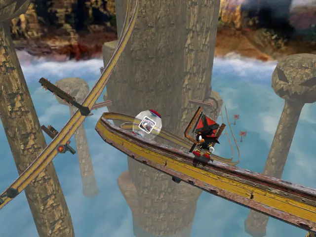

## life 3
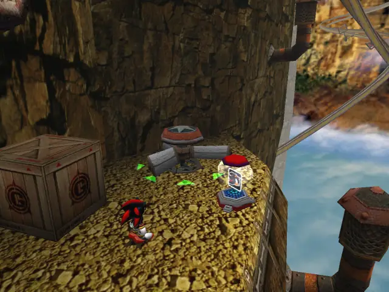

## life 4
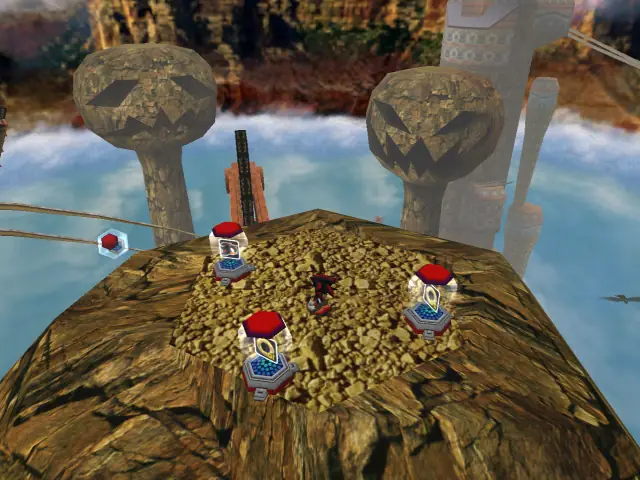

## life 5

## life 6

## life 7
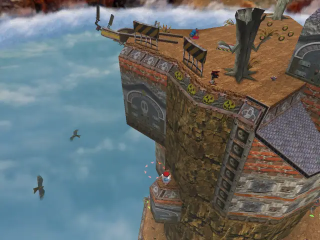

## life 8

## life 9
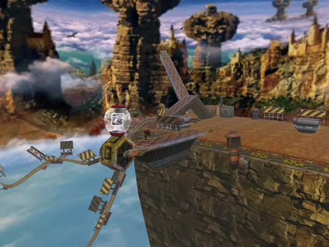

