
## hidden 1

## animal 1
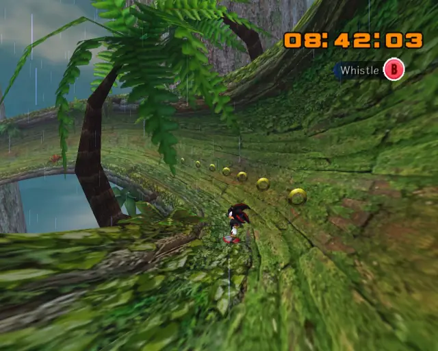

## animal 2
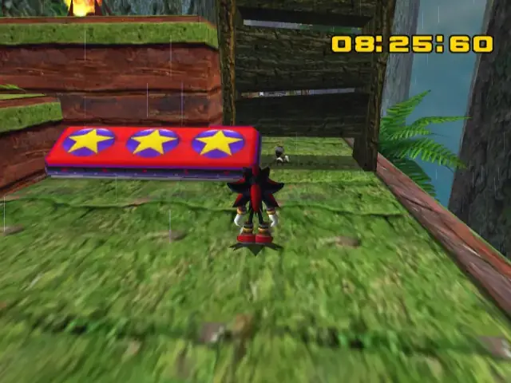

## omochao 1
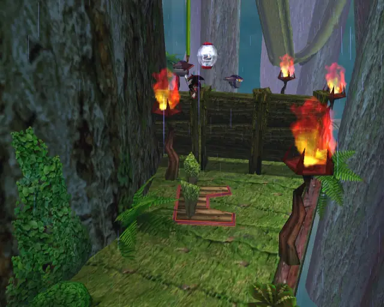
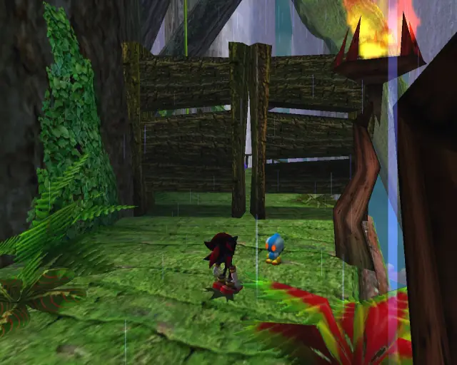

## animal 3
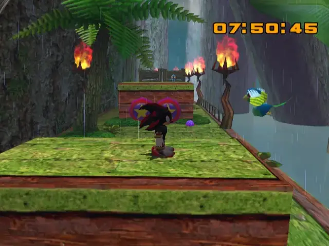

## omochao 2
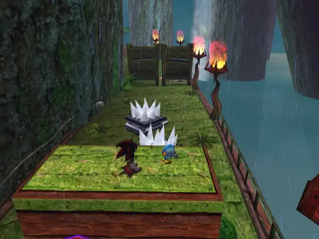

## pipe 1
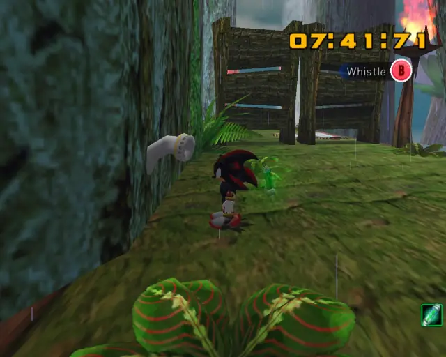

## animal 4

## animal 5
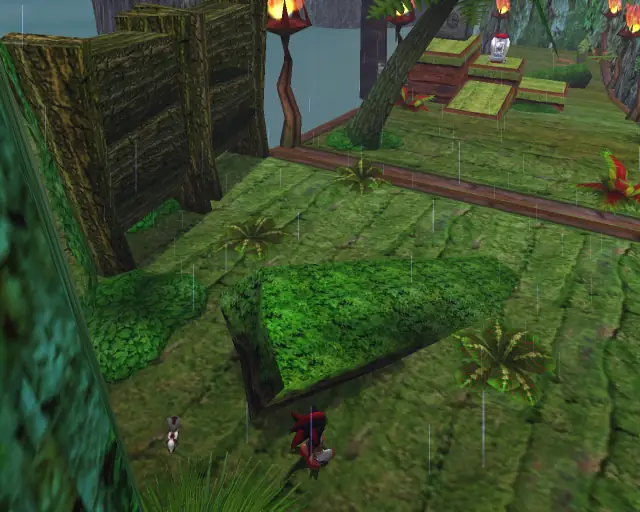

## chaobox 1

## animal 6
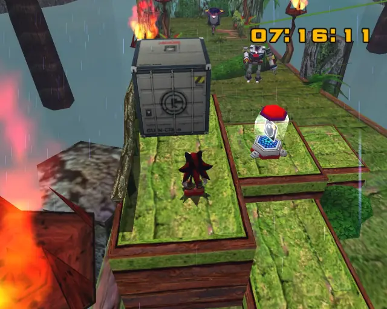
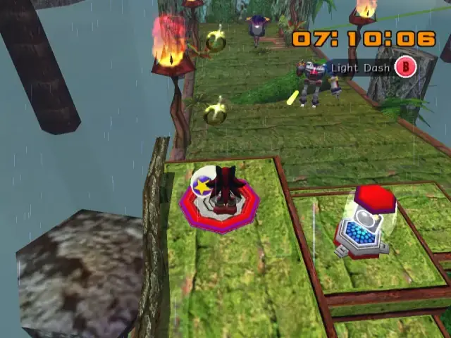
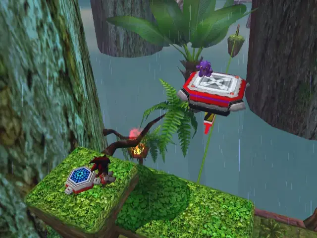

## animal 7
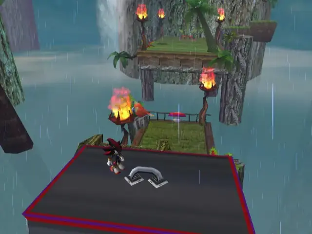

## hidden 2

## animal 8
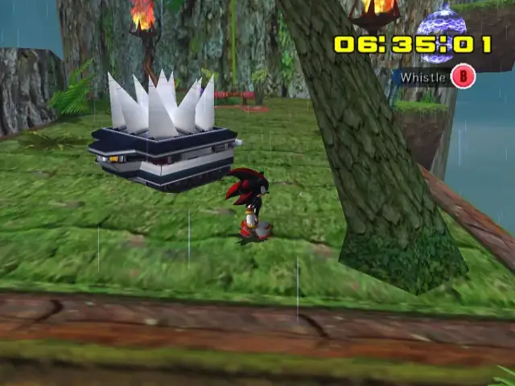

## animal 9

## pipe 2
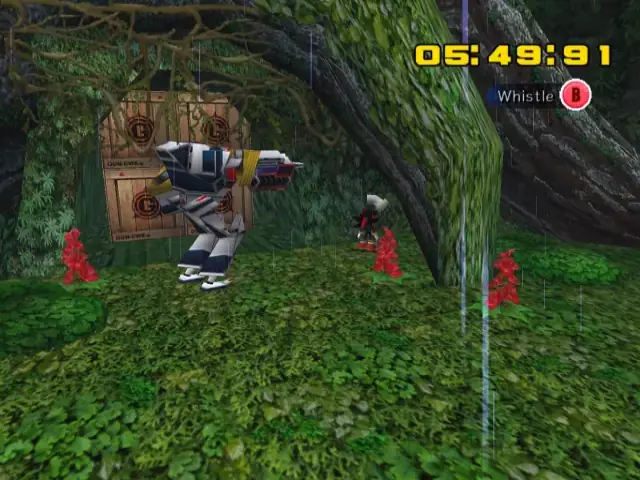

## animal 10

## animal 11
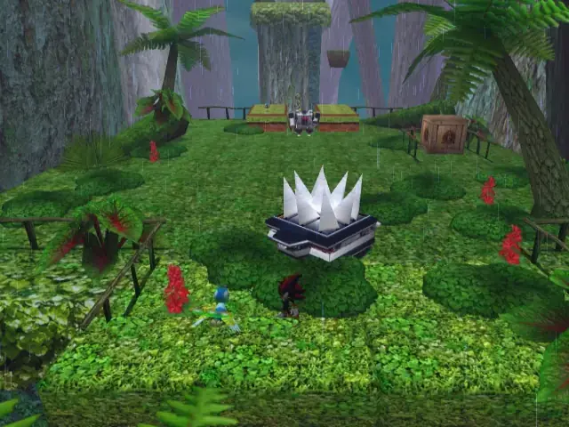

## omochao 3
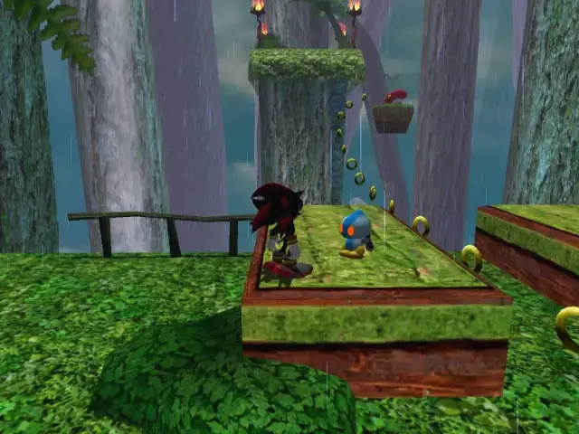

## omochao 4
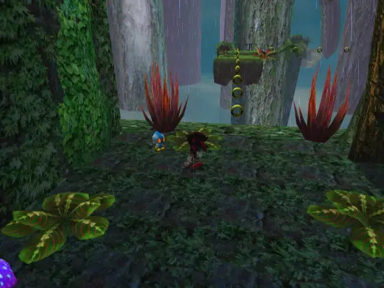

## goldbeetle 1
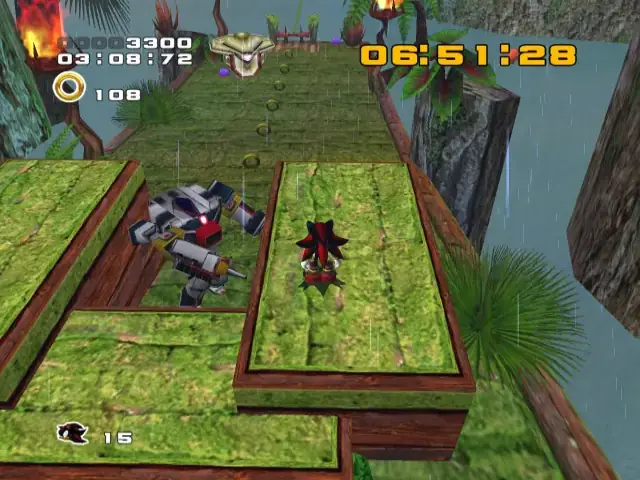

## pipe 3

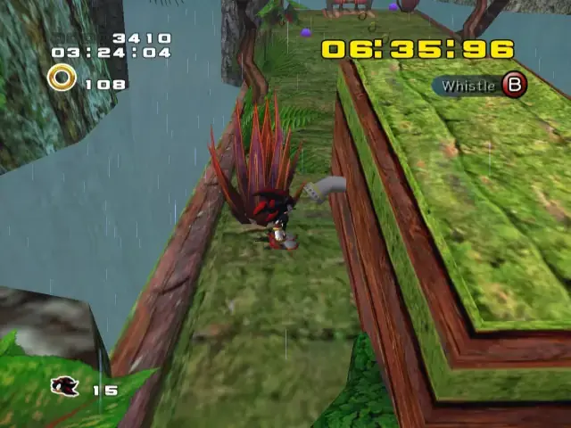

## animal 12

## animal 13
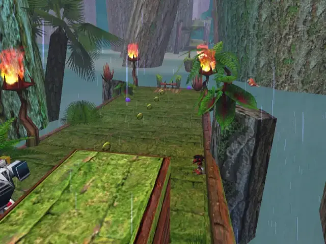

## animal 14
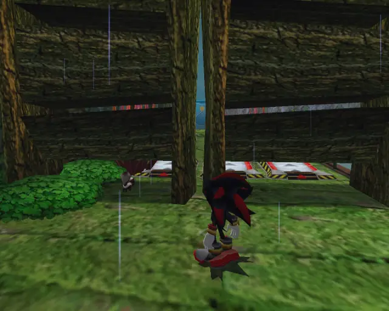

## chaobox 2
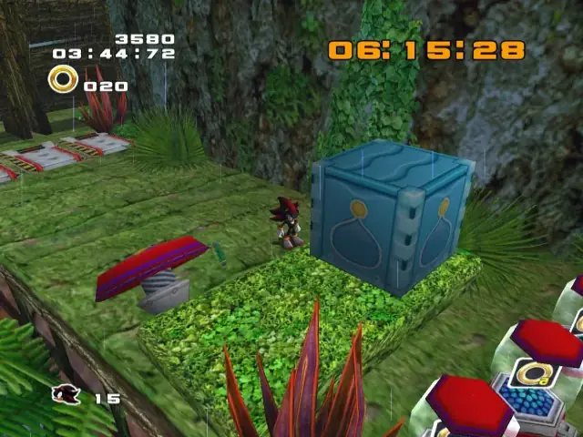

## pipe 4
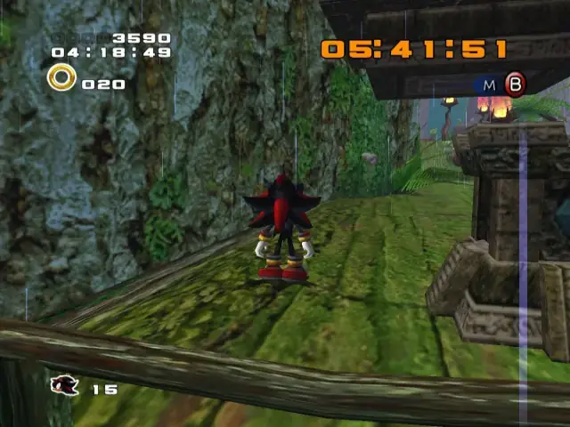

## animal 15

## hidden 3
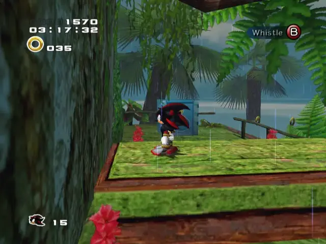

## animal 16

## chaobox 3
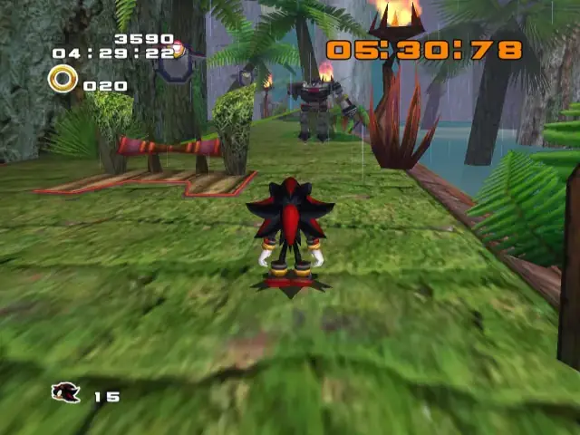
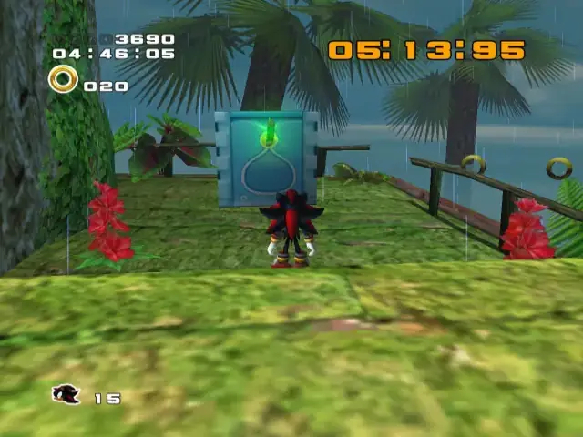

## omochao 5
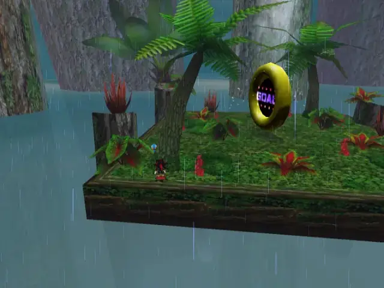

