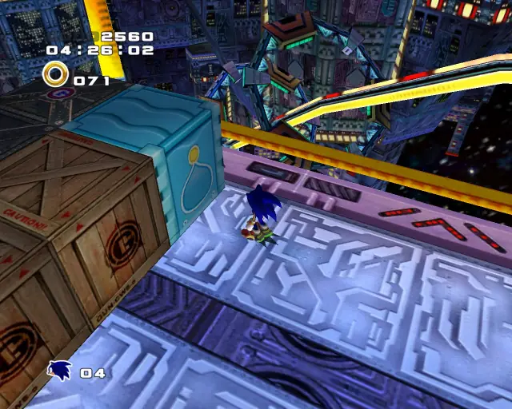
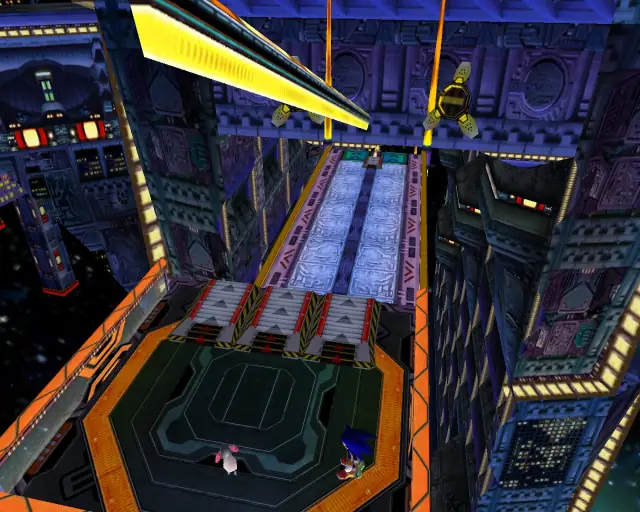

# Final Rush

## Final Rush Omochao 1

[Back to Top](#)

## Final Rush Animal 1

[Back to Top](#)

## Final Rush Chao Box 1

[Back to Top](#)

## Final Rush Animal 2

[Back to Top](#)

## Final Rush Omochao 2

[Back to Top](#)

## Final Rush Chao Box 2

[Back to Top](#)

## Final Rush Pipe 1 & Animal 3

[Back to Top](#)

## Final Rush Animal 4

[Back to Top](#)

## Final Rush Pipe 2 & Animal 5

[Back to Top](#)

## Final Rush Animal 6

[Back to Top](#)

## Final Rush Animal 7

[Back to Top](#)

## Final Rush Animal 8

[Back to Top](#)

## Final Rush Gold Beetle

[Back to Top](#)

## Final Rush Omochao 3

[Back to Top](#)

## Final Rush Animal 9

[Back to Top](#)

## Final Rush Animal 10

[Back to Top](#)

## Final Rush Chao Box 3

[Back to Top](#)

## Final Rush Animal 11

[Back to Top](#)

## Final Rush Animal 12

[Back to Top](#)

## Final Rush Animal 13

[Back to Top](#)

## Final Rush Animal 14

[Back to Top](#)

## Final Rush Animal 15

[Back to Top](#)

## Final Rush Animal 16

[Back to Top](#)

# Green Hill

## Green Hill Chao Box 1

[Back to Top](#)
